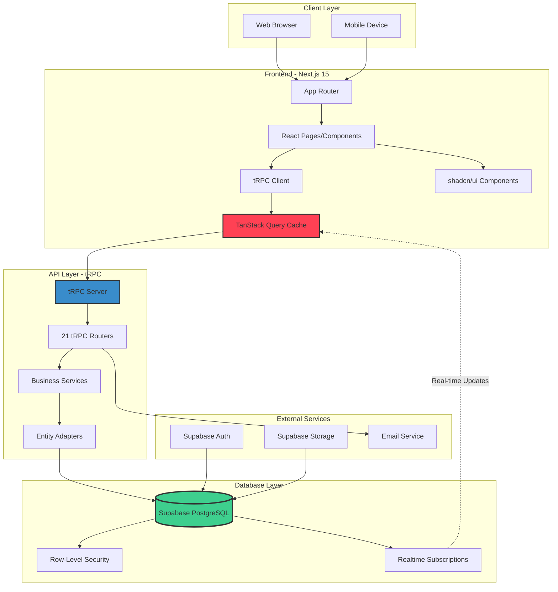
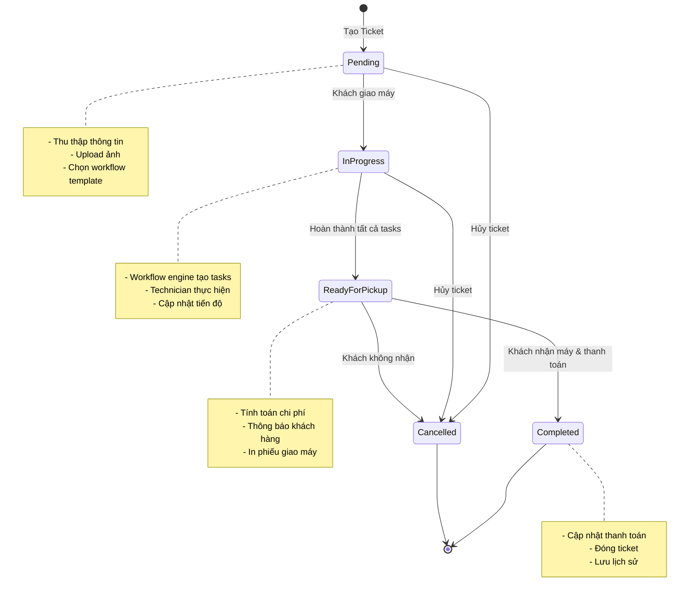
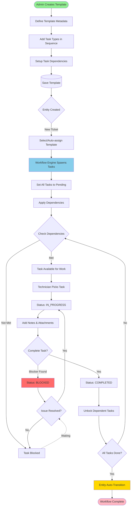
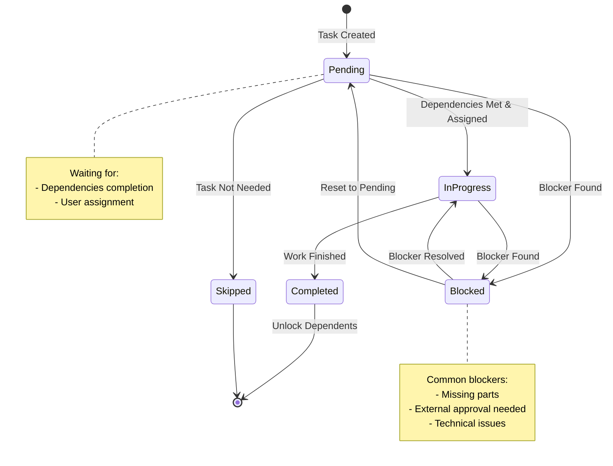
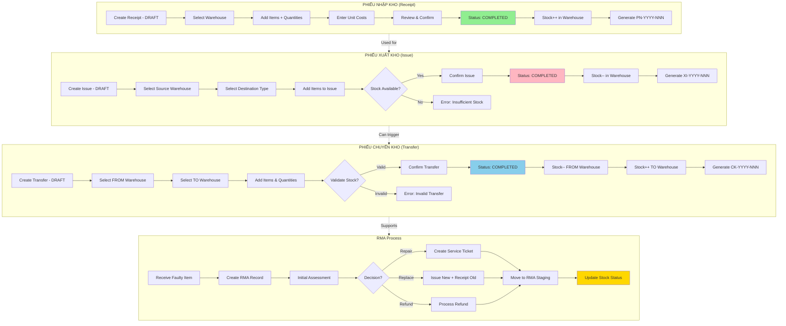
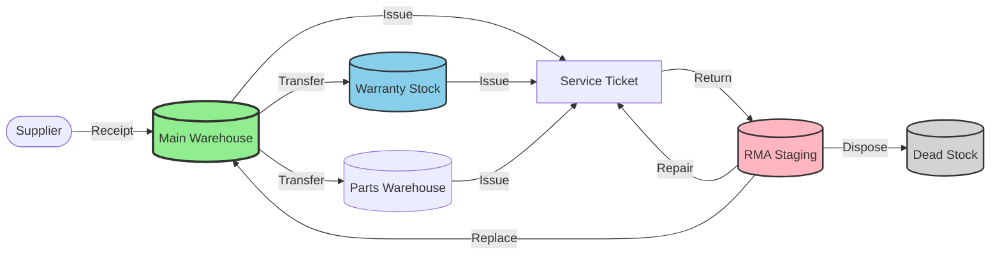
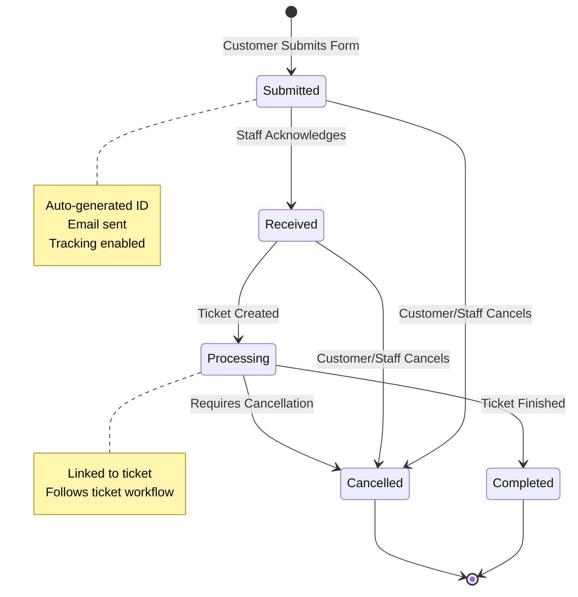
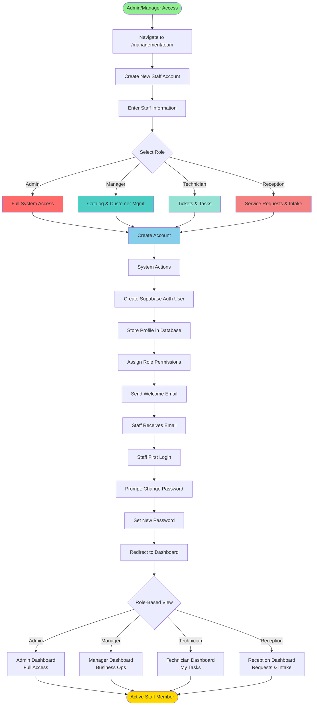
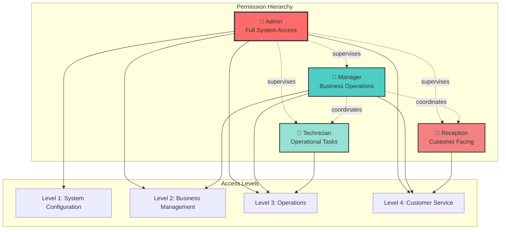

# Service Center App - Phân Tích Workflow Chi Tiết

**Ngày phân tích:** 2026-02-04
**Phân tích bởi:** Wendy - Workflow Building Master
**Dự án:** Service Center App
**Version:** 1.0.0

---

## 📋 MỤC LỤC

1. [Tổng Quan Dự Án](#tổng-quan-dự-án)
2. [Kiến Trúc Hệ Thống](#kiến-trúc-hệ-thống)
3. [Các Module Chính & Workflow](#các-module-chính--workflow)
4. [Cấu Trúc Thư Mục](#cấu-trúc-thư-mục)
5. [Technology Stack](#technology-stack)
6. [Đánh Giá & Khuyến Nghị](#đánh-giá--khuyến-nghị)

---

## 🎯 TỔNG QUAN Dự ÁN

**Service Center App** là một hệ thống quản lý trung tâm bảo hành và sửa chữa toàn diện, được xây dựng trên nền tảng công nghệ hiện đại với kiến trúc full-stack type-safe.

### Thống Kê Tổng Quan

| Metric | Số Lượng |
|--------|----------|
| **Total TypeScript Files** | 329 |
| **React Components** | 179 |
| **tRPC Routers** | 21 routers |
| **API Logic** | 12,000+ lines |
| **Protected Routes** | 56+ routes |
| **Custom Hooks** | 16 hooks |
| **Type Definitions** | 8 major files |

### Tính Năng Chính

- ✅ Quản lý phiếu sửa chữa (Service Tickets)
- ✅ Hệ thống workflow tự động hóa
- ✅ Quản lý kho hàng (Inventory Management)
- ✅ Yêu cầu dịch vụ công khai (Public Service Requests)
- ✅ Quản lý nhân sự với phân quyền chi tiết
- ✅ Dashboard & Analytics
- ✅ Hệ thống thông báo real-time
- ✅ Quản lý danh mục sản phẩm

---

## 🏗️ KIẾN TRÚC HỆ THỐNG

### Technology Stack

#### Frontend
- **Framework**: Next.js 15.5.4 with App Router
- **React**: 19.1.0 (Latest)
- **Build System**: Turbopack (Next-gen bundling)
- **State Management**: TanStack React Query + tRPC caching
- **UI Framework**: shadcn/ui + Radix UI primitives
- **Styling**: Tailwind CSS 4
- **Form Handling**: react-hook-form + zod validation
- **Data Visualization**: Recharts
- **Drag & Drop**: @dnd-kit
- **Notifications**: Sonner (toast notifications)

#### Backend
- **API Layer**: tRPC 11.6.0 (Type-safe APIs)
- **Database**: PostgreSQL via Supabase
- **Authentication**: Supabase Auth + JWT tokens
- **Real-time**: Supabase Realtime subscriptions
- **ORM Pattern**: Direct SQL with type generation

#### Developer Tools
- **Package Manager**: pnpm with workspace support
- **Code Quality**: Biome 2.2.0 (linting + formatting)
- **TypeScript**: Strict mode enabled
- **Version Control**: Git

### Architectural Patterns

1. **tRPC End-to-End Type Safety**
   - Complete type safety from frontend to backend
   - Automatic TypeScript inference
   - No API contract drift

2. **Entity Adapters Pattern**
   - Abstraction layer for complex state management
   - Standardized interface for different entity types
   - Supports: tickets, requests, receipts, issues, transfers

3. **Row-Level Security (RLS)**
   - Database-level permission enforcement
   - Role-based access control
   - Secure by default

4. **Middleware-Based Authentication**
   - Next.js middleware for session management
   - Server-side rendering with secure cookies
   - Automatic session refresh

5. **Component Composition**
   - Atomic design principles
   - Reusable UI primitives
   - Feature-based composition

### System Architecture Diagram



---

## 📦 CẤU TRÚC THƯ MỤC

```
/src
├── app/                          # Next.js App Router (Routing)
│   ├── (auth)/                  # Protected routes group
│   ├── (public)/                # Public routes group
│   ├── api/                     # API endpoints
│   └── layout.tsx               # Root layout
│
├── components/                   # React Components (179 files)
│   ├── ui/                      # Base UI components (41 files)
│   ├── inventory/               # Inventory components
│   ├── workflows/               # Workflow components
│   ├── tasks/                   # Task management
│   ├── forms/                   # Form components
│   ├── tables/                  # Data tables
│   ├── modals/                  # Modal dialogs
│   └── drawers/                 # Slide-out panels
│
├── server/                       # Backend Logic
│   ├── routers/                 # tRPC routers (21 files)
│   ├── services/                # Business logic services
│   ├── entity-adapters/         # State management adapters
│   └── context.ts               # tRPC context
│
├── hooks/                        # Custom React Hooks (16 files)
│   ├── use-workflow.ts          # Workflow operations
│   ├── use-warehouse.ts         # Warehouse operations
│   ├── use-service-request.ts   # Service request ops
│   └── ...                      # Other domain hooks
│
├── lib/                          # Utilities & Libraries
│   ├── supabase/                # Supabase clients
│   ├── trpc/                    # tRPC client setup
│   └── utils.ts                 # Helper functions
│
├── types/                        # TypeScript Definitions
│   ├── database.types.ts        # Auto-generated DB types (126KB)
│   ├── enums.ts                 # Application enums
│   ├── workflow.ts              # Workflow types
│   └── ...                      # Other type files
│
├── constants/                    # Application Constants
│   ├── messages.ts              # UI messages
│   ├── workflow.ts              # Workflow constants
│   └── warehouse.ts             # Warehouse constants
│
├── utils/                        # Helper Functions
└── middleware.ts                 # Next.js Auth Middleware
```

---

## 🔄 CÁC MODULE CHÍNH & WORKFLOW

### 1. TICKET MANAGEMENT (Quản lý Phiếu Sửa Chữa)

#### Mô tả
Module quản lý toàn bộ vòng đời của phiếu sửa chữa từ khi tiếp nhận đến khi hoàn thành và giao máy cho khách hàng.

#### Workflow Flow Diagram



#### Workflow Flow (Text Version)

```
┌─────────────────────────────────────────────────────────┐
│           TICKET LIFECYCLE WORKFLOW                     │
├─────────────────────────────────────────────────────────┤
│                                                         │
│  [Tạo Ticket]                                          │
│       ↓                                                 │
│  Status: PENDING                                        │
│  - Thu thập thông tin khách hàng                       │
│  - Mô tả vấn đề                                        │
│  - Chọn loại dịch vụ (Warranty/Paid/Goodwill)         │
│  - Upload ảnh minh chứng                               │
│  - Chọn workflow template                              │
│       ↓                                                 │
│  [Khách Giao Máy]                                      │
│       ↓                                                 │
│  Status: IN_PROGRESS                                    │
│  - Workflow engine tạo tasks tự động                   │
│  - Gán tasks cho technicians                           │
│  - Bắt đầu quá trình sửa chữa                         │
│       ↓                                                 │
│  [Thực Hiện Tasks]                                     │
│  - Technician nhận task                                │
│  - Cập nhật trạng thái task                           │
│  - Thêm notes & attachments                           │
│  - Hoàn thành task → unlock dependent tasks           │
│       ↓                                                 │
│  [Tất Cả Tasks Hoàn Thành]                            │
│       ↓                                                 │
│  Status: READY_FOR_PICKUP                              │
│  - Tính toán chi phí (parts + labor)                  │
│  - Thông báo khách hàng                                │
│  - In phiếu giao máy                                   │
│       ↓                                                 │
│  [Khách Nhận Máy & Thanh Toán]                        │
│       ↓                                                 │
│  Status: COMPLETED                                      │
│  - Cập nhật thanh toán                                 │
│  - Đóng ticket                                         │
│  - Lưu trữ lịch sử                                     │
│                                                         │
│  [Có thể CANCELLED ở bất kỳ bước nào]                 │
│  - Cập nhật lý do hủy                                  │
│  - Hoàn trả deposit (nếu có)                           │
│  - Thông báo khách hàng                                │
│                                                         │
└─────────────────────────────────────────────────────────┘
```

#### Routes

| Route | Method | Purpose |
|-------|--------|---------|
| `/operations/tickets` | GET | Danh sách tất cả tickets với filtering |
| `/operations/tickets/add` | GET | Form tạo ticket mới |
| `/operations/tickets/[id]` | GET | Chi tiết ticket & workflow execution |
| `/operations/tickets/[id]/edit` | GET | Form chỉnh sửa ticket |

#### Server Router

**File:** `src/server/routers/tickets.ts` (2,405 lines)

**Key Procedures:**
- `getAll` - Lấy danh sách tickets với pagination & filters
- `getById` - Chi tiết ticket với tasks & comments
- `create` - Tạo ticket mới + spawn workflow tasks
- `update` - Cập nhật thông tin ticket
- `updateStatus` - Chuyển trạng thái với validation
- `addComment` - Thêm comment vào ticket
- `addCost` - Thêm chi phí parts/labor
- `delete` - Xóa ticket (soft delete)

#### Database Schema

**Tables:**
- `service_tickets` - Main ticket data
- `service_ticket_comments` - Comment history
- `service_ticket_costs` - Cost tracking
- `service_ticket_attachments` - File uploads
- `tasks` - Workflow tasks

#### Key Features

1. **Automatic Ticket Numbering**
   - Format: `SV-YYYY-NNN` (VD: SV-2026-001)
   - Tự động increment theo năm

2. **Cost Calculation**
   - Parts cost từ inventory
   - Labor cost theo giờ
   - Tổng tự động tính

3. **Comment System**
   - Audit trail hoàn chỉnh
   - Track user & timestamp
   - Supports mentions

4. **File Attachments**
   - Upload multiple files
   - Image preview
   - Secure storage

5. **Status Validation**
   - Chỉ cho phép transition hợp lệ
   - Kiểm tra prerequisites
   - Validation rules

#### Enums

```typescript
enum TicketStatus {
  PENDING = 'pending',
  IN_PROGRESS = 'in_progress',
  READY_FOR_PICKUP = 'ready_for_pickup',
  COMPLETED = 'completed',
  CANCELLED = 'cancelled'
}

enum ServiceType {
  WARRANTY = 'warranty',
  PAID = 'paid',
  GOODWILL = 'goodwill'
}

enum Priority {
  LOW = 'low',
  NORMAL = 'normal',
  HIGH = 'high',
  URGENT = 'urgent'
}
```

---

### 2. WORKFLOW ENGINE (Hệ Thống Workflow Tự Động)

#### Mô tả
Workflow Engine là trái tim của hệ thống, cho phép tạo các quy trình tự động hóa với task dependencies, validation rules, và automatic state transitions.

#### Workflow Architecture Diagram



#### Task State Machine Diagram



#### Workflow Architecture (Text Version)

```
┌──────────────────────────────────────────────────────────┐
│         WORKFLOW TEMPLATE SYSTEM ARCHITECTURE            │
├──────────────────────────────────────────────────────────┤
│                                                          │
│  PHASE 1: TEMPLATE CREATION (Admin)                     │
│  ┌────────────────────────────────────────┐             │
│  │ [Admin] → Create Workflow Template     │             │
│  │       ↓                                 │             │
│  │ Define Template Metadata:               │             │
│  │  - Template Name                        │             │
│  │  - Description                          │             │
│  │  - Entity Type (ticket/request/doc)    │             │
│  │  - Is Active                            │             │
│  │       ↓                                 │             │
│  │ Add Task Types in Sequence:             │             │
│  │  - Task Name & Description              │             │
│  │  - Order/Position                       │             │
│  │  - Required Fields                      │             │
│  │  - Validation Rules                     │             │
│  │       ↓                                 │             │
│  │ Setup Task Dependencies:                │             │
│  │  - Task A must complete before Task B  │             │
│  │  - Parallel tasks (no dependencies)    │             │
│  │  - Conditional dependencies             │             │
│  │       ↓                                 │             │
│  │ [Save Template] → Ready for Use        │             │
│  └────────────────────────────────────────┘             │
│                                                          │
│  PHASE 2: WORKFLOW EXECUTION (Runtime)                  │
│  ┌────────────────────────────────────────┐             │
│  │ [Entity Created] (e.g., New Ticket)    │             │
│  │       ↓                                 │             │
│  │ Template Selected (auto or manual)      │             │
│  │       ↓                                 │             │
│  │ Workflow Engine Spawns Tasks:          │             │
│  │  - Create all tasks from template      │             │
│  │  - Set initial status (pending)        │             │
│  │  - Apply dependencies                   │             │
│  │  - Assign to users (if specified)      │             │
│  │       ↓                                 │             │
│  │ Task Execution Loop:                    │             │
│  │  ┌──────────────────────────┐          │             │
│  │  │ [Pending Tasks]          │          │             │
│  │  │       ↓                   │          │             │
│  │  │ Check Dependencies        │          │             │
│  │  │  - All prerequisites done?│          │             │
│  │  │  - No blockers?           │          │             │
│  │  │       ↓                   │          │             │
│  │  │ [Available for Work]      │          │             │
│  │  │       ↓                   │          │             │
│  │  │ Technician Picks Task     │          │             │
│  │  │       ↓                   │          │             │
│  │  │ Status: IN_PROGRESS       │          │             │
│  │  │  - Add notes              │          │             │
│  │  │  - Upload attachments     │          │             │
│  │  │  - Update progress        │          │             │
│  │  │       ↓                   │          │             │
│  │  │ [Complete Task]           │          │             │
│  │  │       ↓                   │          │             │
│  │  │ Status: COMPLETED         │          │             │
│  │  │       ↓                   │          │             │
│  │  │ Unlock Dependent Tasks    │          │             │
│  │  │       ↓                   │          │             │
│  │  │ Check if all tasks done   │          │             │
│  │  └──────────────────────────┘          │             │
│  │       ↓                                 │             │
│  │ [All Tasks Completed]                   │             │
│  │       ↓                                 │             │
│  │ Entity Auto-Transition:                 │             │
│  │  - Ticket → Ready for Pickup           │             │
│  │  - Request → Processing                 │             │
│  │  - Document → Completed                 │             │
│  └────────────────────────────────────────┘             │
│                                                          │
│  PHASE 3: TEMPLATE SWITCHING (Advanced)                 │
│  ┌────────────────────────────────────────┐             │
│  │ [Mid-workflow Template Switch]          │             │
│  │       ↓                                 │             │
│  │ Cancel remaining tasks from old template│             │
│  │       ↓                                 │             │
│  │ Spawn new tasks from new template      │             │
│  │       ↓                                 │             │
│  │ Continue execution                      │             │
│  └────────────────────────────────────────┘             │
│                                                          │
└──────────────────────────────────────────────────────────┘
```

#### Task State Machine

```
┌─────────────────────────────────────────────┐
│           TASK STATUS FLOW                  │
├─────────────────────────────────────────────┤
│                                             │
│         [PENDING]                           │
│            ↓                                │
│     (Dependencies met?)                     │
│            ↓                                │
│      [IN_PROGRESS]                          │
│            ↓                                │
│     (Work completed?)                       │
│            ↓                                │
│       [COMPLETED]                           │
│            ↓                                │
│  (Unlock dependent tasks)                   │
│                                             │
│  Alternative Paths:                         │
│  [PENDING/IN_PROGRESS]                      │
│            ↓                                │
│     (Blocker found?)                        │
│            ↓                                │
│       [BLOCKED]                             │
│            ↓                                │
│     (Issue resolved)                        │
│            ↓                                │
│     Resume to previous state                │
│                                             │
│  [PENDING]                                  │
│            ↓                                │
│     (Task not needed?)                      │
│            ↓                                │
│       [SKIPPED]                             │
│                                             │
└─────────────────────────────────────────────┘
```

#### Routes

| Route | Purpose |
|-------|---------|
| `/workflows` | Danh sách workflow templates |
| `/workflows/new` | Tạo workflow template mới |
| `/workflows/[id]` | Xem chi tiết template |
| `/workflows/[id]/edit` | Chỉnh sửa template |
| `/workflows/tasks` | Quản lý task types |
| `/my-tasks` | Tasks được gán cho user hiện tại |
| `/my-tasks/[taskId]` | Chi tiết & thực thi task |
| `/my-tasks/serial-entry` | Form nhập serial numbers |

#### Server Router

**File:** `src/server/routers/workflow.ts` (1,929 lines)

**Key Procedures:**

**Template Management:**
- `getTemplates` - Lấy danh sách templates
- `getTemplate` - Chi tiết template với tasks
- `createTemplate` - Tạo template mới
- `updateTemplate` - Cập nhật template
- `deleteTemplate` - Xóa template
- `toggleTemplate` - Activate/deactivate

**Task Type Management:**
- `getTaskTypes` - Danh sách task types
- `createTaskType` - Tạo task type mới
- `updateTaskType` - Cập nhật task type
- `toggleTaskType` - Enable/disable
- `reorderTaskTypes` - Sắp xếp lại order

**Task Execution:**
- `getMyTasks` - Tasks của user hiện tại
- `getTaskById` - Chi tiết task
- `updateTaskStatus` - Cập nhật trạng thái
- `addTaskNotes` - Thêm ghi chú
- `completeTask` - Hoàn thành task
- `skipTask` - Bỏ qua task
- `blockTask` - Đánh dấu blocked

**Dependencies:**
- `getTaskDependencies` - Lấy dependencies
- `checkDependenciesMet` - Kiểm tra prerequisites
- `unlockDependentTasks` - Mở khóa tasks phụ thuộc

#### Custom Hooks

**File:** `src/hooks/use-workflow.ts`

```typescript
// Template Hooks
useTaskTemplates() // Lấy danh sách templates
useTaskTemplate(id) // Chi tiết template
useCreateTemplate() // Tạo template mới
useUpdateTemplate() // Cập nhật template
useSwitchTemplate() // Đổi template mid-workflow

// Task Type Hooks
useTaskTypes() // Danh sách task types
useCreateTaskType() // Tạo task type
useUpdateTaskType() // Cập nhật task type
useToggleTaskType() // Toggle active status

// Execution Hooks
useMyTasks() // Tasks của user
useUpdateTaskStatus() // Cập nhật status
useAddTaskNotes() // Thêm notes
useCompleteTask() // Hoàn thành task
useTaskDependencies() // Quản lý dependencies
```

#### Database Schema

**Tables:**
- `task_templates` - Workflow templates
- `task_types` - Reusable task definitions
- `template_task_types` - Template-TaskType junction
- `tasks` - Runtime task instances
- `task_dependencies` - Task prerequisite relationships

#### Supported Entity Types

Workflow engine hỗ trợ các entity types sau:

1. **service_ticket** - Service repair tickets
2. **service_request** - Public service requests
3. **inventory_receipt** - Stock receipt documents
4. **inventory_issue** - Stock issue documents
5. **inventory_transfer** - Stock transfer documents

#### Key Features

1. **Template-Based Design**
   - Reusable workflow definitions
   - Multiple templates per entity type
   - Easy modification without code changes

2. **Task Dependencies**
   - Prerequisites enforcement
   - Parallel task execution
   - Automatic unlocking

3. **Dynamic Template Switching**
   - Change workflow mid-execution
   - Cancel old tasks, spawn new ones
   - Seamless transition

4. **Progress Tracking**
   - Real-time task completion %
   - Visual progress indicators
   - Analytics dashboard

5. **Flexible Assignment**
   - Auto-assign by role
   - Manual assignment
   - Reassignment capability

6. **Validation Rules**
   - Required fields per task
   - Custom validation logic
   - Prevent invalid transitions

#### Example Workflow Template

**Template Name:** "Laptop Repair - Standard"

```
Task 1: Initial Inspection [No dependencies]
  - Check physical condition
  - Test power on
  - Record issues

Task 2: Diagnostic Testing [Depends on Task 1]
  - Run hardware diagnostics
  - Test all components
  - Identify faulty parts

Task 3: Order Parts [Depends on Task 2]
  - Create parts list
  - Check inventory
  - Order if needed

Task 4: Parts Replacement [Depends on Task 3]
  - Replace faulty components
  - Reassemble device
  - Basic testing

Task 5: Quality Assurance [Depends on Task 4]
  - Full system test
  - Performance benchmarks
  - Customer data restore

Task 6: Final Inspection [Depends on Task 5]
  - Physical inspection
  - Packaging
  - Ready for pickup notification
```

---

### 3. INVENTORY MANAGEMENT (Quản Lý Kho)

#### Mô tả
Hệ thống quản lý kho hàng đầy đủ với multi-warehouse support, document-based movements, serial tracking, và real-time stock updates.

#### Complete Inventory Workflow Diagram



#### Stock Movement Flow



#### Complete Inventory Workflow (Text Version)

```
┌────────────────────────────────────────────────────────────┐
│         INVENTORY MANAGEMENT WORKFLOWS                     │
├────────────────────────────────────────────────────────────┤
│                                                            │
│  A. PHIẾU NHẬP KHO (Receipt Document)                     │
│  ┌──────────────────────────────────────────┐             │
│  │ [Create Receipt]                          │             │
│  │       ↓                                   │             │
│  │ Status: DRAFT                             │             │
│  │  - Chọn warehouse đích                    │             │
│  │  - Chọn supplier (optional)               │             │
│  │  - Reference number                       │             │
│  │       ↓                                   │             │
│  │ Add Items:                                │             │
│  │  - Chọn product từ catalog                │             │
│  │  - Nhập quantity                          │             │
│  │  - Nhập unit cost                         │             │
│  │  - Chọn condition (new/refurbished/used)  │             │
│  │  - Serial numbers (nếu có)                │             │
│  │       ↓                                   │             │
│  │ Review & Confirm                          │             │
│  │       ↓                                   │             │
│  │ Status: COMPLETED                         │             │
│  │       ↓                                   │             │
│  │ Auto Actions:                             │             │
│  │  - Stock tăng trong warehouse             │             │
│  │  - Create stock movement records          │             │
│  │  - Update product costs (FIFO/LIFO)       │             │
│  │  - Generate receipt number (PN-YYYY-NNN)  │             │
│  └──────────────────────────────────────────┘             │
│                                                            │
│  B. PHIẾU XUẤT KHO (Issue Document)                       │
│  ┌──────────────────────────────────────────┐             │
│  │ [Create Issue]                            │             │
│  │       ↓                                   │             │
│  │ Status: DRAFT                             │             │
│  │  - Chọn warehouse nguồn                   │             │
│  │  - Chọn destination type:                 │             │
│  │    * Service ticket                       │             │
│  │    * Customer sale                        │             │
│  │    * Internal use                         │             │
│  │       ↓                                   │             │
│  │ Select Items to Issue:                    │             │
│  │  - Chọn product                           │             │
│  │  - Nhập quantity                          │             │
│  │  - Chọn specific serials (nếu tracked)    │             │
│  │       ↓                                   │             │
│  │ Stock Availability Check:                 │             │
│  │  - Validate sufficient stock              │             │
│  │  - Check condition requirements           │             │
│  │  - Reserve items                          │             │
│  │       ↓                                   │             │
│  │ Confirm Issue                             │             │
│  │       ↓                                   │             │
│  │ Status: COMPLETED                         │             │
│  │       ↓                                   │             │
│  │ Auto Actions:                             │             │
│  │  - Stock giảm trong warehouse             │             │
│  │  - Update stock movements                 │             │
│  │  - Mark serials as issued                 │             │
│  │  - Generate issue number (XI-YYYY-NNN)    │             │
│  │  - Update ticket/request status           │             │
│  └──────────────────────────────────────────┘             │
│                                                            │
│  C. PHIẾU CHUYỂN KHO (Transfer Document)                  │
│  ┌──────────────────────────────────────────┐             │
│  │ [Create Transfer]                         │             │
│  │       ↓                                   │             │
│  │ Status: DRAFT                             │             │
│  │  - Select FROM warehouse                  │             │
│  │  - Select TO warehouse                    │             │
│  │  - Transfer reason/notes                  │             │
│  │       ↓                                   │             │
│  │ Add Items to Transfer:                    │             │
│  │  - Chọn products                          │             │
│  │  - Quantity for each                      │             │
│  │  - Specific serials (if tracked)          │             │
│  │       ↓                                   │             │
│  │ Validation:                               │             │
│  │  - Check FROM warehouse has stock         │             │
│  │  - Validate TO warehouse can receive      │             │
│  │  - Verify transfer is allowed             │             │
│  │       ↓                                   │             │
│  │ Confirm Transfer                          │             │
│  │       ↓                                   │             │
│  │ Status: COMPLETED                         │             │
│  │       ↓                                   │             │
│  │ Auto Actions:                             │             │
│  │  - Stock giảm ở FROM warehouse            │             │
│  │  - Stock tăng ở TO warehouse              │             │
│  │  - Create dual movement records           │             │
│  │  - Update serial locations                │             │
│  │  - Generate transfer number (CK-YYYY-NNN) │             │
│  └──────────────────────────────────────────┘             │
│                                                            │
│  D. RMA (Return Merchandise Authorization)                │
│  ┌──────────────────────────────────────────┐             │
│  │ [Nhận Hàng Lỗi từ Khách]                 │             │
│  │       ↓                                   │             │
│  │ Create RMA Record:                        │             │
│  │  - Customer info                          │             │
│  │  - Product info                           │             │
│  │  - Serial number                          │             │
│  │  - Issue description                      │             │
│  │  - Original purchase date                 │             │
│  │       ↓                                   │             │
│  │ Initial Assessment:                       │             │
│  │  - Check warranty status                  │             │
│  │  - Inspect physical condition             │             │
│  │  - Test functionality                     │             │
│  │       ↓                                   │             │
│  │ Decision:                                 │             │
│  │  ├─→ Repair: Create service ticket        │             │
│  │  ├─→ Replace: Issue new unit + receipt old│             │
│  │  └─→ Refund: Process refund + stock adjust│             │
│  │       ↓                                   │             │
│  │ Update Stock Status:                      │             │
│  │  - Move to RMA staging warehouse          │             │
│  │  - Mark as 'faulty' condition             │             │
│  │  - Track RMA number                       │             │
│  │       ↓                                   │             │
│  │ Final Resolution:                         │             │
│  │  - Close RMA case                         │             │
│  │  - Update inventory records               │             │
│  │  - Customer notification                  │             │
│  └──────────────────────────────────────────┘             │
│                                                            │
│  E. STOCK ADJUSTMENT                                       │
│  ┌──────────────────────────────────────────┐             │
│  │ [Physical Count / Adjustment]             │             │
│  │       ↓                                   │             │
│  │ Record Actual Stock:                      │             │
│  │  - Physical count in warehouse            │             │
│  │  - Compare with system quantity           │             │
│  │       ↓                                   │             │
│  │ Discrepancy Found?                        │             │
│  │  ├─→ Yes: Create adjustment document      │             │
│  │  └─→ No: Mark as verified                 │             │
│  │       ↓                                   │             │
│  │ Adjustment Reasons:                       │             │
│  │  - Lost/stolen                            │             │
│  │  - Damaged                                │             │
│  │  - Data entry error                       │             │
│  │  - Other                                  │             │
│  │       ↓                                   │             │
│  │ Apply Adjustment:                         │             │
│  │  - Update stock quantity                  │             │
│  │  - Create audit trail                     │             │
│  │  - Notify manager                         │             │
│  └──────────────────────────────────────────┘             │
│                                                            │
└────────────────────────────────────────────────────────────┘
```

#### Routes

| Route | Purpose |
|-------|---------|
| `/inventory/overview` | Dashboard tổng quan kho |
| `/inventory/products` | Danh sách sản phẩm & stock levels |
| `/inventory/products/[id]` | Chi tiết sản phẩm |
| `/inventory/products/[id]/stock` | Chi tiết tồn kho theo warehouse |
| `/inventory/warehouses` | Quản lý kho |
| `/inventory/rma` | Quản lý RMA cases |
| `/inventory/rma/[id]` | Chi tiết RMA |
| `/inventory/documents/receipts` | Danh sách phiếu nhập |
| `/inventory/documents/receipts/new` | Tạo phiếu nhập mới |
| `/inventory/documents/receipts/[id]` | Chi tiết phiếu nhập |
| `/inventory/documents/transfers` | Danh sách phiếu chuyển |
| `/inventory/documents/transfers/new` | Tạo phiếu chuyển mới |
| `/inventory/documents/transfers/[id]` | Chi tiết phiếu chuyển |
| `/inventory/documents/issues` | Danh sách phiếu xuất |
| `/inventory/documents/issues/new` | Tạo phiếu xuất mới |
| `/inventory/documents/issues/[id]` | Chi tiết phiếu xuất |

#### Server Routers

**Main Router:** `src/server/routers/physical-products.ts` (1,892 lines)

**Sub-Routers trong `/src/server/routers/inventory/`:**
- `stock.ts` - Stock queries & management
- `receipts.ts` - Receipt document operations
- `issues.ts` - Issue document operations
- `transfers.ts` - Transfer document operations
- `serials.ts` - Serial number tracking

**Key Procedures:**

**Product Management:**
- `getAll` - Danh sách products với stock info
- `getById` - Chi tiết product & stock by warehouse
- `create` - Tạo physical product mới
- `update` - Cập nhật product info
- `updateStock` - Manual stock adjustment

**Receipt Operations:**
- `receipts.getAll` - Danh sách receipts
- `receipts.getById` - Chi tiết receipt
- `receipts.create` - Tạo receipt mới
- `receipts.complete` - Hoàn thành & update stock
- `receipts.cancel` - Hủy receipt

**Issue Operations:**
- `issues.getAll` - Danh sách issues
- `issues.create` - Tạo issue
- `issues.validateAvailability` - Check stock
- `issues.complete` - Thực hiện xuất kho

**Transfer Operations:**
- `transfers.getAll` - Danh sách transfers
- `transfers.create` - Tạo transfer
- `transfers.validate` - Validation logic
- `transfers.complete` - Execute transfer

**Serial Tracking:**
- `serials.track` - Theo dõi serial
- `serials.getHistory` - Lịch sử di chuyển
- `serials.updateLocation` - Cập nhật vị trí

#### Database Schema

**Tables:**
- `physical_products` - Product master data
- `product_stock` - Current stock by warehouse
- `warehouses` - Warehouse definitions
- `inventory_receipts` - Receipt documents
- `inventory_receipt_items` - Receipt line items
- `inventory_issues` - Issue documents
- `inventory_issue_items` - Issue line items
- `inventory_transfers` - Transfer documents
- `inventory_transfer_items` - Transfer line items
- `stock_movements` - Movement audit trail
- `serial_numbers` - Serial tracking
- `rma_cases` - RMA management

#### Warehouse Types

```typescript
enum WarehouseType {
  MAIN = 'main',                    // Kho chính
  WARRANTY_STOCK = 'warranty_stock', // Kho bảo hành
  RMA_STAGING = 'rma_staging',      // Kho RMA
  DEAD_STOCK = 'dead_stock',        // Hàng hỏng
  IN_SERVICE = 'in_service',        // Đang sửa chữa
  PARTS = 'parts',                  // Phụ tùng
  CUSTOMER_INSTALLED = 'customer_installed' // Đã lắp cho khách
}
```

#### Product Conditions

```typescript
enum ProductCondition {
  NEW = 'new',              // Mới
  REFURBISHED = 'refurbished', // Tân trang
  USED = 'used',            // Đã qua sử dụng
  FAULTY = 'faulty',        // Lỗi
  FOR_PARTS = 'for_parts'   // Tháo linh kiện
}
```

#### Key Features

1. **Multi-Warehouse Support**
   - Unlimited warehouses
   - Different types per purpose
   - Cross-warehouse transfers
   - Per-warehouse stock tracking

2. **Document-Based Movements**
   - All movements có document
   - Audit trail hoàn chỉnh
   - Cannot modify completed docs
   - Sequential numbering

3. **Serial Number Tracking**
   - Individual unit tracking
   - Location history
   - Warranty tracking per serial
   - Used in service tickets

4. **Real-time Stock Updates**
   - Automatic stock calculation
   - Supabase Realtime updates
   - Lock-free optimistic updates
   - Transaction safety

5. **Cost Tracking**
   - FIFO/LIFO support
   - Unit cost per movement
   - Average cost calculation
   - Profit margin tracking

6. **Stock Conditions**
   - Multiple condition states
   - Condition-based filtering
   - Automatic condition updates
   - Refurbishment tracking

---

### 4. SERVICE REQUEST (Yêu Cầu Dịch Vụ Công Khai)

#### Mô tả
Public-facing service request portal cho phép khách hàng gửi yêu cầu dịch vụ online mà không cần đăng nhập.

#### Public Request Workflow Diagram

```mermaid
sequenceDiagram
    actor Customer
    participant Portal as Service Request Portal
    participant API as API Endpoint
    participant DB as Database
    participant Email as Email Service
    participant Staff as Reception Staff
    participant Ticket as Ticket System

    Customer->>Portal: Visit /service-request
    Portal->>Customer: Show Request Form

    Customer->>Portal: Fill Form & Upload Photos
    Portal->>Portal: Validate Form

    Portal->>API: POST /api/service-request
    API->>DB: Create Service Request
    DB-->>API: Request ID: SR-2026-XXXX

    API->>Email: Send Confirmation Email
    Email-->>Customer: Confirmation + Tracking Link

    API->>Email: Send Notification
    Email-->>Staff: New Request Alert

    API-->>Portal: Success + Request ID
    Portal->>Customer: Redirect to Success Page

    Note over Customer: Customer can track via<br/>/service-request/track

    Staff->>Portal: Login & Review Request
    Portal-->>Staff: Show Request Details

    Staff->>DB: Update Status: RECEIVED
    Staff->>Email: Contact Customer
    Email-->>Customer: Appointment Confirmation

    Staff->>Ticket: Create Service Ticket
    Ticket-->>DB: Link Request to Ticket
    DB->>DB: Status: PROCESSING

    Note over Ticket: Ticket workflow begins<br/>(See Ticket Lifecycle)

    Ticket->>DB: Ticket Completed
    DB->>DB: Update Request: COMPLETED
    DB->>Email: Send Completion Email
    Email-->>Customer: Service Complete + Invoice

    style Customer fill:#90EE90
    style Staff fill:#87CEEB
    style API fill:#FFB6C1
    style DB fill:#FFD700
```

#### Request Status Flow



#### Public Request Workflow (Text Version)

```
┌────────────────────────────────────────────────────────┐
│       PUBLIC SERVICE REQUEST WORKFLOW                  │
├────────────────────────────────────────────────────────┤
│                                                        │
│  CUSTOMER SIDE (Public Access)                        │
│  ┌──────────────────────────────────────────┐         │
│  │ [Khách Truy Cập Website]                 │         │
│  │       ↓                                   │         │
│  │ Navigate to /service-request             │         │
│  │       ↓                                   │         │
│  │ Fill Request Form:                        │         │
│  │  ┌────────────────────────────────┐      │         │
│  │  │ Customer Information:           │      │         │
│  │  │  - Full Name *                  │      │         │
│  │  │  - Phone Number *               │      │         │
│  │  │  - Email *                      │      │         │
│  │  │  - Address                      │      │         │
│  │  │                                 │      │         │
│  │  │ Device Information:             │      │         │
│  │  │  - Device Type *                │      │         │
│  │  │  - Brand & Model *              │      │         │
│  │  │  - Serial Number (if known)     │      │         │
│  │  │                                 │      │         │
│  │  │ Service Details:                │      │         │
│  │  │  - Service Type: *              │      │         │
│  │  │    ○ Warranty                   │      │         │
│  │  │    ○ Paid Repair                │      │         │
│  │  │  - Issue Description * (min 20) │      │         │
│  │  │  - Upload Photos (up to 5)      │      │         │
│  │  │                                 │      │         │
│  │  │ Delivery Preference:            │      │         │
│  │  │  ○ Pickup at center             │      │         │
│  │  │  ○ Home service                 │      │         │
│  │  │                                 │      │         │
│  │  │ Preferred Date & Time           │      │         │
│  │  └────────────────────────────────┘      │         │
│  │       ↓                                   │         │
│  │ Form Validation:                          │         │
│  │  - Required fields filled                 │         │
│  │  - Valid phone/email format               │         │
│  │  - Description min length                 │         │
│  │  - Images < 5MB each                      │         │
│  │       ↓                                   │         │
│  │ [Submit Request]                          │         │
│  │       ↓                                   │         │
│  │ API: POST /api/service-request            │         │
│  │       ↓                                   │         │
│  │ Auto Actions:                             │         │
│  │  - Generate request ID (SR-YYYY-NNNN)     │         │
│  │  - Status: SUBMITTED                      │         │
│  │  - Upload images to storage               │         │
│  │  - Send confirmation email to customer    │         │
│  │  - Send notification to reception team    │         │
│  │       ↓                                   │         │
│  │ Redirect: /service-request/success        │         │
│  │       ↓                                   │         │
│  │ Show Success Page:                        │         │
│  │  - Request ID display                     │         │
│  │  - Tracking link                          │         │
│  │  - Estimated response time                │         │
│  │  - Contact information                    │         │
│  │       ↓                                   │         │
│  │ [Customer Can Track]                      │         │
│  │       ↓                                   │         │
│  │ Visit: /service-request/track             │         │
│  │  - Enter request ID or phone              │         │
│  │  - View current status                    │         │
│  │  - See updates                            │         │
│  └──────────────────────────────────────────┘         │
│                                                        │
│  ───────────────────────────────────────────────────  │
│                                                        │
│  INTERNAL PROCESSING (Staff Only)                     │
│  ┌──────────────────────────────────────────┐         │
│  │ [Reception Staff Login]                   │         │
│  │       ↓                                   │         │
│  │ Navigate: /operations/service-requests    │         │
│  │       ↓                                   │         │
│  │ View All Requests:                        │         │
│  │  - Filter by status                       │         │
│  │  - Sort by date/priority                  │         │
│  │  - Search by customer info                │         │
│  │       ↓                                   │         │
│  │ [Select a Request]                        │         │
│  │       ↓                                   │         │
│  │ Review Request Details:                   │         │
│  │  - Customer info                          │         │
│  │  - Device details                         │         │
│  │  - Issue description                      │         │
│  │  - Photos uploaded                        │         │
│  │       ↓                                   │         │
│  │ Initial Triage:                           │         │
│  │  - Verify warranty (if claimed)           │         │
│  │  - Check part availability                │         │
│  │  - Estimate service time                  │         │
│  │       ↓                                   │         │
│  │ Update Status: RECEIVED                   │         │
│  │       ↓                                   │         │
│  │ Contact Customer:                         │         │
│  │  - Confirm appointment                    │         │
│  │  - Provide quote (if paid)                │         │
│  │  - Schedule visit/drop-off                │         │
│  │       ↓                                   │         │
│  │ [Create Service Ticket]                   │         │
│  │       ↓                                   │         │
│  │ Link Request → Ticket:                    │         │
│  │  - Copy all request info to ticket        │         │
│  │  - Maintain request reference             │         │
│  │  - Update request status: PROCESSING      │         │
│  │       ↓                                   │         │
│  │ [Ticket Workflow Begins]                  │         │
│  │  (See Ticket Management Workflow)         │         │
│  │       ↓                                   │         │
│  │ On Ticket Completion:                     │         │
│  │  - Update request status: COMPLETED       │         │
│  │  - Send completion email to customer      │         │
│  │  - Include invoice (if paid)              │         │
│  │  - Request feedback                       │         │
│  │       ↓                                   │         │
│  │ [Request Closed]                          │         │
│  └──────────────────────────────────────────┘         │
│                                                        │
│  CANCELLATION FLOW                                     │
│  ┌──────────────────────────────────────────┐         │
│  │ Customer or Staff can Cancel:             │         │
│  │  - Before PROCESSING: Direct cancel       │         │
│  │  - During PROCESSING: Requires reason     │         │
│  │       ↓                                   │         │
│  │ Status: CANCELLED                         │         │
│  │       ↓                                   │         │
│  │ Send cancellation notification            │         │
│  │  - To customer                            │         │
│  │  - To staff if they were assigned         │         │
│  └──────────────────────────────────────────┘         │
│                                                        │
└────────────────────────────────────────────────────────┘
```

#### Request Status Flow

```
┌───────────────────────────────────┐
│    REQUEST STATUS LIFECYCLE       │
├───────────────────────────────────┤
│                                   │
│  [SUBMITTED] ← Customer submits   │
│       ↓                           │
│  [RECEIVED] ← Staff acknowledges  │
│       ↓                           │
│  [PROCESSING] ← Ticket created    │
│       ↓                           │
│  [COMPLETED] ← Service done       │
│                                   │
│  [CANCELLED] ← Can cancel anytime │
│                                   │
└───────────────────────────────────┘
```

#### Routes

**Public Routes (No Auth Required):**
- `/service-request` - Request submission form
- `/service-request/success` - Confirmation page
- `/service-request/track` - Request tracking

**Protected Routes (Staff Only):**
- `/operations/service-requests` - Manage all requests
- `/operations/service-requests/new` - Create request (staff)
- `/operations/service-requests/[id]` - View/edit request
- `/operations/deliveries` - Manage delivery schedules

#### Server Router

**File:** `src/server/routers/service-request.ts` (1,648 lines)

**Key Procedures:**
- `create` - Create new service request (public endpoint)
- `getAll` - List all requests (staff only)
- `getById` - Get request details
- `updateStatus` - Change request status
- `assignToTicket` - Link request to ticket
- `track` - Public tracking endpoint
- `cancel` - Cancel request
- `addNote` - Add internal notes

#### API Endpoint

**Public API:** `POST /api/service-request`
- No authentication required
- Rate limited
- Email notifications
- Image upload to storage

#### Custom Hook

**File:** `src/hooks/use-service-request.ts`

```typescript
useServiceRequests() // List all requests
useServiceRequest(id) // Get single request
useCreateServiceRequest() // Create request
useUpdateRequestStatus() // Update status
useLinkToTicket() // Link to service ticket
useTrackRequest(id) // Public tracking
```

#### Email Notifications

**Customer Emails:**
1. **Confirmation Email** (on submit)
   - Request ID
   - Tracking link
   - What happens next
   - Contact info

2. **Status Update Email** (on status change)
   - Current status
   - Next steps
   - Estimated timeline

3. **Completion Email** (when done)
   - Service summary
   - Invoice (if paid)
   - Feedback request

**Staff Emails:**
1. **New Request Alert**
   - Request summary
   - Customer contact
   - Urgency indicator
   - Quick action link

#### Key Features

1. **No Login Required**
   - Frictionless submission
   - Track by ID or phone
   - Public-facing forms

2. **Image Upload**
   - Up to 5 photos
   - Issue documentation
   - Secure storage
   - Automatic resizing

3. **Email Integration**
   - Automatic notifications
   - Status updates
   - Two-way communication

4. **Request Tracking**
   - Real-time status
   - No login required
   - Mobile-friendly

5. **Staff Triage**
   - Quick review interface
   - Bulk operations
   - Priority assignment
   - One-click ticket creation

6. **Validation**
   - Phone number format
   - Email verification
   - Required field enforcement
   - Spam prevention

---

### 5. TEAM & STAFF MANAGEMENT (Quản Lý Nhân Sự)

#### Mô tả
Hệ thống quản lý nhân viên với role-based access control và user management.

#### User Management Workflow Diagram



#### Role Permission Matrix



#### User Management Workflow (Text Version)

```
┌──────────────────────────────────────────────────┐
│        STAFF MANAGEMENT WORKFLOW                 │
├──────────────────────────────────────────────────┤
│                                                  │
│  PHASE 1: STAFF ACCOUNT CREATION                │
│  ┌────────────────────────────────────┐         │
│  │ [Admin/Manager Access]              │         │
│  │       ↓                             │         │
│  │ Navigate: /management/team          │         │
│  │       ↓                             │         │
│  │ [Create New Staff Account]          │         │
│  │       ↓                             │         │
│  │ Enter Staff Information:            │         │
│  │  - Email Address *                  │         │
│  │  - Full Name *                      │         │
│  │  - Phone Number                     │         │
│  │  - Initial Password *               │         │
│  │       ↓                             │         │
│  │ Select Role: *                      │         │
│  │  ○ Admin                            │         │
│  │    - Full system access             │         │
│  │    - User management                │         │
│  │    - System configuration           │         │
│  │                                     │         │
│  │  ○ Manager                          │         │
│  │    - Catalog management             │         │
│  │    - Customer management            │         │
│  │    - Reports & analytics            │         │
│  │    - Inventory overview             │         │
│  │                                     │         │
│  │  ○ Technician                       │         │
│  │    - Ticket operations              │         │
│  │    - Task execution                 │         │
│  │    - Inventory transactions         │         │
│  │    - Parts usage                    │         │
│  │                                     │         │
│  │  ○ Reception                        │         │
│  │    - Service request intake         │         │
│  │    - Customer communication         │         │
│  │    - Ticket creation                │         │
│  │    - Basic customer management      │         │
│  │       ↓                             │         │
│  │ Optional Settings:                  │         │
│  │  - Department/Team                  │         │
│  │  - Specialization                   │         │
│  │  - Work Schedule                    │         │
│  │  - Max Concurrent Tasks             │         │
│  │       ↓                             │         │
│  │ [Create Account]                    │         │
│  │       ↓                             │         │
│  │ System Actions:                     │         │
│  │  - Create Supabase Auth user        │         │
│  │  - Store profile in database        │         │
│  │  - Assign role permissions          │         │
│  │  - Generate welcome email           │         │
│  │  - Create activity log entry        │         │
│  │       ↓                             │         │
│  │ [Account Created Successfully]      │         │
│  └────────────────────────────────────┘         │
│                                                  │
│  PHASE 2: STAFF ONBOARDING                      │
│  ┌────────────────────────────────────┐         │
│  │ [Staff Receives Email]              │         │
│  │       ↓                             │         │
│  │ Welcome Email Contains:             │         │
│  │  - Login URL                        │         │
│  │  - Username (email)                 │         │
│  │  - Initial password                 │         │
│  │  - Instructions                     │         │
│  │       ↓                             │         │
│  │ [Staff First Login]                 │         │
│  │       ↓                             │         │
│  │ Navigate: /login                    │         │
│  │       ↓                             │         │
│  │ Enter Credentials                   │         │
│  │       ↓                             │         │
│  │ [Prompt: Change Password]           │         │
│  │       ↓                             │         │
│  │ Set New Password                    │         │
│  │       ↓                             │         │
│  │ Redirect: /dashboard                │         │
│  │       ↓                             │         │
│  │ [Role-Based Dashboard View]         │         │
│  └────────────────────────────────────┘         │
│                                                  │
│  PHASE 3: ROLE-BASED ACCESS                     │
│  ┌────────────────────────────────────┐         │
│  │ Permission Matrix by Role:          │         │
│  │                                     │         │
│  │ ADMIN:                              │         │
│  │  ✓ All ticket operations            │         │
│  │  ✓ All inventory operations         │         │
│  │  ✓ User management                  │         │
│  │  ✓ System settings                  │         │
│  │  ✓ Workflow configuration           │         │
│  │  ✓ Reports & analytics              │         │
│  │  ✓ Catalog management               │         │
│  │                                     │         │
│  │ MANAGER:                            │         │
│  │  ✓ View all tickets                 │         │
│  │  ✓ Catalog management               │         │
│  │  ✓ Customer management              │         │
│  │  ✓ Inventory overview               │         │
│  │  ✓ Reports & analytics              │         │
│  │  ✗ User management                  │         │
│  │  ✗ System settings                  │         │
│  │                                     │         │
│  │ TECHNICIAN:                         │         │
│  │  ✓ Assigned tickets                 │         │
│  │  ✓ Task execution                   │         │
│  │  ✓ Parts usage recording            │         │
│  │  ✓ Inventory transactions           │         │
│  │  ✓ My tasks view                    │         │
│  │  ✗ User management                  │         │
│  │  ✗ Catalog management               │         │
│  │  ✗ System settings                  │         │
│  │                                     │         │
│  │ RECEPTION:                          │         │
│  │  ✓ Service request intake           │         │
│  │  ✓ Ticket creation                  │         │
│  │  ✓ Customer communication           │         │
│  │  ✓ Basic customer management        │         │
│  │  ✗ Inventory management             │         │
│  │  ✗ Task execution                   │         │
│  │  ✗ System settings                  │         │
│  └────────────────────────────────────┘         │
│                                                  │
│  PHASE 4: STAFF MANAGEMENT OPERATIONS           │
│  ┌────────────────────────────────────┐         │
│  │ [Edit Staff]                        │         │
│  │  - Update profile info              │         │
│  │  - Change role                      │         │
│  │  - Update permissions               │         │
│  │       ↓                             │         │
│  │ [Deactivate Staff]                  │         │
│  │  - Revoke access                    │         │
│  │  - Reassign tasks                   │         │
│  │  - Preserve history                 │         │
│  │       ↓                             │         │
│  │ [Reset Password]                    │         │
│  │  - Generate reset link              │         │
│  │  - Send email                       │         │
│  │  - Time-limited token               │         │
│  │       ↓                             │         │
│  │ [View Activity Log]                 │         │
│  │  - Login history                    │         │
│  │  - Actions performed                │         │
│  │  - Performance metrics              │         │
│  └────────────────────────────────────┘         │
│                                                  │
└──────────────────────────────────────────────────┘
```

#### Routes

| Route | Purpose |
|-------|---------|
| `/management/team` | Staff list & management |
| `/settings/account` | Personal account settings |
| `/unauthorized` | Access denied page |

#### Server Router

**File:** `src/server/routers/staff.ts` (implied in system)

**Key Procedures:**
- `getAll` - List all staff members
- `getById` - Staff details
- `create` - Create staff account
- `update` - Update staff info
- `updateRole` - Change user role
- `deactivate` - Deactivate account
- `resetPassword` - Password reset flow

#### Database Schema

**Tables:**
- `users` - User accounts (Supabase Auth)
- `profiles` - Extended user profile data
- `user_roles` - Role assignments
- `activity_logs` - Audit trail

#### Role Hierarchy

```
Admin
  └─→ Full system access
  └─→ Can create/edit all roles

Manager
  └─→ Business operations
  └─→ Cannot manage users

Technician
  └─→ Operational tasks
  └─→ Limited to assigned work

Reception
  └─→ Customer-facing
  └─→ Intake & communication
```

#### Key Features

1. **Role-Based Access Control**
   - Database-level RLS enforcement
   - Middleware authentication
   - Route-level protection
   - Fine-grained permissions

2. **User Management**
   - Create/edit/deactivate
   - Password management
   - Role assignment
   - Activity tracking

3. **Secure Authentication**
   - Supabase Auth integration
   - JWT tokens
   - Session management
   - Password policies

4. **Activity Logging**
   - Login tracking
   - Action audit trail
   - Performance metrics
   - Security monitoring

---

### 6. DASHBOARD & ANALYTICS (Báo Cáo & Phân Tích)

#### Mô tả
Real-time analytics dashboard với interactive charts và key performance indicators.

#### Analytics Workflow

```
┌────────────────────────────────────────────┐
│      ANALYTICS DASHBOARD WORKFLOW          │
├────────────────────────────────────────────┤
│                                            │
│  [User Login]                              │
│       ↓                                    │
│  Role-Based Dashboard View:                │
│       ↓                                    │
│  ┌──────────────────────────────┐         │
│  │ REAL-TIME METRICS            │         │
│  │                              │         │
│  │ • Total Tickets: 1,234       │         │
│  │   └─ Pending: 45             │         │
│  │   └─ In Progress: 89         │         │
│  │   └─ Ready: 12               │         │
│  │   └─ Completed: 1,088        │         │
│  │                              │         │
│  │ • Revenue This Month: $45K   │         │
│  │   └─ Warranty: $12K          │         │
│  │   └─ Paid: $33K              │         │
│  │                              │         │
│  │ • Task Completion: 87%       │         │
│  │   └─ On Time: 92%            │         │
│  │   └─ Delayed: 8%             │         │
│  │                              │         │
│  │ • Inventory Alerts: 3        │         │
│  │   └─ Low Stock: 2            │         │
│  │   └─ Out of Stock: 1         │         │
│  └──────────────────────────────┘         │
│       ↓                                    │
│  ┌──────────────────────────────┐         │
│  │ INTERACTIVE CHARTS           │         │
│  │                              │         │
│  │ [Line Chart]                 │         │
│  │  Ticket Volume Over Time     │         │
│  │  - Daily/Weekly/Monthly view │         │
│  │  - Filter by status          │         │
│  │                              │         │
│  │ [Bar Chart]                  │         │
│  │  Revenue by Service Type     │         │
│  │  - Warranty vs Paid          │         │
│  │  - Comparison periods        │         │
│  │                              │         │
│  │ [Pie Chart]                  │         │
│  │  Ticket Status Distribution  │         │
│  │  - Current snapshot          │         │
│  │                              │         │
│  │ [Area Chart]                 │         │
│  │  Task Completion Trends      │         │
│  │  - By technician             │         │
│  │  - By task type              │         │
│  └──────────────────────────────┘         │
│       ↓                                    │
│  ┌──────────────────────────────┐         │
│  │ FILTERS & DATE RANGE         │         │
│  │                              │         │
│  │ [Date Range Picker]          │         │
│  │  • Today                     │         │
│  │  • Last 7 days               │         │
│  │  • Last 30 days              │         │
│  │  • This month                │         │
│  │  • Last month                │         │
│  │  • Custom range              │         │
│  │       ↓                      │         │
│  │ [Apply Filters]              │         │
│  │  - Service type              │         │
│  │  - Priority                  │         │
│  │  - Technician                │         │
│  │  - Warehouse                 │         │
│  └──────────────────────────────┘         │
│       ↓                                    │
│  ┌──────────────────────────────┐         │
│  │ EXPORT & REPORTS             │         │
│  │                              │         │
│  │ [Export Options]             │         │
│  │  • PDF Report                │         │
│  │  • Excel Spreadsheet         │         │
│  │  • CSV Data                  │         │
│  │                              │         │
│  │ [Schedule Reports]           │         │
│  │  • Daily email               │         │
│  │  • Weekly summary            │         │
│  │  • Monthly report            │         │
│  └──────────────────────────────┘         │
│                                            │
└────────────────────────────────────────────┘
```

#### Routes

| Route | Purpose |
|-------|---------|
| `/dashboard` | Main analytics dashboard |
| `/dashboard/notifications` | Notification center |
| `/dashboard/task-progress` | Task analytics |

#### Server Routers

**Files:**
- `src/server/routers/analytics.ts` (89 lines)
- `src/server/routers/revenue.ts` (79 lines)

**Key Procedures:**
- `analytics.getTicketStats` - Ticket KPIs
- `analytics.getRevenueStats` - Revenue metrics
- `analytics.getTaskCompletionRates` - Task analytics
- `analytics.getInventoryAlerts` - Stock warnings
- `revenue.getByPeriod` - Revenue by time period
- `revenue.getByServiceType` - Revenue breakdown

#### Key Metrics

1. **Ticket Metrics**
   - Total tickets by status
   - Average resolution time
   - Customer satisfaction
   - Technician performance

2. **Revenue Metrics**
   - Total revenue
   - Revenue by service type
   - Revenue trends
   - Profit margins

3. **Task Metrics**
   - Completion rates
   - On-time percentage
   - Task duration averages
   - Bottleneck identification

4. **Inventory Metrics**
   - Stock levels
   - Low stock alerts
   - Movement velocity
   - Reorder suggestions

#### Key Features

1. **Real-time Updates**
   - Supabase Realtime subscriptions
   - Automatic refresh
   - Live metric updates

2. **Interactive Charts**
   - Recharts library
   - Drill-down capability
   - Hover tooltips
   - Export functionality

3. **Flexible Filtering**
   - Date range selection
   - Multi-dimension filters
   - Saved filter presets

4. **Role-Based Views**
   - Admin: All metrics
   - Manager: Business metrics
   - Technician: Personal stats
   - Reception: Customer metrics

---

### 7. NOTIFICATION SYSTEM (Hệ Thống Thông Báo)

#### Mô tả
Real-time notification system với in-app và email notifications.

#### Notification Workflow

```
┌──────────────────────────────────────────────┐
│       NOTIFICATION SYSTEM WORKFLOW           │
├──────────────────────────────────────────────┤
│                                              │
│  EVENT TRIGGERS:                             │
│  ┌────────────────────────────────┐         │
│  │ • Task Assigned                │         │
│  │ • Ticket Status Changed         │         │
│  │ • Service Request Received      │         │
│  │ • Stock Low Warning             │         │
│  │ • Comment Added                 │         │
│  │ • Payment Received              │         │
│  │ • Deadline Approaching          │         │
│  └────────────────────────────────┘         │
│       ↓                                      │
│  [Create Notification Record]                │
│       ↓                                      │
│  Store in Database:                          │
│  - User ID (recipient)                       │
│  - Notification type                         │
│  - Title & message                           │
│  - Related entity (ticket/task/etc)          │
│  - Timestamp                                 │
│  - Read status (false)                       │
│       ↓                                      │
│  [Send In-App Notification]                  │
│       ↓                                      │
│  Supabase Realtime Broadcast:                │
│  - Push to user's active sessions            │
│  - Show toast notification                   │
│  - Update notification badge count           │
│  - Play sound (if enabled)                   │
│       ↓                                      │
│  [Optional: Send Email]                      │
│       ↓                                      │
│  If user preferences allow:                  │
│  - Compose email from template               │
│  - Include action links                      │
│  - Send via email service                    │
│       ↓                                      │
│  [User Views Notification]                   │
│       ↓                                      │
│  Navigate: /dashboard/notifications          │
│       ↓                                      │
│  Display Notifications:                      │
│  - Grouped by date                           │
│  - Unread first                              │
│  - Action buttons                            │
│       ↓                                      │
│  [User Clicks Notification]                  │
│       ↓                                      │
│  Actions:                                    │
│  - Mark as read                              │
│  - Navigate to related entity                │
│  - Dismiss                                   │
│  - Archive                                   │
│       ↓                                      │
│  [Notification Processed]                    │
│                                              │
└──────────────────────────────────────────────┘
```

#### Routes

| Route | Purpose |
|-------|---------|
| `/dashboard/notifications` | Notification center |

#### Server Router

**File:** `src/server/routers/notifications.ts` (372 lines)

**Key Procedures:**
- `getAll` - Get user's notifications
- `getUnreadCount` - Badge count
- `markAsRead` - Mark notification read
- `markAllAsRead` - Clear all
- `delete` - Remove notification
- `create` - Send new notification

#### Notification Types

```typescript
enum NotificationType {
  TASK_ASSIGNED = 'task_assigned',
  TICKET_STATUS = 'ticket_status',
  REQUEST_RECEIVED = 'request_received',
  STOCK_LOW = 'stock_low',
  COMMENT_ADDED = 'comment_added',
  PAYMENT_RECEIVED = 'payment_received',
  DEADLINE_NEAR = 'deadline_near'
}
```

#### Custom Hook

**File:** `src/hooks/use-notifications.ts`

```typescript
useNotifications() // Get all notifications
useUnreadCount() // Badge count
useMarkAsRead() // Mark read
useSendNotification() // Create notification
```

#### Key Features

1. **Real-time Delivery**
   - Supabase Realtime
   - Instant push
   - Multi-session support

2. **Email Integration**
   - Template-based emails
   - User preferences
   - Unsubscribe links

3. **Toast Notifications**
   - Sonner library
   - Non-intrusive
   - Action buttons

4. **Notification Center**
   - Grouped display
   - Quick actions
   - Archive system

---

### 8. CATALOG MANAGEMENT (Quản Lý Danh Mục)

#### Mô tả
Product catalog system với brands, products, và parts management.

#### Product Catalog Workflow

```
┌──────────────────────────────────────────────┐
│      CATALOG MANAGEMENT WORKFLOW             │
├──────────────────────────────────────────────┤
│                                              │
│  A. BRAND MANAGEMENT                         │
│  ┌────────────────────────────────┐         │
│  │ [Create Brand]                  │         │
│  │       ↓                         │         │
│  │ Enter Brand Info:               │         │
│  │  - Brand Name                   │         │
│  │  - Description                  │         │
│  │  - Logo Upload                  │         │
│  │  - Website                      │         │
│  │       ↓                         │         │
│  │ [Save Brand]                    │         │
│  │       ↓                         │         │
│  │ Brand → Available for products  │         │
│  └────────────────────────────────┘         │
│                                              │
│  B. PRODUCT CATALOG (Master Data)           │
│  ┌────────────────────────────────┐         │
│  │ [Create Product]                │         │
│  │       ↓                         │         │
│  │ Select Brand                    │         │
│  │       ↓                         │         │
│  │ Product Information:            │         │
│  │  - Product Name                 │         │
│  │  - Model Number                 │         │
│  │  - Category                     │         │
│  │  - Description                  │         │
│  │       ↓                         │         │
│  │ Specifications:                 │         │
│  │  - Technical specs (JSON)       │         │
│  │  - Dimensions                   │         │
│  │  - Weight                       │         │
│  │       ↓                         │         │
│  │ Images & Media:                 │         │
│  │  - Product photos               │         │
│  │  - Manuals (PDF)                │         │
│  │  - Videos                       │         │
│  │       ↓                         │         │
│  │ [Save Product]                  │         │
│  │       ↓                         │         │
│  │ Product → Master Catalog        │         │
│  └────────────────────────────────┘         │
│                                              │
│  C. PHYSICAL PRODUCTS (Inventory Items)     │
│  ┌────────────────────────────────┐         │
│  │ [From Product Master]           │         │
│  │       ↓                         │         │
│  │ [Create Physical Product]       │         │
│  │       ↓                         │         │
│  │ Pricing Info:                   │         │
│  │  - Purchase cost                │         │
│  │  - Selling price                │         │
│  │  - Warranty price               │         │
│  │       ↓                         │         │
│  │ Inventory Settings:             │         │
│  │  - Default warehouse            │         │
│  │  - Reorder level                │         │
│  │  - Track serials? (yes/no)      │         │
│  │       ↓                         │         │
│  │ [Save Physical Product]         │         │
│  │       ↓                         │         │
│  │ Ready for Stock Management      │         │
│  └────────────────────────────────┘         │
│                                              │
│  D. PARTS MANAGEMENT                         │
│  ┌────────────────────────────────┐         │
│  │ [Create Part]                   │         │
│  │       ↓                         │         │
│  │ Part Information:               │         │
│  │  - Part name                    │         │
│  │  - Part number/SKU              │         │
│  │  - Compatible models            │         │
│  │  - Category                     │         │
│  │       ↓                         │         │
│  │ Pricing & Stock:                │         │
│  │  - Unit cost                    │         │
│  │  - Selling price                │         │
│  │  - Warehouse location           │         │
│  │  - Current stock                │         │
│  │       ↓                         │         │
│  │ [Save Part]                     │         │
│  │       ↓                         │         │
│  │ Available for:                  │         │
│  │  - Ticket repairs               │         │
│  │  - Stock issues                 │         │
│  │  - Cost calculations            │         │
│  └────────────────────────────────┘         │
│                                              │
└──────────────────────────────────────────────┘
```

#### Routes

| Route | Purpose |
|-------|---------|
| `/catalog/products` | Product master catalog |
| `/catalog/brands` | Brand management |
| `/catalog/parts` | Parts inventory |

#### Server Routers

**Files:**
- `src/server/routers/products.ts` (289 lines)
- `src/server/routers/brands.ts` (131 lines)
- `src/server/routers/parts.ts` (286 lines)

#### Database Schema

**Tables:**
- `brands` - Brand definitions
- `products` - Master product catalog
- `physical_products` - Inventory-tracked items
- `parts` - Repair parts/components

#### Key Features

1. **Hierarchical Structure**
   - Brands → Products → Physical Products
   - Reusable product definitions
   - Variant support

2. **Specifications Storage**
   - JSON-based specs
   - Flexible schema
   - Searchable fields

3. **Media Management**
   - Multiple images per product
   - Document attachments
   - Secure storage

4. **Parts Tracking**
   - Compatible model tracking
   - Used in ticket repairs
   - Cost calculations

---

## 📊 ĐÁNH GIÁ & KHUYẾN NGHỊ

### Điểm Mạnh Của Hệ Thống

#### 1. Kiến Trúc Vững Chắc
✅ **Type Safety Hoàn Chỉnh**
- tRPC đảm bảo type safety end-to-end
- TypeScript strict mode
- Automatic type generation từ database
- Không có API contract drift

✅ **Workflow Engine Mạnh Mẽ**
- Template-based design linh hoạt
- Task dependencies hỗ trợ workflows phức tạp
- Dynamic template switching
- Entity adapters pattern tốt cho extensibility

✅ **Security-First Approach**
- Database-level RLS enforcement
- Middleware-based authentication
- Role-based access control chặt chẽ
- Secure by default

#### 2. Real-time Capabilities
✅ **Supabase Realtime Integration**
- Live stock updates
- Real-time notifications
- Multi-session synchronization
- WebSocket-based communication

#### 3. Inventory Management
✅ **Document-Based Tracking**
- Audit trail hoàn chỉnh
- FIFO/LIFO cost tracking
- Multi-warehouse support
- Serial number tracking

#### 4. Developer Experience
✅ **Modern Tech Stack**
- Next.js 15 với App Router
- React 19 với latest features
- Turbopack build system
- Biome cho code quality

✅ **Component Architecture**
- shadcn/ui với Radix primitives
- Reusable atomic components
- Consistent design system

### Cơ Hội Cải Thiện

#### 1. Workflow Visualization
⚠️ **Thiếu Workflow Visualization UI**
- Hiện tại workflow chỉ dạng text
- Cần visual workflow builder với drag-and-drop
- Real-time workflow progress visualization

**Khuyến nghị:**
- Implement workflow diagram visualization (React Flow/Excalidraw)
- Visual workflow template builder
- Progress tracking với Gantt chart view

#### 2. Workflow Versioning
⚠️ **Workflow Templates Không Có Version Control**
- Khi edit template, entities đang chạy có thể bị ảnh hưởng
- Không có rollback capability
- Khó track changes over time

**Khuyến nghị:**
- Implement template versioning system
- Version snapshots khi template được sử dụng
- Migration strategy cho version upgrades

#### 3. Advanced Analytics
⚠️ **Analytics Có Thể Mở Rộng Hơn**
- Chưa có workflow bottleneck detection
- Thiếu predictive analytics
- Limited custom reporting

**Khuyến nghị:**
- Workflow analytics dashboard
- Bottleneck identification algorithms
- Custom report builder
- Predictive maintenance suggestions

#### 4. Testing & Documentation
⚠️ **Test Coverage & Documentation**
- Cần thêm automated tests
- API documentation
- Workflow documentation

**Khuyến nghị:**
- Integration tests cho workflows
- API documentation với OpenAPI/tRPC docs
- Workflow template documentation system

### Performance Considerations

#### Current Strengths
✅ TanStack Query caching strategy tốt
✅ Server-side rendering với Next.js
✅ Optimistic updates cho UX tốt

#### Potential Improvements
⚠️ **Large Data Sets**
- Pagination strategy cần review
- Virtual scrolling cho long lists
- Data aggregation optimizations

⚠️ **Real-time Scaling**
- Monitor Supabase Realtime connection limits
- Implement connection pooling strategies
- Consider Redis for high-frequency updates

### Security Recommendations

#### Current Security Posture
✅ Row-Level Security implemented
✅ JWT-based authentication
✅ Secure password policies
✅ Rate limiting on public endpoints

#### Additional Measures
⚠️ **Enhanced Security**
- Implement audit logging for sensitive operations
- Add two-factor authentication option
- Session management improvements
- API rate limiting per user role

### Scalability Roadmap

#### Phase 1: Current State (✅ Complete)
- Core workflows implemented
- Multi-warehouse support
- Role-based access
- Real-time notifications

#### Phase 2: Enhancement (📅 Recommended Next)
1. Workflow visualization
2. Template versioning
3. Advanced analytics dashboard
4. Custom reporting engine

#### Phase 3: Scale (📅 Future)
1. Multi-tenant support
2. API rate limiting per tenant
3. Data archival strategy
4. Performance monitoring

---

## 📈 TECHNICAL METRICS

### Code Quality Metrics

| Metric | Value | Status |
|--------|-------|--------|
| **TypeScript Coverage** | 100% | ✅ Excellent |
| **Strict Mode** | Enabled | ✅ Excellent |
| **Component Count** | 179 | ✅ Well-organized |
| **Router Count** | 21 | ✅ Modular |
| **API Procedures** | 100+ | ✅ Comprehensive |
| **Custom Hooks** | 16 | ✅ Good reusability |

### Architecture Score

| Category | Score | Notes |
|----------|-------|-------|
| **Type Safety** | 10/10 | Perfect tRPC + TS integration |
| **Security** | 9/10 | Strong RLS, minor improvements possible |
| **Scalability** | 8/10 | Good foundation, needs optimization |
| **Maintainability** | 9/10 | Clean code, good separation |
| **Performance** | 8/10 | Good, room for optimization |
| **Testing** | 6/10 | Needs more test coverage |
| **Documentation** | 7/10 | Code is clear, needs more docs |

**Overall Score: 8.1/10** - Excellent foundation với clear path for improvement

---

## 🎯 NEXT STEPS & RECOMMENDATIONS

### Immediate Actions (High Priority)

1. **Add Workflow Visualization**
   - Timeline: 2-3 weeks
   - Impact: High user experience improvement
   - Effort: Medium

2. **Implement Template Versioning**
   - Timeline: 1-2 weeks
   - Impact: Critical for production stability
   - Effort: Low-Medium

3. **Enhanced Analytics Dashboard**
   - Timeline: 2 weeks
   - Impact: Better business insights
   - Effort: Medium

### Medium-term Goals (Next Quarter)

1. **Automated Testing Suite**
   - Unit tests for critical functions
   - Integration tests for workflows
   - E2E tests for main user flows

2. **API Documentation**
   - tRPC procedure documentation
   - Setup guides
   - API usage examples

3. **Performance Optimization**
   - Database query optimization
   - React component optimization
   - Caching strategy refinement

### Long-term Vision (6-12 Months)

1. **Multi-tenant Architecture**
   - Support multiple service centers
   - Tenant isolation
   - Shared vs dedicated resources

2. **Mobile Applications**
   - React Native apps
   - Technician mobile interface
   - Customer tracking app

3. **Advanced Automation**
   - AI-powered diagnostics
   - Predictive maintenance
   - Automated workflow optimization

---

## 🎨 WORKFLOW DIAGRAMS SUMMARY

### Diagram Index

Document này bao gồm các Mermaid diagrams sau để visualize workflows:

1. **System Architecture Diagram** (Section: Kiến Trúc Hệ Thống)
   - Tổng quan kiến trúc từ Client → Frontend → API → Database
   - Technology stack visualization
   - Data flow patterns

2. **Ticket Lifecycle State Diagram** (Section: Ticket Management)
   - State transitions: Pending → In Progress → Ready → Completed
   - Cancellation paths
   - Status notes và conditions

3. **Task State Machine Diagram** (Section: Workflow Engine)
   - Task status flow: Pending → In Progress → Completed
   - Blocking và skipping scenarios
   - Dependency relationships

4. **Workflow Engine Flowchart** (Section: Workflow Engine)
   - Template creation process
   - Task spawning và execution
   - Dependency checking logic

5. **Inventory Workflows Diagram** (Section: Inventory Management)
   - Receipt, Issue, Transfer document flows
   - RMA process visualization
   - Stock movement patterns

6. **Stock Movement Flow** (Section: Inventory Management)
   - Warehouse relationships
   - Transfer directions
   - Movement types

7. **Service Request Sequence Diagram** (Section: Service Request)
   - Customer → Portal → API → Staff interaction
   - Email notification flows
   - Ticket creation linkage

8. **Request Status Flow** (Section: Service Request)
   - Status transitions
   - Cancellation points

9. **Staff Management Flowchart** (Section: Team Management)
   - Account creation workflow
   - Role assignment process
   - Onboarding flow

10. **Role Permission Matrix** (Section: Team Management)
    - Permission hierarchy
    - Access levels by role
    - Supervision relationships

### Viewing the Diagrams

These Mermaid diagrams will render automatically on:
- ✅ GitHub/GitLab repositories
- ✅ VS Code with Markdown Preview Mermaid Support extension
- ✅ Notion, Obsidian, and other modern markdown editors
- ✅ Online Mermaid editors: https://mermaid.live/

---

## 📝 CONCLUSION

**Service Center App** là một hệ thống quản lý trung tâm bảo hành được thiết kế và triển khai rất tốt. Với **329 TypeScript files**, **21 tRPC routers**, và **179 React components**, đây là một codebase có quy mô vừa phải nhưng được tổ chức rất tốt.

### Key Highlights

1. **Workflow Engine** là điểm mạnh lớn nhất của hệ thống, cho phép automation linh hoạt
2. **Type Safety** được đảm bảo hoàn toàn với tRPC + TypeScript
3. **Security** được implement tốt với RLS và role-based access
4. **Real-time Features** tạo trải nghiệm người dùng xuất sắc
5. **Inventory Management** với document-based tracking rất chuẩn

### Areas for Growth

Hệ thống có foundation vững chắc và ready để scale. Các improvements được đề xuất chủ yếu là enhancements chứ không phải fixes, cho thấy chất lượng code tốt.

Focus vào workflow visualization và analytics sẽ mang lại giá trị lớn nhất trong thời gian tới.

---

**Generated by:** Wendy - BMAD Workflow Building Master
**Date:** 2026-02-04
**Version:** 1.0.0
**Codebase analyzed:** service-center-app
