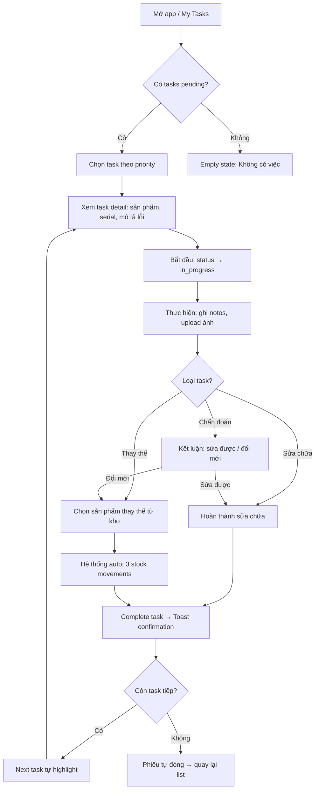
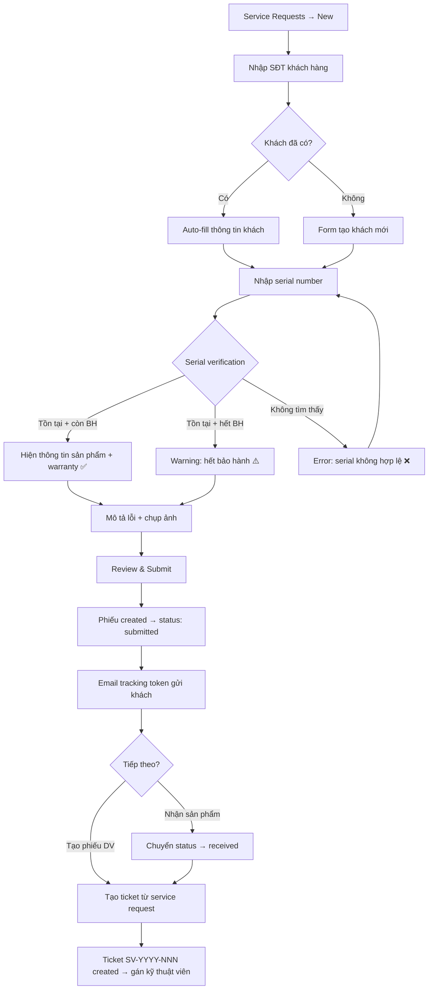
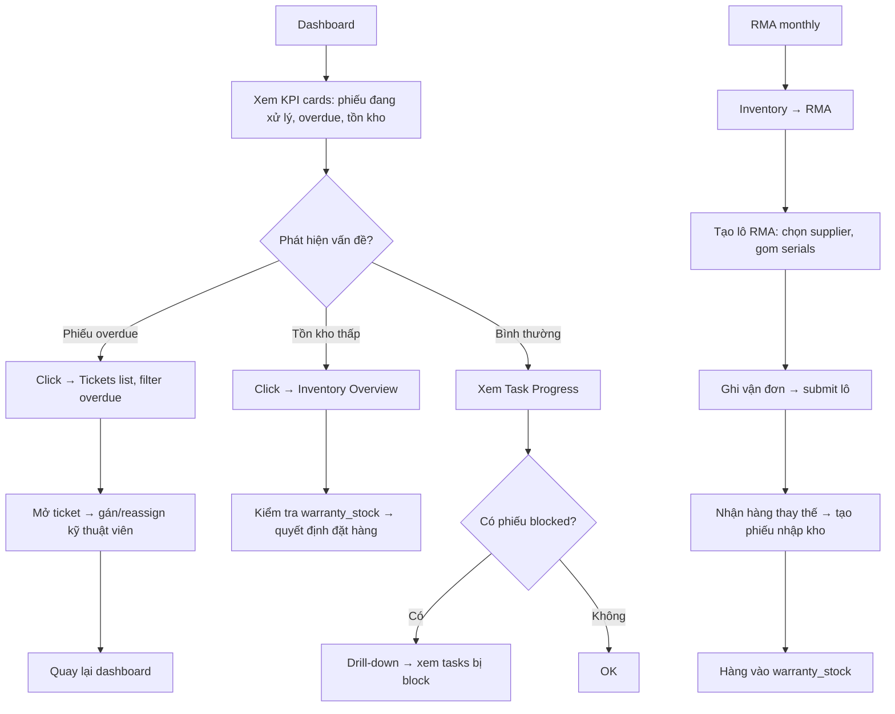

# UX Design Specification service-center-app

**Author:** Tan
**Date:** 2026-02-08

---

<!-- UX design content will be appended sequentially through collaborative workflow steps -->

## Executive Summary

### Project Vision

Hệ thống quản lý trung tâm bảo hành SSTC — thay thế Frappe/ERPNext bằng web app nội bộ thiết kế đúng nghiệp vụ bảo hành. Phục vụ ~20 nhân viên (4 vai trò nội bộ) + trang public cho khách hàng. Giao diện tiếng Việt, responsive, dark/light mode, sidebar navigation với role-based menu visibility.

Hệ thống bao quát toàn bộ vòng đời sản phẩm: nhập kho → bán hàng → tiếp nhận bảo hành → sửa chữa/đổi mới → RMA đổi trả về hãng. Mọi sản phẩm được theo dõi theo serial xuyên suốt qua 7 kho ảo.

### Target Users

**1. Kỹ thuật viên (Primary user)**
- Người dùng chính, sử dụng nhiều nhất
- Xem danh sách tasks, cập nhật chẩn đoán/sửa chữa, upload ảnh, chọn kết quả (sửa được / đổi mới)
- Nhu cầu UX: nhanh, ít bước thao tác, dùng được tại nơi làm việc (có thể trên mobile/tablet)
- Entry point chính: "My Tasks" page

**2. Tiếp nhận (Reception)**
- Vai trò chung — bất kỳ nhân viên nào cũng có thể thực hiện
- Tạo phiếu yêu cầu, xác minh serial/bảo hành, quản lý khách hàng, tạo phiếu dịch vụ
- Nhu cầu UX: quy trình rõ ràng từng bước, auto-fill thông tin, ít nhập liệu thủ công

**3. Quản lý (Manager)**
- Giám sát toàn bộ vận hành
- Dashboard tổng quan, gán kỹ thuật viên, RMA, kiểm soát tồn kho, workflow config
- Nhu cầu UX: bird's-eye view, phát hiện nhanh vấn đề, drill-down khi cần

**4. Admin**
- Quản lý tài khoản, phân quyền, cấu hình hệ thống, audit logs
- Dùng ít nhất, cần clarity hơn speed

**5. Khách hàng (Public — không đăng nhập)**
- Tự tạo yêu cầu bảo hành, tra cứu trạng thái bằng tracking token
- Nhu cầu UX: tối giản, không cần tài khoản, instant feedback

### Key Design Challenges

1. **Complexity management** — 47 pages, 10 domains, nhưng mỗi role chỉ cần một subset. Sidebar navigation + RBAC filtering giải quyết bằng cách chỉ hiện menu liên quan đến role.

2. **Multi-step workflows** — Phiếu yêu cầu → phiếu dịch vụ → tasks → stock movements. Mỗi bước có trạng thái phức tạp (7 states cho service request, task dependencies). Cần UX flow rõ ràng, không để user lạc giữa workflow.

3. **Serial tracking & validation** — Nhập serial number, xác minh bảo hành tự động, chọn sản phẩm thay thế từ kho — cần instant feedback, validation rõ ràng, error messages tiếng Việt dễ hiểu.

4. **Mobile usability cho kỹ thuật viên** — Kỹ thuật viên có thể dùng điện thoại/tablet tại bàn sửa chữa. Task execution, upload ảnh, cập nhật status cần hoạt động tốt trên mobile.

### Design Opportunities

1. **Task-centric experience** cho kỹ thuật viên — "My Tasks" là entry point chính, minimize navigation overhead, focus vào action (complete task, upload photo, update status).

2. **Dashboard insights** cho quản lý — KPIs, phiếu quá hạn, tồn kho thấp, employee performance → giúp ra quyết định nhanh mà không cần drill-down.

3. **Public portal simplicity** — Trang public tối giản, form submission → tracking token → status check. Không cần tạo tài khoản, trải nghiệm frictionless.

### Responsive & Mobile Strategy

**Approach:** Mobile-first responsive với container queries

- **`useIsMobile()` hook** — breakpoint 768px, điều khiển adaptive UI behaviors
- **Container queries** — `@container/main`, `@container/card` cho responsive layout theo container size (không chỉ viewport)
- **Drawer adaptive** — Desktop: slide từ phải, Mobile: slide từ dưới lên (bottom sheet pattern)
- **Sidebar** — Collapse sang icon-only mode trên màn hình nhỏ
- **Tables** — Desktop: full columns + tabs filter, Mobile: select dropdown + ẩn bớt columns
- **Pagination** — Mobile ẩn row-per-page, chỉ hiện prev/next
- **Header** — Mobile ẩn date/time clock và pending count, chỉ giữ title + sidebar toggle
- **Buttons** — Desktop: full text ("Tạo phiếu mới"), Mobile: icon-only
- **Grid layouts** — `grid-cols-1` → `@xl:grid-cols-2` → `@5xl:grid-cols-4` (progressive enhancement)
- **Stack patterns** — `flex-col` → `md:flex-row`, `w-full` → `w-fit`

## Core User Experience

### Defining Experience

Hệ thống xoay quanh **vòng đời phiếu dịch vụ** — mỗi role tương tác với vòng đời này ở một giai đoạn khác nhau:

| Role | Core Action | Entry Point |
|------|------------|-------------|
| Kỹ thuật viên | Complete tasks trên phiếu (chẩn đoán → sửa chữa → kết quả) | My Tasks |
| Tiếp nhận | Tạo phiếu yêu cầu với serial verification | Service Requests → New |
| Quản lý | Monitor & assign — tổng quan, gán việc, phát hiện bottleneck | Dashboard |
| Khách hàng | Submit & track — gửi yêu cầu, tra cứu trạng thái | /service-request (public) |

### Platform Strategy

- **Web app responsive** — desktop-first, mobile-adaptive
- **Desktop (mouse/keyboard)** — Primary cho tiếp nhận, quản lý, admin
- **Mobile/tablet (touch)** — Secondary cho kỹ thuật viên tại bàn sửa chữa
- **Không cần offline** — luôn có mạng nội bộ
- **Camera device** — upload ảnh chẩn đoán/sản phẩm qua mobile browser

### Effortless Interactions

1. **Serial verification** — nhập serial → hệ thống tự kiểm tra tồn tại + bảo hành → instant feedback
2. **Auto-fill khách hàng** — nhập SĐT → tự điền nếu đã có trong hệ thống
3. **Stock movements tự động** — thay đổi status phiếu → kho tự chuyển (không cần thao tác thủ công)
4. **Role-based navigation** — sidebar chỉ hiện menu relevant, kỹ thuật viên không thấy admin screens
5. **Task dependencies** — task tự unlock khi prerequisites hoàn thành
6. **Tracking token** — khách hàng chỉ cần 1 mã để tra cứu, không cần tài khoản

### Critical Success Moments

1. **"Sửa xong"** — Kỹ thuật viên complete task cuối → phiếu tự đóng, kho tự chuyển → workflow trôi chảy
2. **"Đổi mới thành công"** — Chọn sản phẩm thay thế → 3 stock movements tự động (lỗi→RMA, thay thế→khách, RMA batch cập nhật) → zero manual steps
3. **"Phiếu được tạo"** — Tiếp nhận submit → serial verified, khách hàng auto-fill, mã phiếu generated → nhanh, ít lỗi
4. **"Dashboard load"** — Quản lý mở app → thấy ngay KPIs, phiếu overdue, tồn kho → ra quyết định trong 10 giây

### Experience Principles

1. **Task-driven, not menu-driven** — User thấy ngay việc cần làm, không phải tìm trong menu. "My Tasks" cho kỹ thuật viên, "Pending requests" cho tiếp nhận, "Dashboard KPIs" cho quản lý.

2. **Automate the boring** — Stock movements, mã phiếu, email notifications, audit logs — tất cả tự động. User chỉ focus vào quyết định (sửa được? đổi mới? gán ai?).

3. **Vietnamese-first clarity** — Mọi label, error message, status badge bằng tiếng Việt. Không mix ngôn ngữ trong UI. Technical terms giữ nguyên khi cần (serial, RMA, SKU).

4. **Progressive disclosure** — Không overwhelm với tất cả thông tin cùng lúc. Dùng accordion, tabs, drawers để reveal chi tiết khi cần. Form phức tạp chia sections.

5. **Instant feedback everywhere** — Toast sau mỗi action, validation realtime, status badges color-coded, timeline cho workflow progress.

## Desired Emotional Response

### Primary Emotional Goals

Khi dùng hệ thống, user nên cảm thấy **"mọi thứ đang được kiểm soát"** — biết rõ việc gì cần làm, tiến độ ra sao, không lo sót bước.

- **Kỹ thuật viên:** Tập trung — task rõ ràng, next step tự hiện, hoàn thành → hài lòng
- **Tiếp nhận:** Tự tin — serial verified, auto-fill đúng, quy trình không nhầm
- **Quản lý:** An tâm — dashboard KPIs bình thường, phát hiện sớm khi có vấn đề
- **Khách hàng:** Nhẹ nhàng — gửi yêu cầu dễ, tracking đơn giản, không cần gọi điện hỏi

### Emotional Journey Mapping

| Giai đoạn | Kỹ thuật viên | Tiếp nhận | Quản lý |
|-----------|--------------|-----------|---------|
| Mở app | Rõ ràng: "Hôm nay có 5 việc" | Sẵn sàng: "Form đã sẵn, nhập thôi" | An tâm: "KPIs bình thường" |
| Làm việc | Tập trung: task rõ ràng, next step tự hiện | Tự tin: serial verified, auto-fill đúng | Kiểm soát: thấy toàn cảnh, gán việc nhanh |
| Hoàn thành | Hài lòng: phiếu tự đóng, kho tự chuyển | Nhẹ nhàng: phiếu tạo xong, email tự gửi | Yên tâm: không có phiếu overdue |
| Lỗi xảy ra | Không hoảng: error message rõ, biết cách fix | Không bối rối: validation chặn trước khi submit | Phát hiện sớm: dashboard alert |

### Micro-Emotions

**Cần đạt được:**
- **Confidence > Confusion** — Mỗi screen rõ ràng: đang ở đâu, cần làm gì, bước tiếp là gì. Status badges color-coded, page headers, breadcrumbs.
- **Trust > Skepticism** — Automation (kho tự chuyển, mã tự tạo) → user cần tin tưởng qua toast confirm, stock movement history để verify.
- **Accomplishment > Frustration** — Complete task → visual feedback ngay (toast, status change, progress bar). Không để user tự hỏi "đã lưu chưa?".

**Cần tránh:**
- **Overwhelm** — quá nhiều fields hiện cùng lúc, quá nhiều menu items
- **Uncertainty** — "tôi vừa bấm cái gì?" "đã lưu chưa?" "dữ liệu kho có đúng không?"
- **Lost** — "tôi đang ở đâu trong workflow?" "phải làm bước gì tiếp?"

### Design Implications

| Emotion mục tiêu | UX Approach |
|------------------|------------|
| Kiểm soát | Dashboard KPIs, clear navigation, status badges, timeline tracking |
| Tự tin | Instant validation, auto-fill, confirmation toasts, undo khi có thể |
| Tập trung | Role-based menu, progressive disclosure, task-centric views |
| Hài lòng | Completion feedback (toast + status change), zero manual kho movements |
| An tâm | Error boundaries, clear error messages tiếng Việt, retry mechanisms |

### Emotional Design Principles

1. **Clarity over cleverness** — Giao diện rõ ràng hơn là đẹp mắt. Label đầy đủ, status badges dễ đọc, navigation predictable.

2. **Confirmation builds trust** — Mỗi action quan trọng đều có feedback: toast success/error, status badge thay đổi, timeline update.

3. **Prevent before correct** — Validation chặn lỗi trước khi submit (Zod + form validation). Disable nút khi thiếu data. Confirm dialog cho destructive actions.

4. **Recovery without panic** — Khi lỗi xảy ra: error message tiếng Việt cụ thể ("Không tìm thấy serial này trong hệ thống"), không hiện mã lỗi kỹ thuật, suggest next action.

## UX Pattern Analysis & Inspiration

### Inspiring Products Analysis

**1. Vercel Dashboard / Linear**
- Sidebar navigation collapsible với icon-only mode
- Clean, minimal design với card-based layouts
- Dark/light mode toggle
- Status badges color-coded
- Áp dụng trong app: AppSidebar, page-header, dark mode, badges

**2. Shopify Admin / Inventory Management Tools**
- Data tables với sort, filter, pagination, column customization
- Drawer panels cho edit forms (slide-in từ phải)
- Bulk actions (select all → action)
- Stock document patterns (receipts, issues, transfers)
- Áp dụng trong app: data-table + TanStack Table, form-drawer, inventory document flows

**3. Jira / Trello (Task Management)**
- Task cards với status, assignee, priority
- Task progression (pending → in_progress → completed)
- Task dependencies + blocking indicators
- Timeline view cho progress tracking
- Áp dụng trong app: task-execution-card, task-dependency-indicator, task-list-accordion

### Transferable UX Patterns

**Navigation:**
- Hierarchical sidebar với collapsible sections + role-based visibility
- Page header với back button + contextual info (clock, pending count)

**Data Display:**
- TanStack Table: sort, filter, paginate, drag-reorder, column toggle
- KPI metric cards với trend indicators (revenue, customers, products)
- Status timeline cho workflow progress

**Input & Forms:**
- Searchable select / combobox cho product lookup
- Serial number input với instant validation
- Multi-section forms với accordion (progressive disclosure)
- Drawer-based edit forms (không navigate away từ list page)

**Feedback:**
- Toast notifications (Sonner) cho mọi mutation
- Color-coded status badges (green/yellow/red/blue)
- Skeleton loading placeholders
- Empty state components với suggested actions

**Mobile Adaptive:**
- Bottom sheet drawers (thay side drawers trên mobile)
- Icon-only buttons + simplified pagination
- Container queries cho responsive grid

### Anti-Patterns to Avoid

1. **Multi-page wizard forms** — Dùng accordion sections trong 1 page thay vì bắt user qua nhiều pages
2. **Modal trong modal** — Tránh nested dialogs. Dùng drawer → confirm dialog (1 level max)
3. **Table overload** — Không hiện >8 columns trên mobile. Ẩn columns ít quan trọng
4. **Generic error messages** — "Something went wrong" → thay bằng error tiếng Việt cụ thể
5. **Redirect sau submit** — Không redirect về list page ngay. Hiện toast + giữ context

### Design Inspiration Strategy

**Adopt (giữ nguyên):**
- shadcn/ui component library — accessible, consistent, dễ customize
- Sidebar + page header navigation pattern
- Data table với TanStack Table (proven cho admin dashboards)
- Toast feedback pattern (Sonner)

**Adapt (điều chỉnh cho nghiệp vụ):**
- Task management: simplified từ Jira → task-centric view phù hợp kỹ thuật viên
- Inventory: inspired by Shopify nhưng focus serial tracking thay vì SKU variants
- Dashboard: KPI cards + charts, focus actionable metrics

**Avoid:**
- Over-engineered drag-and-drop (chỉ dùng cho task reordering)
- Complex role-based dashboards (1 dashboard cho tất cả, filter bằng RBAC)
- Notification center phức tạp (bell icon + dropdown list là đủ)

## Design System Foundation

### Design System Choice

**shadcn/ui + Radix UI + Tailwind CSS 4** — Themeable System approach.

Copy-paste model: components nằm trong `src/components/ui/` (41 files), team sửa trực tiếp source. Radix primitives cho accessibility foundation. Tailwind CSS 4 với `@theme` directive cho design tokens.

### Rationale for Selection

| Factor | Decision |
|--------|----------|
| Speed vs Uniqueness | Balance — shadcn/ui copy-paste, customize thoải mái |
| Accessibility | Built-in — Radix primitives (ARIA, keyboard nav, focus management) |
| Customization | Full control — self-owned source, không phụ thuộc library updates |
| Brand Flexibility | OKLch color system, CSS variables cho dark/light mode |
| Team Expertise | Tailwind CSS quen thuộc, components dễ hiểu |
| Maintenance | Self-owned — no breaking changes từ upstream |

### Implementation Approach

- **41 shadcn/ui components** installed: button, card, dialog, drawer, table, tabs, badge, skeleton, combobox, select, popover, tooltip, accordion, alert-dialog, sheet...
- **Radix primitives** foundation: Dialog, Select, Dropdown, Popover, Tooltip, Tabs, Accordion, RadioGroup, Checkbox, Switch
- **Tailwind CSS 4** với `@import "tailwindcss"` + `tw-animate-css` cho animations
- **Recharts** integration qua custom `chart.tsx` wrapper
- **Sonner** cho toast notification system

### Customization Strategy

**Color System (OKLch):**
- Primary: `oklch(0.637 0.237 25.331)` — warm orange/brown
- Destructive: `oklch(0.577 0.245 27.325)` — red
- Background: `oklch(1 0 0)` light / `oklch(0.141 0.005 285.823)` dark
- 5-color chart palette cho data visualization
- Separate sidebar color scale

**Typography:**
- Sans: Geist Sans (Google Fonts)
- Mono: Geist Mono
- Custom font size scale: xs (0.75rem) → 9xl (8rem)

**Spacing & Layout:**
- Base unit: 4px (Tailwind default)
- Sidebar width: 288px (`calc(var(--spacing) * 72)`)
- Header height: 48px (`calc(var(--spacing) * 12)`)
- Border radius: `--radius: 0.65rem` (rounded, not pill)

**Dark Mode:**
- `.dark` class toggle via `next-themes`
- Separate CSS variable tokens cho light/dark
- Border transparency: `oklch(1 0 0 / 10%)` in dark mode

**Custom Components Beyond shadcn/ui:**
- `form-drawer.tsx` — Drawer variant optimized cho forms
- `multi-select-combobox.tsx` — Multi-select với search
- `searchable-select.tsx` — Custom searchable dropdown
- `table-pagination.tsx` — Dedicated pagination controls
- `date-picker.tsx` — Date input component

## Defining Core Experience (Chi tiết)

### Defining Experience Statement

**"Mở app → thấy ngay việc cần làm → làm xong → hệ thống lo phần còn lại"**

Đây là trải nghiệm cốt lõi — người dùng mở app, immediately sees their work, completes it, và system handles the rest (stock movements, notifications, status updates). Nếu nail được interaction này, mọi thứ khác sẽ follow.

| Tương tự với | Defining Experience |
|-------------|-------------------|
| Tinder | Swipe to match |
| Spotify | Discover and play any song instantly |
| **SSTC** | **Mở → thấy việc → làm xong → hệ thống xử lý** |

### User Mental Model

**Nền tảng hiện tại:**
- Team đang migrate từ **Frappe/ERPNext** — quen với sidebar navigation, list views, form views, doctype-based workflow
- Mental model: **task-as-checklist** — mỗi phiếu có danh sách task, hoàn thành tuần tự
- **Serial = identity** — mỗi sản phẩm được nhận dạng bằng serial number xuyên suốt lifecycle

**Kỳ vọng user:**
- Kỹ thuật viên: "Mở app → thấy tasks → bấm hoàn thành" (đơn giản như checklist)
- Tiếp nhận: "Nhập serial → hệ thống tự fill thông tin → submit" (giống POS checkout)
- Quản lý: "Mở dashboard → thấy tình hình → drill-down nếu cần" (giống analytics tool)

**Điểm friction cần tránh:**
- Frappe: quá nhiều fields trên 1 form, navigation phức tạp, translation tiếng Việt kém
- Giải pháp: progressive disclosure, role-based menus, Vietnamese-first UI

### Success Criteria

| Metric | Target | Cách đo |
|--------|--------|---------|
| Task completion time | < 30 giây | Từ mở task → bấm hoàn thành |
| Service request creation | < 2 phút | Từ bắt đầu nhập → submit |
| Manual stock movements | Zero | Hệ thống tự xử lý khi status thay đổi |
| Dashboard meaningful load | < 10 giây | Mở app → hiểu tình hình hiện tại |
| Public form submission | < 3 phút | Khách hàng gửi yêu cầu mà không cần hỗ trợ |
| First-use learnability | < 1 ngày | Nhân viên mới tự dùng được sau 1 ngày hướng dẫn |

### Novel UX Patterns

**Approach: Established patterns + Domain-specific customization**

Hệ thống chủ yếu dùng **established UX patterns** (sidebar, tables, forms, drawers) mà user đã quen từ Frappe và các admin tools khác. Điểm khác biệt nằm ở **domain logic** được embed vào UX:

**Established (giữ nguyên):**
- Sidebar navigation + role-based visibility
- Data tables với sort/filter/pagination
- Form-in-drawer pattern
- Toast feedback sau mỗi action

**Domain-specific (tùy chỉnh cho nghiệp vụ):**
- **Serial verification flow** — nhập serial → instant validate + hiện thông tin bảo hành (unique cho warranty domain)
- **Auto stock movements** — status change triggers stock transfer giữa 7 kho ảo (invisible cho user)
- **Task dependency UI** — tasks tự unlock khi prerequisites hoàn thành, visual indicators cho blocked tasks
- **Replacement product picker** — chọn sản phẩm thay thế từ kho tương thích, kèm stock availability

**Không cần user education** — patterns đều familiar, chỉ domain logic mới cần onboarding ngắn.

### Experience Mechanics

**Core Flow: Kỹ thuật viên hoàn thành task (defining interaction)**

**1. Initiation:**
- Mở app → landing page "My Tasks" hiện danh sách tasks assigned
- Tasks grouped by service request, sorted by priority/deadline
- Badge count trên sidebar cho pending tasks
- Visual cues: overdue = red, today = orange, upcoming = default

**2. Interaction:**
- Tap/click vào task → drawer mở ra với task details
- Form fields tùy theo task type (diagnosis, repair, replacement)
- Upload ảnh (camera trên mobile, file picker trên desktop)
- Chọn kết quả: sửa được / cần đổi mới / cần linh kiện
- Notes field cho ghi chú kỹ thuật

**3. Feedback:**
- Real-time form validation (Zod)
- Toast "Task đã hoàn thành" sau submit
- Status badge chuyển từ "Đang xử lý" → "Hoàn thành"
- Next task tự highlight (nếu có dependencies)
- Stock movements tự động (user thấy qua toast notification)

**4. Completion:**
- Task hoàn thành → drawer đóng, quay lại task list
- Task list cập nhật: completed task move xuống / ẩn
- Nếu task cuối cùng → service request tự chuyển status
- Timeline trên service request cập nhật automatically
- Manager nhận notification về progress

## Visual Design Foundation

### Color System

**Color Space: OKLch** — modern perceptual color space, đảm bảo color transitions đều và contrast nhất quán.

**Core Palette:**

| Token | Light Mode | Dark Mode | Usage |
|-------|-----------|-----------|-------|
| Primary | `oklch(0.637 0.237 25.331)` | Same | Warm orange — CTA, focus ring, links |
| Primary FG | `oklch(0.971 0.013 17.38)` | Same | Text trên primary background |
| Background | `oklch(1 0 0)` | `oklch(0.141 0.005 285.823)` | Page background |
| Foreground | `oklch(0.141 0.005 285.823)` | `oklch(0.985 0 0)` | Body text |
| Destructive | `oklch(0.577 0.245 27.325)` | `oklch(0.704 0.191 22.216)` | Errors, delete actions |
| Muted | `oklch(0.967 0.001 286.375)` | `oklch(0.274 0.006 286.033)` | Secondary surfaces |
| Muted FG | `oklch(0.552 0.016 285.938)` | `oklch(0.71 0.016 286.067)` | Placeholder, secondary text |
| Border | `oklch(0.92 0.004 286.32)` | `oklch(1 0 0 / 10%)` | Dividers, input borders |

**Status Colors (Badge system):**
- Pending: `#EB002B` (red)
- Processing: `#F9BE6F` (gold)
- Resolved: `#4AD08C` (green)
- Closed: `#6F787F` (gray)
- Ready: `#3B82F6` (blue)

**Chart Palette (5 colors):**
- Light: Orange → Cyan → Deep blue → Yellow-green → Golden
- Dark: Purple → Teal → Golden → Magenta → Red-orange

**Sidebar** có separate color tokens: background, foreground, primary, accent, border, ring — cho phép sidebar có visual identity riêng.

### Typography System

**Font Stack:**
- **Sans-serif:** Geist Sans (Google Fonts, variable `--font-geist-sans`)
- **Monospace:** Geist Mono (variable `--font-geist-mono`)
- Latin subset, loaded qua `next/font/google`

**Type Scale:**

| Token | Size | Pixel | Usage |
|-------|------|-------|-------|
| xs | 0.75rem | 12px | Badges, sidebar group labels |
| sm | 0.875rem | 14px | Buttons, inputs, card descriptions |
| base | 1rem | 16px | Body text |
| lg | 1.125rem | 18px | Section headings |
| xl | 1.25rem | 20px | Page sub-headings |
| 2xl | 1.5rem | 24px | Page headings |
| 3xl–9xl | 1.875–8rem | 30–128px | Hero/display (ít dùng) |

**Font Weight Usage:**
- `font-medium` (500): Buttons, labels, badges, alert titles
- `font-semibold` (600): Card titles, active sidebar items
- `font-bold` (700): KPI numbers, emphasis
- Default (400): Body text, descriptions

**Responsive:** Body text `md:text-sm` — smaller on desktop for information density.

### Spacing & Layout Foundation

**Base Unit:** 4px (Tailwind default spacing scale)

**Border Radius System:**

| Token | Value | Usage |
|-------|-------|-------|
| radius | 0.65rem | Cards, dialogs, inputs |
| radius-sm | calc(radius - 4px) ≈ 0.4rem | Badges, small buttons |
| radius-md | calc(radius - 2px) ≈ 0.5rem | Standard controls |
| radius-lg | radius = 0.65rem | Cards, containers |
| radius-xl | calc(radius + 4px) ≈ 1rem | Large panels |

**Layout Dimensions:**
- Sidebar desktop: 16rem (256px), mobile: 18rem (288px), icon-only: 3rem (48px)
- Header: 48px (`calc(var(--spacing) * 12)`)
- Content padding: responsive, từ `p-4` (mobile) → `p-6` (desktop)

**Component Heights:**
- Button default: 36px (h-9), sm: 32px (h-8), lg: 40px (h-10)
- Input: 36px (h-9)
- Checkbox: 16px (size-4)
- Sidebar menu item: 32px (h-8), large: 48px (h-12)

**Gap Patterns:**
- Component groups: `gap-1`, `gap-1.5`, `gap-2`
- Card sections: `gap-6`
- Form fields: `gap-4`

**Grid Strategy:**
- Container queries: `@container/main`, `@container/card`, `@container/card-header`
- Progressive columns: `grid-cols-1` → `@xl:grid-cols-2` → `@5xl:grid-cols-4`
- Stack patterns: `flex-col` → `md:flex-row`

### Accessibility Considerations

**Focus States:**
- Ring color: Primary orange (`ring-ring`) với 50% opacity
- Ring width: 3px (`ring-[3px]`)
- Pattern: `outline-none focus-visible:border-ring focus-visible:ring-ring/50 focus-visible:ring-[3px]`
- Destructive variant: `dark:focus-visible:ring-destructive/40`

**Color & Contrast:**
- Primary text on white: `oklch(0.141)` on `oklch(1)` — ratio >15:1
- Light text on dark: `oklch(0.985)` on `oklch(0.141)` — ratio >15:1
- Muted text: `oklch(0.552)` on white — ratio ~5:1 (WCAG AA compliant)
- Selection highlighting: primary color background

**Interactive States:**
- Disabled: `opacity-50 + pointer-events-none + cursor-not-allowed`
- Invalid: `aria-invalid:ring-destructive/20 aria-invalid:border-destructive`
- Hover: Background shifts via `hover:bg-*` tokens
- Active sidebar: `data-[active=true]:bg-sidebar-accent data-[active=true]:font-medium`

**Keyboard Navigation:**
- Sidebar toggle: `Ctrl/Cmd + B`
- All Radix primitives: full keyboard support (arrow keys, enter, escape, tab)
- Focus management qua Radix (Dialog, Popover, Dropdown auto-focus)

**Transitions:**
- Standard duration: 200ms
- Button: `transition-all`
- Input: `transition-[color,box-shadow]`
- Sidebar: `transition-[width] duration-200 ease-linear`
- Recommend bổ sung: `prefers-reduced-motion` media query cho users cần giảm animation

## Design Direction Decision

### Design Directions Explored

App đã được implement — visual direction là kết quả của các quyết định design trong quá trình development. Không cần explore nhiều variations.

**Direction đã chọn: "Professional Warmth"** — Clean admin dashboard với warm orange accent, tối ưu cho nghiệp vụ bảo hành.

| Aspect | Quyết định |
|--------|-----------|
| Layout | Sidebar + header + content area (classic admin pattern) |
| Visual weight | Medium density — cards cho KPIs, tables cho data, drawers cho forms |
| Color mood | Neutral base (gray scale) + warm orange primary (energetic nhưng professional) |
| Navigation | Hierarchical sidebar với collapsible sections |
| Interaction | Drawer-based forms, inline table actions, toast feedback |
| Mode | Dark/light toggle — full dual-theme support |

### Chosen Direction

**"Professional Warmth" — Operational efficiency với visual comfort**

Đặc trưng:
- **Warm orange** (`oklch(0.637 0.237 25.331)`) làm primary — nổi bật trên neutral background, tạo cảm giác active/energetic phù hợp với operational tool
- **Clean neutral grays** cho background/borders — không distract, để content nổi bật
- **Card-based dashboard** — KPI metrics, charts, quick actions organized trong cards
- **Table-heavy data views** — TanStack Table cho list pages (products, customers, service requests)
- **Drawer forms** — slide-in panels thay vì full-page forms, giữ context
- **Progressive disclosure** — accordion sections, tabs, expandable rows

### Design Rationale

1. **Warm orange > cold blue** — Khác biệt với hầu hết admin tools (thường dùng blue). Orange tạo cảm giác friendly, approachable cho internal team. Phù hợp với brand identity SSTC.

2. **Sidebar navigation > top nav** — Admin apps cần nhiều menu items. Sidebar accommodates 10+ domains với collapsible sections. Role-based filtering giảm menu overload.

3. **Drawer forms > full-page forms** — User không mất context khi edit. Đặc biệt quan trọng khi đang ở list view → edit 1 item → quay lại list ngay.

4. **Dark mode support** — Kỹ thuật viên có thể dùng trong môi trường ánh sáng yếu (khu vực sửa chữa). Dark mode giảm eye strain cho user dùng nhiều giờ.

5. **Container queries > media queries** — Flexible hơn, components responsive theo container size thay vì viewport. Cho phép cùng 1 component hoạt động tốt ở sidebar, drawer, và full-width.

### Implementation Approach

**Đã implement — documenting current state:**

- **Page layout:** `<AppSidebar>` + `<SidebarInset>` wrapper cho mọi authenticated pages
- **Page structure:** `<PageHeader>` → `<Content area>` với `@container/main` wrapper
- **Data pages:** Table + filter toolbar + pagination + drawer for CRUD
- **Dashboard:** Grid of KPI cards + chart cards + quick action links
- **Forms:** React Hook Form + Zod validation, rendered trong Drawer hoặc Dialog
- **Public pages:** Standalone layout không sidebar, tối giản

## User Journey Flows

### Journey 1: Kỹ Thuật Viên — Task Execution Flow

**Entry:** `/my-tasks` → Danh sách tasks assigned, sorted by priority



**Routes:** `/my-tasks` → `/my-tasks/[taskId]`
**Key interactions:** Task status update, photo upload, outcome selection, auto stock movements

### Journey 2: Tiếp Nhận — Service Request Creation Flow

**Entry:** `/operations/service-requests/new`



**Routes:** `/operations/service-requests` → `.../new` → `.../[id]` → `/operations/tickets/add`
**Key interactions:** Customer auto-fill, serial verification, email notification, ticket creation

### Journey 3: Quản Lý — Monitor & Assign Flow

**Entry:** `/dashboard`



**Routes:** `/dashboard` → `/operations/tickets` → `/dashboard/task-progress` → `/inventory/overview` → `/inventory/rma`
**Key interactions:** KPI monitoring, drill-down navigation, technician assignment, RMA batch processing

### Journey 4: Khách Hàng — Public Service Request Flow

**Entry:** `/service-request` (no auth required)

```mermaid
flowchart TD
    A[Trang public /service-request] --> B[Nhập thông tin: tên, SĐT, email]
    B --> C[Nhập serial + mô tả lỗi + ảnh]
    C --> D[Submit form]
    D --> E[Success page + tracking token hiển thị]
    E --> F[Email xác nhận gửi tự động]
    F --> G{Muốn tra cứu?}
    G -->|Có| H[/service-request/track → nhập token]
    H --> I[Xem trạng thái realtime]
    I --> J{Hoàn tất?}
    J -->|Chưa| K[Quay lại tra cứu sau]
    J -->|Rồi| L[Nhận email hoàn tất → lấy sản phẩm]
```

**Routes:** `/service-request` → `/service-request/success` → `/service-request/track`
**Key interactions:** Anonymous form submission, tracking token, status lookup

### Journey Patterns

| Pattern | Description | Used In |
|---------|------------|---------|
| **List → Detail → Action** | Browse list → select item → action in drawer/detail | Tasks, Tickets, Service Requests, Products |
| **Auto-fill & Verify** | Input identifier → system validates + fills data | Customer (SĐT), Product (serial), Warranty |
| **Status Progression** | Linear state machine with visual badges | Service requests (7 states), Tasks (4 states) |
| **Toast Confirm** | Every mutation → immediate toast feedback | All CRUD operations |
| **Drill-down Navigation** | Dashboard KPI → filtered list → detail view | Manager monitoring flow |
| **Form-in-Drawer** | Edit/create without leaving list context | Product edit, task update, customer edit |

### Flow Optimization Principles

1. **Minimize clicks to value** — Kỹ thuật viên từ mở app → complete task trong ≤3 clicks. Tiếp nhận tạo phiếu ≤5 steps.

2. **Auto-fill everywhere** — SĐT → customer info, Serial → product + warranty, Service request → ticket defaults.

3. **Smart defaults** — Status tự chuyển theo workflow, tasks tự unlock, stock movements tự động. User chỉ cần quyết định.

4. **Context preservation** — Drawer forms giữ list context. Back button reliable. Breadcrumbs cho deep navigation.

5. **Error prevention > error recovery** — Serial validation trước submit. Confirm dialog cho destructive actions. Disable buttons khi thiếu data.

## Component Strategy

### Design System Components (shadcn/ui)

**41 shadcn/ui primitives** trong `src/components/ui/`:

| Category | Components |
|----------|-----------|
| Layout | card, separator, sidebar, sheet, scroll-area, collapsible, resizable-panel |
| Navigation | tabs, breadcrumb, navigation-menu, pagination |
| Forms | button, input, textarea, select, checkbox, radio-group, switch, slider, toggle, toggle-group, label, form |
| Overlay | dialog, drawer, popover, tooltip, dropdown-menu, context-menu, alert-dialog |
| Data | table, badge, avatar, calendar, skeleton |
| Feedback | alert, progress, sonner (toast) |
| Advanced | combobox, accordion, command, chart (Recharts wrapper) |

Coverage: shadcn/ui covers 100% primitive UI needs. Tất cả custom components xây dựng trên các primitives này.

### Custom Components (128 components)

**Distribution:**

| Category | Count | Examples |
|----------|-------|---------|
| Data Display | 41 | Tables, timelines, cards, charts |
| Domain-specific | 30 | Serial verification, stock movements, RMA, auth |
| Form Components | 26 | Multi-step forms, serial input, drawers |
| Feedback | 17 | Status badges, progress bars, confirmation modals |
| Navigation | 5 | Sidebar sections, nav menus |
| Layout | 4 | Page header, section cards |

**Key Custom Components by Feature:**

**Inventory (~35 components):** serial-input, serial-entry-drawer, unified-serial-input-drawer, product-inventory-table, stock-documents-table, receipt/issue/transfer headers & items, stock-breakdown-section, stock-trend-chart, stock-status-badge, warranty-status-badge, product-search, warehouse-selector

**Tasks (~12 components):** task-card, task-execution-card, task-status-badge, task-dependency-indicator, task-attachment-upload, task-notes-section, task-filters, tasks-table

**Workflows (~9 components):** workflow-detail (5 files), workflow-selection-dialog, workflow-preview, template-form, sortable-task-item

**Operations (~13 modals):** complete-ticket-modal, task-completion-modal, convert-to-ticket-modal, reject-request-modal, confirm-delivery-modal, record-movement-modal

**Shared:** request-status-timeline, movement-history-timeline, serial-verification-widget, empty-state, loading-state, confirm-dialog

### Component Implementation Strategy

**Architecture:**
```
src/components/
├── ui/              → 41 shadcn/ui primitives (foundation)
├── common/          → Shared utilities (empty state, loading, confirm)
├── shared/          → Cross-feature components (badges, timelines)
├── auth/            → Auth/RBAC components (Can, RequireRole)
├── modals/          → Action confirmation dialogs
├── drawers/         → Slide-in form panels
└── [feature]/       → Feature-specific components

src/app/(auth)/[route]/
└── components/      → Route-colocated components (tables, forms)
```

**Composition pattern:** Domain components compose shadcn/ui primitives:
- `task-card` = Card + Badge + Button + Avatar
- `serial-input` = Input + validation logic + feedback display
- `data-table` = Table + TanStack Table + DnD + Pagination
- `form-drawer` = Drawer + Form + validation

**State management:** React Hook Form + Zod cho forms, TanStack Query cho server state, React context cho UI state.

### Implementation Roadmap

**Status: ~90% implemented.** Gaps cần bổ sung:
1. `prefers-reduced-motion` support — Accessibility improvement
2. Notification center component — Dropdown bell icon
3. Offline indicator — Network connectivity feedback (nếu cần)
4. Onboarding tour component — First-use guidance

## UX Consistency Patterns

### Button Hierarchy

| Variant | Usage | Visual | Example |
|---------|-------|--------|---------|
| **Default (Primary)** | Main CTA, primary actions | Warm orange bg, white text | "Tạo phiếu", "Lưu", "Hoàn thành" |
| **Destructive** | Delete, reject, cancel actions | Red bg | "Xóa", "Từ chối" |
| **Outline** | Secondary actions | Border only, transparent bg | "Hủy", "Quay lại" |
| **Secondary** | Tertiary actions | Gray bg | "Bộ lọc", "Export" |
| **Ghost** | Inline actions, table row actions | No bg, accent on hover | Edit icon, menu trigger |
| **Link** | Navigation, text links | Underline on hover | "Xem chi tiết" |

**Placement rules:**
- Primary action rightmost trong button groups
- Destructive actions require confirm dialog (alert-dialog)
- Mobile: icon-only buttons + tooltips, Desktop: full text
- Disable button khi form invalid hoặc đang submitting

### Feedback Patterns

**Toast (Sonner):**

| Type | When | Duration | Example |
|------|------|----------|---------|
| Success | After successful mutation | 3s auto-dismiss | "Phiếu đã được tạo thành công" |
| Error | API error, validation failure | 5s, manual dismiss | "Không thể lưu. Vui lòng thử lại" |
| Warning | Non-critical issue | 4s | "Serial này đã hết bảo hành" |
| Info | Status update | 3s | "Task đã được gán cho Minh" |

**Status Badges:** Color-coded (Pending=red, Processing=gold, Resolved=green, Closed=gray, Ready=blue), text tiếng Việt, consistent across service requests, tasks, RMA, stock documents.

**Loading:** Skeleton placeholders (initial load), button spinner (submitting), table skeleton (fetching), progress bar (bulk ops).

**Empty States:** Icon + message + CTA button. Component: `empty-state.tsx`.

### Form Patterns

**Layout:** Single-column trong drawers (~480px max). Multi-section dùng accordion. Labels above inputs. Required: asterisk (*).

**Validation:** Zod + React Hook Form. Realtime on blur. Error messages tiếng Việt cụ thể ("Serial phải có 10-20 ký tự").

**Input types:** Text input, phone (auto-format), serial-input (instant verify), Select/SearchableSelect, multi-select-combobox, date-picker, file upload, signature-canvas.

**Form-in-Drawer:** Desktop slide từ phải (~480px), Mobile slide từ dưới. Unsaved changes → confirm dialog.

### Navigation Patterns

**Sidebar:** Hierarchical sections, role-based visibility (`RequireRole`), collapsible, icon-only mode, `Ctrl/Cmd+B` toggle.

**Page:** Header (title + back button + actions), breadcrumbs cho deep nav, tabs cho multi-view, reliable back button.

**Table:** Click row → detail/drawer. Pagination: full (desktop) / simplified (mobile). Filter toolbar above table. Sort via column header.

### Modal & Overlay Patterns

| Type | Usage | Behavior |
|------|-------|----------|
| Dialog | Confirmations, simple forms | Center screen, backdrop blur |
| Alert Dialog | Destructive confirmations | Requires explicit action |
| Drawer | Complex forms, detail views | Right (desktop) / bottom (mobile) |
| Popover | Quick info, small menus | Anchored to trigger |
| Tooltip | Help text, icon explanation | Hover/focus trigger |
| Dropdown Menu | Action menus | Click trigger, keyboard navigable |

**Rules:** Max 1 nesting level. Escape always closes. Click outside closes (except alert-dialog). Focus trap (Radix).

### Data Table Patterns

**Standard layout:** Filter toolbar → Table header (sortable) → Table body (inline actions) → Pagination.

**Consistent features:** Column sorting, visibility toggle, row selection, drag-reorder, responsive column hiding, empty state, skeleton loading.

### Search & Filter Patterns

Search: Input + search icon, debounced 300ms, clear button. Filters: Toolbar above table, collapsible, clear all. Filter types: select, date range, status multi-select, text search.

## Responsive Design & Accessibility

### Responsive Strategy

**Approach:** Desktop-first với mobile-adaptive.

**Desktop (1024px+):**
- Full sidebar (256px) + header + content area
- Multi-column layouts: KPI grid 4 cols, tables full columns
- Drawer forms slide từ phải (480px width)
- Dense information: `md:text-sm` body text
- Mouse + keyboard optimized

**Tablet (768px–1023px):**
- Sidebar icon-only mode (48px) hoặc overlay sheet
- KPI grid 2 cols, tables ẩn 2-3 columns
- Drawer wider (80% screen)
- Touch-friendly: larger tap targets

**Mobile (<768px):**
- Sidebar hidden, toggle qua hamburger (sheet overlay)
- KPI grid 1 col, stacked layout
- Tables: minimal columns, simplified pagination (prev/next only)
- Drawer slide từ dưới (bottom sheet)
- Icon-only buttons, ẩn date/time clock + pending count
- Camera access cho photo upload

### Breakpoint Strategy

**Primary breakpoint:** `768px` (`useIsMobile()` hook)

**Container queries (preferred over media queries):**

| Container | Usage |
|-----------|-------|
| `@container/main` | Main content area — grid columns, spacing |
| `@container/card` | Card internals — layout, font sizes |
| `@container/card-header` | Card header — grid arrangement |

**Progressive enhancement:**
- `grid-cols-1` → `@xl:grid-cols-2` → `@5xl:grid-cols-4`
- `flex-col` → `md:flex-row`
- `p-4` → `p-6`

### Accessibility Strategy

**Target:** WCAG 2.1 Level AA

**Implemented:**

| Area | Status |
|------|--------|
| Color contrast (>4.5:1 text) | Done |
| Keyboard navigation (Radix) | Done |
| Focus indicators (3px ring) | Done |
| Semantic HTML + ARIA | Done |
| Touch targets (min 36px) | Done |
| Dark mode (full dual-theme) | Done |
| Form validation (aria-invalid) | Done |
| Disabled states | Done |

**Gaps to address:**

| Area | Priority |
|------|----------|
| `prefers-reduced-motion` | Medium |
| Skip links ("Skip to main content") | Low |
| Screen reader testing (VoiceOver/NVDA) | Medium |
| `lang="vi"` on `<html>` | Low |

### Testing Strategy

**Responsive:** Chrome DevTools simulation, actual devices (iPhone Safari, Android Chrome, iPad), container query resize testing.

**Accessibility:** Lighthouse audit (target >90), axe DevTools extension, keyboard-only navigation walkthrough, VoiceOver testing.

**Browser support:** Chrome (primary), Safari (mobile), Firefox, Edge — latest 2 versions.

### Implementation Guidelines

**Responsive:**
- `useIsMobile()` hook cho adaptive behavior
- Container queries (`@container`) preferred over media queries
- Touch targets min 36px (h-9), recommend 44px primary actions mobile
- Test portrait + landscape on tablet

**Accessibility:**
- All interactive elements focusable + visible focus indicator
- Form fields always have associated `<Label>`
- Error messages: `aria-invalid` + `aria-describedby`
- Modals: Radix primitives (auto focus trap + restore)
- Status changes: toast with `role="alert"`
- Color never sole indicator — always paired with text/icon
