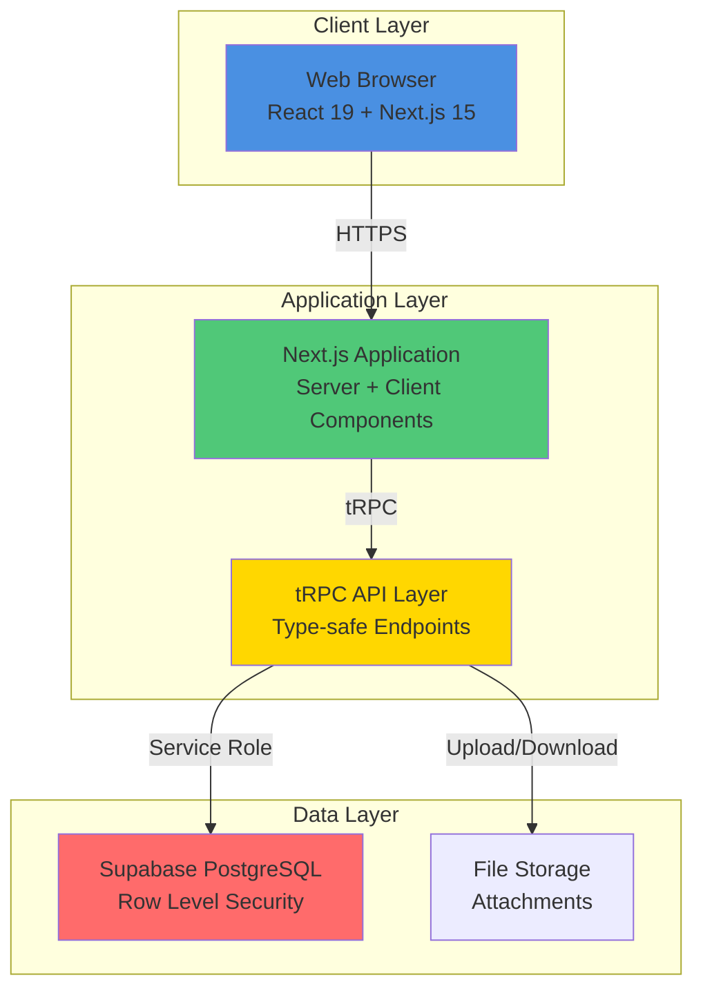
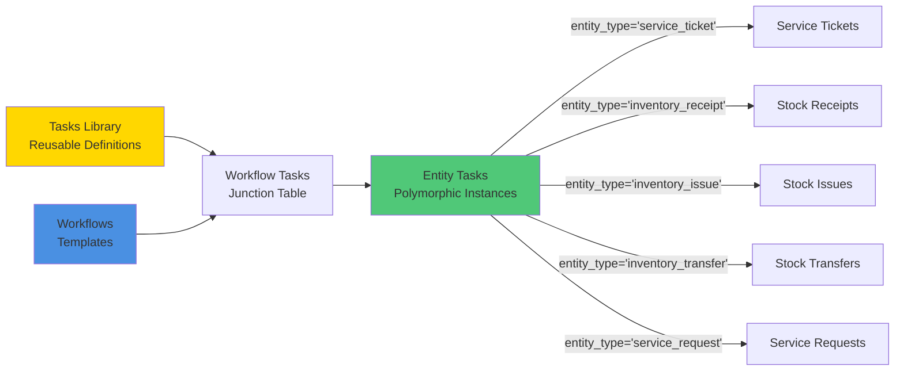
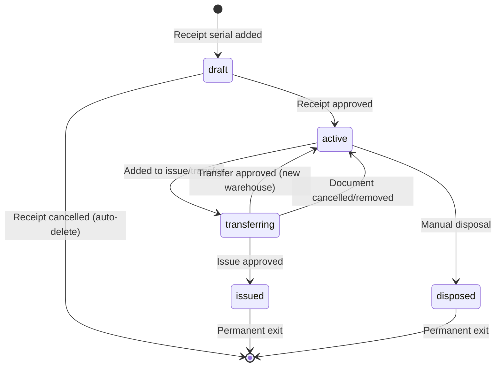
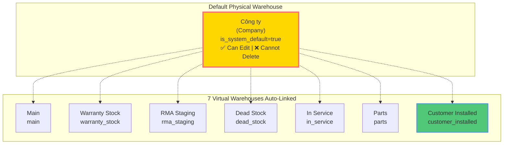
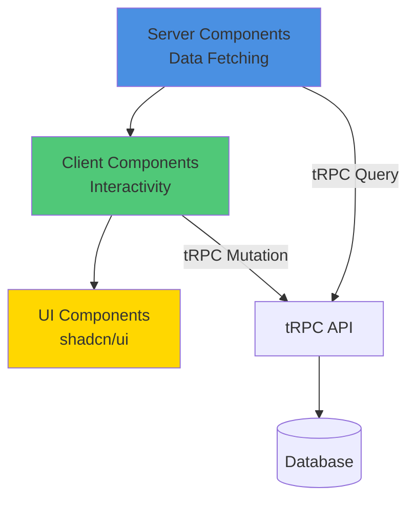
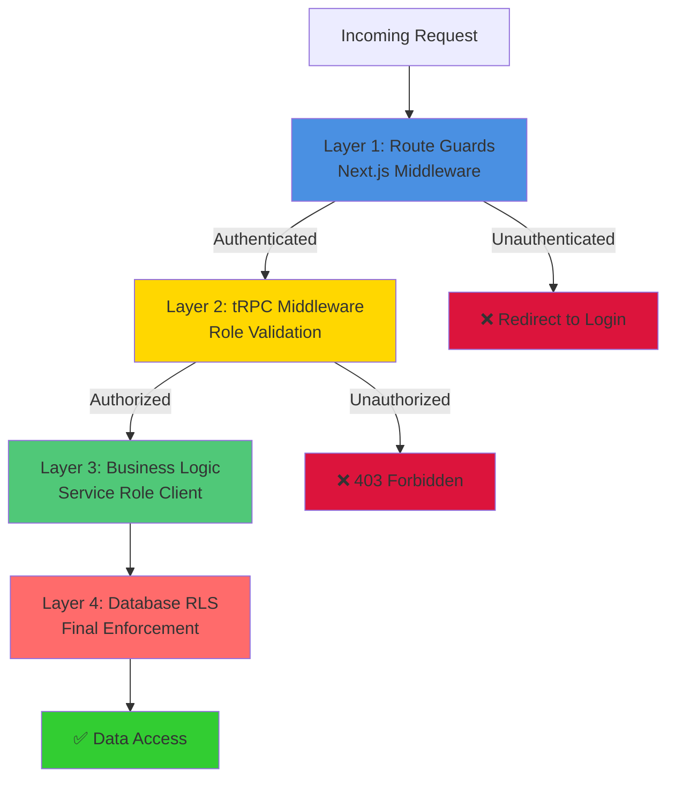

# Service Center - Architecture Master Document

**Version:** 2.0
**Last Updated:** 2025-11-05
**Status:** Production (v0.2.1)
**Document Type:** Current State Architecture (Consolidated)

---

## 📚 Table of Contents

1. [System Overview](#1-system-overview)
2. [Core Architectural Concepts](#2-core-architectural-concepts)
3. [Database Architecture](#3-database-architecture)
4. [API Architecture](#4-api-architecture)
5. [Application Architecture](#5-application-architecture)
6. [Technology Stack](#6-technology-stack)
7. [Security & Access Control](#7-security--access-control)
8. [Recent Architectural Changes](#8-recent-architectural-changes)
9. [Quick Reference](#9-quick-reference)
10. [Documentation Index](#10-documentation-index)
11. [Frontend Development Guidelines](#11-frontend-development-guidelines)
12. [Future Enhancements (Roadmap)](#12-future-enhancements-roadmap)

---

## 1. System Overview

### 1.1 Purpose

Service Center is a **comprehensive warehouse and service management system** for SSTC Service Center, built to manage:

- **Service Tickets** - Complete repair/warranty workflow from intake to delivery
- **Inventory Operations** - Stock receipts, issues, transfers with serial number tracking
- **Warehouse Management** - Physical warehouses + 7 virtual warehouse categories
- **Task Workflows** - Polymorphic task system supporting multiple entity types
- **Customer Portal** - Public service request submission with tracking

### 1.2 High-Level Architecture



### 1.3 System Metrics

| Metric | Value | Status |
|--------|-------|--------|
| **Version** | 0.2.1 | ✅ Production |
| **Database Tables** | 40+ tables | ✅ Complete |
| **tRPC Routers** | 17 routers | ✅ Complete |
| **tRPC Procedures** | 170+ procedures | ✅ Complete |
| **React Components** | 140+ components | ✅ Complete |
| **Pages** | 45+ pages | ✅ Complete |
| **User Roles** | 4 roles (Admin, Manager, Technician, Reception) | ✅ RBAC Implemented |

---

## 2. Core Architectural Concepts

### 2.1 Polymorphic Task System

**Purpose:** Allow tasks to be attached to ANY entity type, not just service tickets.

**Key Innovation (2025-10-31):**
- Tasks can belong to `service_ticket`, `inventory_receipt`, `inventory_issue`, `inventory_transfer`, `service_request`
- Single unified task execution UI for all entity types
- Automatic task generation based on entity type + workflow

**Core Components:**



**Terminology Evolution:**
- ❌ Old: `task_types` → ✅ New: `tasks`
- ❌ Old: `task_templates` → ✅ New: `workflows`
- ❌ Old: `service_ticket_tasks` → ✅ New: `entity_tasks`

**Database Tables:**
- `tasks` - Reusable task definitions (e.g., "Enter Serial Numbers", "Quality Check")
- `workflows` - Ordered sequences of tasks
- `workflow_tasks` - Junction table (workflow → tasks)
- `entity_tasks` - Polymorphic task instances with `entity_type` + `entity_id`
- `entity_task_history` - Immutable audit trail

**See:** [TERMINOLOGY-REFACTORING-TASKS-WORKFLOWS.md](architecture/TERMINOLOGY-REFACTORING-TASKS-WORKFLOWS.md)

### 2.2 Physical Product Management & Virtual Warehouses

**Purpose:** Track individual serialized products with lifecycle status and logical warehouse categorization.

#### Physical Product Schema

**Core Design:**
- Each physical product has a unique serial number
- Stored in a specific **virtual warehouse instance** (not just warehouse type)
- Tracks complete lifecycle with `status` field
- Maintains audit trail of location and customer history

**Database Table:**
```sql
CREATE TABLE physical_products (
  id UUID PRIMARY KEY,
  product_id UUID NOT NULL,
  serial_number VARCHAR(255) NOT NULL UNIQUE,
  condition product_condition NOT NULL DEFAULT 'new',

  -- Virtual warehouse management
  virtual_warehouse_id UUID NOT NULL
    REFERENCES virtual_warehouses(id),
  previous_virtual_warehouse_id UUID
    REFERENCES virtual_warehouses(id),

  -- Lifecycle status (Added 2025-11-05)
  status physical_product_status NOT NULL DEFAULT 'draft',

  -- Warranty tracking
  manufacturer_warranty_end_date DATE,
  user_warranty_end_date DATE,

  -- Context tracking
  rma_batch_id UUID REFERENCES rma_batches(id),
  current_ticket_id UUID REFERENCES service_tickets(id),
  last_known_customer_id UUID REFERENCES customers(id),

  notes TEXT,
  created_at TIMESTAMPTZ NOT NULL DEFAULT NOW(),
  updated_at TIMESTAMPTZ NOT NULL DEFAULT NOW()
);
```

#### Physical Product Status Lifecycle

**Status ENUM (Added 2025-11-05):**
```sql
CREATE TYPE physical_product_status AS ENUM (
  'draft',        -- From unapproved receipt (temporary)
  'active',       -- In stock, available for selection
  'transferring', -- Locked in draft issue/transfer document
  'issued',       -- Issued out permanently (not in stock)
  'disposed'      -- Scrapped/unusable
);
```

**Lifecycle Flow:**


**Key Rules:**
- ✅ Only `active` products can be selected for new documents
- ✅ `draft` products auto-deleted when receipt cancelled (cleanup)
- ✅ `transferring` status prevents product from being selected twice
- ✅ Only `active` products count toward available stock
- ✅ Complete audit trail via database triggers

#### Virtual Warehouse Architecture

**Two-Level System:**
1. **Physical Warehouses:** Actual storage locations (e.g., "Công ty" main office)
2. **Virtual Warehouses:** Logical categories within physical locations

**7 Virtual Warehouse Types:**

| Type | Code | Vietnamese | Purpose |
|------|------|------------|---------|
| **Main** | `main` | Kho Chính | Primary inventory storage |
| **Warranty Stock** | `warranty_stock` | Kho Bảo Hành | Products for warranty replacements |
| **RMA Staging** | `rma_staging` | Khu Vực RMA | Products awaiting return to supplier |
| **Dead Stock** | `dead_stock` | Kho Hàng Hỏng | Obsolete/damaged inventory |
| **In Service** | `in_service` | Đang Sử Dụng | Products currently being repaired |
| **Parts** | `parts` | Kho Linh Kiện | Replacement parts and components |
| **Customer Installed** | `customer_installed` | Hàng Đã Bán | Products sold and deployed at customer sites |

**Architecture Benefits:**
```
Physical Warehouse: "Công ty"
  ├── Main Warehouse (UUID: xxx-xxx) [virtual_warehouse_type='main']
  ├── Warranty Stock (UUID: yyy-yyy) [virtual_warehouse_type='warranty_stock']
  ├── RMA Staging (UUID: zzz-zzz) [virtual_warehouse_type='rma_staging']
  └── ... (7 virtual warehouses total)

Physical products reference: virtual_warehouse_id (UUID)
  → Allows future expansion: multiple instances of same type if needed
  → Currently: one instance per type (enforced via UNIQUE constraint)
```

**Design Advantages:**
- ✅ Foreign key constraints ensure referential integrity
- ✅ Easy to query with JOINs (virtual → physical warehouse)
- ✅ Flexible: can add multiple warehouses of same type later
- ✅ Each virtual warehouse configurable independently

**Customer Tracking:**
- `customer_installed` warehouse tracks `last_known_customer_id`
- Enables warranty claim verification
- Auto-set when warranty replacement issued via service ticket
- Retained even if product returned for service

**Querying Physical Products:**
```sql
-- Get product with warehouse details
SELECT
  pp.*,
  vw.name as virtual_warehouse_name,
  vw.warehouse_type,
  pw.name as physical_warehouse_name
FROM physical_products pp
JOIN virtual_warehouses vw ON pp.virtual_warehouse_id = vw.id
JOIN physical_warehouses pw ON vw.physical_warehouse_id = pw.id
WHERE pp.status = 'active';
```

#### Default Physical Warehouse System

**Purpose:** Ensure a system-managed physical warehouse always exists across database resets.

**Default Warehouse "Công ty" (Company):**
```sql
CREATE TABLE physical_warehouses (
  id UUID PRIMARY KEY,
  name VARCHAR(255) NOT NULL,
  code VARCHAR(20) NOT NULL UNIQUE,
  location TEXT,
  description TEXT,
  is_active BOOLEAN NOT NULL DEFAULT true,
  is_system_default BOOLEAN NOT NULL DEFAULT false,  -- System-managed flag
  created_at TIMESTAMPTZ NOT NULL DEFAULT NOW(),
  updated_at TIMESTAMPTZ NOT NULL DEFAULT NOW()
);

-- Unique partial index: only one warehouse can be system default
CREATE UNIQUE INDEX physical_warehouses_system_default_unique
ON physical_warehouses(is_system_default)
WHERE is_system_default = true;
```

**Auto-Seeded Default Warehouse:**
- **Name:** "Công ty"
- **Code:** `COMPANY`
- **Location:** "Trụ sở chính"
- **Description:** "Kho mặc định của công ty, không thể xóa. Chứa tất cả các loại kho ảo."
- **Flag:** `is_system_default = true`

**Key Features:**


**System Behavior:**
- ✅ **Auto-created** on `pnpx supabase db reset`
- ✅ **Idempotent seeding** - safe to run migrations multiple times
- ✅ **Can be edited** - name, location, description are modifiable
- ❌ **Cannot be deleted** - API validation blocks deletion attempts
- ✅ **All 7 virtual warehouses** automatically seeded and linked

**API Protection:**
```typescript
// warehouse.deletePhysical - Validation
if (warehouse?.is_system_default) {
  throw new TRPCError({
    code: 'PRECONDITION_FAILED',
    message: `Cannot delete system default warehouse "${warehouse.name}".`
  });
}
```

**Use Cases:**
1. **Database Init:** Run `pnpx supabase db reset` → "Công ty" created automatically
2. **Edit Warehouse:** Admin can update name, location, description ✅
3. **Delete Attempt:** API blocks deletion with error message ❌
4. **Automatic Warranty:** Products auto-move to `customer_installed` on warranty replacement
5. **Manual Sales:** Staff transfers products to `customer_installed` with customer selection

**See:** [INVENTORY-WORKFLOW-V2.md](architecture/INVENTORY-WORKFLOW-V2.md)

### 2.3 Inventory Workflow v2.0 (Non-Blocking)

**Purpose:** Enable immediate stock availability after approval without waiting for serial entry.

**Traditional Workflow (BLOCKING):**
```
Create Receipt → Enter ALL Serials (BLOCKS) → Submit → Approve → Stock Updated
                         ↑ MUST WAIT
```

**New Workflow v2.0 (NON-BLOCKING):**
```
Create Receipt → Submit (0% serials OK) → Approve → ✅ STOCK AVAILABLE
                                                      ↓
                                          Serial Entry Task (parallel)
                                                      ↓
                                            Auto-complete at 100%
```

**Key Benefits:**
- ✅ Stock visible immediately after approval
- ✅ Warehouse can use stock before serial entry completes
- ✅ Serial entry non-blocking - any technician can help
- ✅ Auto-complete eliminates manual status updates
- ✅ Maintains full traceability with partial serial entry

**Database Triggers (Added 2025-10-29):**
- `update_stock_on_receipt_approval()` - Increments stock when receipt approved
- `update_stock_on_issue_approval()` - Decrements stock when issue approved
- `update_stock_on_transfer_approval()` - Moves stock between warehouses

**See:** [INVENTORY-WORKFLOW-V2.md](architecture/INVENTORY-WORKFLOW-V2.md)

### 2.4 Service Request Draft Mode

**Purpose:** Allow staff to save incomplete service requests without submission.

**Status Flow:**
```
draft (saved, not submitted)
    ↓
Submit → received (products already at service center)
    OR
Submit → pickingup (waiting for customer to bring products)
    ↓
Staff confirms receipt → received
    ↓
Auto-create tickets → processing
```

**Key Features:**
1. **Draft Mode:** Save with lenient validation (phone + 1 serial only)
2. **Smart Submit:** Checkbox controls received vs pickingup status
3. **Phone Lookup:** Auto-fill customer name/email by phone (500ms debounce)
4. **Auto-Ticket Creation:** Database trigger creates tickets when status = 'received'

**Database Trigger:**
- `auto_create_tickets_on_received()` - Fires on status = 'received'
- Creates 1 service ticket per product in `service_request_items`
- Looks up customer by phone (UNIQUE constraint), updates name/email if changed
- Links tickets to request via `service_request_items.ticket_id`

**See:** [SERVICE-REQUEST-DRAFT-AND-PHONE-LOOKUP.md](architecture/SERVICE-REQUEST-DRAFT-AND-PHONE-LOOKUP.md)

---

## 3. Database Architecture

### 3.1 Schema Organization

**Numbered Schema Files (100-900 series):**

| Series | Purpose | Key Files |
|--------|---------|-----------|
| **100** | Base Types | ENUMs, sequences, domains |
| **150** | Base Functions | RLS helpers, common triggers |
| **200** | Core Tables | Users, customers, tickets, inventory, tasks |
| **500** | Business Logic | Warehouse functions, audit functions |
| **600** | Triggers | Stock updates, lifecycle management |
| **700** | Views | Reporting views, analytics |
| **800** | RLS Policies | Row-level security enforcement |
| **900** | Seed Data | Default warehouses, sample workflows |

**Total Tables:** 40+ tables organized by concern

### 3.2 Key Database Tables

**Core Entities:**
- `profiles` - Extended user profiles with roles
- `customers` - Customer master data (UNIQUE phone for lookup)
- `brands`, `products`, `parts` - Product catalog
- `service_tickets` - Service workflow (auto-numbered SV-YYYY-NNN)

**Polymorphic Task System:**
- `workflows` - Workflow templates (entity_type specific or generic)
- `tasks` - Reusable task library
- `workflow_tasks` - Junction (workflows → tasks)
- `entity_tasks` - Polymorphic task instances (entity_type + entity_id)
- `entity_task_history` - Immutable audit trail

**Warehouse & Inventory:**
- `physical_warehouses` - Physical locations (default: "Công ty")
- `virtual_warehouses` - 7 warehouse types (UNIQUE constraint on warehouse_type)
- `physical_products` - Serialized products with status lifecycle
- `stock_movements` - Immutable movement history

**Stock Documents:**
- `stock_receipts`, `stock_receipt_items`, `stock_receipt_serials` - Incoming inventory
- `stock_issues`, `stock_issue_items`, `stock_issue_serials` - Outgoing inventory
- `stock_transfers`, `stock_transfer_items`, `stock_transfer_serials` - Internal transfers
- `product_warehouse_stock` - Stock levels per product-warehouse

**Public Portal:**
- `service_requests` - Customer submissions (draft → received → processing)
- `service_request_items` - Products in request
- `email_notifications` - Email delivery tracking

**Audit & Security:**
- `audit_logs` - Immutable audit trail (admin-only, no UPDATE/DELETE)

### 3.3 Key ENUMs

**User & Access:**
- `user_role` - admin, manager, technician, reception

**Service Operations:**
- `ticket_status` - pending, in_progress, completed, cancelled
- `priority_level` - low, normal, high, urgent
- `warranty_type` - warranty, paid, goodwill

**Task System:**
- `task_status` - pending, in_progress, completed, blocked, skipped
- `entity_type` - service_ticket, inventory_receipt, inventory_issue, inventory_transfer, service_request

**Warehouse:**
- `warehouse_type` - main, warranty_stock, rma_staging, dead_stock, in_service, parts, customer_installed
- `product_condition` - new, refurbished, used, faulty, for_parts
- `physical_product_status` - draft, active, transferring, issued, disposed

**Inventory Documents:**
- `stock_document_status` - draft, pending_approval, approved, completed, cancelled

### 3.4 Critical Triggers

**Stock Updates (600_stock_triggers.sql):**
- `update_stock_on_receipt_approval()` - ✅ Increments stock
- `update_stock_on_issue_approval()` - ✅ Decrements stock
- `update_stock_on_transfer_approval()` - ✅ Moves between warehouses

**Physical Product Lifecycle (600_stock_triggers.sql):**
- `create_physical_product_from_receipt_serial()` - Creates draft products
- `activate_physical_products_on_receipt_approval()` - draft → active
- `mark_physical_product_as_transferring_on_issue()` - active → transferring
- `mark_physical_products_as_issued_on_issue_approval()` - transferring → issued
- `restore_active_status_on_transfer_approval()` - transferring → active (new warehouse)

**Auto-Numbering:**
- `generate_ticket_number()` - Service ticket numbering (SV-YYYY-NNN)
- `generate_tracking_token()` - Service request tokens (SR-XXXXXXXXXXXX)
- `generate_rma_batch_number()` - RMA batch numbers (RMA-YYYY-MM-NNN)

**Audit Logging:**
- `log_status_change()` - Auto-log ticket status changes to comments
- `log_template_switch()` - Log workflow changes with mandatory reason

### 3.5 Entity Relationships

**Service Ticket Relationships:**
```
service_tickets → customers (N:1)
service_tickets → products (N:1)
service_tickets → profiles (N:1, assigned_to)
service_tickets → workflows (N:1)
service_tickets ← entity_tasks (1:N via polymorphic)
service_tickets ← service_ticket_parts (1:N, cascade delete)
```

**Polymorphic Task Relationships:**
```
workflows → entity_type (ENUM: service_ticket, inventory_receipt, etc.)
workflows ← workflow_tasks (1:N, cascade delete)
workflow_tasks → tasks (N:1, restrict)
entity_tasks → tasks (N:1, restrict)
entity_tasks → workflows (N:1, set null)

-- Polymorphic:
entity_tasks → service_tickets (via entity_type + entity_id)
entity_tasks → stock_receipts (via entity_type + entity_id)
entity_tasks → stock_issues (via entity_type + entity_id)
entity_tasks → stock_transfers (via entity_type + entity_id)
```

**Warehouse Relationships:**
```
physical_warehouses ← virtual_warehouses (1:N)
virtual_warehouses ← physical_products (1:N)
physical_products → products (N:1)
physical_products → service_tickets (N:1, current_ticket_id)
physical_products ← stock_movements (1:N, immutable)
```

**See:** [03-data-models.md](architecture/03-data-models.md) for complete ER diagram

---

## 4. API Architecture

### 4.1 tRPC Router Hierarchy

**17 Main Routers (170+ Procedures):**

```mermaid
graph TB
    APP[tRPC App Router]

    APP --> ADMIN[admin<br/>System Setup]
    APP --> PROFILE[profile<br/>User Management]
    APP --> TICKETS[tickets<br/>Service Tickets]
    APP --> CUSTOMERS[customers<br/>Customer CRUD]
    APP --> PRODUCTS[products<br/>Product Catalog]
    APP --> PARTS[parts<br/>Parts Inventory]
    APP --> BRANDS[brands<br/>Brand Management]
    APP --> REVENUE[revenue<br/>Analytics]
    APP --> WORKFLOW[workflow<br/>Tasks & Workflows]
    APP --> WAREHOUSE[warehouse<br/>Warehouse Config]
    APP --> INVENTORY[inventory<br/>Stock Operations]
    APP --> PHYSICAL[physicalProducts<br/>Serial Tracking]
    APP --> REQUEST[serviceRequest<br/>Public Portal]
    APP --> NOTIF[notifications<br/>Email Tracking]
    APP --> TASKS[tasks<br/>Task Execution]
    APP --> ANALYTICS[analytics<br/>BI Dashboard]
    APP --> ASSIGN[assignments<br/>Task Assignment]

    INVENTORY --> RECEIPTS[receipts.*]
    INVENTORY --> ISSUES[issues.*]
    INVENTORY --> TRANSFERS[transfers.*]
    INVENTORY --> SERIALS[serials.*]
    INVENTORY --> APPROVALS[approvals.*]
    INVENTORY --> STOCK[stock.*]

    style APP fill:#FFD700
    style INVENTORY fill:#FF6B6B
```



### 4.2 Key API Patterns

**1. Type-Safe End-to-End:**
```typescript
// Database → tRPC → React (no code generation)
Database Types → Supabase Generated Types → Zod Schemas → TypeScript Inference
```

**2. Service Role Access:**
```typescript
// tRPC uses service role to bypass RLS
const { supabaseAdmin } = ctx; // Bypasses all RLS policies
const { supabaseClient } = ctx; // Uses anon key with user session
```

**3. Field Mapping:**
```typescript
// Database field names don't always match API names
DB: strict_sequence ↔ API: enforce_sequence
// Always map in tRPC procedures (see mapTemplateFromDb helper)
```

**4. Authorization Middleware:**
```typescript
// Middleware stack
publicProcedure
  .use(requireAdmin)           // Admin only
  .use(requireManagerOrAbove)  // Manager or Admin
  .use(requireRole('technician')) // Specific role
```

**5. Input Validation:**
```typescript
// All inputs validated with Zod
.input(z.object({
  customer_id: z.string().uuid(),
  service_type: z.enum(['warranty', 'paid', 'goodwill']),
  priority: z.enum(['low', 'normal', 'high', 'urgent'])
}))
```

### 4.3 Critical API Endpoints

**Service Tickets:**
- `tickets.list` - List with filters (status, priority, technician)
- `tickets.create` - Auto-generates ticket number, creates entity_tasks
- `tickets.updateStatus` - One-way status flow enforcement
- `tickets.confirmDelivery` - Delivery confirmation with signature

**Inventory Operations:**
- `inventory.receipts.create` - Stock receipt (GRN)
- `inventory.receipts.approve` - Triggers stock update + serial entry task
- `inventory.serials.addSerial` - Single serial entry with validation
- `inventory.serials.bulkAddSerials` - Batch serial insertion
- `inventory.serials.getComplianceMetrics` - Manager dashboard metrics

**Workflow Management:**
- `workflow.workflow.create` - Create workflow template
- `workflow.workflow.switchWorkflow` - Mid-execution switch with audit
- `workflow.entityTask.start` - Start task execution
- `workflow.entityTask.complete` - Complete task, auto-advance next

**Service Requests:**
- `serviceRequest.submit` - Create and submit (received or pickingup)
- `serviceRequest.saveDraft` - Save draft (lenient validation)
- `serviceRequest.deleteDraft` - Delete draft only
- `customers.getByPhone` - Phone lookup for auto-fill

**See:** [05-api-design.md](architecture/05-api-design.md) for complete reference

---

## 5. Application Architecture

### 5.1 Route Structure

**Authenticated Routes (`/app/(auth)/`):**

```
/dashboard                     # Main analytics dashboard
  /task-progress              # Manager task monitoring
  /notifications              # Email notification center

/operations                    # Daily operations
  /tickets                     # Service ticket management
  /service-requests            # Request intake
  /deliveries                  # Customer delivery tracking

/inventory                     # Warehouse operations
  /documents
    /receipts                  # Stock receipts (GRN)
    /issues                    # Stock issues (GIN)
    /transfers                 # Stock transfers
  /products                    # Physical product master data
  /overview                    # Stock summary
  /warehouses                  # Warehouse configuration
  /rma                         # RMA batch management

/catalog                       # Master data
  /products                    # Product catalog
  /parts                       # Parts catalog
  /brands                      # Brand management

/workflows                     # Process templates
  /tasks                       # Task library
  /[id]                        # Workflow details

/my-tasks                      # Technician dashboard
  /serial-entry                # Serial entry tasks

/management                    # Admin functions
  /team                        # Staff management
  /customers                   # Customer management

/settings
  /account                     # User profile
  /system                      # System settings (admin only)
```

**Public Routes (`/app/(public)/`):**
```
/login                         # Authentication
/setup                         # Initial setup
/service-request               # Service request submission
/service-request/track         # Request tracking
```

### 5.2 Component Architecture

**Three-Layer Pattern:**


**Layer 1: Server Components (Default)**
- Direct tRPC calls
- No client-side JavaScript
- SEO-friendly
- Example: Dashboard, lists, detail pages

**Layer 2: Client Components (`'use client'`)**
- Forms with validation
- Interactive tables
- Real-time updates
- Example: Ticket creation form, serial entry UI

**Layer 3: UI Components (shadcn/ui)**
- Radix UI primitives
- Tailwind CSS styling
- Reusable across app
- Example: Button, Dialog, Table, Form

**Key Components:**

**Serial Entry System (6 components):**
- `SerialEntryCard` - Status card with progress
- `ProductSerialAccordion` - Per-product serial entry
- `SerialInput` - Auto-save input with validation
- `TaskCard` - Priority-based task display
- `SerialComplianceWidget` - Manager dashboard widget
- `SerialProgressBar` - Color-coded progress (Red/Yellow/Green)

**Inventory Documents:**
- Receipt/Issue/Transfer forms with approval workflow
- Product selection with availability checking
- Serial selection UI with status filtering

**Task Execution:**
- Polymorphic task UI supporting all entity types
- Task timeline with dependency visualization
- Task completion modal with findings capture

### 5.3 State Management

**Server State (TanStack Query):**
```typescript
// All tRPC queries cached by TanStack Query
const { data, isLoading } = api.tickets.list.useQuery({ status: 'pending' });
```

**Client State (React Hooks):**
```typescript
// Local UI state only
const [isOpen, setIsOpen] = useState(false);
```

**Form State (React Hook Form + Zod):**
```typescript
const form = useForm<CreateTicketInput>({
  resolver: zodResolver(createTicketSchema)
});
```

**See:** [04-component-architecture.md](architecture/04-component-architecture.md)

---

## 6. Technology Stack

### 6.1 Core Technologies

**Frontend:**
- **Next.js 15.5.4** - App Router with Turbopack
- **React 19.1.0** - Server + Client Components
- **TypeScript 5.x** - Strict mode
- **Tailwind CSS 4** - Utility-first styling
- **shadcn/ui** - Radix UI component library

**Backend:**
- **tRPC 11.6.0** - Type-safe API layer
- **Supabase** - PostgreSQL + Auth + Storage
- **Zod 4.1.11** - Runtime validation
- **Superjson 2.2.2** - Type-safe serialization

**State Management:**
- **TanStack Query 5.90.2** - Server state
- **TanStack React Table 8.21.3** - Data tables
- **React Hook Form 7.65.0** - Form state

**Development:**
- **Biome 2.2.0** - Linting + formatting
- **Playwright 1.56.1** - E2E testing
- **Turbopack** - Fast builds
- **pnpm** - Package management

### 6.2 Architecture Decision Records

**Why Next.js 15?**
- ✅ App Router with Server Components (reduced JS bundle)
- ✅ Turbopack for fast builds (<15s development)
- ✅ React 19 support (latest features)
- ✅ File-based routing (convention over configuration)

**Why tRPC?**
- ✅ End-to-end type safety (no code generation)
- ✅ Automatic type inference
- ✅ Single source of truth for data shapes
- ✅ Better DX than REST/GraphQL

**Why Supabase?**
- ✅ Open-source (no vendor lock-in)
- ✅ PostgreSQL (powerful, proven)
- ✅ Row Level Security (database-enforced access control)
- ✅ Local development via Docker (no cloud dependency)

**Why Polymorphic Tasks?**
- ✅ Unified task execution across entity types
- ✅ Reusable task definitions
- ✅ Flexible workflow system
- ✅ Reduced code duplication

**See:** [02-technology-stack.md](architecture/02-technology-stack.md)

---

## 7. Security & Access Control

### 7.1 Four-Layer Security Model



### 7.2 Role-Based Access Control (RBAC)

**4 User Roles:**

| Role | Count | Access Level | Key Permissions |
|------|-------|--------------|-----------------|
| **Admin** | 1 | Full system access | All operations, system settings, audit logs, team management |
| **Manager** | Multiple | Operations oversight | All operations, approvals, reports (no system settings) |
| **Technician** | Multiple | Task execution | Execute tasks, view assigned tickets, read-only inventory |
| **Reception** | Multiple | Customer intake | Create tickets, manage customers, deliveries |

**Permission Enforcement:**
- **Database:** RLS policies filter data by role
- **API:** tRPC middleware validates permissions
- **UI:** Route guards + conditional rendering

**Middleware Functions:**
```typescript
requireAdmin()           // Admin only
requireManagerOrAbove()  // Manager or Admin
requireRole('technician') // Specific role
requireAnyAuthenticated() // Any logged-in user
```

### 7.3 Row Level Security (RLS)

**RLS Pattern:**
```sql
-- Example: Service tickets visible to all authenticated users
CREATE POLICY "Service tickets viewable by authenticated users"
ON service_tickets FOR SELECT
TO authenticated
USING (
  auth.uid() IN (
    SELECT id FROM profiles WHERE role IN ('admin', 'manager')
  )
  OR assigned_to = auth.uid() -- Technicians see assigned tickets only
);
```

**Key Policies:**
- `audit_logs` - Admin-only SELECT, no UPDATE/DELETE (immutable)
- `service_requests` - Public INSERT, Admin/Manager UPDATE/DELETE
- `entity_tasks` - Technicians can UPDATE assigned tasks only
- `profiles` - Users can UPDATE their own profile

### 7.4 Audit Trail

**Immutable Audit Logging:**
```sql
-- audit_logs table tracks sensitive operations
CREATE TABLE audit_logs (
  id UUID PRIMARY KEY DEFAULT gen_random_uuid(),
  user_id UUID NOT NULL,
  user_role user_role NOT NULL,
  user_email TEXT NOT NULL,
  action TEXT NOT NULL,
  resource TEXT NOT NULL,
  resource_id UUID,
  reason TEXT, -- Mandatory for some operations
  old_values JSONB,
  new_values JSONB,
  changes JSONB GENERATED ALWAYS AS (jsonb_diff(old_values, new_values)) STORED,
  created_at TIMESTAMPTZ NOT NULL DEFAULT now()
);

-- RLS: Admin-only read access, no updates ever
CREATE POLICY "Audit logs viewable by admins only"
ON audit_logs FOR SELECT TO authenticated
USING (auth.check_role('admin'));

-- No UPDATE or DELETE policies = immutable
```

**Audited Operations:**
- Template/workflow switches (with mandatory reason)
- Role changes (with mandatory reason)
- High-value transactions
- System setting changes

**See:**
- [10-security.md](architecture/10-security.md)
- [11-audit-logging.md](architecture/11-audit-logging.md)

---

## 8. Recent Architectural Changes

### 8.1 Inventory Workflow v2.0 (2025-10-29)

**Change:** Non-blocking serial entry workflow

**Before:**
```
Create Receipt → Enter ALL Serials (BLOCKS) → Submit → Approve → Stock Updated
```

**After:**
```
Create Receipt → Submit (0% serials) → Approve → Stock Updated IMMEDIATELY
                                                  ↓
                                        Serial Entry Task (parallel)
```

**Impact:**
- ✅ Stock available immediately after approval
- ✅ Serial entry non-blocking (any technician can help)
- ✅ Auto-complete at 100% serials
- ✅ Manager dashboard tracks serial compliance

**Migration:** Database triggers added, no schema breaking changes

**See:** [INVENTORY-WORKFLOW-V2.md](architecture/INVENTORY-WORKFLOW-V2.md)

### 8.2 Physical Product Status Lifecycle (2025-11-05)

**Change:** Added `status` field to `physical_products` table

**Purpose:** Prevent double-selection in draft documents, enable cleanup

**Status Flow:**
```
draft → active → transferring → issued/disposed
```

**Impact:**
- ✅ Only `active` products can be selected for new documents
- ✅ `draft` products auto-deleted when receipt cancelled
- ✅ `transferring` prevents product from being selected twice
- ✅ Complete audit trail via triggers

**Migration:** ALTER TABLE add column, 10+ triggers added

**See:** [INVENTORY-WORKFLOW-V2.md](architecture/INVENTORY-WORKFLOW-V2.md) (Updated 2025-11-05)

### 8.3 Terminology Refactoring (2025-10-31)

**Change:** Renamed tables and concepts to industry-standard terminology

**Renamings:**
- ❌ `task_types` → ✅ `tasks`
- ❌ `task_templates` → ✅ `workflows`
- ❌ `service_ticket_tasks` → ✅ `entity_tasks`

**Purpose:** Support polymorphic task system for multiple entity types

**Impact:**
- ✅ Tasks can belong to service_ticket, inventory_receipt, inventory_issue, inventory_transfer, service_request
- ✅ Unified task execution UI
- ✅ Reusable task library

**Migration:** 33 files updated (~210 lines changed), zero downtime

**See:** [TERMINOLOGY-REFACTORING-TASKS-WORKFLOWS.md](architecture/TERMINOLOGY-REFACTORING-TASKS-WORKFLOWS.md)

### 8.4 Virtual Warehouse UUID Migration (2025-10-31)

**Change:** Migrated from ENUM `warehouse_type` to UUID `virtual_warehouse_id`

**Before:**
```sql
physical_products.warehouse_type warehouse_type (ENUM)
```

**After:**
```sql
physical_products.virtual_warehouse_id UUID REFERENCES virtual_warehouses(id)
```

**Purpose:** Allow flexibility for multiple instances of same warehouse type

**Impact:**
- ✅ Can create multiple "main" warehouses if needed
- ✅ Each virtual warehouse has physical_warehouse_id
- ✅ Customer tracking in customer_installed warehouse
- ⚠️ Breaking change: Required data migration

**Migration:** Data migration script provided, full rollback plan documented

**See:** [PHYSICAL-PRODUCTS-SCHEMA-UPDATE.md](architecture/PHYSICAL-PRODUCTS-SCHEMA-UPDATE.md)

### 8.5 Default Warehouse System (2025-10-30)

**Change:** System-managed default warehouses seeded automatically

**Default Physical Warehouse:**
- Name: "Công ty" (Company)
- Code: `COMPANY`
- Cannot be deleted (system protected)

**7 Virtual Warehouse Types:**
- Auto-seeded on database reset
- UNIQUE constraint on `warehouse_type` (single-instance)
- Includes `customer_installed` warehouse with customer tracking

**Impact:**
- ✅ Consistent warehouse setup across environments
- ✅ No manual warehouse creation required
- ✅ Protected from accidental deletion

**See:** [DEFAULT-WAREHOUSE-SYSTEM.md](architecture/DEFAULT-WAREHOUSE-SYSTEM.md)

### 8.6 Service Request Draft Mode (2025-11-02)

**Change:** Added draft mode and phone lookup to service requests

**Features:**
1. **Draft Mode:** Save incomplete requests (lenient validation)
2. **Phone Lookup:** Auto-fill customer by phone (500ms debounce)
3. **Smart Submit:** Checkbox controls received vs pickingup status

**Status Flow:**
```
draft → submitted → received/pickingup → processing → completed
```

**Impact:**
- ✅ Staff can save progress without submitting
- ✅ Customer lookup reduces duplicate entries
- ✅ Auto-ticket creation on status = received

**See:** [SERVICE-REQUEST-DRAFT-AND-PHONE-LOOKUP.md](architecture/SERVICE-REQUEST-DRAFT-AND-PHONE-LOOKUP.md)

---

## 9. Quick Reference

### 9.1 Common ENUMs

```typescript
// User roles
type UserRole = 'admin' | 'manager' | 'technician' | 'reception';

// Ticket statuses
type TicketStatus = 'pending' | 'in_progress' | 'completed' | 'cancelled';

// Priority levels
type PriorityLevel = 'low' | 'normal' | 'high' | 'urgent';

// Entity types (polymorphic)
type EntityType = 'service_ticket' | 'inventory_receipt' | 'inventory_issue' |
                  'inventory_transfer' | 'service_request';

// Warehouse types
type WarehouseType = 'main' | 'warranty_stock' | 'rma_staging' | 'dead_stock' |
                     'in_service' | 'parts' | 'customer_installed';

// Physical product status
type PhysicalProductStatus = 'draft' | 'active' | 'transferring' | 'issued' | 'disposed';

// Product conditions
type ProductCondition = 'new' | 'refurbished' | 'used' | 'faulty' | 'for_parts';

// Stock document status
type StockDocumentStatus = 'draft' | 'pending_approval' | 'approved' |
                           'completed' | 'cancelled';
```

### 9.2 Key Workflows

**Service Ticket Flow:**
```
1. Create ticket (Reception/Manager)
2. Auto-generate tasks from workflow
3. Assign to technician
4. Technician executes tasks
5. Manager approves completion
6. Customer delivery confirmation
```

**Stock Receipt Flow (Inventory v2.0):**
```
1. Create receipt (draft)
2. Add line items with declared quantities
3. Submit for approval (0% serials OK)
4. Manager approves → Stock increased IMMEDIATELY
5. Serial entry task created (parallel)
6. Technician enters serials (non-blocking)
7. Auto-complete at 100% serials
```

**Service Request Flow:**
```
1. Customer submits request (public portal)
   OR staff creates draft
2. Staff reviews → Accept (received/pickingup)
3. If received → Auto-create service tickets
4. Tickets processed normally
5. Customer notified via email
```

### 9.3 Permission Matrix

| Feature | Admin | Manager | Technician | Reception |
|---------|-------|---------|------------|-----------|
| View all tickets | ✅ | ✅ | ❌ (assigned only) | ✅ |
| Create tickets | ✅ | ✅ | ❌ | ✅ |
| Assign technicians | ✅ | ✅ | ❌ | ❌ |
| Execute tasks | ✅ | ✅ | ✅ (own tasks) | ❌ |
| Approve stock documents | ✅ | ✅ | ❌ | ❌ |
| Serial entry | ✅ | ✅ | ✅ (all receipts) | ❌ |
| Warehouse management | ✅ | ✅ | ❌ (read-only) | ❌ |
| Team management | ✅ | ❌ | ❌ | ❌ |
| System settings | ✅ | ❌ | ❌ | ❌ |
| Audit logs | ✅ | ❌ | ❌ | ❌ |

### 9.4 Common Commands

**Development:**
```bash
pnpm dev          # Start dev server on port 3025 (Turbopack)
pnpm build        # Production build (timeout: 60s)
pnpm start        # Start production server
pnpm lint         # Run Biome linter
pnpm format       # Format code with Biome
```

**Database (Supabase):**
```bash
pnpx supabase start           # Start local stack (12 services)
pnpx supabase stop            # Stop services
pnpx supabase status          # Check service status
pnpx supabase db reset        # Reset database (deletes all data)
pnpx supabase db diff -f name # Generate migration
pnpx supabase migration up    # Apply pending migrations
pnpx supabase gen types typescript --local > src/types/database.types.ts
```

**Schema Setup:**
```bash
./docs/data/schemas/setup_schema.sh  # Copy schemas and generate migrations
```

---

## 10. Documentation Index

### 10.1 Core Architecture Documents

**Main Shards (10 documents):**
1. [01-introduction.md](architecture/01-introduction.md) - Project overview, constraints, principles
2. [02-technology-stack.md](architecture/02-technology-stack.md) - Tech decisions and rationale
3. [03-data-models.md](architecture/03-data-models.md) - Complete ER diagram, schema
4. [04-component-architecture.md](architecture/04-component-architecture.md) - Three-layer architecture
5. [05-api-design.md](architecture/05-api-design.md) - tRPC routers and procedures
6. [06-source-tree.md](architecture/06-source-tree.md) - Project structure, file organization
7. [07-infrastructure.md](architecture/07-infrastructure.md) - Docker deployment, multi-tenant
8. [08-coding-standards.md](architecture/08-coding-standards.md) - Best practices, naming
9. [09-testing-strategy.md](architecture/09-testing-strategy.md) - Testing pyramid, E2E tests
10. [10-security.md](architecture/10-security.md) - Four-layer security model, RLS

**Total:** ~165KB with 72+ diagrams

### 10.2 Architectural Change Documents

**Critical Design Changes:**
- [INVENTORY-WORKFLOW-V2.md](architecture/INVENTORY-WORKFLOW-V2.md) - Non-blocking serial entry (2025-10-29, updated 2025-11-05)
- [TERMINOLOGY-REFACTORING-TASKS-WORKFLOWS.md](architecture/TERMINOLOGY-REFACTORING-TASKS-WORKFLOWS.md) - Polymorphic tasks (2025-10-31)
- [PHYSICAL-PRODUCTS-SCHEMA-UPDATE.md](architecture/PHYSICAL-PRODUCTS-SCHEMA-UPDATE.md) - Virtual warehouse UUID migration (2025-10-31)
- [DEFAULT-WAREHOUSE-SYSTEM.md](architecture/DEFAULT-WAREHOUSE-SYSTEM.md) - System-managed warehouses (2025-10-30)
- [SERVICE-REQUEST-DRAFT-AND-PHONE-LOOKUP.md](architecture/SERVICE-REQUEST-DRAFT-AND-PHONE-LOOKUP.md) - Draft mode + phone lookup (2025-11-02)
- [WARRANTY-MANAGEMENT.md](architecture/WARRANTY-MANAGEMENT.md) - Warranty tracking system
- [SERIAL-ENTRY-WORKFLOW-ARCHITECTURE.md](architecture/SERIAL-ENTRY-WORKFLOW-ARCHITECTURE.md) - Serial entry task system
- [11-audit-logging.md](architecture/11-audit-logging.md) - Immutable audit trail

### 10.3 Other Documentation

- [prd.md](prd.md) - Complete product requirements (v2.0, 2025-11-05)
- [CLAUDE.md](CLAUDE.md) - Project instructions for Claude Code
- [ROLES-AND-PERMISSIONS.md](ROLES-AND-PERMISSIONS.md) - Complete RBAC specification
- [IMPLEMENTATION-GUIDE-ROLES.md](IMPLEMENTATION-GUIDE-ROLES.md) - Role implementation guide
- [DEVELOPMENT.md](DEVELOPMENT.md) - Local setup instructions
- [DEPLOYMENT.md](DEPLOYMENT.md) - Vietnamese deployment guide

### 10.4 Schema Files (Source of Truth)

**Location:** `docs/data/schemas/`

**Key Files:**
- `100_enums_and_sequences.sql` - Base types, ENUMs, sequences
- `150_base_functions.sql` - RLS helpers, common triggers
- `201_service_tickets.sql` - Service ticket tables
- `202_task_and_warehouse.sql` - Polymorphic tasks + warehouses
- `203_service_requests.sql` - Service request portal
- `204_inventory_documents.sql` - Stock receipts/issues/transfers
- `500_warehouse_functions.sql` - Warehouse business logic
- `502_audit_functions.sql` - Audit logging functions
- `600_stock_triggers.sql` - Stock updates + lifecycle triggers
- `700_reporting_views.sql` - Analytics views
- `900_default_warehouse_seed.sql` - Default warehouse seed data

---

## 11. Frontend Development Guidelines

### 11.1 TypeScript Standards

**🚨 ENFORCED RULE: Always use `type`, never `interface`**

Enforced in `biome.json`:
```json
{
  "linter": {
    "rules": {
      "style": {
        "useConsistentTypeDefinitions": {
          "level": "error",
          "options": { "mode": "type" }
        }
      }
    }
  }
}
```

**✅ DO:**
```typescript
// Component props
type TicketCardProps = {
  ticket: Ticket
  onUpdate?: (ticket: Ticket) => void
  className?: string
}

// Type intersection
type ButtonProps = React.ButtonHTMLAttributes<HTMLButtonElement> & {
  variant: "default" | "destructive"
  isLoading?: boolean
}

// Discriminated unions
type FormFieldProps =
  | { type: "text"; placeholder: string }
  | { type: "number"; min: number; max: number }
```

**❌ DON'T:**
```typescript
// ❌ Never use interface
interface TicketCardProps {
  ticket: Ticket
}
```

### 11.2 Component Standards

**Component Template:**
```typescript
"use client"

import * as React from "react"
import { useRouter } from "next/navigation"

// External libraries
import { toast } from "sonner"
import { useForm } from "react-hook-form"

// UI Components
import { Button } from "@/components/ui/button"

// Hooks & tRPC
import { trpc } from "@/components/providers/trpc-provider"

// Utils
import { cn } from "@/lib/utils"

// Types
type TicketCardProps = {
  ticket: Ticket
  className?: string
}

// Component
export function TicketCard({ ticket, className }: TicketCardProps) {
  const router = useRouter()
  const [isEditing, setIsEditing] = React.useState(false)

  const { data } = trpc.tickets.getTicket.useQuery({ id: ticket.id })

  return (
    <div className={cn("rounded-lg border p-4", className)}>
      {/* Component content */}
    </div>
  )
}

TicketCard.displayName = "TicketCard"
```

### 11.3 Naming Conventions

| Type | Convention | Example |
|------|-----------|---------|
| **Files** | kebab-case | `ticket-card.tsx`, `add-ticket-form.tsx` |
| **Components** | PascalCase | `TicketCard`, `AddTicketForm` |
| **Props Types** | PascalCase + `Props` | `TicketCardProps` |
| **Hooks** | camelCase with `use` prefix | `useTickets`, `useAuth` |
| **Event Handlers** | camelCase with `handle` prefix | `handleSubmit`, `handleClick` |
| **Boolean Props** | `is/has/can/should` prefix | `isLoading`, `hasError` |

### 11.4 State Management

**Philosophy:** Server state and client state are fundamentally different.

**1. Server State (Primary) - TanStack Query via tRPC:**
```typescript
// Query example
export function TicketList() {
  const { data: tickets, isLoading, error } = trpc.tickets.getTickets.useQuery()

  if (isLoading) return <TicketsSkeleton />
  if (error) return <ErrorMessage error={error.message} />

  return <TicketTable data={tickets} />
}

// Mutation example
export function UpdateTicketButton({ ticketId }: { ticketId: string }) {
  const utils = trpc.useUtils()

  const updateStatus = trpc.tickets.updateTicketStatus.useMutation({
    onSuccess: () => {
      utils.tickets.getTickets.invalidate()
      toast.success("Ticket updated!")
    },
    onError: (error) => {
      toast.error(error.message)
    },
  })

  return <Button onClick={() => updateStatus.mutate({ id: ticketId })}>Start Work</Button>
}
```

**2. Client State (Local) - React useState:**
```typescript
export function TicketCard({ ticket }: { ticket: Ticket }) {
  const [isDialogOpen, setIsDialogOpen] = useState(false)
  return <Dialog open={isDialogOpen} onOpenChange={setIsDialogOpen}>...</Dialog>
}
```

**3. Form State - react-hook-form:**
```typescript
export function AddTicketForm() {
  const form = useForm<CreateTicketInput>({
    resolver: zodResolver(createTicketSchema),
    defaultValues: { customer_data: { name: "", phone: "" } },
  })

  const createTicket = trpc.tickets.createTicket.useMutation({
    onSuccess: () => {
      form.reset()
      toast.success("Ticket created!")
    },
  })

  return (
    <form onSubmit={form.handleSubmit((data) => createTicket.mutate(data))}>
      <input {...form.register("customer_data.name")} />
    </form>
  )
}
```

### 11.5 Styling Guidelines

**Design Token System:**
```css
:root {
  /* Base colors */
  --background: oklch(1 0 0);
  --foreground: oklch(0.141 0.005 285.823);

  /* Semantic colors */
  --primary: oklch(0.637 0.237 25.331);
  --destructive: oklch(0.577 0.245 27.325);

  /* UI elements */
  --card: oklch(1 0 0);
  --border: oklch(0.92 0.004 286.32);
  --ring: oklch(0.637 0.237 25.331);

  /* Border radius */
  --radius: 0.65rem;
}
```

**The cn() Utility:**
```typescript
import { cn } from "@/lib/utils"

// Conditional classes
<div className={cn(
  "rounded-lg border p-4",
  isActive && "bg-primary",
  className
)} />
```

**Best Practices:**
```typescript
// ✅ DO: Use design tokens
<div className="bg-background text-foreground border-border" />

// ❌ DON'T: Use arbitrary colors
<div className="bg-white text-gray-900 border-gray-200" />

// ✅ DO: Use cn() for dynamic classes
<div className={cn("p-4", isActive && "bg-primary")} />

// ❌ DON'T: String concatenation
<div className={`p-4 ${isActive ? 'bg-primary' : ''}`} />
```

### 11.6 Critical Coding Rules

**🚨 MUST FOLLOW:**

```typescript
// RULE 1: Always use `type`, never `interface`
type ButtonProps = { variant: "primary" }

// RULE 2: Export Zod schemas for reuse
export const createTicketSchema = z.object({ /* ... */ })

// RULE 3: Use Server Components by default
export default async function Page() { /* ... */ }

// RULE 4: Use cn() for dynamic classes
<div className={cn("p-4", isActive && "bg-primary")} />

// RULE 5: Use design tokens
<div className="bg-background text-foreground" />

// RULE 6: Use tRPC hooks for server state
const { data } = trpc.tickets.getTickets.useQuery()

// RULE 7: Invalidate queries after mutations
onSuccess: () => utils.tickets.getTickets.invalidate()

// RULE 8: Always validate tRPC input
.input(createItemSchema)

// RULE 9: Use supabaseAdmin for data
await ctx.supabaseAdmin.from("tickets").select("*")
```

### 11.7 Frontend Tech Stack Details

| Category | Technology | Version | Purpose |
|----------|-----------|---------|---------|
| **Framework** | Next.js | 15.5.4 | React framework with App Router, SSR/SSG |
| **UI Library** | React | 19.1.0 | Core UI rendering |
| **State Management** | TanStack Query | 5.90.2 | Server state caching |
| **Styling** | Tailwind CSS | 4.0 | Utility-first CSS |
| **Component Library** | shadcn/ui | Latest | Accessible components |
| **Form Handling** | react-hook-form | Latest | Form validation |
| **Icons** | Lucide React + Tabler Icons | 0.544.0 / 3.35.0 | Icon libraries |
| **UI Primitives** | Radix UI | Various | Unstyled primitives |
| **Drag & Drop** | dnd-kit | 6.3.1 | Accessible drag/drop |
| **Data Visualization** | Recharts | 2.15.4 | Charts for dashboard |
| **Notifications** | Sonner | 2.0.7 | Toast notifications |
| **Theming** | next-themes | 0.4.6 | Dark mode support |
| **Command Palette** | cmdk | 1.1.1 | Command menu UI |

---

## 12. Future Enhancements (Roadmap)

### 12.1 Directory Reorganization

**Goal:** Improve component organization from flat structure to feature-based grouping.

**Current (Flat):**
```
src/components/
├── ui/
├── add-ticket-form.tsx
├── edit-ticket-form.tsx
├── ticket-table.tsx
├── customer-table.tsx
└── ... (20+ files)
```

**Target (Organized):**
```
src/components/
├── ui/                        # Base components
├── forms/                     # Business forms
│   ├── add-ticket-form.tsx
│   ├── edit-ticket-form.tsx
│   └── ...
├── tables/                    # Data tables
│   ├── ticket-table.tsx
│   ├── customer-table.tsx
│   └── ...
├── navigation/                # Navigation components
│   ├── app-sidebar.tsx
│   ├── nav-main.tsx
│   └── ...
├── modals/                    # Modal/Dialog components
└── shared/                    # Shared business components
```

### 12.2 New Directories to Create

**Phase 1: Essential Directories**
```bash
mkdir -p src/types           # TypeScript type definitions
mkdir -p src/hooks           # Custom React hooks
mkdir -p src/constants       # Application constants
mkdir -p src/components/{forms,tables,navigation,modals,shared}
```

**Phase 2: Type Definitions**
```typescript
// src/types/models.ts
export type ServiceTicket = {
  id: string
  ticket_number: string
  customer_id: string
  status: TicketStatus
  // ...
}

// src/types/enums.ts
export type TicketStatus = 'pending' | 'in_progress' | 'completed' | 'cancelled'

// Status flow validation
export const VALID_STATUS_TRANSITIONS: Record<TicketStatus, TicketStatus[]> = {
  pending: ['in_progress', 'cancelled'],
  in_progress: ['completed', 'cancelled'],
  completed: [],
  cancelled: [],
}
```

**Phase 3: Shared Constants**
```typescript
// src/constants/routes.ts
export const ROUTES = {
  HOME: '/',
  LOGIN: '/login',
  DASHBOARD: '/dashboard',
  TICKETS: '/tickets',
  TICKET_ADD: '/tickets/add',
  TICKET_DETAIL: (id: string) => `/tickets/${id}`,
  // ...
}

// src/constants/config.ts
export const PAGINATION = {
  DEFAULT_PAGE_SIZE: 20,
  MAX_PAGE_SIZE: 100,
}
```

### 12.3 Testing Infrastructure

**Planned Testing Stack:**
- **Unit Tests:** Vitest for utilities and hooks
- **Component Tests:** React Testing Library
- **E2E Tests:** Playwright (already configured)
- **Visual Regression:** Storybook + Chromatic (planned)

**Test Coverage Goals:**
- Unit tests: 80%+ for utilities
- Component tests: Key business logic components
- E2E tests: Critical user flows (ticket creation, inventory operations)

### 12.4 Implementation Phases

**Phase 1: Foundation (2-3 weeks)**
- Create new directory structure
- Set up type definitions
- Move constants to dedicated directory
- No breaking changes

**Phase 2: Component Reorganization (3-4 weeks)**
- Move components to feature directories
- Update all imports
- Verify no regressions
- Update documentation

**Phase 3: Testing Infrastructure (4-6 weeks)**
- Set up Vitest
- Write utility tests
- Write component tests
- Integrate with CI/CD

**Phase 4: Advanced Features (Ongoing)**
- Storybook for component documentation
- Visual regression testing
- Performance monitoring
- Accessibility audits

---

## Appendix: Glossary

**Terms:**
- **RBAC** - Role-Based Access Control
- **RLS** - Row Level Security (database-level access control)
- **tRPC** - TypeScript Remote Procedure Call (type-safe API framework)
- **Polymorphic** - Entity that can reference multiple types (via entity_type + entity_id)
- **Virtual Warehouse** - Logical stock category (warranty_stock, rma_staging, etc.)
- **Physical Warehouse** - Actual storage location
- **Entity Task** - Task instance attached to any entity type
- **Service Role** - Supabase administrative client (bypasses RLS)
- **GRN** - Goods Receipt Note (Stock Receipt)
- **GIN** - Goods Issue Note (Stock Issue)
- **RMA** - Return Merchandise Authorization

**Vietnamese Terms:**
- **Phiếu Nhập Kho** - Stock Receipt
- **Phiếu Xuất Kho** - Stock Issue
- **Phiếu Chuyển Kho** - Stock Transfer
- **Công ty** - Company (default warehouse name)
- **Kho Chính** - Main warehouse
- **Kho Bảo Hành** - Warranty stock
- **Hàng Đã Bán** - Customer installed (sold products)

---

**Document Version:** 2.1
**Last Updated:** 2025-11-05 (Consolidated frontend architecture)
**Maintained By:** Development Team
**Review Cycle:** Monthly or after major architectural changes

**For detailed implementation guides, see [Documentation Index](#10-documentation-index)**

---

**End of Architecture Master Document**
