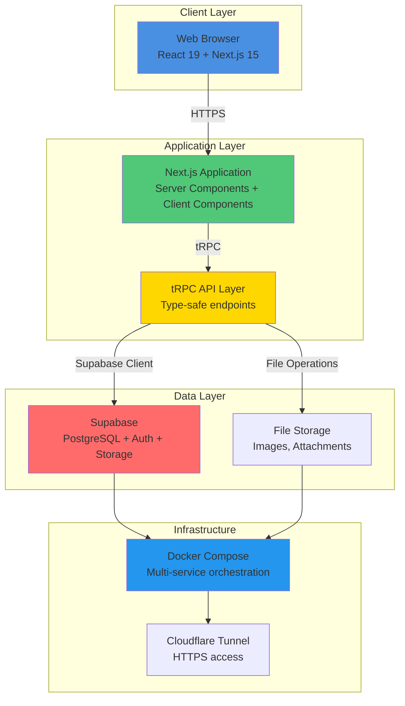
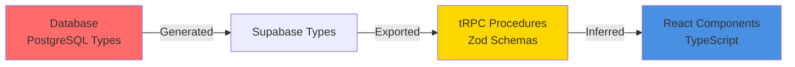

# Service Center - Architecture Documentation

**Version:** 2.0 (Phase 2 Complete)
**Last Updated:** 2025-10-25
**Document Type:** Brownfield Architecture
**Author:** Winston (Architect Agent) + BMad Orchestrator Team

---

## 📚 Documentation Structure

This architecture document is organized into **10 focused sections**, each in its own file for better maintainability and navigation.

```mermaid
graph TB
    INDEX[Architecture Index<br/>You are here]

    INDEX --> S1[01 Introduction<br/>Project overview, constraints]
    INDEX --> S2[02 Technology Stack<br/>Tech choices & rationale]
    INDEX --> S3[03 Data Models<br/>Database schema & ERD]
    INDEX --> S4[04 Component Architecture<br/>Frontend/backend structure]
    INDEX --> S5[05 API Design<br/>tRPC endpoints]
    INDEX --> S6[06 Source Tree<br/>Project structure]
    INDEX --> S7[07 Infrastructure<br/>Deployment & operations]
    INDEX --> S8[08 Coding Standards<br/>Development guidelines]
    INDEX --> S9[09 Testing Strategy<br/>Testing approach]
    INDEX --> S10[10 Security<br/>Security model]

    style INDEX fill:#FFD700,color:#000
    style S1 fill:#4A90E2
    style S2 fill:#4A90E2
    style S3 fill:#FF6B6B
    style S4 fill:#50C878
    style S5 fill:#50C878
    style S6 fill:#9370DB
    style S7 fill:#FF8C00
    style S8 fill:#20B2AA
    style S9 fill:#DB7093
    style S10 fill:#DC143C
```

---

## 📖 Table of Contents

### Core Architecture

| Section | File | Description | Status |
|---------|------|-------------|--------|
| **1. Introduction** | [01-introduction.md](architecture/01-introduction.md) | Project overview, current state, constraints, principles | ✅ Complete |
| **2. Technology Stack** | [02-technology-stack.md](architecture/02-technology-stack.md) | Complete tech stack with rationale | ✅ Complete |
| **3. Data Models** | [03-data-models.md](architecture/03-data-models.md) | Database schema, ENUMs, triggers, RLS, ER diagrams | ✅ Complete |
| **4. Component Architecture** | [04-component-architecture.md](architecture/04-component-architecture.md) | Three-layer architecture, Supabase clients, state management | ✅ Complete |
| **5. API Design** | [05-api-design.md](architecture/05-api-design.md) | tRPC routers, 50+ procedures, type safety flow | ✅ Complete |

### Implementation Details

| Section | File | Description | Status |
|---------|------|-------------|--------|
| **6. Source Tree** | [06-source-tree.md](architecture/06-source-tree.md) | Project structure, naming conventions, import patterns | ✅ Complete |
| **7. Infrastructure** | [07-infrastructure.md](architecture/07-infrastructure.md) | Docker deployment, multi-tenant architecture, operations | ✅ Complete |
| **8. Coding Standards** | [08-coding-standards.md](architecture/08-coding-standards.md) | Type enforcement, naming, error handling, security | ✅ Complete |
| **9. Testing Strategy** | [09-testing-strategy.md](architecture/09-testing-strategy.md) | Testing stack, phased implementation, coverage goals | ✅ Complete |
| **10. Security** | [10-security.md](architecture/10-security.md) | Three-layer security model, authentication, RLS | ✅ Complete |

---

## 🚀 Quick Start

### For New Developers

**Recommended Reading Order:**

1. **Start Here** → [Introduction](architecture/01-introduction.md) - Understand project overview and constraints
2. **Tech Stack** → [Technology Stack](architecture/02-technology-stack.md) - Learn what technologies we use and why
3. **Architecture** → [Component Architecture](architecture/04-component-architecture.md) - Understand system structure
4. **Standards** → [Coding Standards](architecture/08-coding-standards.md) - Learn development guidelines
5. **Dive Deeper** → Other sections as needed

### For DevOps Engineers

**Recommended Reading Order:**

1. **Deployment** → [Infrastructure & Deployment](architecture/07-infrastructure.md) - Docker setup, multi-tenant model
2. **Security** → [Security](architecture/10-security.md) - Security model, authentication flow
3. **Database** → [Data Models](architecture/03-data-models.md) - Database schema understanding

### For Architects

**Recommended Reading Order:**

Read all sections in order, focusing on:
- Architectural principles in [Introduction](architecture/01-introduction.md)
- Technology rationale in [Technology Stack](architecture/02-technology-stack.md)
- Trade-offs and constraints throughout all documents

### For AI Assistants

**Context Loading Strategy:**

Load relevant sections based on task type:

| Task Type | Load These Sections |
|-----------|---------------------|
| **Frontend Development** | Component Architecture, Coding Standards, API Design |
| **Backend Development** | API Design, Data Models, Coding Standards, Security |
| **Database Changes** | Data Models, Coding Standards (naming) |
| **Deployment** | Infrastructure, Security |
| **Bug Fixes** | Relevant section + Coding Standards + Security |
| **Code Review** | Coding Standards, Security |

---

## 🏗️ System Overview

### High-Level Architecture

### Technology Stack Summary

| Layer | Technologies |
|-------|-------------|
| **Frontend** | React 19.1.0, Next.js 15.5.4, Tailwind CSS 4, shadcn/ui |
| **API** | tRPC 11.6.0, Zod 4.1.11, TanStack Query 5.90.2 |
| **Database** | PostgreSQL (Supabase), Row Level Security |
| **Authentication** | Supabase Auth, JWT tokens |
| **Build** | Turbopack, TypeScript 5, Biome 2.2.0 |
| **Deployment** | Docker Compose, Cloudflare Tunnel |

---

## 🔑 Key Architectural Decisions

### 1. Type Safety End-to-End

**Decision:** Use TypeScript + Zod + tRPC for complete type safety from database to UI.

**Rationale:**
- Eliminates runtime type errors
- Automatic type inference (no code generation)
- Single source of truth for data shapes
- Catches errors at compile time

### 2. Server-First Architecture

**Decision:** Server Components by default, Client Components only when needed.

**Rationale:**
- Reduces client-side JavaScript bundle
- Better SEO and initial page load
- Direct database access in Server Components
- Improved Core Web Vitals scores

### 3. Multi-Tenant Isolation

**Decision:** Separate Docker instances with isolated databases per tenant.

**Rationale:**
- Complete data isolation
- Independent scaling per tenant
- Security through separation
- Simplified backup/restore

### 4. Three-Layer Security

**Decision:** Security enforced at middleware, route, API, and database layers.

**Rationale:**
- Defense in depth
- Multiple checkpoints prevent bypasses
- Each layer serves specific purpose
- Database RLS as final enforcement

---

## 📊 System Metrics

### Current State (Phase 2 - Oct 2025)

| Metric | Value | Status |
|--------|-------|--------|
| **Version** | 0.2.1 | ✅ Production |
| **Framework** | Next.js 15.5.4 | ✅ Latest |
| **Database Tables** | 24 tables (10 Phase 1 + 14 Phase 2) | ✅ Complete |
| **tRPC Routers** | 13 routers (8 Phase 1 + 5 Phase 2) | ✅ Complete |
| **tRPC Procedures** | ~95 endpoints | ✅ Complete |
| **Test Coverage** | E2E Tests (Playwright) | ✅ Active |
| **Documentation** | 100% | ✅ Complete |
| **RBAC Implementation** | 50+ protected endpoints | ✅ Complete |
| **Phase 2 Progress** | 18/21 stories (86%) | 🟡 In Progress |

### Resource Requirements

**Per Instance:**
- **RAM:** 4 GB recommended (2 GB minimum)
- **CPU:** 4 cores recommended (2 cores minimum)
- **Disk:** 50 GB recommended (10 GB minimum)
- **Ports:** 5 per instance (app, database, studio, tunnel, monitoring)

---

## 🗺️ Navigation Guide

### Sequential Reading

For complete understanding, read sections in order:

1. [Introduction](architecture/01-introduction.md) - Start here
2. [Technology Stack](architecture/02-technology-stack.md)
3. [Data Models](architecture/03-data-models.md)
4. [Component Architecture](architecture/04-component-architecture.md)
5. [API Design](architecture/05-api-design.md)
6. [Source Tree](architecture/06-source-tree.md)
7. [Infrastructure](architecture/07-infrastructure.md)
8. [Coding Standards](architecture/08-coding-standards.md)
9. [Testing Strategy](architecture/09-testing-strategy.md)
10. [Security](architecture/10-security.md)

### Topic-Based Reading

Jump directly to relevant sections based on your needs:

**Understanding the System:**
- System overview → [Introduction](architecture/01-introduction.md)
- How it's built → [Technology Stack](architecture/02-technology-stack.md)
- How it works → [Component Architecture](architecture/04-component-architecture.md)

**Working with Data:**
- Database schema → [Data Models](architecture/03-data-models.md)
- API endpoints → [API Design](architecture/05-api-design.md)
- Security rules → [Security](architecture/10-security.md)

**Development:**
- Code organization → [Source Tree](architecture/06-source-tree.md)
- Coding rules → [Coding Standards](architecture/08-coding-standards.md)
- Testing approach → [Testing Strategy](architecture/09-testing-strategy.md)

**Operations:**
- Deployment → [Infrastructure](architecture/07-infrastructure.md)
- Security → [Security](architecture/10-security.md)

---

## 📝 Document Conventions

### Diagrams

This documentation uses **Mermaid diagrams** for visualization:

- **Flow diagrams** - Process flows and decision trees
- **Sequence diagrams** - Interaction between components
- **ER diagrams** - Database relationships
- **Mind maps** - Concept relationships
- **Timelines** - Evolution and roadmaps

All diagrams render automatically on GitHub and in compatible Markdown viewers.

### Code Examples

Code examples follow the project's coding standards:
- TypeScript with strict mode
- `type` over `interface` (enforced)
- Comprehensive error handling
- Security best practices

### Status Indicators

- ✅ Complete and verified
- 🟡 In progress or partial
- ⏳ Planned for future
- ⚠️ Needs attention
- 🔴 Critical issue
- ❌ Not implemented

---

## 🔗 Related Documentation

### Internal Documentation

| Document | Location | Purpose |
|----------|----------|---------|
| **Frontend Architecture** | `docs/ui-architecture.md` | React/Next.js patterns |
| **Deployment Guide** | `DEPLOYMENT.md` | Vietnamese deployment guide |
| **Development Guide** | `DEVELOPMENT.md` | Local setup instructions |
| **Project Instructions** | `CLAUDE.md` | Claude Code instructions |
| **PRD** | `docs/prd/` | Product requirements |

### External Resources

- **Next.js Documentation** - https://nextjs.org/docs
- **tRPC Documentation** - https://trpc.io/docs
- **Supabase Documentation** - https://supabase.com/docs
- **Tailwind CSS** - https://tailwindcss.com/docs
- **shadcn/ui** - https://ui.shadcn.com

---

## 🤝 Contributing

When updating this documentation:

1. **Update the relevant shard file** in `docs/architecture/`
2. **Maintain consistency** with existing style and format
3. **Add diagrams** where they improve understanding
4. **Update version numbers** and change log
5. **Keep the index synchronized** with shard changes

---

## 📅 Version History

| Date | Version | Description | Author |
|------|---------|-------------|--------|
| 2025-10-25 | 2.0 | Updated for Phase 2 completion (18/21 stories) - Added 14 tables, 5 routers, RBAC, Playwright tests | BMad Team |
| 2025-10-23 | 1.0 | Initial sharded architecture documentation with comprehensive diagrams | Winston |

---

## 📞 Getting Help

**For Questions:**
- Review relevant section in this documentation
- Check `CLAUDE.md` for project-specific guidelines
- Consult related documentation (Frontend Architecture, Deployment Guide)

**For Issues:**
- Report at GitHub repository issues
- Include relevant section reference from this document

---

**Ready to dive in?** Start with [Introduction →](architecture/01-introduction.md)

---

**End of Architecture Index**
