# 1. Introduction

[← Back to Architecture Index](../architecture.md) | [Next: Technology Stack →](02-technology-stack.md)

---

## 1.1 Project Overview

**Project Name:** Service Center Management Application
**Project Type:** Production Brownfield Application
**Current Version:** 0.2.1
**Repository:** `/home/tan/work/sevice-center`

### Purpose

A comprehensive service center management system for tracking repair services, customer information, inventory, and technician workflows. The application manages the complete lifecycle of service tickets from creation through completion, with support for parts inventory, customer records, and staff management.

### System Context Diagram


---

## 1.2 Current State

### Production Status

✅ **Active Production Application**

**Key Characteristics:**
- Full-stack Next.js 15.5.4 application with App Router
- Supabase PostgreSQL backend with local development support
- Type-safe API layer using tRPC 11.6.0
- Server-first architecture leveraging React Server Components
- Docker-based multi-tenant deployment ready
- Automated deployment scripts for SaaS model

### Application Maturity

```mermaid
graph LR
    subgraph "Production Ready"
        Core[Core Features<br/>✅ Complete]
        DB[Database Schema<br/>✅ Complete]
        Deploy[Deployment<br/>✅ Automated]
    end

    subgraph "In Progress"
        Docs[Documentation<br/>🟡 Expanding]
    end

    subgraph "Planned"
        Tests[Testing<br/>⏳ Planned]
        Monitor[Monitoring<br/>⏳ Planned]
    end

    style Core fill:#50C878
    style DB fill:#50C878
    style Deploy fill:#50C878
    style Docs fill:#FFD700
    style Tests fill:#B0B0B0
    style Monitor fill:#B0B0B0
```



### Available Documentation

| Document | Location | Status | Purpose |
|----------|----------|--------|---------|
| **Frontend Architecture** | `docs/ui-architecture.md` | ✅ Complete | React/Next.js patterns, component standards |
| **Deployment Guide** | `DEPLOYMENT.md` | ✅ Complete (Vietnamese) | Docker deployment, multi-instance setup |
| **Development Guide** | `DEVELOPMENT.md` | ✅ Complete | Local development workflow |
| **PRD** | `docs/prd/` | ✅ Complete (Sharded) | Product requirements |
| **Database Schemas** | `docs/data/schemas/` | ✅ Complete | SQL schema files (source of truth) |
| **Architecture** | `docs/architecture/` | ✅ Complete (Sharded) | This document |

---

## 1.3 Document Purpose

This architecture document serves as the comprehensive technical reference for the Service Center application.

### Target Audience


### Document Scope

**Covers:**
- ✅ Complete technology stack and rationale
- ✅ Database schema and data model design
- ✅ API architecture and endpoint documentation
- ✅ Security model and authentication flow
- ✅ Deployment infrastructure and operations
- ✅ Coding standards and best practices
- ✅ Testing strategy and implementation roadmap
- ✅ Component architecture and patterns

**Does NOT Cover:**
- ❌ Business requirements (see PRD in `docs/prd/`)
- ❌ UI/UX specifications (see Frontend Architecture)
- ❌ Marketing or sales strategy
- ❌ End-user documentation

---

## 1.4 Architectural Constraints

### Identified Constraints


#### 1. Database-First Design

**Constraint:** Schema files in `docs/data/schemas/` serve as source of truth.

**Impact:**
- All database changes must start with schema file updates
- Requires disciplined migration workflow
- Schema order dependencies must be maintained

**Rationale:** Ensures database schema is version-controlled, documented, and reproducible across environments.

#### 2. Supabase Local Development

**Constraint:** Development requires running local Supabase stack via Docker.

**Impact:**
- Developers need Docker installed
- ~2GB RAM required for local stack
- Initial setup time: 5-10 minutes

**Rationale:** Provides production-like environment locally with auth, storage, and database.

#### 3. Service Role Pattern

**Constraint:** tRPC uses service role client bypassing RLS.

**Impact:**
- Authentication must be explicitly verified in all procedures
- RLS policies not enforced at tRPC layer
- Developer discipline required

**Rationale:** Provides flexibility for server-side operations while maintaining security through explicit checks.

#### 4. Three-Client Pattern

**Constraint:** Application uses browser/server/admin Supabase clients with distinct security contexts.

**Impact:**
- Developers must choose correct client for each use case
- Incorrect client usage can cause security issues or bugs
- Learning curve for new developers

**Rationale:** Separates concerns between client-side, server-side, and admin operations.

#### 5. Server Component Philosophy

**Constraint:** Components are Server Components by default.

**Impact:**
- Must explicitly use "use client" for interactivity
- Cannot use browser APIs in Server Components
- State management strategy differs from traditional React apps

**Rationale:** Reduces client-side JavaScript, improves performance, enables server-side data fetching.

#### 6. Type Enforcement

**Constraint:** Frontend architecture mandates `type` over `interface`.

**Impact:**
- All type definitions must use `type` keyword
- Linter enforces this rule (build fails on violation)
- Consistency across codebase

**Rationale:** Better compatibility with Zod inference, discriminated unions, and type operations.

#### 7. Vietnamese Language Support

**Constraint:** Filenames require sanitization for Vietnamese diacritics.

**Impact:**
- File upload code must sanitize filenames
- Cannot use raw filenames from user input
- Special handling for à, ă, đ, ê, ô, ơ, ư characters

**Rationale:** Ensures filesystem compatibility and prevents encoding issues.

#### 8. Port Calculation

**Constraint:** Multi-tenant deployment uses calculated ports (base + instance number).

**Impact:**
- Port conflicts must be avoided manually
- Port ranges must be reserved
- Firewall rules more complex

**Rationale:** Enables multiple isolated instances on single server for SaaS model.

### Constraint Impact Matrix

| Constraint | Development | Testing | Deployment | Maintenance |
|------------|-------------|---------|------------|-------------|
| Database-First | 🟡 Medium | 🟢 Low | 🟢 Low | 🟢 Low |
| Supabase Local | 🟠 High | 🟡 Medium | 🟢 Low | 🟡 Medium |
| Service Role | 🟠 High | 🟠 High | 🟢 Low | 🟡 Medium |
| Three-Client | 🟡 Medium | 🟡 Medium | 🟢 Low | 🟢 Low |
| Server Components | 🟡 Medium | 🟡 Medium | 🟢 Low | 🟢 Low |
| Type Enforcement | 🟢 Low | 🟢 Low | 🟢 Low | 🟢 Low |
| Vietnamese Support | 🟢 Low | 🟢 Low | 🟢 Low | 🟢 Low |
| Port Calculation | 🟢 Low | 🟢 Low | 🟡 Medium | 🟡 Medium |

🟢 Low Impact | 🟡 Medium Impact | 🟠 High Impact | 🔴 Critical Impact

---

## 1.5 Architecture Evolution

### Version History


### Future Considerations

**Short-term (Next 3 months):**
- Implement testing infrastructure (Vitest + Playwright)
- Add monitoring and observability (Sentry, DataDog)
- Enhance error handling and logging
- Document API with OpenAPI/Swagger

**Medium-term (6-12 months):**
- Multi-language support (i18n)
- Mobile app (React Native)
- Advanced reporting and analytics
- Automated backup and disaster recovery

**Long-term (12+ months):**
- Microservices architecture (if needed)
- Kubernetes orchestration for scaling
- Machine learning for predictive maintenance
- Real-time collaboration features

---

## 1.6 How to Read This Document

### Document Navigation

This architecture document is **sharded** into multiple files for better maintainability:

```
docs/architecture/
├── 01-introduction.md          ← You are here
├── 02-technology-stack.md      → Technology choices and rationale
├── 03-data-models.md           → Database schema and models
├── 04-component-architecture.md → Frontend/backend structure
├── 05-api-design.md            → tRPC API documentation
├── 06-source-tree.md           → Project structure
├── 07-infrastructure.md        → Deployment and operations
├── 08-coding-standards.md      → Development guidelines
├── 09-testing-strategy.md      → Testing approach
└── 10-security.md              → Security model
```

### Reading Recommendations

**For New Developers:**
1. Start here (Introduction)
2. Read [Technology Stack](02-technology-stack.md)
3. Read [Component Architecture](04-component-architecture.md)
4. Read [Coding Standards](08-coding-standards.md)
5. Skim other sections as needed

**For DevOps Engineers:**
1. Read [Infrastructure & Deployment](07-infrastructure.md)
2. Read [Security](10-security.md)
3. Read [Data Models](03-data-models.md) for database understanding

**For Architects:**
1. Read all sections in order
2. Focus on rationale sections in each document
3. Review constraints and trade-offs

**For AI Assistants:**
1. Load relevant sections based on task
2. Reference [Coding Standards](08-coding-standards.md) for code generation
3. Use [API Design](05-api-design.md) for endpoint documentation

---

## 1.7 Key Architectural Principles

### Core Principles


#### 1. Type Safety End-to-End

**Principle:** Eliminate runtime type errors through compile-time checking.

**Implementation:**
- TypeScript in strict mode
- Zod schemas for runtime validation
- tRPC for automatic type inference from server to client
- `type` over `interface` for consistency

#### 2. Security Defense in Depth

**Principle:** Multiple security layers prevent single point of failure.

**Implementation:**
- Layer 1: Middleware (session sync)
- Layer 2: Layout guards (authentication)
- Layer 3: API procedures (authorization)
- Layer 4: Database RLS (final enforcement)

#### 3. Performance Server-First

**Principle:** Minimize client-side JavaScript, maximize server capabilities.

**Implementation:**
- Server Components by default
- Database-level calculations (generated columns, triggers)
- Edge caching with Cloudflare
- Turbopack for fast builds

#### 4. Maintainability Through Conventions

**Principle:** Consistent patterns reduce cognitive load.

**Implementation:**
- Enforced coding standards (Biome)
- Standard file naming conventions
- tRPC procedure naming patterns
- Database naming conventions

#### 5. Scalability via Isolation

**Principle:** Multi-tenant architecture enables horizontal scaling.

**Implementation:**
- Docker container isolation
- Separate databases per instance
- Port-based instance separation
- Automated deployment scripts

---

## Next Steps

Continue to [Technology Stack →](02-technology-stack.md) to understand the complete technology choices and their rationale.

---

[← Back to Architecture Index](../architecture.md) | [Next: Technology Stack →](02-technology-stack.md)
