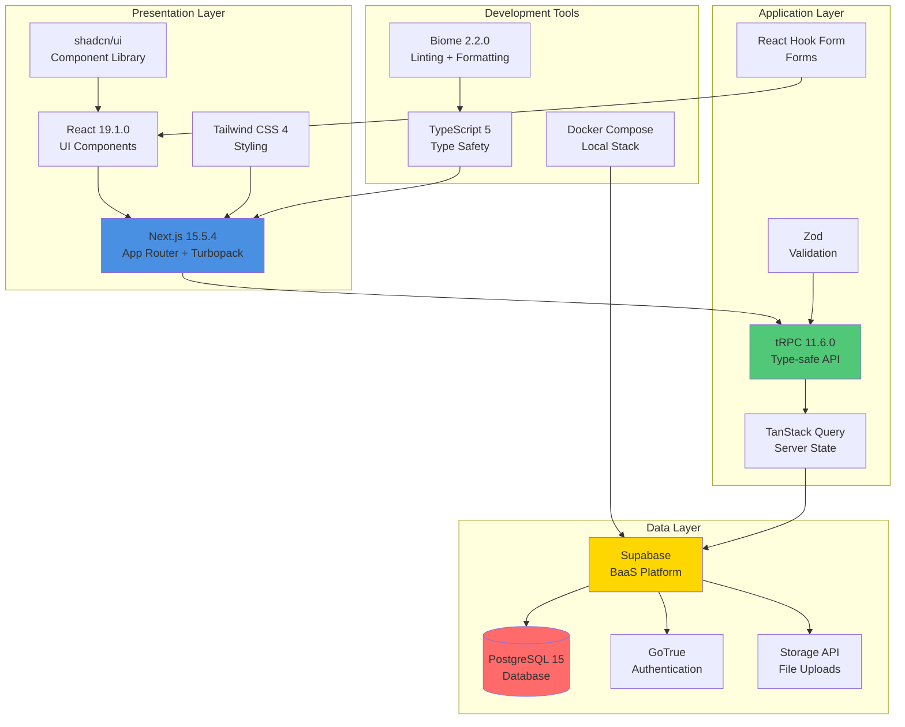
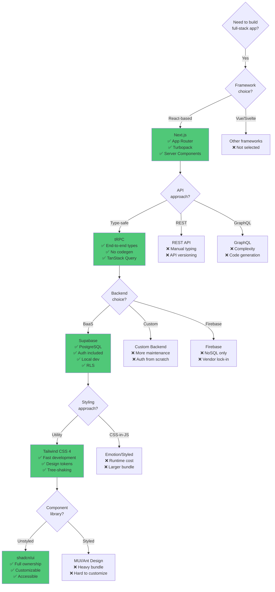
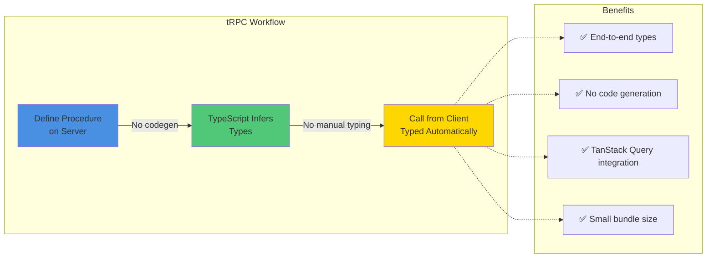
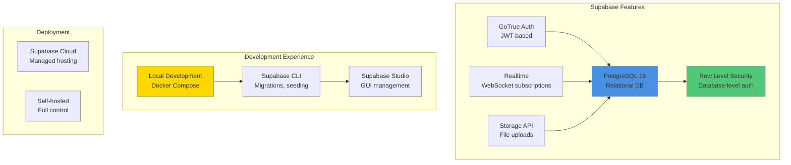
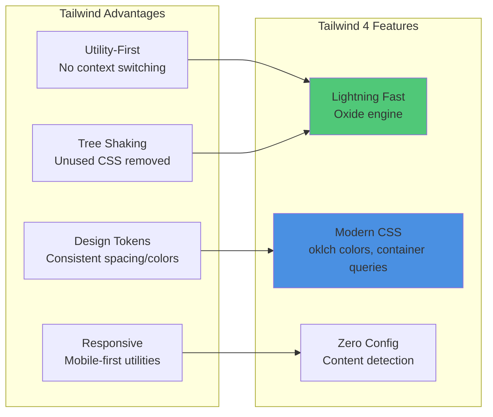
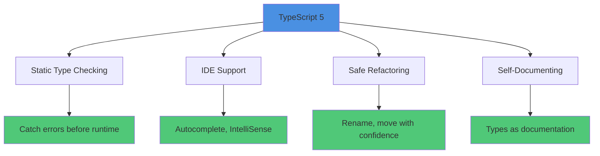
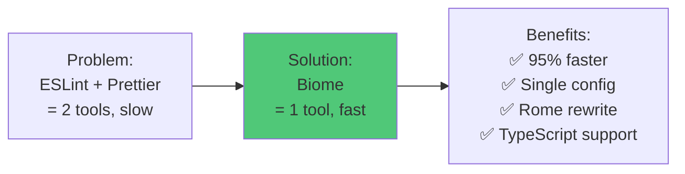
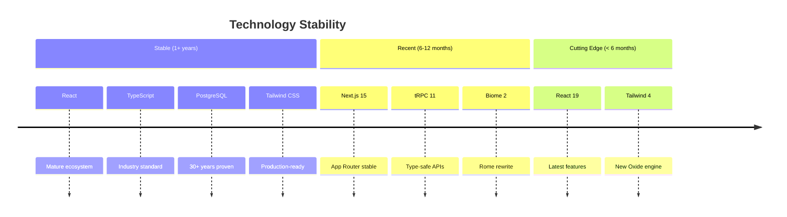
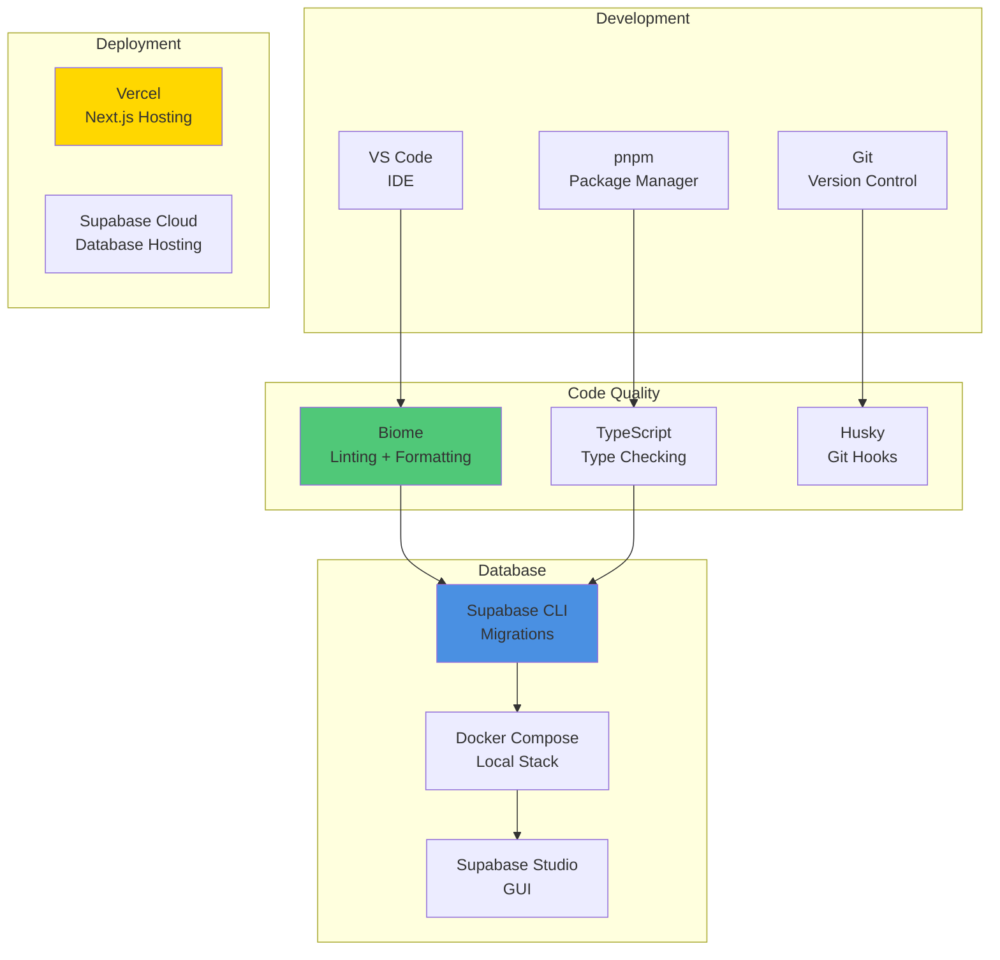

# 2. Technology Stack

[← Previous: Introduction](01-introduction.md) | [Back to Index](../architecture.md) | [Next: Data Models →](03-data-models.md)

---

## 2.1 Stack Overview



---

## 2.2 Technology Layers

### 2.2.1 Presentation Layer

| Technology | Version | Purpose | Decision Rationale |
|------------|---------|---------|-------------------|
| **React** | 19.1.0 | UI framework | Latest features (Server Components, Suspense) |
| **Next.js** | 15.5.4 | React framework | App Router for RSC, Turbopack for fast builds |
| **Tailwind CSS** | 4.0 | Utility-first CSS | Rapid UI development, consistent design tokens |
| **shadcn/ui** | Latest | Component library | Customizable, accessible, Tailwind-based |

### 2.2.2 Application Layer

| Technology | Version | Purpose | Decision Rationale |
|------------|---------|---------|-------------------|
| **tRPC** | 11.6.0 | API layer | End-to-end type safety without code generation |
| **TanStack Query** | 5.x | Server state | Caching, refetching, optimistic updates |
| **React Hook Form** | Latest | Form handling | Performance (uncontrolled inputs), validation |
| **Zod** | Latest | Validation | Runtime type checking, tRPC integration |

### 2.2.3 Data Layer

| Technology | Version | Purpose | Decision Rationale |
|------------|---------|---------|-------------------|
| **Supabase** | Latest | Backend-as-a-Service | PostgreSQL + Auth + Realtime + Storage |
| **PostgreSQL** | 15 | Database | Robust, feature-rich, Row Level Security (RLS) |
| **GoTrue** | Latest | Authentication | JWT-based auth, part of Supabase stack |

### 2.2.4 Development Tools

| Technology | Version | Purpose | Decision Rationale |
|------------|---------|---------|-------------------|
| **TypeScript** | 5.x | Type system | Static typing, IDE support, catch errors early |
| **Biome** | 2.2.0 | Linter + Formatter | Single tool replacing ESLint + Prettier |
| **Docker Compose** | Latest | Container orchestration | Reproducible local Supabase stack |
| **pnpm** | Latest | Package manager | Faster installs, disk space efficiency |

---

## 2.3 Technology Decision Tree



---

## 2.4 Key Technology Decisions

### 2.4.1 Why Next.js 15.5.4?

```mermaid
mindmap
  root((Next.js 15.5.4))
    App Router
      Server Components default
      Async Server Components
      Nested layouts
      Parallel routes
    Performance
      Turbopack bundler
      Faster dev server
      Optimized builds
    React 19 Support
      Server Actions
      use() hook
      Improved hydration
    SEO & SSR
      Server-side rendering
      Static generation
      Dynamic metadata
```

**Benefits:**
- **App Router** - Modern routing with layouts, loading states, error boundaries
- **Server Components** - Reduced client bundle, direct database access
- **Turbopack** - 700x faster than Webpack for updates
- **React 19 Ready** - Full support for latest React features
- **Incremental Adoption** - Can migrate pages gradually

**Why Not Alternatives:**
- ❌ **Create React App** - No SSR, deprecated
- ❌ **Vite + React Router** - No built-in SSR, more configuration
- ❌ **Remix** - Good alternative, but Next.js has larger ecosystem

---

### 2.4.2 Why tRPC 11.6.0?



**Benefits:**
- **Zero Runtime Overhead** - Types erased at build time
- **DX Excellence** - Autocomplete, refactoring, type errors in IDE
- **No Versioning** - Client and server always in sync
- **TanStack Query** - Built-in caching and state management

**Why Not Alternatives:**
- ❌ **REST API** - Manual type definitions, API versioning issues
- ❌ **GraphQL** - Code generation, complexity, over-fetching prevention
- ❌ **Server Actions Only** - No queryable state, limited caching

---

### 2.4.3 Why Supabase?



**Benefits:**
- **PostgreSQL** - Robust, feature-rich relational database
- **Built-in Auth** - No need for separate auth service
- **Row Level Security** - Database-enforced permissions
- **Local Development** - Full stack runs in Docker (no cloud dependency)
- **Open Source** - Can self-host, avoid vendor lock-in

**Why Not Alternatives:**
- ❌ **Firebase** - NoSQL only, vendor lock-in, expensive at scale
- ❌ **PlanetScale** - No local dev, MySQL not PostgreSQL
- ❌ **Custom Backend** - More maintenance, auth from scratch

---

### 2.4.4 Why Tailwind CSS 4?



**Benefits:**
- **Fast Development** - No naming classes, no switching files
- **Small Bundle** - Only ships used utilities (~10KB gzipped)
- **Design Consistency** - Spacing scale, color palette enforced
- **Tailwind 4** - New Oxide engine (10x faster), modern CSS features

**Why Not Alternatives:**
- ❌ **CSS-in-JS** - Runtime overhead, larger bundle, SSR complexity
- ❌ **Bootstrap** - Heavy, opinionated, harder to customize
- ❌ **Plain CSS** - Naming fatigue, no tree-shaking, global scope

---

### 2.4.5 Why shadcn/ui?

**Benefits:**
- **Copy-Paste Components** - Full control, not an npm dependency
- **Customizable** - Tailwind-based, easy to modify
- **Accessible** - Built with Radix UI primitives (ARIA compliant)
- **TypeScript Native** - Full type safety

**Why Not Alternatives:**
- ❌ **MUI** - Heavy (~300KB), opinionated styling, hard to customize
- ❌ **Ant Design** - Opinionated, large bundle, Chinese design language
- ❌ **Chakra UI** - CSS-in-JS runtime cost

---

### 2.4.6 Why TypeScript 5?



**Benefits:**
- **Type Safety** - Prevents entire classes of bugs
- **Better DX** - Autocomplete, inline documentation, refactoring
- **Strict Mode** - Enforced null checks, no implicit any
- **tRPC Integration** - Types flow from server to client

**Why Not JavaScript:**
- ❌ No type safety
- ❌ Runtime errors instead of compile-time
- ❌ Harder to maintain as codebase grows

---

### 2.4.7 Why Biome 2.2.0?



**Benefits:**
- **Single Tool** - Replaces ESLint + Prettier
- **95% Faster** - Written in Rust
- **Compatible** - Supports Prettier config format
- **TypeScript Native** - Understands TS without plugins

**Why Not Alternatives:**
- ❌ **ESLint + Prettier** - Slower, two tools, config conflicts
- ❌ **Just Prettier** - No linting, only formatting

---

## 2.5 Version Lock-in & Stability



**Upgrade Strategy:**
- **Core Dependencies** - Pin major versions, update quarterly
- **Security Patches** - Apply immediately
- **Feature Updates** - Test in staging before production
- **Breaking Changes** - Plan migration, update docs

---

## 2.6 Technology Comparison Matrix

### 2.6.1 API Layer Comparison

| Feature | tRPC | REST API | GraphQL |
|---------|------|----------|---------|
| **Type Safety** | ✅ End-to-end | ❌ Manual | ⚠️ Codegen required |
| **Bundle Size** | ✅ Small | ✅ Small | ❌ Large client |
| **Learning Curve** | ✅ Easy | ✅ Easy | ❌ Steep |
| **Caching** | ✅ TanStack Query | ⚠️ Manual | ✅ Built-in |
| **Versioning** | ✅ Not needed | ❌ Required | ⚠️ Schema evolution |
| **Dev Experience** | ✅ Excellent | ❌ Manual typing | ⚠️ Codegen setup |

**Winner:** tRPC for type safety and DX

---

### 2.6.2 Backend Comparison

| Feature | Supabase | Firebase | Custom (Node.js) |
|---------|----------|----------|------------------|
| **Database** | ✅ PostgreSQL | ❌ NoSQL only | ✅ Your choice |
| **Auth Built-in** | ✅ Yes | ✅ Yes | ❌ Manual |
| **Local Dev** | ✅ Docker | ❌ Emulators only | ✅ Full control |
| **Cost** | ✅ Low | ⚠️ High at scale | ⚠️ Hosting cost |
| **Vendor Lock-in** | ✅ Open source | ❌ Proprietary | ✅ None |
| **RLS** | ✅ Native | ❌ No | ⚠️ Manual |

**Winner:** Supabase for PostgreSQL + local dev

---

### 2.6.3 Styling Comparison

| Feature | Tailwind CSS | CSS-in-JS | Plain CSS |
|---------|--------------|-----------|-----------|
| **Bundle Size** | ✅ Small (tree-shaken) | ❌ Runtime cost | ✅ Small |
| **Developer Experience** | ✅ Fast | ⚠️ Context switching | ❌ Naming fatigue |
| **SSR Support** | ✅ Perfect | ⚠️ Complex | ✅ Perfect |
| **Customization** | ✅ Config file | ✅ Full JS | ⚠️ Manual |
| **Performance** | ✅ No runtime | ❌ Runtime overhead | ✅ No runtime |

**Winner:** Tailwind for DX and bundle size

---

## 2.7 Tool Ecosystem



---

## 2.8 Package.json Scripts

```json
{
  "scripts": {
    "dev": "next dev -p 3025 --turbopack",
    "build": "next build --turbopack",
    "start": "next start -p 3025",
    "lint": "biome check .",
    "format": "biome check --write ."
  },
  "dependencies": {
    "next": "15.5.4",
    "react": "19.1.0",
    "@trpc/server": "11.6.0",
    "@trpc/client": "11.6.0",
    "@trpc/react-query": "11.6.0",
    "@tanstack/react-query": "^5.0.0",
    "@supabase/supabase-js": "^2.39.0",
    "zod": "^3.22.0",
    "react-hook-form": "^7.49.0",
    "tailwindcss": "^4.0.0"
  },
  "devDependencies": {
    "typescript": "^5.3.0",
    "@biomejs/biome": "2.2.0"
  }
}
```

---

## 2.9 Technology Maturity Assessment

| Technology | Maturity | Risk Level | Upgrade Frequency |
|------------|----------|------------|-------------------|
| **React** | Mature | Low | Minor updates quarterly |
| **Next.js** | Mature | Low | Patch updates monthly |
| **TypeScript** | Mature | Low | Minor updates quarterly |
| **PostgreSQL** | Very Mature | Very Low | Rarely (years) |
| **Supabase** | Growing | Medium | Check releases monthly |
| **tRPC** | Mature | Low | Minor updates bi-annually |
| **Tailwind** | Mature | Low | Patch updates as needed |
| **Biome** | Growing | Medium | Monitor for updates |

---

## Next Steps

Continue to [Data Models →](03-data-models.md) to understand the database schema and entity relationships.

---

[← Previous: Introduction](01-introduction.md) | [Back to Index](../architecture.md) | [Next: Data Models →](03-data-models.md)
