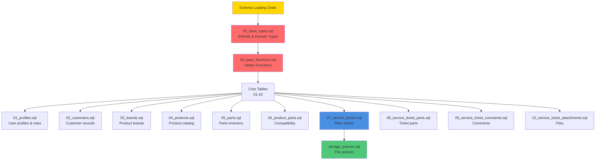
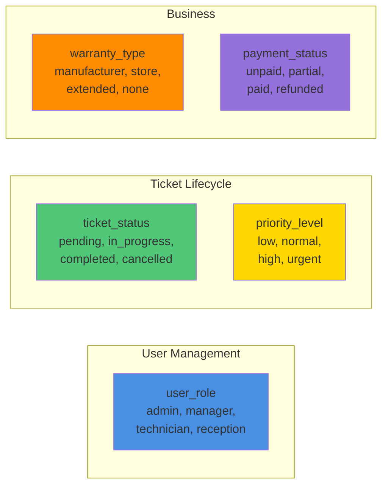
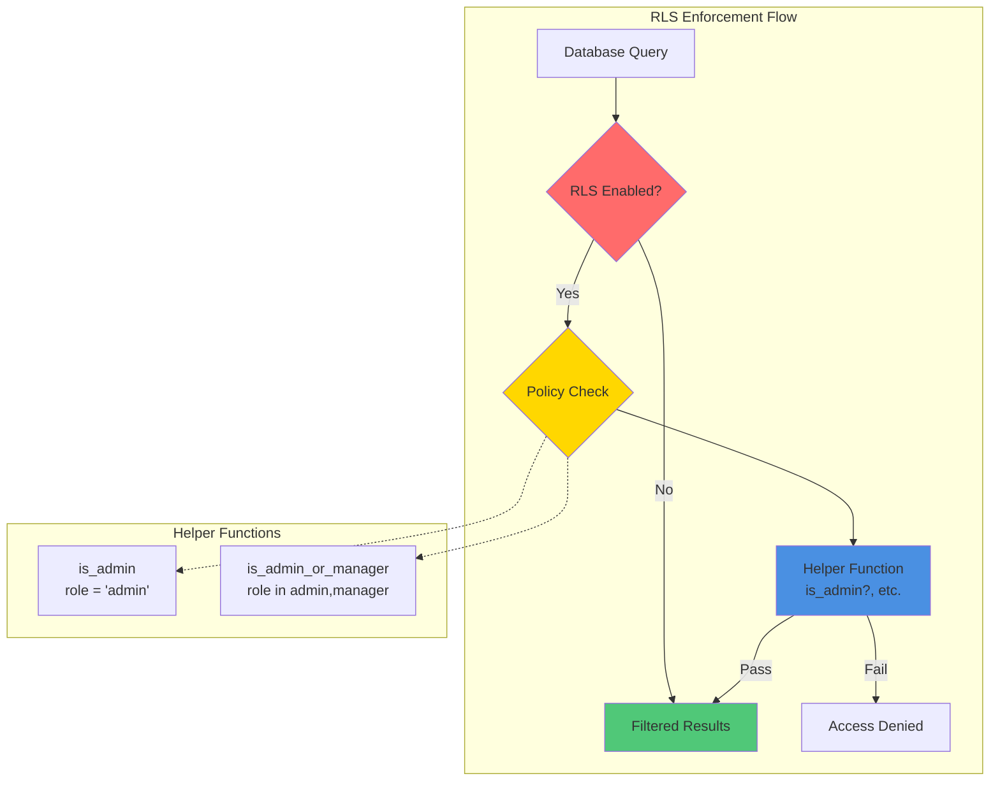
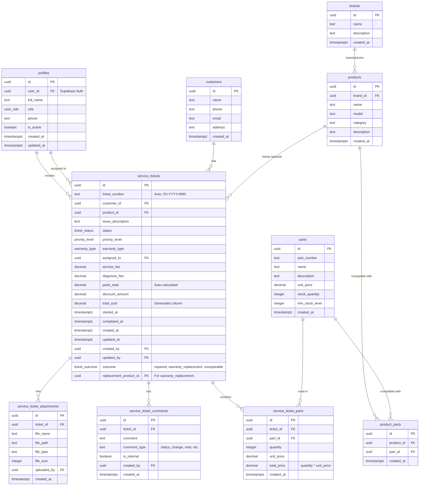
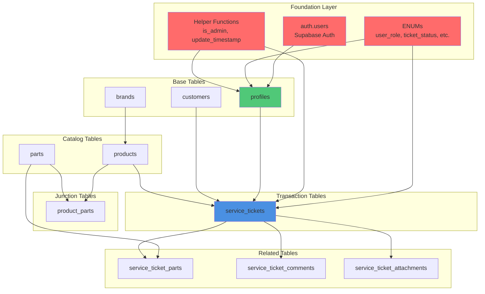

# 3. Data Models & Database Schema

[← Previous: Technology Stack](02-technology-stack.md) | [Back to Index](../architecture.md) | [Next: Component Architecture →](04-component-architecture.md)

---

## 3.1 Schema Organization

Database schemas are organized in **dependency order** in `docs/data/schemas/`:



**Critical:** Files must be loaded in this exact order due to foreign key dependencies.

---

## 3.2 Core Data Models

### 3.2.1 ENUMs and Types


**IMPORTANT SCHEMA UPDATE (2025-10-31):** The `physical_products` table was redesigned to use virtual warehouse instances instead of types:

- ✅ **NEW:** `virtual_warehouse_id` (UUID NOT NULL) - References specific virtual warehouse instance
- ✅ **NEW:** `previous_virtual_warehouse_id` (UUID nullable) - Stores previous warehouse for RMA batch management
- ❌ **REMOVED:** `virtual_warehouse_type` (ENUM) - Replaced with UUID reference for flexibility
- ❌ **REMOVED:** `physical_warehouse_id` - Redundant, obtained via `virtual_warehouse.physical_warehouse_id`

This enables unlimited warehouse instances per physical location and proper foreign key relationships. See [Physical Products Schema Update](./PHYSICAL-PRODUCTS-SCHEMA-UPDATE.md) for complete details.


**User Roles:**
```sql
create type public.user_role as enum (
  'admin',      -- Full system access
  'manager',    -- Manage tickets, customers, products
  'technician', -- Work on assigned tickets
  'reception'   -- Create tickets, view customers
);
```

**Ticket Lifecycle:**
```sql
create type public.ticket_status as enum (
  'pending',      -- Initial state, awaiting assignment
  'in_progress',  -- Technician working on repair
  'completed',    -- Repair finished
  'cancelled'     -- Ticket cancelled
);

create type public.priority_level as enum (
  'low', 'normal', 'high', 'urgent'
);
```

**Business Types:**
```sql
create type public.warranty_type as enum (
  'manufacturer',  -- Manufacturer warranty
  'store',         -- Store warranty
  'extended',      -- Extended warranty plan
  'none'          -- Out of warranty
);

create type public.payment_status as enum (
  'unpaid', 'partial', 'paid', 'refunded'
);

-- Warehouse type enum (updated Oct 30, 2025)
-- NOTE: A new value 'main' was added to support default virtual warehouses
-- and simplify UI mappings. Two redundant fields were removed from
-- `virtual_warehouses`: `display_name` and `color_code` (migrations
-- applied: 202510260014, 202510260015, 202510260016).
-- UPDATE Oct 30, 2025: Added 'customer_installed' to track sold products
-- currently installed at customer sites.
-- Developer follow-ups:
--  * Regenerate TypeScript DB types (supabase gen types)
--  * Update Zod schemas and frontend dropdowns to include 'main' and 'customer_installed'
--  * Update any code paths that referenced display_name or color_code
create type public.warehouse_type as enum (
  'main', -- Kho Chính (Main storage)
  'warranty_stock',
  'rma_staging',
  'dead_stock',
  'in_service',
  'parts',
  'customer_installed' -- Hàng đã bán (Products sold and installed at customer sites)
);

-- Ticket outcome enum (added Dec 15, 2025)
-- Tracks the result of service ticket completion
create type public.ticket_outcome as enum (
  'repaired',              -- Sửa chữa thành công, trả máy cũ
  'warranty_replacement',  -- Đổi sản phẩm mới từ kho bảo hành
  'unrepairable'           -- Không sửa được, không đổi được
);
```

### 3.2.2 Service Tickets Table (Core)

```sql
create table "service_tickets" (
  "id" uuid not null default gen_random_uuid(),
  "ticket_number" text not null unique,  -- Auto: SV-YYYY-NNN
  "customer_id" uuid not null references "customers"("id"),
  "product_id" uuid not null references "products"("id"),
  "issue_description" text not null,
  "status" public.ticket_status not null default 'pending',
  "priority_level" public.priority_level not null default 'normal',
  "warranty_type" public.warranty_type,
  "assigned_to" uuid references "profiles"("user_id"),

  -- Financial (auto-calculated total)
  "service_fee" decimal(10,2) not null default 0 check (service_fee >= 0),
  "diagnosis_fee" decimal(10,2) not null default 0 check (diagnosis_fee >= 0),
  "parts_total" decimal(10,2) not null default 0 check (parts_total >= 0),
  "discount_amount" decimal(10,2) not null default 0 check (discount_amount >= 0),
  "total_cost" decimal(10,2) generated always as
    (service_fee + diagnosis_fee + parts_total - discount_amount) stored,

  -- Timestamps
  "started_at" timestamptz,
  "completed_at" timestamptz,
  "created_at" timestamptz not null default now(),
  "updated_at" timestamptz not null default now(),

  -- Audit trail
  "created_by" uuid references "profiles"("user_id"),
  "updated_by" uuid references "profiles"("user_id"),
  "notes" text,

  -- Ticket completion outcome (added Dec 15, 2025)
  "outcome" public.ticket_outcome,  -- Result: repaired, warranty_replacement, unrepairable
  "replacement_product_id" uuid references "physical_products"("id"),  -- For warranty_replacement

  constraint "service_tickets_pkey" primary key ("id"),
  constraint "service_tickets_dates_check" check (
    completed_at is null or started_at is null or completed_at >= started_at
  ),
  -- Ensure replacement_product_id only set when outcome = warranty_replacement
  constraint "chk_replacement_requires_outcome" check (
    (outcome = 'warranty_replacement' AND replacement_product_id IS NOT NULL) OR
    (outcome != 'warranty_replacement' AND replacement_product_id IS NULL) OR
    (outcome IS NULL)
  )
);
```

---

## 3.3 Database Triggers & Automation

```mermaid
sequenceDiagram
    participant App as Application
    participant DB as Database
    participant Trigger1 as Ticket Number Trigger
    participant Trigger2 as Status Log Trigger
    participant Trigger3 as Parts Total Trigger

    App->>DB: INSERT new ticket
    DB->>Trigger1: BEFORE INSERT
    Trigger1->>Trigger1: Generate SV-2025-001
    Trigger1-->>DB: Set ticket_number
    DB-->>App: Ticket created

    Note: The database also contains triggers that assist with warehouse automation. In particular,
    the function `create_default_virtual_warehouse()` (used when a new `physical_warehouses` row
    is inserted) was updated on 2025-10-26 to create the default virtual warehouse with
    warehouse_type = 'main' instead of 'warranty_stock'. This change simplifies the default
    mapping and aligns with UI expectations. See migrations `202510260014`, `202510260015`,
    `202510260016` for details (these migrations also removed the legacy `display_name` and
    `color_code` columns from `virtual_warehouses`).

    App->>DB: UPDATE ticket status
    DB->>Trigger2: AFTER UPDATE
    Trigger2->>Trigger2: Status changed?
    Trigger2->>DB: INSERT comment
    DB-->>App: Status updated

    App->>DB: INSERT ticket part
    DB->>Trigger3: AFTER INSERT
    Trigger3->>Trigger3: Sum all parts
    Trigger3->>DB: UPDATE parts_total
    DB-->>App: Part added
```

### Auto-Generate Ticket Numbers

```sql
-- Function to generate ticket numbers: SV-YYYY-NNN
create or replace function public.generate_ticket_number()
returns text as $$
declare
  current_year text;
  next_number integer;
begin
  current_year := to_char(now(), 'YYYY');

  select coalesce(
    max((regexp_match(ticket_number, 'SV-' || current_year || '-(\d+)'))[1]::integer),
    0
  ) + 1
  into next_number
  from public.service_tickets;

  return 'SV-' || current_year || '-' || lpad(next_number::text, 3, '0');
end;
$$ language plpgsql security definer set search_path = pg_catalog, public;

-- Trigger to call function before insert
create trigger "service_tickets_set_number_trigger"
  before insert on "service_tickets"
  for each row
  execute function set_ticket_number();
```

**Examples:**
- First ticket of 2025: `SV-2025-001`
- 142nd ticket of 2025: `SV-2025-142`
- First ticket of 2026: `SV-2026-001` (counter resets)

### Auto-Log Status Changes

```sql
create or replace function public.log_status_change()
returns trigger as $$
begin
  if (tg_op = 'UPDATE' and old.status is distinct from new.status) then
    insert into public.service_ticket_comments (
      ticket_id,
      comment,
      comment_type,
      is_internal,
      created_by
    ) values (
      new.id,
      'Status changed from "' || old.status || '" to "' || new.status || '"',
      'status_change',
      false,
      coalesce(new.updated_by, auth.uid())
    );
  end if;
  return new;
end;
$$ language plpgsql security definer set search_path = '';
```

---

## 3.4 Row Level Security (RLS)



### RLS Helper Functions

```sql
-- Check if current user is admin
create or replace function public.is_admin()
returns boolean as $$
begin
  return exists (
    select 1 from public.profiles
    where user_id = auth.uid() and role = 'admin'
  );
end;
$$ language plpgsql security definer set search_path = '';

-- Check if current user is admin or manager
create or replace function public.is_admin_or_manager()
returns boolean as $$
begin
  return exists (
    select 1 from public.profiles
    where user_id = auth.uid() and role in ('admin', 'manager')
  );
end;
$$ language plpgsql security definer set search_path = '';
```

### RLS Policies Example

```sql
-- Enable RLS
alter table "service_tickets" enable row level security;

-- All authenticated users can view tickets
create policy "service_tickets_select_policy" on "service_tickets"
  for select using (true);

-- All authenticated users can create tickets
create policy "service_tickets_insert_policy" on "service_tickets"
  for insert with check (true);

-- All authenticated users can update tickets
create policy "service_tickets_update_policy" on "service_tickets"
  for update using (true);

-- Only admins and managers can delete tickets
create policy "service_tickets_delete_policy" on "service_tickets"
  for delete using (public.is_admin_or_manager());
```

---

## 3.5 Entity Relationship Diagram



---

## 3.6 Schema Dependency Flow



---

## 3.7 Current Database Schema

### 3.7.1 ENUMs Defined

```sql
-- Task workflow management
create type public.task_status as enum (
  'pending', 'in_progress', 'completed', 'cancelled', 'blocked'
);

-- Warehouse management
-- NOTE: 'main' added Oct 26, 2025
-- UPDATE: 'customer_installed' added Oct 30, 2025 to track sold products
create type public.warehouse_type as enum (
  'main', 'warranty_stock', 'rma_staging', 'dead_stock', 'in_service', 'parts', 'customer_installed'
);

-- Migrations applied: 202510260014, 202510260015, 202510260016 (added 'main', removed `display_name` and `color_code` from virtual_warehouses)
-- Migration pending: Add 'customer_installed' enum value and seed default physical warehouse "Công ty"

-- Ticket completion outcome (added Dec 15, 2025)
-- Tracks the final result of ticket processing
create type public.ticket_outcome as enum (
  'repaired',              -- Successfully repaired, return original product
  'warranty_replacement',  -- Replace with new product from warranty_stock
  'unrepairable'           -- Cannot be repaired or replaced
);

create type public.product_condition as enum (
  'new', 'refurbished', 'defective', 'parts_only'
);

create type public.stock_movement_type as enum (
  'receiving', 'transfer', 'assignment', 'disposal', 'return'
);

-- Service request management
create type public.request_status as enum (
  'pending', 'verified', 'converted', 'rejected', 'expired'
);

create type public.delivery_method as enum (
  'self_pickup', 'delivery_requested', 'delivered'
);
```

### 3.7.2 RBAC Helper Functions

```sql
-- Role-based access control helpers
create or replace function get_my_role()
returns user_role as $$
  select role from profiles where user_id = auth.uid()
$$ language sql security definer;

create or replace function has_role(required_role user_role)
returns boolean as $$
  select role = required_role from profiles where user_id = auth.uid()
$$ language sql security definer;

create or replace function has_any_role(required_roles user_role[])
returns boolean as $$
  select role = any(required_roles) from profiles where user_id = auth.uid()
$$ language sql security definer;

create or replace function is_manager_or_above()
returns boolean as $$
  select role in ('admin', 'manager') from profiles where user_id = auth.uid()
$$ language sql security definer;

create or replace function is_admin_only()
returns boolean as $$
  select role = 'admin' from profiles where user_id = auth.uid()
$$ language sql security definer;

create or replace function is_technician_assigned_to_ticket(ticket_id uuid)
returns boolean as $$
  select assigned_to = auth.uid() from service_tickets where id = ticket_id
$$ language sql security definer;
```

### 3.7.3 Table Categories

**Task Workflow System:** *(Updated 2025-10-31 - See [Terminology Refactoring](./TERMINOLOGY-REFACTORING-TASKS-WORKFLOWS.md))*
- `workflows` - Workflow templates for different service types *(was `task_templates`)*
- `tasks` - Library of pre-defined tasks *(was `task_types`)*
- `workflow_tasks` - Junction table linking workflows to tasks *(was `task_templates_tasks`)*
- `service_ticket_tasks` - Task instances for each ticket
- `task_history` - Audit trail for task execution
- `ticket_workflow_changes` - Log of dynamic workflow switches *(was `ticket_template_changes`)*

**Warehouse & Inventory Management:**
- `physical_warehouses` - Physical warehouse locations.
  ```sql
  CREATE TABLE "physical_warehouses" (
    "id" uuid not null default gen_random_uuid(),
    "name" text not null,
    "code" text not null,
    "address" text,
    "description" text,
    "is_system_default" boolean not null default false,
    "created_at" timestamptz not null default now(),
    "updated_at" timestamptz not null default now(),
    constraint "physical_warehouses_pkey" primary key ("id"),
    constraint "physical_warehouses_code_key" unique ("code")
  );
  ```
- `virtual_warehouses` - Virtual warehouse instances within physical warehouses. Each belongs to a physical warehouse (NOT NULL).
  ```sql
  CREATE TABLE "virtual_warehouses" (
    "id" uuid not null default gen_random_uuid(),
    "physical_warehouse_id" uuid not null references "physical_warehouses"("id") on delete cascade,
    "name" text not null,
    "warehouse_type" public.warehouse_type not null,
    "description" text,
    "is_active" boolean not null default true,
    "created_at" timestamptz not null default now(),
    "updated_at" timestamptz not null default now(),
    constraint "virtual_warehouses_pkey" primary key ("id")
  );
  ```
- `physical_products` - Serialized product instances **REDESIGNED 2025-10-31**
  - Now references `virtual_warehouse_id` (UUID) instead of `virtual_warehouse_type` (ENUM)
  - Added `previous_virtual_warehouse_id` for RMA batch management
  - Removed `physical_warehouse_id` (get from virtual_warehouse join)
  ```sql
  CREATE TABLE "physical_products" (
    "id" uuid primary key,
    "product_id" uuid not null references products(id),
    "serial_number" varchar(255) not null unique,
    "virtual_warehouse_id" uuid not null references virtual_warehouses(id),
    "previous_virtual_warehouse_id" uuid references virtual_warehouses(id),
    "manufacturer_warranty_end_date" date,
    "user_warranty_end_date" date,
    "last_known_customer_id" uuid references customers(id),
    -- ... other fields
  );
  ```
- `stock_movements` - Product movement audit trail
- `product_stock_thresholds` - Low-stock alert thresholds by warehouse type
- `product_warehouse_stock` - Declared stock quantities by product-warehouse instance
- `rma_batches` - Return merchandise authorization batches

**Stock Documents:**
- `stock_receipts` - Incoming stock documents (Phiếu Nhập Kho)
- `stock_receipt_items` - Receipt line items
- `stock_receipt_serials` - Receipt serial tracking
- `stock_issues` - Outgoing stock documents (Phiếu Xuất Kho)
- `stock_issue_items` - Issue line items
- `stock_issue_serials` - Issue serial tracking
- `stock_transfers` - Internal transfer documents (Phiếu Chuyển Kho)
- `stock_transfer_items` - Transfer line items
- `stock_transfer_serials` - Transfer serial tracking
- `stock_document_attachments` - Document file uploads

**Public Portal & Communication:**
- `service_requests` - Public service requests with tracking tokens
- `email_notifications` - Email notification queue and log

**Security & System:**
- `audit_logs` - Immutable audit trail for all permission-sensitive operations
- `system_settings` - Global application configuration (key/value JSONB).

---

### 3.7.4 Warehouse Automation Triggers

Two triggers are in place to automate the management of a default virtual warehouse for each physical warehouse.

**1. Auto-create default virtual warehouse:**
When a new `physical_warehouses` record is inserted, a trigger creates a corresponding `virtual_warehouses` record.

```sql
create or replace function public.create_default_virtual_warehouse()
returns trigger as $$
begin
  insert into public.virtual_warehouses (physical_warehouse_id, name, description, is_default)
  values (new.id, new.name || ' - Kho chính', 'Default virtual warehouse for ' || new.name, true);
  return new;
end;
$$ language plpgsql;

create trigger "after_insert_physical_warehouse"
  after insert on "physical_warehouses"
  for each row
  execute function public.create_default_virtual_warehouse();
```

**2. Auto-update default virtual warehouse name:**
When a `physical_warehouses` record's name is updated, the trigger finds the associated default virtual warehouse and updates its name accordingly.

```sql
create or replace function public.update_default_virtual_warehouse_name()
returns trigger as $$
begin
  if old.name is distinct from new.name then
    update public.virtual_warehouses
    set name = new.name || ' - Kho chính'
    where physical_warehouse_id = new.id and is_default = true;
  end if;
  return new;
end;
$$ language plpgsql;

create trigger "after_update_physical_warehouse_name"
  after update of name on "physical_warehouses"
  for each row
  execute function public.update_default_virtual_warehouse_name();
```

---

## 3.8 Complete Table Listing

### Core Tables (10)

| Table | Est. Rows | Purpose | Key Features |
|-------|-----------|---------|--------------|
| **profiles** | ~10-100 | User profiles & roles | Links to auth.users, RBAC |
| **customers** | ~1000+ | Customer records | Name, phone, email, address |
| **brands** | ~20-50 | Product brands | Manufacturer information |
| **products** | ~100-500 | Product catalog (SKU) | Brand, model, warranty period |
| **parts** | ~500-2000 | Parts inventory | Stock tracking, pricing |
| **product_parts** | ~1000+ | Product-parts compatibility | Junction table |
| **service_tickets** | ~5000+ | Main service tickets | Auto-numbering, one-way status flow |
| **service_ticket_parts** | ~10000+ | Parts used in tickets | Quantity, cost tracking |
| **service_ticket_comments** | ~20000+ | Ticket audit trail | Auto-logged status changes |
| **service_ticket_attachments** | ~5000+ | Ticket file uploads | Images, documents |

### Workflow Tables (6) *(Updated 2025-10-31)*

| Table | Est. Rows | Purpose |
|-------|-----------|---------|
| **workflows** | ~20-50 | Workflow templates *(was `task_templates`)* |
| **tasks** | ~15-30 | Task library *(was `task_types`)* |
| **workflow_tasks** | ~200-500 | Workflow-task junction *(was `task_templates_tasks`)* |
| **service_ticket_tasks** | ~50000+ | Task instances per ticket |
| **task_history** | ~100000+ | Immutable task execution audit |
| **ticket_workflow_changes** | ~1000+ | Workflow switch log with reason *(was `ticket_template_changes`)* |

### Warehouse & Inventory Tables (7)

| Table | Est. Rows | Purpose |
|-------|-----------|---------|
| **physical_warehouses** | ~5-20 | Physical warehouse locations |
| **virtual_warehouses** | ~20-100 | Virtual zones within warehouses |
| **physical_products** | ~5000+ | Serialized product tracking |
| **stock_movements** | ~50000+ | Product movement audit trail |
| **product_stock_thresholds** | ~100-500 | Low-stock alert configuration |
| **product_warehouse_stock** | ~5000+ | Stock levels by warehouse |
| **rma_batches** | ~500+ | Return merchandise batches |

### Stock Document Tables (10)

| Table | Est. Rows | Purpose |
|-------|-----------|---------|
| **stock_receipts** | ~2000+ | Incoming stock documents |
| **stock_receipt_items** | ~10000+ | Receipt line items |
| **stock_receipt_serials** | ~50000+ | Receipt serial tracking |
| **stock_issues** | ~2000+ | Outgoing stock documents |
| **stock_issue_items** | ~10000+ | Issue line items |
| **stock_issue_serials** | ~50000+ | Issue serial tracking |
| **stock_transfers** | ~1000+ | Internal transfer documents |
| **stock_transfer_items** | ~5000+ | Transfer line items |
| **stock_transfer_serials** | ~25000+ | Transfer serial tracking |
| **stock_document_attachments** | ~5000+ | Document file uploads |

### Public Portal & Communication Tables (3)

| Table | Est. Rows | Purpose |
|-------|-----------|---------|
| **service_requests** | ~2000+ | Public service requests with tracking tokens |
| **service_request_items** | ~5000+ | Individual products per service request (1:N relationship) |
| **email_notifications** | ~10000+ | Email queue and delivery tracking |

### Security & Audit Tables (1)

| Table | Est. Rows | Purpose |
|-------|-----------|---------|
| **audit_logs** | ~50000+ | Immutable security audit trail |

**Total Tables:** 37 (10 Core + 6 Workflow + 7 Warehouse + 10 Stock Documents + 3 Portal + 1 Audit)

**Updated:** 2025-10-30
- Added `stock_document_attachments` for file uploads on inventory documents
- Added `service_request_items` for multiple products per service request
- Added `auto_complete_service_request()` trigger for automatic completion

---

## Next Steps

Continue to [Component Architecture →](04-component-architecture.md) to understand how the application layers interact with this database schema.

---

[← Previous: Technology Stack](02-technology-stack.md) | [Back to Index](../architecture.md) | [Next: Component Architecture →](04-component-architecture.md)
