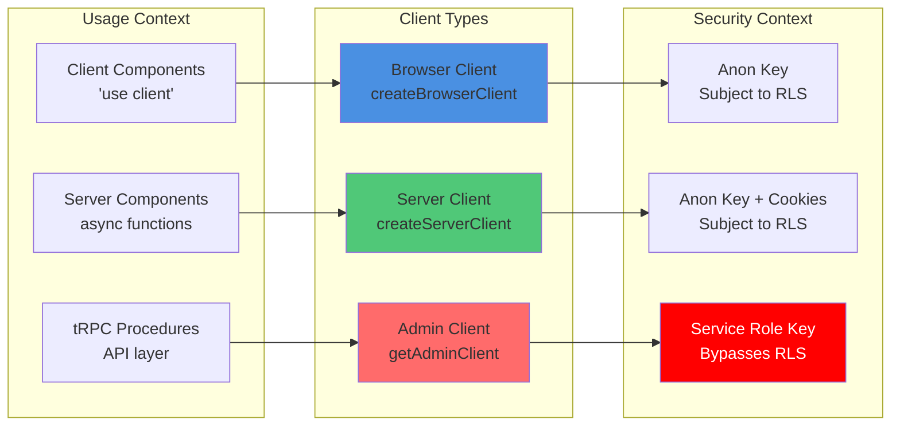
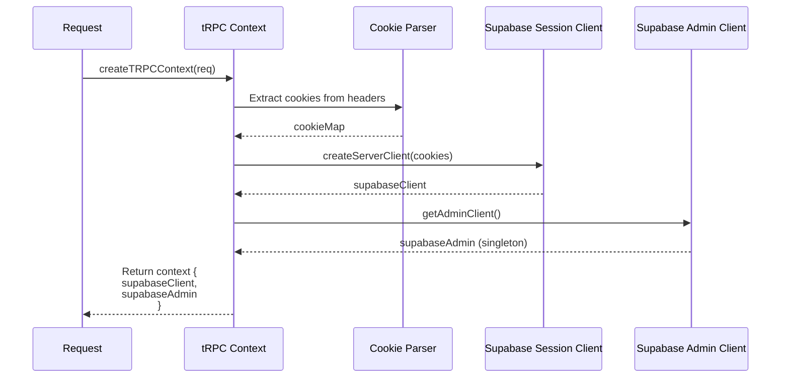
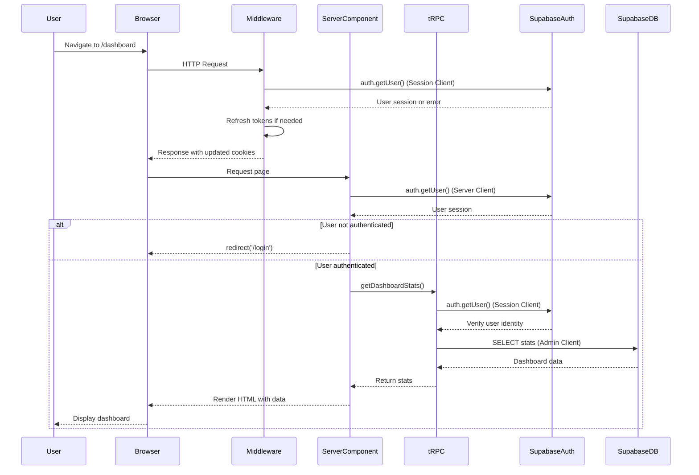
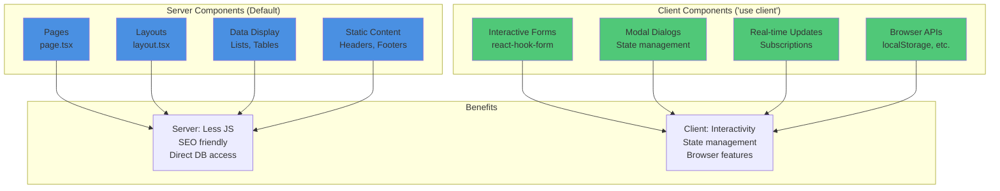
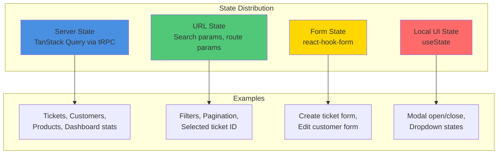

# 4. Component Architecture

[← Previous: Data Models](03-data-models.md) | [Back to Index](../architecture.md) | [Next: API Design →](05-api-design.md)

---

## 4.1 Architecture Overview

The application uses a **three-layer architecture** with clear separation of concerns:

```mermaid
graph TB
    subgraph "FRONTEND LAYER"
        SC[Server Components<br/>Default Pattern]
        CC[Client Components<br/>"use client"]
        UI[shadcn/ui Components<br/>Radix UI Primitives]
        TQ[TanStack Query<br/>Server State Management]
    end

    subgraph "API LAYER"
        TR[tRPC Routers<br/>8 routers, 50+ procedures]
        ZOD[Zod Validation<br/>Input Schemas]
        AUTH[Authentication<br/>User Verification]
        BL[Business Logic<br/>Data Operations]
    end

    subgraph "DATABASE LAYER"
        PG[(PostgreSQL<br/>with RLS)]
        TRIG[Triggers & Functions<br/>Auto-calculations]
        GEN[Generated Columns<br/>Computed Values]
        AUDIT[Audit Trail<br/>created_by/updated_by]
    end

    SC -->|tRPC Query| TR
    CC -->|tRPC Mutation| TR
    UI --> SC
    UI --> CC
    TQ --> TR

    TR --> ZOD
    ZOD --> AUTH
    AUTH --> BL
    BL -->|Supabase Admin| PG

    PG --> TRIG
    PG --> GEN
    PG --> AUDIT

    style SC fill:#4A90E2
    style CC fill:#50C878
    style TR fill:#FFD700
    style PG fill:#FF6B6B
```

---

## 4.2 Three Supabase Client Pattern



### 4.2.1 Browser Client

```typescript
// src/utils/supabase/client.ts
import { createBrowserClient } from '@supabase/ssr'

export function createClient() {
  return createBrowserClient(
    process.env.NEXT_PUBLIC_SUPABASE_URL!,
    process.env.NEXT_PUBLIC_SUPABASE_ANON_KEY!
  )
}
```

**Use Cases:**
- ✅ Client Components (`'use client'`)
- ✅ Browser-side operations
- ✅ Realtime subscriptions
- ✅ Subject to RLS policies

**Security Context:**
- Uses public anon key (safe to expose)
- Reads cookies automatically in browser
- All operations subject to RLS
- NEVER has elevated permissions

### 4.2.2 Server Client

```typescript
// src/utils/supabase/server.ts
import { createServerClient } from '@supabase/ssr'
import { cookies } from 'next/headers'

export async function createClient() {
  const cookieStore = await cookies()

  return createServerClient(
    process.env.NEXT_PUBLIC_SUPABASE_URL!,
    process.env.NEXT_PUBLIC_SUPABASE_ANON_KEY!,
    {
      cookies: {
        getAll() { return cookieStore.getAll() },
        setAll(cookiesToSet) {
          cookiesToSet.forEach(({ name, value, options }) => {
            cookieStore.set(name, value, options)
          })
        },
      },
    }
  )
}
```

**Use Cases:**
- ✅ Server Components
- ✅ Server Actions
- ✅ Cookie-based authentication
- ✅ Subject to RLS policies

**Security Context:**
- Uses anon key with server-side cookie access
- Can read and write cookies for auth
- Subject to RLS policies
- Session-aware operations

### 4.2.3 Admin Client (Service Role)

```typescript
// src/utils/supabase/admin.ts
import { createClient } from '@supabase/supabase-js'

let _supabaseAdmin: ReturnType<typeof createClient> | null = null

export function getAdminClient() {
  if (_supabaseAdmin) return _supabaseAdmin

  _supabaseAdmin = createClient(
    process.env.NEXT_PUBLIC_SUPABASE_URL!,
    process.env.SUPABASE_SERVICE_ROLE_KEY!, // ⚠️ SERVER-ONLY
    {
      auth: {
        autoRefreshToken: false,
        persistSession: false,
      }
    }
  )
  return _supabaseAdmin
}
```

**Use Cases:**
- ✅ tRPC procedures (server-side only)
- ✅ Bypasses RLS policies
- ✅ Admin operations
- ⛔ NEVER exposed to client

**Security Context:**
- Uses service role key (SECRET, server-only)
- Bypasses ALL RLS policies
- No session management
- Singleton pattern for performance

---

## 4.3 tRPC Context Creation



```typescript
// src/server/trpc.ts
import { createServerClient } from '@supabase/ssr'
import { getAdminClient } from '@/utils/supabase/admin'

export function createTRPCContext(opts: { req: Request }) {
  // Parse cookies from request headers
  const cookies = opts.req.headers.get('cookie') || ''
  const cookieMap = new Map<string, string>()

  cookies.split(';').forEach(cookie => {
    const [name, value] = cookie.trim().split('=')
    if (name && value) cookieMap.set(name, value)
  })

  // Create session-aware client (for auth checks)
  const supabaseClient = createServerClient(
    process.env.NEXT_PUBLIC_SUPABASE_URL!,
    process.env.NEXT_PUBLIC_SUPABASE_ANON_KEY!,
    {
      cookies: {
        getAll: () => Array.from(cookieMap.entries())
          .map(([name, value]) => ({ name, value })),
        setAll: () => {}, // Can't set cookies in tRPC context
      },
    }
  )

  // Create admin client (for data operations)
  const supabaseAdmin = getAdminClient()

  return {
    supabaseClient,  // For auth.getUser()
    supabaseAdmin,   // For database queries
  }
}

const t = initTRPC.context<TRPCContext>().create({
  transformer: superjson,
})

export const router = t.router
export const publicProcedure = t.procedure
```

**Why Two Clients?**

| Purpose | Client Used | Reason |
|---------|-------------|--------|
| **Verify user authentication** | `supabaseClient` | Respects session cookies, validates JWT |
| **Query/mutate data** | `supabaseAdmin` | Bypasses RLS for performance, uses explicit authorization |
| **Create audit records** | `supabaseAdmin` | Can set created_by/updated_by after verifying user |

---

## 4.4 Component Flow Diagram



---

## 4.5 Server vs Client Components



### Decision Matrix

| Need | Component Type | Reason |
|------|----------------|--------|
| Fetch data from database | Server Component | Direct access, no client bundle |
| Handle form submission | Client Component | useState, onSubmit handlers |
| Display static content | Server Component | No interactivity needed |
| Use browser APIs | Client Component | window, localStorage, etc. |
| Real-time subscriptions | Client Component | Websocket connections |
| SEO-critical content | Server Component | Rendered server-side |
| Complex state management | Client Component | useState, useReducer, etc. |

---

## 4.6 State Management Strategy



### State Types

#### 1. Server State (Primary) - TanStack Query

```typescript
// Automatic caching, refetching, and synchronization
export function TicketList() {
  const { data: tickets, isLoading, error } = trpc.tickets.getTickets.useQuery()

  if (isLoading) return <TicketsSkeleton />
  if (error) return <ErrorMessage error={error.message} />

  return <TicketTable data={tickets} />
}
```

#### 2. URL State - Next.js Router

```typescript
// Shareable, bookmarkable state
const searchParams = useSearchParams()
const status = searchParams.get('status') || 'all'
const page = Number(searchParams.get('page')) || 1

const router = useRouter()
router.push(`/tickets?status=pending&page=2`)
```

#### 3. Form State - react-hook-form

```typescript
// Complex form validation and management
const form = useForm<CreateTicketInput>({
  resolver: zodResolver(createTicketSchema),
  defaultValues: {
    customer_data: { name: "", phone: "" },
    description: "",
    service_fee: 0,
  },
})
```

#### 4. Local UI State - useState

```typescript
// Temporary, component-scoped state
const [isDialogOpen, setIsDialogOpen] = useState(false)
const [isEditing, setIsEditing] = useState(false)
```

---

## Next Steps

Continue to [API Design →](05-api-design.md) to understand the tRPC API architecture and all available endpoints.

---

[← Previous: Data Models](03-data-models.md) | [Back to Index](../architecture.md) | [Next: API Design →](05-api-design.md)
