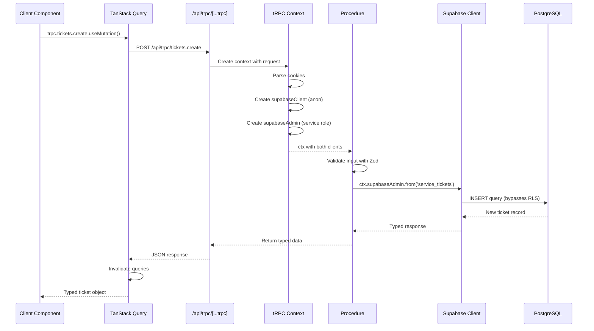
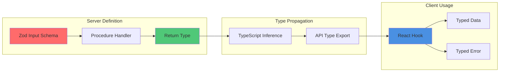
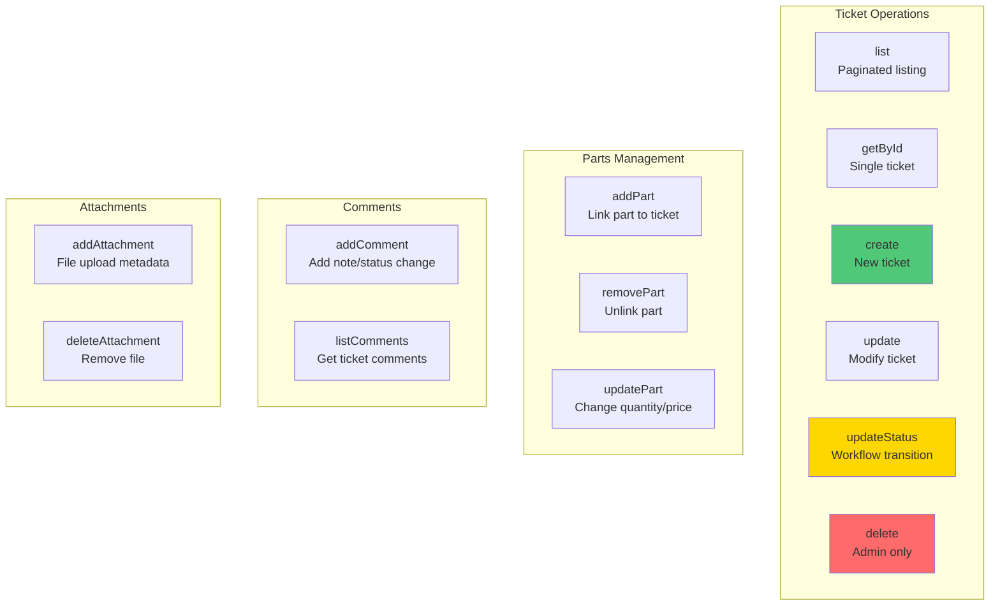
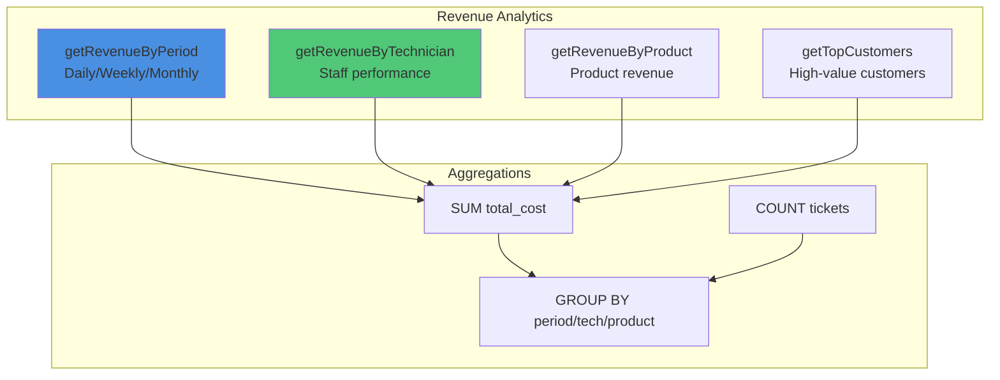
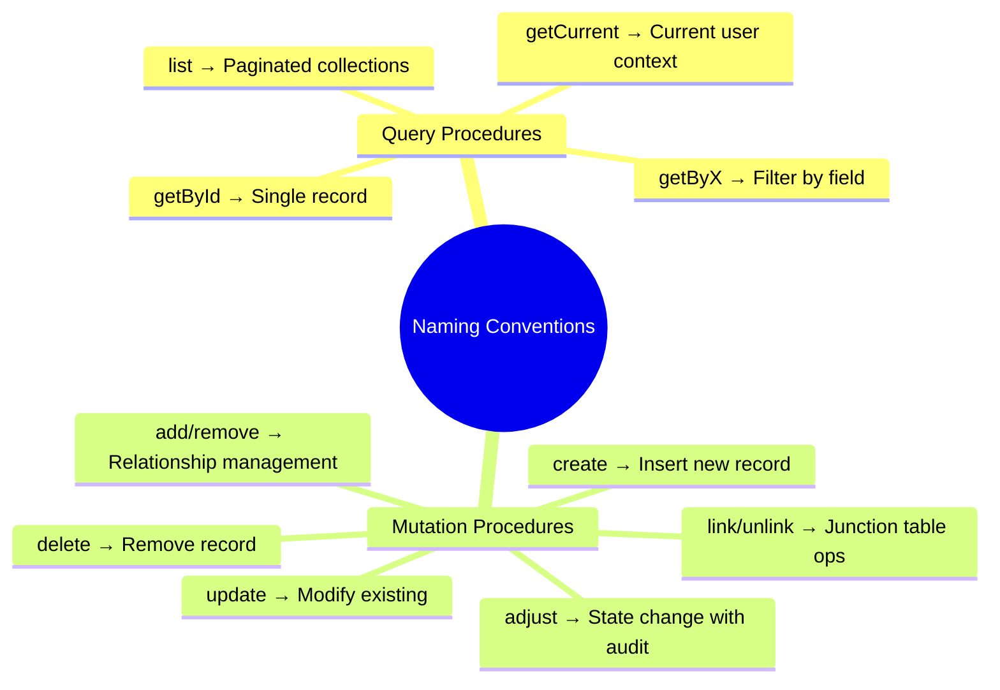
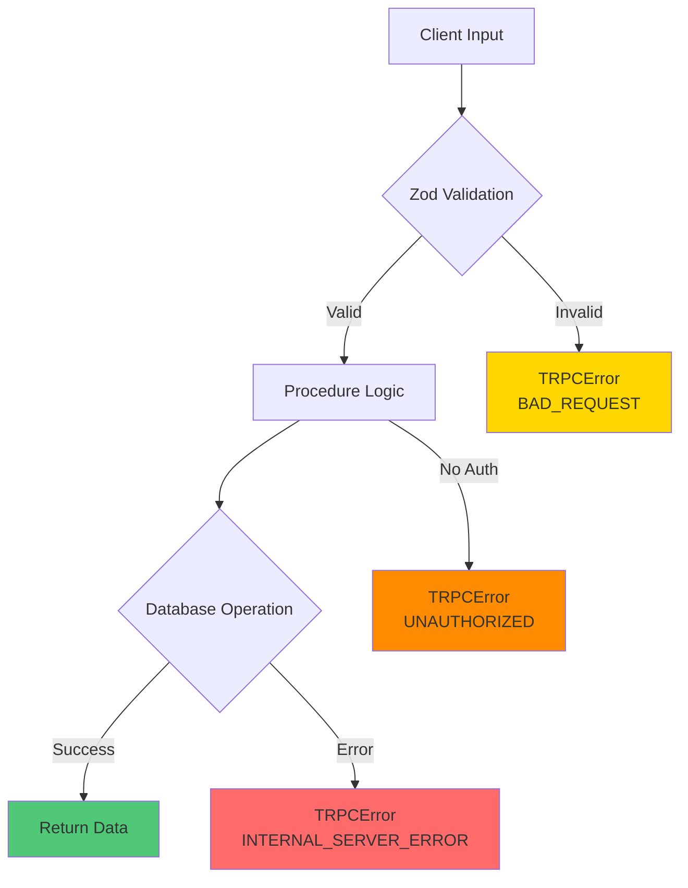

# 5. API Design & tRPC Architecture

[← Previous: Component Architecture](04-component-architecture.md) | [Back to Index](../architecture.md) | [Next: Source Tree →](06-source-tree.md)

---

## 5.1 tRPC Overview

The application uses **tRPC 11.6.0** for end-to-end type-safe API communication between the Next.js frontend and backend.

```mermaid
graph TB
    subgraph "tRPC Architecture"
        Client[Client Component]
        TQ[TanStack Query]
        HTTP[HTTP Request]
        Route[/api/trpc/[...trpc]]
        Router[App Router]
        Proc[Procedure Handler]
        DB[(Supabase)]

        Client -->|useMutation/useQuery| TQ
        TQ -->|POST/GET| HTTP
        HTTP --> Route
        Route --> Router
        Router --> Proc
        Proc -->|SQL| DB
        DB -->|Data| Proc
        Proc -->|Type-safe| Router
        Router -->|JSON| Route
        Route -->|Response| HTTP
        HTTP -->|Inferred Types| TQ
        TQ -->|Typed Data| Client
    end

    style Client fill:#4A90E2
    style Router fill:#50C878
    style DB fill:#FF6B6B
    style TQ fill:#FFD700
```

**Key Benefits:**
- **End-to-end type safety** - TypeScript types inferred from server to client
- **No code generation** - Types propagate automatically
- **Integrated with TanStack Query** - Caching, refetching, optimistic updates
- **Zod validation** - Input validation at API boundary

---

## 5.2 Router Hierarchy

```mermaid
graph TB
    AppRouter[appRouter<br/>Main Router]

    subgraph "Phase 1 Routers"
        Admin[admin<br/>Setup & Config]
        Profile[profile<br/>User Management]
        Tickets[tickets<br/>Service Tickets]
        Customers[customers<br/>Customer CRUD]
        Products[products<br/>Product Catalog]
        Parts[parts<br/>Parts Inventory]
        Brands[brands<br/>Brand Management]
        Revenue[revenue<br/>Analytics]
    end

    subgraph "Phase 2 Routers - ✅ Complete"
        Workflow[workflow<br/>Task Templates & Execution]
        Warehouse[warehouse<br/>Physical/Virtual Warehouses]
        Inventory[inventory<br/>Physical Products & RMA]
        ServiceRequest[serviceRequest<br/>Public Portal & Staff Mgmt]
        Notifications[notifications<br/>Email System]
    end

    AppRouter --> Admin
    AppRouter --> Profile
    AppRouter --> Tickets
    AppRouter --> Customers
    AppRouter --> Products
    AppRouter --> Parts
    AppRouter --> Brands
    AppRouter --> Revenue
    AppRouter --> Workflow
    AppRouter --> Warehouse
    AppRouter --> Inventory
    AppRouter --> ServiceRequest
    AppRouter --> Notifications

    Workflow --> W1[createTemplate<br/>updateTemplate<br/>switchTemplate]
    Workflow --> W2[createTask<br/>updateTask<br/>completeTask]

    ServiceRequest --> SR1[createRequest<br/>trackRequest<br/>convertToTicket]

    style AppRouter fill:#FFD700
    style Tickets fill:#4A90E2
    style Workflow fill:#50C878
    style ServiceRequest fill:#9370DB
```



**Router Locations:**
```
src/server/routers/
├── _app.ts              # Main router combining all sub-routers
├── admin.ts             # Setup and initial configuration
├── profile.ts           # User profile management
├── tickets.ts           # Service ticket operations
├── customers.ts         # Customer CRUD
├── products.ts          # Product catalog
├── parts.ts             # Parts inventory
├── brands.ts            # Brand management
├── revenue.ts           # Revenue analytics
├── workflow.ts          # ✅ Task templates & execution (43KB) - Stories 01.02-01.05, 01.17
├── warehouse.ts         # ✅ Physical/virtual warehouses (4KB) - Story 01.06
├── inventory.ts         # ✅ Physical products & RMA (40KB) - Stories 01.07-01.10
├── serviceRequest.ts    # ✅ Public portal & staff mgmt (28KB) - Stories 01.11-01.13
└── notifications.ts     # ✅ Email notification system (11KB) - Story 01.15
```

**Total Routers:** 13 (8 Phase 1 + 5 Phase 2)

---

## 5.3 Request/Response Flow



**Context Creation:**
```typescript
// src/server/trpc.ts
export const createTRPCContext = async (opts: { headers: Headers }) => {
  const cookieStore = cookies();
  const cookieHeader = cookieStore
    .getAll()
    .map(c => `${c.name}=${c.value}`)
    .join('; ');

  return {
    // Anon client - subject to RLS (rarely used)
    supabaseClient: createServerClient(
      process.env.NEXT_PUBLIC_SUPABASE_URL!,
      process.env.NEXT_PUBLIC_SUPABASE_ANON_KEY!,
      { cookies: { get: () => cookieHeader } }
    ),

    // Service role client - bypasses RLS (primary)
    supabaseAdmin: getAdminClient(),
  };
};
```

---

## 5.4 Type Inference Chain



**Example Type Flow:**

```typescript
// Server: src/server/routers/tickets.ts
export const ticketsRouter = router({
  create: publicProcedure
    .input(z.object({
      customer_id: z.string().uuid(),
      product_id: z.string().uuid(),
      issue_description: z.string().min(1),
      priority_level: z.enum(['low', 'normal', 'high', 'urgent']),
      // ... more fields
    }))
    .mutation(async ({ ctx, input }) => {
      const { data, error } = await ctx.supabaseAdmin
        .from('service_tickets')
        .insert(input)
        .select()
        .single();

      if (error) throw new TRPCError({ code: 'INTERNAL_SERVER_ERROR' });
      return data; // Type: ServiceTicket
    }),
});

// Client: Automatic type inference
const createTicket = trpc.tickets.create.useMutation();

// input is typed as { customer_id: string, product_id: string, ... }
// data is typed as ServiceTicket | undefined
// error is typed as TRPCClientError<AppRouter>
createTicket.mutate({
  customer_id: '...',
  product_id: '...',
  issue_description: 'Screen not working',
  priority_level: 'high', // Autocomplete works!
});
```

---

## 5.5 Available Routers & Procedures

### 5.5.1 Admin Router

**Purpose:** Initial system setup and configuration

```typescript
// src/server/routers/admin.ts
export const adminRouter = router({
  setupInitialAdmin: publicProcedure
    .input(z.object({
      email: z.string().email(),
      password: z.string().min(6),
      full_name: z.string().min(1),
      setup_password: z.string(),
    }))
    .mutation(async ({ ctx, input }) => {
      // Verify setup password
      // Create auth user
      // Create profile with admin role
    }),
});
```

**Procedures:**
- `setupInitialAdmin` - Create first admin user (requires SETUP_PASSWORD)

---

### 5.5.2 Tickets Router (Core)

**Purpose:** Service ticket lifecycle management



**Key Procedures:**

```typescript
// src/server/routers/tickets.ts
export const ticketsRouter = router({
  // Listing & Retrieval
  list: publicProcedure
    .input(z.object({
      limit: z.number().min(1).max(100).default(10),
      offset: z.number().min(0).default(0),
      status: z.enum(['pending', 'in_progress', 'completed', 'cancelled']).optional(),
      assigned_to: z.string().uuid().optional(),
    }))
    .query(async ({ ctx, input }) => { /* ... */ }),

  getById: publicProcedure
    .input(z.string().uuid())
    .query(async ({ ctx, input }) => { /* ... */ }),

  // Lifecycle
  create: publicProcedure.input(/* ... */).mutation(/* ... */),
  update: publicProcedure.input(/* ... */).mutation(/* ... */),
  updateStatus: publicProcedure
    .input(z.object({
      id: z.string().uuid(),
      status: z.enum(['pending', 'in_progress', 'completed', 'cancelled']),
    }))
    .mutation(/* ... */),
  delete: publicProcedure.input(z.string().uuid()).mutation(/* ... */),

  // Parts
  addPart: publicProcedure.input(/* ... */).mutation(/* ... */),
  removePart: publicProcedure.input(/* ... */).mutation(/* ... */),

  // Comments
  addComment: publicProcedure.input(/* ... */).mutation(/* ... */),
});
```

**Total:** ~15 procedures

---

### 5.5.3 Customers Router

**Purpose:** Customer record management

**Procedures:**
- `list` - Paginated customer listing with search
- `getById` - Single customer details
- `create` - New customer registration
- `update` - Modify customer info
- `delete` - Remove customer (admin only)

**Total:** 5 procedures

---

### 5.5.4 Products Router

**Purpose:** Product catalog management

**Procedures:**
- `list` - Paginated products with brand filter
- `getById` - Product details with compatible parts
- `create` - New product entry
- `update` - Modify product
- `delete` - Remove product
- `linkPart` - Add compatible part
- `unlinkPart` - Remove compatible part

**Total:** 7 procedures

---

### 5.5.5 Parts Router

**Purpose:** Parts inventory management

**Procedures:**
- `list` - Paginated parts with low stock filter
- `getById` - Part details with stock history
- `create` - New part entry
- `update` - Modify part (price, stock)
- `delete` - Remove part
- `adjustStock` - Stock level adjustment with audit trail

**Total:** 6 procedures

---

### 5.5.6 Brands Router

**Purpose:** Brand/manufacturer management

**Procedures:**
- `list` - All brands
- `getById` - Brand with product count
- `create` - New brand
- `update` - Modify brand
- `delete` - Remove brand (if no products)

**Total:** 5 procedures

---

### 5.5.7 Profile Router

**Purpose:** User profile and role management

**Procedures:**
- `getCurrent` - Current logged-in user profile
- `list` - All staff members (admin only)
- `getById` - Single profile
- `update` - Modify profile
- `updateRole` - Change user role (admin only)
- `deactivate` - Disable user account (admin only)

**Total:** 6 procedures

---

### 5.5.8 Revenue Router

**Purpose:** Business analytics and reporting



**Procedures:**
- `getRevenueByPeriod` - Revenue grouped by date range
- `getRevenueByTechnician` - Staff performance metrics
- `getRevenueByProduct` - Product profitability
- `getTopCustomers` - Customer lifetime value

**Total:** 4 procedures

---

## 5.6 Procedure Naming Patterns



**Query Conventions:**
- `list` - Returns paginated array, accepts filters
- `getById` - Returns single record or null
- `getByX` - Returns records filtered by specific field
- `getCurrent` - Returns data for authenticated user

**Mutation Conventions:**
- `create` - INSERT operation, returns created record
- `update` - UPDATE operation, returns updated record
- `delete` - DELETE operation, returns success boolean
- `add*/remove*` - Manages relationships (comments, parts, attachments)
- `adjust*` - State changes with audit trail (stock, status)
- `link/unlink` - Junction table operations (product_parts)

---

## 5.7 Input Validation Strategy

All procedures use **Zod schemas** for runtime validation:

```typescript
// Common validation patterns
const uuidSchema = z.string().uuid();
const paginationSchema = z.object({
  limit: z.number().min(1).max(100).default(10),
  offset: z.number().min(0).default(0),
});

// ENUM validation matches database
const ticketStatusSchema = z.enum([
  'pending',
  'in_progress',
  'completed',
  'cancelled',
]);

// Nested validation for complex inputs
const createTicketSchema = z.object({
  customer_id: uuidSchema,
  product_id: uuidSchema,
  issue_description: z.string().min(1).max(5000),
  priority_level: z.enum(['low', 'normal', 'high', 'urgent']),
  warranty_type: z.enum(['manufacturer', 'store', 'extended', 'none']).optional(),
  service_fee: z.number().min(0).optional(),
  diagnosis_fee: z.number().min(0).optional(),
});
```

**Validation Benefits:**
- Runtime type checking at API boundary
- Clear error messages for invalid inputs
- Type inference for client-side usage
- Prevention of SQL injection (inputs are typed)

---

## 5.8 Error Handling



**Error Types:**

```typescript
import { TRPCError } from '@trpc/server';

// Validation error (Zod catches automatically)
throw new TRPCError({
  code: 'BAD_REQUEST',
  message: 'Invalid input data',
});

// Authentication error
throw new TRPCError({
  code: 'UNAUTHORIZED',
  message: 'Must be logged in',
});

// Permission error
throw new TRPCError({
  code: 'FORBIDDEN',
  message: 'Insufficient permissions',
});

// Database error
throw new TRPCError({
  code: 'INTERNAL_SERVER_ERROR',
  message: 'Database operation failed',
});

// Not found
throw new TRPCError({
  code: 'NOT_FOUND',
  message: 'Ticket not found',
});
```

---

## 5.9 Client Usage Patterns

### Query Hook Pattern

```typescript
'use client';

import { trpc } from '@/utils/trpc';

export function TicketList() {
  const { data, isLoading, error } = trpc.tickets.list.useQuery({
    limit: 10,
    offset: 0,
    status: 'pending',
  });

  if (isLoading) return <div>Loading...</div>;
  if (error) return <div>Error: {error.message}</div>;

  return (
    <ul>
      {data?.tickets.map(ticket => (
        <li key={ticket.id}>{ticket.ticket_number}</li>
      ))}
    </ul>
  );
}
```

### Mutation Hook Pattern

```typescript
'use client';

import { trpc } from '@/utils/trpc';

export function CreateTicketForm() {
  const utils = trpc.useUtils();
  const createTicket = trpc.tickets.create.useMutation({
    onSuccess: () => {
      // Invalidate and refetch tickets list
      utils.tickets.list.invalidate();
    },
  });

  const handleSubmit = (formData: FormData) => {
    createTicket.mutate({
      customer_id: formData.get('customer_id') as string,
      product_id: formData.get('product_id') as string,
      issue_description: formData.get('issue') as string,
      priority_level: 'normal',
    });
  };

  return (
    <form onSubmit={handleSubmit}>
      {/* form fields */}
      <button type="submit" disabled={createTicket.isPending}>
        {createTicket.isPending ? 'Creating...' : 'Create Ticket'}
      </button>
    </form>
  );
}
```

---

## 5.10 Performance Considerations

**Query Caching:**
```typescript
// TanStack Query automatically caches queries
const { data } = trpc.tickets.getById.useQuery('ticket-id', {
  staleTime: 5 * 60 * 1000, // 5 minutes
  cacheTime: 10 * 60 * 1000, // 10 minutes
});
```

**Prefetching:**
```typescript
// Server Component prefetching
async function TicketPage({ params }: { params: { id: string } }) {
  const helpers = createServerSideHelpers({
    router: appRouter,
    ctx: await createTRPCContext({ headers: new Headers() }),
  });

  await helpers.tickets.getById.prefetch(params.id);

  return (
    <HydrateClient>
      <TicketDetails id={params.id} />
    </HydrateClient>
  );
}
```

**Optimistic Updates:**
```typescript
const updateStatus = trpc.tickets.updateStatus.useMutation({
  onMutate: async (newStatus) => {
    // Cancel outgoing refetches
    await utils.tickets.getById.cancel();

    // Snapshot previous value
    const previous = utils.tickets.getById.getData(ticketId);

    // Optimistically update
    utils.tickets.getById.setData(ticketId, (old) => ({
      ...old!,
      status: newStatus.status,
    }));

    return { previous };
  },
  onError: (err, newStatus, context) => {
    // Rollback on error
    utils.tickets.getById.setData(ticketId, context?.previous);
  },
});
```

---

## 5.11 API Summary

**Phase 1 Routers (Original):**

| Router | Procedures | Primary Use Case |
|--------|-----------|------------------|
| **admin** | 1 | Initial setup |
| **profile** | 6 | User management |
| **tickets** | 15+ | Core workflow |
| **customers** | 5 | Customer CRUD |
| **products** | 7 | Catalog management |
| **parts** | 6 | Inventory tracking |
| **brands** | 5 | Brand management |
| **revenue** | 4 | Analytics & reporting |
| **Subtotal** | **~50** | Phase 1 coverage |

**Phase 2 Routers (✅ Complete - Oct 2025):**

| Router | Procedures | Primary Use Case | Stories |
|--------|-----------|------------------|---------|
| **workflow** | 12+ | Task templates & execution | 01.02-01.05, 01.17 |
| **warehouse** | 8+ | Warehouse hierarchy | 01.06 |
| **inventory** | 15+ | Physical products & RMA | 01.07-01.10 |
| **serviceRequest** | 8+ | Public portal & staff mgmt | 01.11-01.13 |
| **notifications** | 6+ | Email notification system | 01.15 |
| **Subtotal** | **~45** | Phase 2 coverage |

**Total API Surface:**

| Metric | Count |
|--------|-------|
| **Total Routers** | 13 (8 + 5) |
| **Total Procedures** | **~95** |
| **Protected Endpoints** | 50+ (RBAC middleware) |
| **Public Endpoints** | 3 (service request portal) |

---

## Next Steps

Continue to [Source Tree →](06-source-tree.md) to understand the project's file organization and module structure.

---

[← Previous: Component Architecture](04-component-architecture.md) | [Back to Index](../architecture.md) | [Next: Source Tree →](06-source-tree.md)
