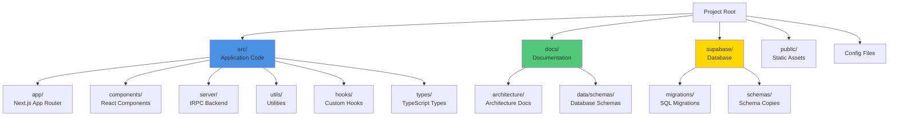
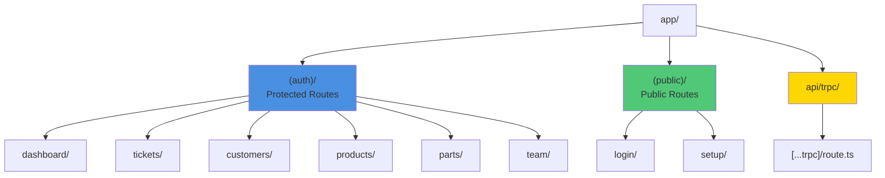
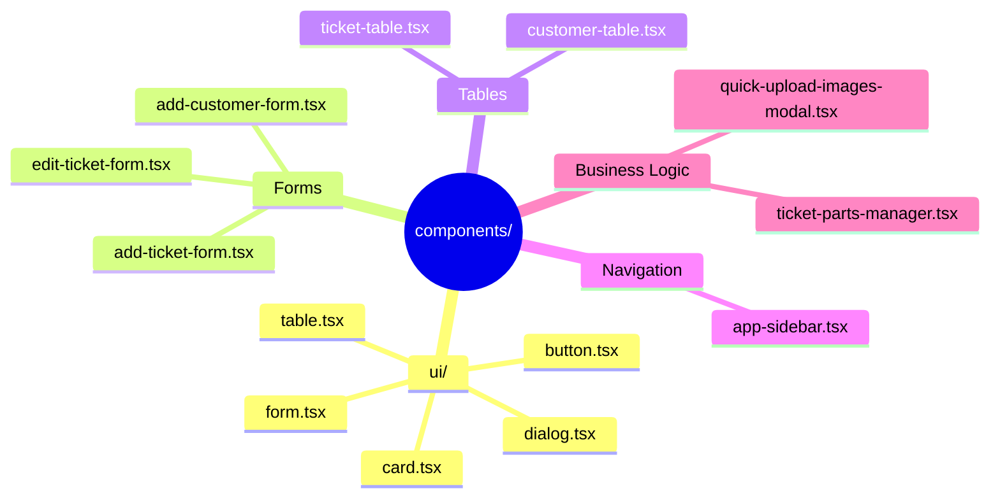
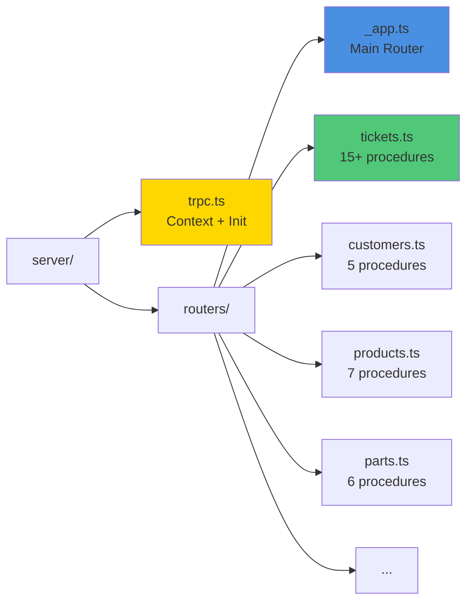
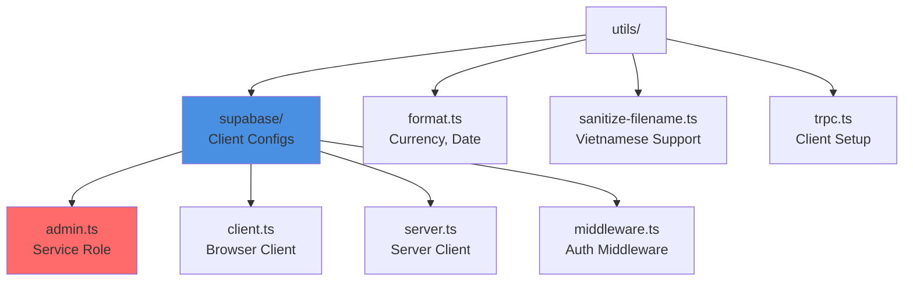
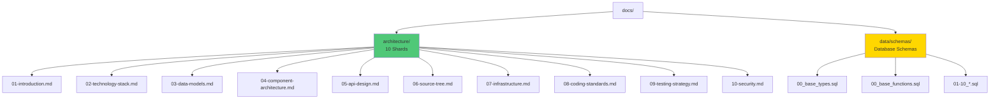
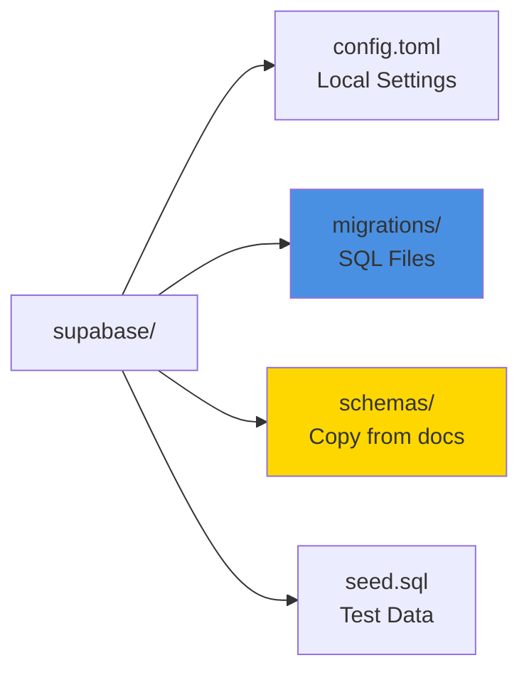
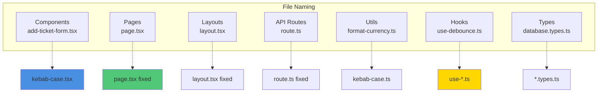
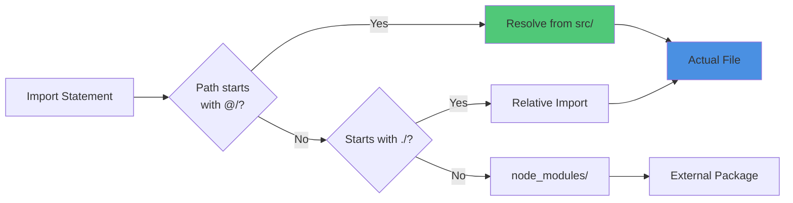
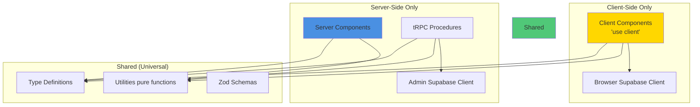

# 6. Source Tree & File Organization

[← Previous: API Design](05-api-design.md) | [Back to Index](../architecture.md) | [Next: Infrastructure →](07-infrastructure.md)

---

## 6.1 Project Structure Overview



---

## 6.2 Complete Directory Tree

```
sevice-center/
├── .bmad-core/              # Multi-tenant instance data
├── .next/                   # Next.js build output (gitignored)
├── docs/                    # 📚 Documentation
│   ├── architecture.md      # Main architecture index
│   ├── architecture/        # Sharded architecture docs
│   │   ├── 01-introduction.md
│   │   ├── 02-technology-stack.md
│   │   ├── 03-data-models.md
│   │   ├── 04-component-architecture.md
│   │   ├── 05-api-design.md
│   │   ├── 06-source-tree.md (this file)
│   │   ├── 07-infrastructure.md
│   │   ├── 08-coding-standards.md
│   │   ├── 09-testing-strategy.md
│   │   ├── 10-security.md
│   │   ├── README.md
│   │   └── STATUS.md
│   └── data/
│       └── schemas/         # ⭐ Database schema source of truth
│           ├── 00_base_types.sql
│           ├── 00_base_functions.sql
│           ├── 01_profiles.sql
│           ├── 02_customers.sql
│           ├── 03_brands.sql
│           ├── 04_products.sql
│           ├── 05_parts.sql
│           ├── 06_product_parts.sql
│           ├── 07_service_tickets.sql
│           ├── 08_service_ticket_parts.sql
│           ├── 09_service_ticket_comments.sql
│           ├── 10_service_ticket_attachments.sql
│           ├── storage_policies.sql
│           └── setup_schema.sh
├── public/                  # Static assets
│   ├── favicon.ico
│   └── images/
├── scripts/                 # Automation scripts
│   └── setup-instance.sh    # Multi-tenant instance setup
├── src/                     # 🎯 Application source code
│   ├── app/                 # Next.js App Router
│   │   ├── (auth)/          # Protected routes
│   │   │   ├── dashboard/
│   │   │   │   └── page.tsx
│   │   │   ├── tickets/
│   │   │   │   ├── page.tsx
│   │   │   │   ├── [id]/
│   │   │   │   │   └── page.tsx
│   │   │   │   └── new/
│   │   │   │       └── page.tsx
│   │   │   ├── customers/
│   │   │   │   ├── page.tsx
│   │   │   │   └── [id]/
│   │   │   │       └── page.tsx
│   │   │   ├── products/
│   │   │   │   └── page.tsx
│   │   │   ├── parts/
│   │   │   │   └── page.tsx
│   │   │   ├── team/
│   │   │   │   └── page.tsx
│   │   │   └── layout.tsx   # Auth layout with sidebar
│   │   ├── (public)/        # Public routes
│   │   │   ├── login/
│   │   │   │   └── page.tsx
│   │   │   └── setup/
│   │   │       └── page.tsx
│   │   ├── api/
│   │   │   └── trpc/
│   │   │       └── [...trpc]/
│   │   │           └── route.ts  # tRPC HTTP handler
│   │   ├── favicon.ico
│   │   ├── globals.css      # Tailwind imports
│   │   └── layout.tsx       # Root layout
│   ├── components/          # React components (flat structure)
│   │   ├── ui/              # shadcn/ui base components
│   │   │   ├── button.tsx
│   │   │   ├── card.tsx
│   │   │   ├── dialog.tsx
│   │   │   ├── form.tsx
│   │   │   ├── input.tsx
│   │   │   ├── select.tsx
│   │   │   ├── table.tsx
│   │   │   └── ...
│   │   ├── add-customer-form.tsx
│   │   ├── add-ticket-form.tsx
│   │   ├── app-sidebar.tsx
│   │   ├── customer-select.tsx
│   │   ├── customer-table.tsx
│   │   ├── edit-customer-form.tsx
│   │   ├── edit-ticket-form.tsx
│   │   ├── product-select.tsx
│   │   ├── quick-upload-images-modal.tsx
│   │   ├── ticket-parts-manager.tsx
│   │   ├── ticket-status-badge.tsx
│   │   └── ticket-table.tsx
│   ├── hooks/               # Custom React hooks
│   │   ├── use-debounce.ts
│   │   └── use-media-query.ts
│   ├── lib/                 # Third-party library configs
│   │   └── utils.ts         # cn() for Tailwind merging
│   ├── server/              # tRPC backend
│   │   ├── routers/
│   │   │   ├── _app.ts      # Main router
│   │   │   ├── admin.ts     # Setup & config
│   │   │   ├── brands.ts    # Brand management
│   │   │   ├── customers.ts # Customer CRUD
│   │   │   ├── parts.ts     # Parts inventory
│   │   │   ├── products.ts  # Product catalog
│   │   │   ├── profile.ts   # User profiles
│   │   │   ├── revenue.ts   # Analytics
│   │   │   └── tickets.ts   # Service tickets (largest)
│   │   └── trpc.ts          # tRPC initialization
│   ├── types/               # TypeScript type definitions
│   │   └── database.types.ts  # Supabase generated types
│   └── utils/               # Utility functions
│       ├── supabase/
│       │   ├── admin.ts     # Service role client
│       │   ├── client.ts    # Browser client
│       │   ├── server.ts    # Server client
│       │   └── middleware.ts  # Auth middleware
│       ├── format.ts        # Formatting utilities
│       ├── sanitize-filename.ts  # Vietnamese char handling
│       └── trpc.ts          # tRPC client setup
├── supabase/                # Supabase configuration
│   ├── config.toml          # Supabase local config
│   ├── migrations/          # Generated SQL migrations
│   │   ├── 20250115000000_initial_schema.sql
│   │   └── ...
│   ├── schemas/             # Copy of docs/data/schemas/
│   └── seed.sql             # Seed data for development
├── .env                     # Environment variables (gitignored)
├── .gitignore
├── biome.json               # Biome linter/formatter config
├── components.json          # shadcn/ui config
├── next.config.ts           # Next.js configuration
├── package.json
├── pnpm-lock.yaml
├── postcss.config.mjs       # PostCSS for Tailwind
├── tailwind.config.ts       # Tailwind CSS config
└── tsconfig.json            # TypeScript config
```

---

## 6.3 Key Directories Explained

### 6.3.1 `src/app/` - Next.js App Router



**Route Groups:**
- `(auth)/` - Requires authentication, shares sidebar layout
- `(public)/` - No authentication, minimal layout
- `api/` - API routes (tRPC endpoint)

**File Conventions:**
- `page.tsx` - Page component (becomes route)
- `layout.tsx` - Shared layout for nested routes
- `loading.tsx` - Loading UI (Suspense fallback)
- `error.tsx` - Error boundary
- `not-found.tsx` - 404 page

---

### 6.3.2 `src/components/` - React Components



**Structure:**
- **Flat** - All components in one directory (except `ui/`)
- **ui/** - shadcn/ui base components (copy-pasted, customizable)
- **Business Components** - Domain-specific (tickets, customers)

**Naming:**
- Files: `kebab-case.tsx`
- Exports: `PascalCase`

---

### 6.3.3 `src/server/` - tRPC Backend



**Key Files:**
- `trpc.ts` - tRPC initialization, context creation (Supabase clients)
- `routers/_app.ts` - Combines all sub-routers
- `routers/*.ts` - Individual routers (one per domain)

---

### 6.3.4 `src/utils/` - Utilities



**Supabase Clients:**
- `admin.ts` - Service role (bypasses RLS), used in tRPC
- `client.ts` - Browser client (subject to RLS), for Client Components
- `server.ts` - Server client (with cookies), for Server Components
- `middleware.ts` - Auth middleware for route protection

---

### 6.3.5 `docs/` - Documentation



---

### 6.3.6 `supabase/` - Database Configuration



**Migration Workflow:**
1. Edit schemas in `docs/data/schemas/`
2. Copy to `supabase/schemas/` via `setup_schema.sh`
3. Generate migration: `supabase db diff -f name`
4. Apply: `supabase db reset`

---

## 6.4 File Naming Conventions



**Conventions:**

| File Type | Pattern | Example |
|-----------|---------|---------|
| **Components** | `kebab-case.tsx` | `add-ticket-form.tsx` |
| **Pages** | `page.tsx` | `app/tickets/page.tsx` |
| **Layouts** | `layout.tsx` | `app/(auth)/layout.tsx` |
| **API Routes** | `route.ts` | `app/api/trpc/[...trpc]/route.ts` |
| **Utilities** | `kebab-case.ts` | `format-currency.ts` |
| **Hooks** | `use-*.ts` | `use-debounce.ts` |
| **Types** | `*.types.ts` | `database.types.ts` |

---

## 6.5 Import Path Aliases

**Configured in `tsconfig.json`:**

```json
{
  "compilerOptions": {
    "paths": {
      "@/*": ["./src/*"]
    }
  }
}
```

**Usage Examples:**

```typescript
// ✅ CORRECT - Use alias
import { trpc } from '@/utils/trpc';
import { Button } from '@/components/ui/button';
import { createClient } from '@/utils/supabase/server';

// ❌ INCORRECT - Relative paths
import { trpc } from '../../../utils/trpc';
import { Button } from '../../components/ui/button';
```

**Benefits:**
- No `../../../` hell
- Easier refactoring
- Clear distinction (external vs internal)

---

## 6.6 Import Resolution Flow



**Examples:**

```typescript
// @/* → src/*
import { trpc } from '@/utils/trpc';
// Resolves to: src/utils/trpc.ts

// Relative import
import { helper } from './helper';
// Resolves to: same directory

// External package
import { z } from 'zod';
// Resolves to: node_modules/zod
```

---

## 6.7 Module Boundaries



**Rules:**
- **Client Components** - Can't access server-only modules (Supabase admin, file system)
- **Server Components** - Can't use hooks, browser APIs
- **tRPC Procedures** - Server-only, use `ctx.supabaseAdmin`
- **Utilities** - Should be pure functions (work on both client/server)

---

## 6.8 Key Files Reference

| File | Purpose | Critical? |
|------|---------|-----------|
| `src/server/trpc.ts` | tRPC initialization, context creation | ⭐⭐⭐ |
| `src/server/routers/_app.ts` | Main router combining all sub-routers | ⭐⭐⭐ |
| `src/utils/supabase/admin.ts` | Service role Supabase client | ⭐⭐⭐ |
| `src/app/api/trpc/[...trpc]/route.ts` | tRPC HTTP handler | ⭐⭐⭐ |
| `docs/data/schemas/*.sql` | Database schema source of truth | ⭐⭐⭐ |
| `src/app/(auth)/layout.tsx` | Main app layout with sidebar | ⭐⭐ |
| `src/components/ui/*` | shadcn/ui base components | ⭐⭐ |
| `tailwind.config.ts` | Tailwind customization | ⭐⭐ |
| `next.config.ts` | Next.js configuration | ⭐⭐ |
| `biome.json` | Linter/formatter config | ⭐ |

---

## 6.9 Generated Files (Gitignored)

```bash
# Build artifacts
.next/                    # Next.js build output
dist/                     # Distribution build

# Dependencies
node_modules/             # npm packages
.pnpm-store/              # pnpm cache

# Environment
.env                      # Local environment variables

# Database
supabase/.temp/           # Supabase CLI temp files
supabase/functions/       # Edge functions (not used)

# IDE
.vscode/                  # VS Code settings (optional)
.idea/                    # IntelliJ settings

# Testing
coverage/                 # Test coverage reports
```

---

## 6.10 File Size Guidelines

**Recommended Limits:**

| File Type | Max Lines | Action if Exceeded |
|-----------|-----------|-------------------|
| **Component** | 300 | Split into smaller components |
| **tRPC Router** | 500 | Split into multiple routers |
| **Utility** | 200 | Split into multiple files |
| **Page** | 200 | Extract components |

**Example Split:**

```typescript
// ❌ BAD - One large tickets.ts router (800 lines)
export const ticketsRouter = router({
  list: /* ... */,
  create: /* ... */,
  update: /* ... */,
  // 15+ procedures
});

// ✅ GOOD - Split into multiple routers
// tickets/list.ts
export const ticketsListRouter = router({ /* ... */ });

// tickets/mutations.ts
export const ticketsMutationsRouter = router({ /* ... */ });

// tickets/_app.ts
export const ticketsRouter = router({
  ...ticketsListRouter,
  ...ticketsMutationsRouter,
});
```

---

## 6.11 Code Organization Best Practices

**DO:**
- ✅ Keep related files together (colocation)
- ✅ Use barrel exports (`index.ts`) for clean imports
- ✅ Extract reusable logic into hooks or utils
- ✅ Keep components focused (single responsibility)
- ✅ Use TypeScript path aliases (`@/*`)

**DON'T:**
- ❌ Create deeply nested directories (max 3 levels)
- ❌ Mix client and server code in same file
- ❌ Use relative imports for distant files
- ❌ Create giant "god" components
- ❌ Duplicate code across components

---

## 6.12 Finding Files Quickly

**By Pattern:**
```bash
# Find all tRPC routers
find src/server/routers -name "*.ts"

# Find all forms
find src/components -name "*-form.tsx"

# Find all pages
find src/app -name "page.tsx"
```

**By Content:**
```bash
# Find files using a specific component
grep -r "AddTicketForm" src/

# Find all tRPC procedure definitions
grep -r "publicProcedure" src/server/routers/
```

---

## Next Steps

Continue to [Infrastructure →](07-infrastructure.md) to understand the multi-tenant deployment architecture and Docker Compose setup.

---

[← Previous: API Design](05-api-design.md) | [Back to Index](../architecture.md) | [Next: Infrastructure →](07-infrastructure.md)
