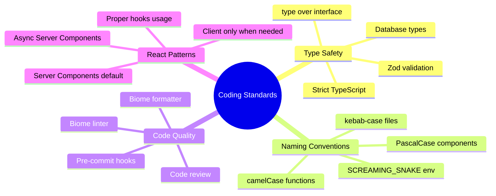
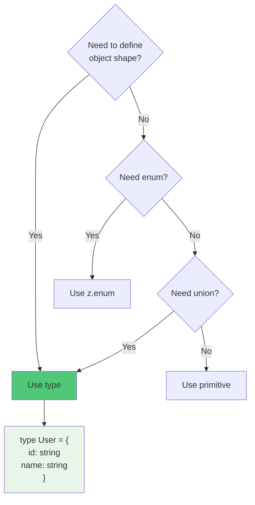
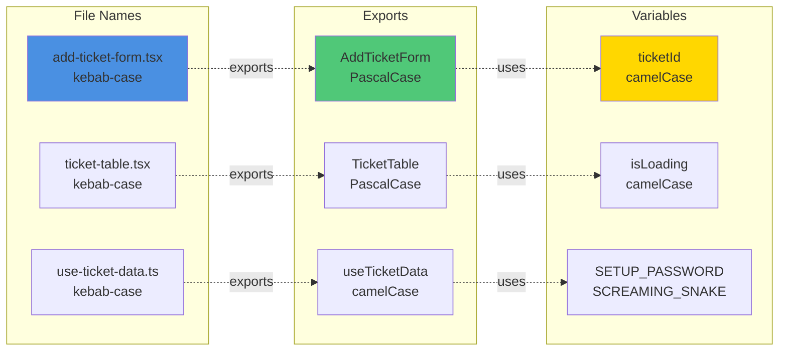
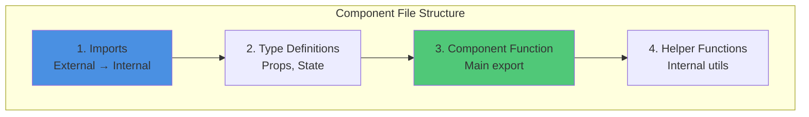
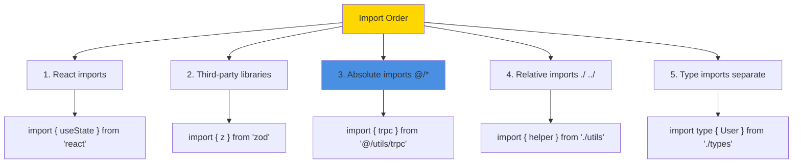
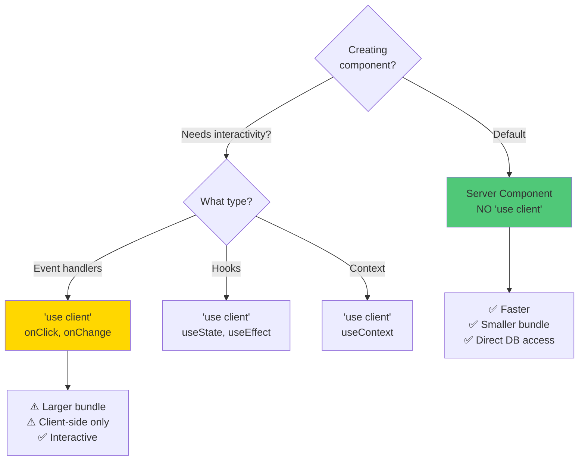
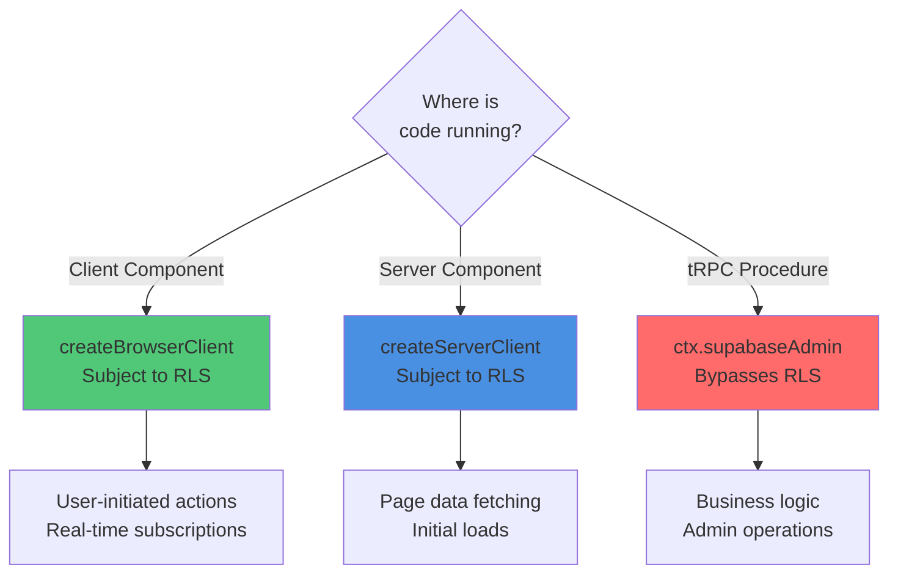
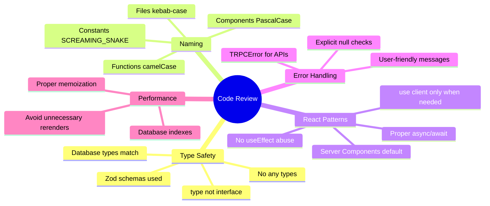

# 8. Coding Standards & Best Practices

[← Previous: Infrastructure](07-infrastructure.md) | [Back to Index](../architecture.md) | [Next: Testing Strategy →](09-testing-strategy.md)

---

## 8.1 Overview

This project enforces **strict coding standards** using automated tools and code review practices to ensure consistency, maintainability, and type safety.



---

## 8.2 Type vs Interface Enforcement

**CRITICAL RULE:** Use `type` instead of `interface` for all type definitions.



**✅ CORRECT:**
```typescript
// Use type for object shapes
type ServiceTicket = {
  id: string;
  ticket_number: string;
  customer_id: string;
  status: TicketStatus;
};

// Use type for unions
type TicketStatus = 'pending' | 'in_progress' | 'completed' | 'cancelled';

// Use type for intersections
type TimestampedTicket = ServiceTicket & {
  created_at: string;
  updated_at: string;
};

// Use type for function signatures
type CreateTicketFn = (input: CreateTicketInput) => Promise<ServiceTicket>;
```

**❌ INCORRECT:**
```typescript
// DON'T use interface
interface ServiceTicket {  // ❌ WRONG
  id: string;
}

// DON'T use enum
enum TicketStatus {  // ❌ WRONG
  Pending = 'pending',
  InProgress = 'in_progress',
}
```

**Why `type` over `interface`?**
1. **Consistency** - One way to define types reduces cognitive load
2. **More flexible** - Supports unions, intersections, primitives
3. **No implicit merging** - Interfaces can be accidentally merged across files
4. **Better with Zod** - Zod infers `type`, not `interface`

---

## 8.3 Naming Conventions



### 8.3.1 Component Files

**Pattern:** `kebab-case.tsx`

```bash
✅ CORRECT:
src/components/add-ticket-form.tsx
src/components/ticket-table.tsx
src/components/customer-select.tsx

❌ INCORRECT:
src/components/AddTicketForm.tsx      # PascalCase file
src/components/ticket_table.tsx       # snake_case
src/components/TicketTable.tsx        # PascalCase file
```

### 8.3.2 Component Names

**Pattern:** `PascalCase`

```typescript
// ✅ CORRECT
export function AddTicketForm() { /* ... */ }
export const TicketTable = () => { /* ... */ };

// ❌ INCORRECT
export function addTicketForm() { /* ... */ }  // camelCase
export const ticket_table = () => { /* ... */ };  // snake_case
```

### 8.3.3 Hook Files & Names

**Files:** `use-*.ts` (kebab-case)
**Names:** `use*` (camelCase)

```typescript
// src/hooks/use-ticket-data.ts
export function useTicketData(id: string) {
  return trpc.tickets.getById.useQuery(id);
}

// ✅ File: use-ticket-data.ts (kebab-case)
// ✅ Export: useTicketData (camelCase with 'use' prefix)
```

### 8.3.4 Utility Functions

**Files:** `kebab-case.ts`
**Names:** `camelCase`

```typescript
// src/utils/format-currency.ts
export function formatCurrency(amount: number): string {
  return new Intl.NumberFormat('vi-VN', {
    style: 'currency',
    currency: 'VND',
  }).format(amount);
}
```

### 8.3.5 Constants

**Pattern:** `SCREAMING_SNAKE_CASE`

```typescript
// ✅ CORRECT
const MAX_FILE_SIZE = 5 * 1024 * 1024; // 5MB
const DEFAULT_PAGE_SIZE = 10;
const TICKET_NUMBER_PREFIX = 'SV';

// ❌ INCORRECT
const maxFileSize = 5242880;  // camelCase
const DefaultPageSize = 10;   // PascalCase
```

### 8.3.6 Environment Variables

**Pattern:** `SCREAMING_SNAKE_CASE`

```bash
# .env
NEXT_PUBLIC_SUPABASE_URL=http://127.0.0.1:54321
SUPABASE_SERVICE_ROLE_KEY=eyJhbGciOiJIUzI1NiIsInR5cCI6IkpXVCJ9...
SETUP_PASSWORD=secure_password_here
ADMIN_EMAIL=admin@example.com
```

### 8.3.7 Database Identifiers

**Tables & Columns:** `snake_case`
**ENUMs:** `snake_case`

```sql
-- ✅ CORRECT
create table service_tickets (
  id uuid primary key,
  ticket_number text not null,
  created_at timestamptz default now()
);

create type ticket_status as enum (
  'pending', 'in_progress', 'completed', 'cancelled'
);

-- ❌ INCORRECT
create table ServiceTickets (  -- PascalCase
  ID uuid,                     -- Uppercase
  ticketNumber text            -- camelCase
);
```

---

## 8.4 File Organization



**Standard Component File:**

```typescript
// 1. IMPORTS - External first, then internal
'use client';

import { useState } from 'react';
import { useForm } from 'react-hook-form';
import { zodResolver } from '@hookform/resolvers/zod';
import { z } from 'zod';

import { trpc } from '@/utils/trpc';
import { Button } from '@/components/ui/button';
import { Input } from '@/components/ui/input';

// 2. TYPE DEFINITIONS
const formSchema = z.object({
  customer_id: z.string().uuid(),
  issue_description: z.string().min(1),
});

type FormData = z.infer<typeof formSchema>;

type AddTicketFormProps = {
  onSuccess?: (ticketId: string) => void;
};

// 3. MAIN COMPONENT
export function AddTicketForm({ onSuccess }: AddTicketFormProps) {
  const form = useForm<FormData>({
    resolver: zodResolver(formSchema),
  });

  const createTicket = trpc.tickets.create.useMutation({
    onSuccess: (data) => onSuccess?.(data.id),
  });

  const handleSubmit = (data: FormData) => {
    createTicket.mutate(data);
  };

  return (
    <form onSubmit={form.handleSubmit(handleSubmit)}>
      {/* JSX */}
    </form>
  );
}

// 4. HELPER FUNCTIONS (if needed)
function validateTicketNumber(num: string): boolean {
  return /^SV-\d{4}-\d{3}$/.test(num);
}
```

---

## 8.5 Import Ordering



**Example:**

```typescript
// ✅ CORRECT ORDER
import { useState, useEffect } from 'react';
import { useRouter } from 'next/navigation';

import { z } from 'zod';
import { useForm } from 'react-hook-form';

import { trpc } from '@/utils/trpc';
import { Button } from '@/components/ui/button';
import { formatCurrency } from '@/utils/format';

import { TicketStatus } from './ticket-status';
import { validateInput } from './validation';

import type { ServiceTicket } from '@/types/database';
```

---

## 8.6 React Component Patterns

### 8.6.1 Server Components by Default



**✅ Server Component (Default):**
```typescript
// src/app/(auth)/tickets/page.tsx
// NO 'use client' directive

import { createClient } from '@/utils/supabase/server';

export default async function TicketsPage() {
  const supabase = await createClient();
  const { data: tickets } = await supabase
    .from('service_tickets')
    .select('*')
    .limit(10);

  return (
    <div>
      <h1>Service Tickets</h1>
      <ul>
        {tickets?.map(ticket => (
          <li key={ticket.id}>{ticket.ticket_number}</li>
        ))}
      </ul>
    </div>
  );
}
```

**✅ Client Component (Only When Needed):**
```typescript
// src/components/add-ticket-form.tsx
'use client';  // Required for useState, event handlers

import { useState } from 'react';

export function AddTicketForm() {
  const [isSubmitting, setIsSubmitting] = useState(false);

  const handleSubmit = (e: React.FormEvent) => {
    e.preventDefault();
    setIsSubmitting(true);
    // ...
  };

  return <form onSubmit={handleSubmit}>{/* ... */}</form>;
}
```

### 8.6.2 Async Server Components

```typescript
// ✅ CORRECT - Async Server Component
export default async function TicketPage({ params }: { params: { id: string } }) {
  const supabase = await createClient();
  const { data: ticket } = await supabase
    .from('service_tickets')
    .select('*')
    .eq('id', params.id)
    .single();

  if (!ticket) return <div>Ticket not found</div>;

  return <TicketDetails ticket={ticket} />;
}

// ❌ INCORRECT - Can't use async in Client Components
'use client';
export default async function TicketPage() {  // ❌ Error!
  const data = await fetch('/api/tickets');
  // ...
}
```

---

## 8.7 TypeScript Strict Mode

**tsconfig.json enforces strict checking:**

```json
{
  "compilerOptions": {
    "strict": true,
    "noUncheckedIndexedAccess": true,
    "noImplicitReturns": true,
    "noFallthroughCasesInSwitch": true,
    "noUnusedLocals": true,
    "noUnusedParameters": true
  }
}
```

**Implications:**

```typescript
// ✅ CORRECT - Explicit null checks
function getTicket(id: string): ServiceTicket | null {
  const ticket = tickets.find(t => t.id === id);
  return ticket ?? null;
}

const ticket = getTicket('123');
if (ticket) {  // Type guard required
  console.log(ticket.ticket_number);  // ✅ Safe
}

// ❌ INCORRECT - No null check
const ticket = getTicket('123');
console.log(ticket.ticket_number);  // ❌ Error: Object is possibly 'null'
```

---

## 8.8 Biome Configuration

**Linter & Formatter:** Biome 2.2.0 replaces ESLint + Prettier

```json
// biome.json
{
  "formatter": {
    "enabled": true,
    "indentStyle": "space",
    "indentWidth": 2,
    "lineWidth": 100
  },
  "linter": {
    "enabled": true,
    "rules": {
      "recommended": true,
      "correctness": {
        "noUnusedVariables": "error",
        "useExhaustiveDependencies": "warn"
      },
      "style": {
        "useConst": "error",
        "useTemplate": "warn"
      }
    }
  }
}
```

**Commands:**
```bash
pnpm lint      # Check for issues
pnpm format    # Auto-fix formatting
```

---

## 8.9 Database Access Patterns

### 8.9.1 Supabase Client Selection



**Client Component:**
```typescript
'use client';
import { createBrowserClient } from '@/utils/supabase/client';

export function RealtimeTickets() {
  const supabase = createBrowserClient();  // ✅ Browser client

  useEffect(() => {
    const channel = supabase
      .channel('tickets')
      .on('postgres_changes', { /* ... */ }, handleChange)
      .subscribe();
  }, []);
}
```

**Server Component:**
```typescript
import { createClient } from '@/utils/supabase/server';

export default async function TicketsPage() {
  const supabase = await createClient();  // ✅ Server client with cookies
  const { data } = await supabase.from('service_tickets').select();
}
```

**tRPC Procedure:**
```typescript
export const ticketsRouter = router({
  create: publicProcedure.mutation(async ({ ctx, input }) => {
    const { data } = await ctx.supabaseAdmin  // ✅ Admin client (bypasses RLS)
      .from('service_tickets')
      .insert(input)
      .select()
      .single();
    return data;
  }),
});
```

---

## 8.10 Error Handling Patterns

```typescript
// ✅ CORRECT - Explicit error handling in tRPC
export const ticketsRouter = router({
  getById: publicProcedure
    .input(z.string().uuid())
    .query(async ({ ctx, input }) => {
      const { data, error } = await ctx.supabaseAdmin
        .from('service_tickets')
        .select()
        .eq('id', input)
        .single();

      if (error) {
        throw new TRPCError({
          code: 'INTERNAL_SERVER_ERROR',
          message: 'Failed to fetch ticket',
          cause: error,
        });
      }

      if (!data) {
        throw new TRPCError({
          code: 'NOT_FOUND',
          message: 'Ticket not found',
        });
      }

      return data;
    }),
});
```

---

## 8.11 Code Review Checklist



**Before Submitting PR:**

- [ ] All files follow naming conventions
- [ ] No `interface` keywords (use `type`)
- [ ] No `enum` keywords (use `z.enum` or unions)
- [ ] `'use client'` only where necessary
- [ ] Imports properly ordered
- [ ] Biome passes (`pnpm lint`)
- [ ] TypeScript compiles with no errors
- [ ] Database types match schema
- [ ] Zod validation for all inputs
- [ ] Proper error handling
- [ ] Comments explain "why", not "what"

---

## 8.12 Common Anti-Patterns to Avoid

**❌ Using `interface`:**
```typescript
interface User {  // ❌ WRONG - Use type
  id: string;
}
```

**❌ Using `enum`:**
```typescript
enum Status {  // ❌ WRONG - Use z.enum or union type
  Pending = 'pending',
}
```

**❌ Client Component for static content:**
```typescript
'use client';  // ❌ WRONG - No interactivity needed

export function StaticHeader() {
  return <h1>Welcome</h1>;
}
```

**❌ Ignoring null checks:**
```typescript
const ticket = tickets.find(t => t.id === id);
console.log(ticket.ticket_number);  // ❌ WRONG - ticket might be undefined
```

**❌ Any types:**
```typescript
function process(data: any) {  // ❌ WRONG - Define proper type
  // ...
}
```

**❌ Improper Supabase client:**
```typescript
// In tRPC procedure
const supabase = createClient();  // ❌ WRONG - Use ctx.supabaseAdmin
```

---

## Next Steps

Continue to [Testing Strategy →](09-testing-strategy.md) to understand the project's approach to testing and quality assurance.

---

[← Previous: Infrastructure](07-infrastructure.md) | [Back to Index](../architecture.md) | [Next: Testing Strategy →](09-testing-strategy.md)
