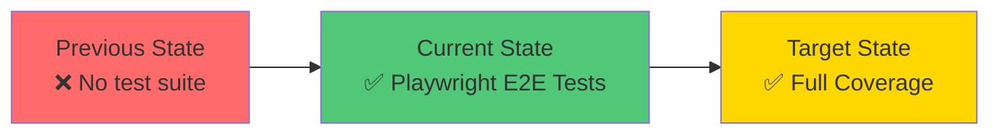
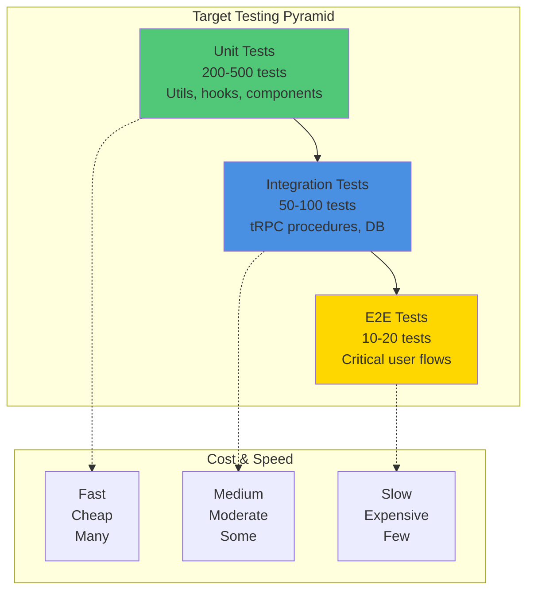
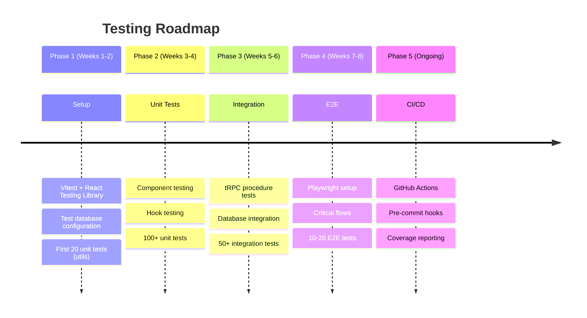
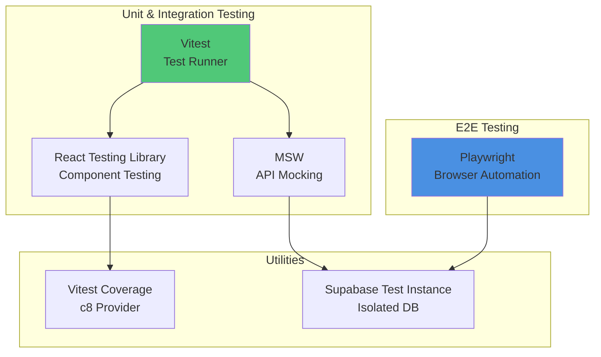
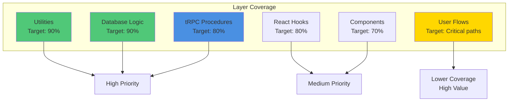
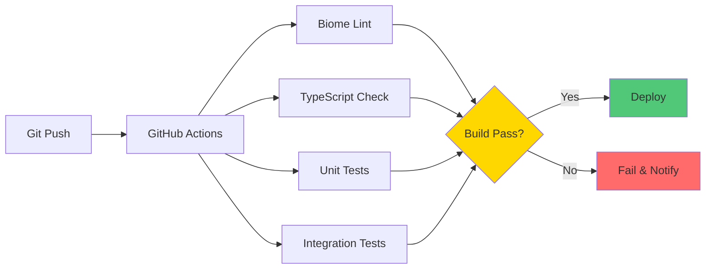
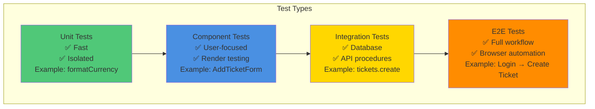

# 9. Testing Strategy

[← Previous: Coding Standards](08-coding-standards.md) | [Back to Index](../architecture.md) | [Next: Security →](10-security.md)

---

## 9.1 Current State

**Status:** ✅ E2E Testing Infrastructure Implemented (Oct 2025)



**✅ Implemented:**
- ✅ Playwright E2E testing framework
- ✅ Test execution reports in `docs/qa/test-execution/`
- ✅ Automated test scripts for critical workflows
- ✅ Role-based permission tests (Story 01.00)
- ✅ Integration test suite (Story 01.18)
- ✅ Test configuration and setup

**Current Test Suite:**

| Test File | Purpose | Status |
|-----------|---------|--------|
| **tests/e2e/01-authentication.spec.ts** | Login/logout flows | ✅ Active |
| **tests/e2e/02-ticket-management.spec.ts** | Ticket CRUD operations | ✅ Active |
| **tests/e2e/03-customer-management.spec.ts** | Customer operations | ✅ Active |
| **tests/e2e/04-product-management.spec.ts** | Product catalog | ✅ Active |
| **tests/e2e/05-parts-inventory.spec.ts** | Parts inventory | ✅ Active |
| **tests/e2e/06-role-permissions.spec.ts** | RBAC testing | ✅ Active |

**Test Execution Reports:**
- `docs/qa/test-execution/TEST-EXECUTION-REPORT-AUTOMATED.md`
- `docs/qa/test-execution/SECURITY-TEST-REPORT.md`
- `docs/qa/test-execution/DATA-INTEGRITY-TEST-REPORT.md`
- `docs/qa/test-execution/FINAL-TEST-REPORT.md`

**Remaining Gaps:**
- Unit tests for utilities and hooks (planned)
- Integration tests for Phase 2 routers (partial)
- Component tests for UI (planned)

---

## 9.2 Testing Pyramid



**Recommended Distribution:**
- **70%** Unit tests - Functions, hooks, utilities
- **20%** Integration tests - API procedures, database operations
- **10%** E2E tests - Critical workflows (login, create ticket)

---

## 9.3 Phased Implementation Plan



---

## 9.4 Recommended Technology Stack



**Rationale:**

| Tool | Purpose | Why Chosen |
|------|---------|------------|
| **Vitest** | Unit/Integration testing | Fast, Vite-powered, Jest-compatible API |
| **React Testing Library** | Component testing | User-centric, encourages accessible code |
| **MSW** | API mocking | Intercepts network requests, realistic mocking |
| **Playwright** | E2E testing | Multi-browser, fast, reliable, trace viewer |
| **c8** | Coverage reporting | Built-in V8 coverage, fast |

**Why Not Alternatives:**
- ❌ **Jest** - Slower than Vitest, requires more config
- ❌ **Cypress** - Slower than Playwright, limited multi-tab support
- ❌ **Enzyme** - Outdated, implementation-focused (not user-focused)

---

## 9.5 Test Coverage Matrix



**Coverage Targets:**

| Layer | Target Coverage | Priority | Example |
|-------|----------------|----------|---------|
| **Utilities** | 90%+ | High | `formatCurrency()`, `sanitizeFilename()` |
| **Database Triggers** | 90%+ | High | Ticket number generation, status logging |
| **tRPC Procedures** | 80%+ | High | `tickets.create`, `customers.list` |
| **React Hooks** | 80%+ | Medium | `useTicketData()`, `useDebounce()` |
| **Components** | 70%+ | Medium | Forms, tables, modals |
| **E2E Flows** | Critical paths | High Value | Login, create ticket, assign technician |

---

## 9.6 Phase 1: Setup & Utilities (Weeks 1-2)

### 9.6.1 Install Dependencies

```bash
# Install Vitest and related tools
pnpm add -D vitest @vitest/ui @vitest/coverage-v8
pnpm add -D @testing-library/react @testing-library/jest-dom
pnpm add -D @testing-library/user-event
pnpm add -D msw
```

### 9.6.2 Configure Vitest

```typescript
// vitest.config.ts
import { defineConfig } from 'vitest/config';
import react from '@vitejs/plugin-react';
import path from 'path';

export default defineConfig({
  plugins: [react()],
  test: {
    globals: true,
    environment: 'jsdom',
    setupFiles: './vitest.setup.ts',
    coverage: {
      provider: 'v8',
      reporter: ['text', 'json', 'html'],
      exclude: [
        'node_modules/',
        '.next/',
        'vitest.config.ts',
        '**/*.test.{ts,tsx}',
      ],
    },
  },
  resolve: {
    alias: {
      '@': path.resolve(__dirname, './src'),
    },
  },
});
```

### 9.6.3 Setup File

```typescript
// vitest.setup.ts
import '@testing-library/jest-dom';
import { afterEach } from 'vitest';
import { cleanup } from '@testing-library/react';

// Cleanup after each test
afterEach(() => {
  cleanup();
});
```

### 9.6.4 Example Utility Tests

```typescript
// src/utils/format-currency.test.ts
import { describe, it, expect } from 'vitest';
import { formatCurrency } from './format-currency';

describe('formatCurrency', () => {
  it('formats VND currency correctly', () => {
    expect(formatCurrency(50000)).toBe('50.000 ₫');
  });

  it('handles zero', () => {
    expect(formatCurrency(0)).toBe('0 ₫');
  });

  it('handles large numbers', () => {
    expect(formatCurrency(1000000)).toBe('1.000.000 ₫');
  });

  it('handles decimals (rounds)', () => {
    expect(formatCurrency(50000.75)).toBe('50.001 ₫');
  });
});
```

**Package.json Scripts:**

```json
{
  "scripts": {
    "test": "vitest",
    "test:ui": "vitest --ui",
    "test:coverage": "vitest --coverage"
  }
}
```

---

## 9.7 Phase 2: Component & Hook Testing (Weeks 3-4)

### 9.7.1 Component Test Example

```typescript
// src/components/add-ticket-form.test.tsx
import { describe, it, expect, vi } from 'vitest';
import { render, screen, waitFor } from '@testing-library/react';
import userEvent from '@testing-library/user-event';
import { AddTicketForm } from './add-ticket-form';

describe('AddTicketForm', () => {
  it('renders form fields', () => {
    render(<AddTicketForm />);

    expect(screen.getByLabelText(/customer/i)).toBeInTheDocument();
    expect(screen.getByLabelText(/product/i)).toBeInTheDocument();
    expect(screen.getByLabelText(/issue description/i)).toBeInTheDocument();
  });

  it('validates required fields', async () => {
    const user = userEvent.setup();
    render(<AddTicketForm />);

    const submitButton = screen.getByRole('button', { name: /create/i });
    await user.click(submitButton);

    expect(await screen.findByText(/customer is required/i)).toBeInTheDocument();
  });

  it('calls onSuccess when form submits', async () => {
    const user = userEvent.setup();
    const onSuccess = vi.fn();

    render(<AddTicketForm onSuccess={onSuccess} />);

    // Fill out form
    await user.selectOptions(screen.getByLabelText(/customer/i), 'customer-1');
    await user.selectOptions(screen.getByLabelText(/product/i), 'product-1');
    await user.type(screen.getByLabelText(/issue/i), 'Screen broken');

    await user.click(screen.getByRole('button', { name: /create/i }));

    await waitFor(() => {
      expect(onSuccess).toHaveBeenCalledWith(expect.any(String)); // ticket ID
    });
  });
});
```

### 9.7.2 Hook Test Example

```typescript
// src/hooks/use-ticket-data.test.ts
import { describe, it, expect } from 'vitest';
import { renderHook, waitFor } from '@testing-library/react';
import { useTicketData } from './use-ticket-data';
import { createWrapper } from '../test-utils/trpc-wrapper';

describe('useTicketData', () => {
  it('fetches ticket data', async () => {
    const { result } = renderHook(() => useTicketData('ticket-id'), {
      wrapper: createWrapper(),
    });

    expect(result.current.isLoading).toBe(true);

    await waitFor(() => {
      expect(result.current.isSuccess).toBe(true);
    });

    expect(result.current.data).toMatchObject({
      id: 'ticket-id',
      ticket_number: expect.stringMatching(/^SV-\d{4}-\d{3}$/),
    });
  });
});
```

---

## 9.8 Phase 3: Integration Testing (Weeks 5-6)

### 9.8.1 Test Database Setup

```typescript
// src/test-utils/test-db.ts
import { createClient } from '@supabase/supabase-js';

export function getTestSupabase() {
  return createClient(
    process.env.TEST_SUPABASE_URL!,
    process.env.TEST_SUPABASE_SERVICE_ROLE_KEY!
  );
}

export async function resetTestDatabase() {
  const supabase = getTestSupabase();

  // Clear all tables in order (FK dependencies)
  await supabase.from('service_ticket_attachments').delete().neq('id', '00000000-0000-0000-0000-000000000000');
  await supabase.from('service_ticket_comments').delete().neq('id', '00000000-0000-0000-0000-000000000000');
  await supabase.from('service_ticket_parts').delete().neq('id', '00000000-0000-0000-0000-000000000000');
  await supabase.from('service_tickets').delete().neq('id', '00000000-0000-0000-0000-000000000000');
  // ... more tables
}
```

### 9.8.2 tRPC Procedure Test Example

```typescript
// src/server/routers/tickets.test.ts
import { describe, it, expect, beforeEach } from 'vitest';
import { appRouter } from './_app';
import { createTRPCContext } from '../trpc';
import { resetTestDatabase, seedTestData } from '@/test-utils/test-db';

describe('tickets router', () => {
  beforeEach(async () => {
    await resetTestDatabase();
    await seedTestData();
  });

  it('creates a ticket', async () => {
    const ctx = await createTRPCContext({ headers: new Headers() });
    const caller = appRouter.createCaller(ctx);

    const ticket = await caller.tickets.create({
      customer_id: 'test-customer-id',
      product_id: 'test-product-id',
      issue_description: 'Screen not working',
      priority_level: 'high',
    });

    expect(ticket).toMatchObject({
      ticket_number: expect.stringMatching(/^SV-\d{4}-\d{3}$/),
      status: 'pending',
      priority_level: 'high',
    });
  });

  it('enforces status flow', async () => {
    const ctx = await createTRPCContext({ headers: new Headers() });
    const caller = appRouter.createCaller(ctx);

    const ticket = await caller.tickets.create({ /* ... */ });

    // Should allow pending -> in_progress
    await expect(
      caller.tickets.updateStatus({
        id: ticket.id,
        status: 'in_progress',
      })
    ).resolves.toBeDefined();

    // Should NOT allow in_progress -> pending (one-way flow)
    await expect(
      caller.tickets.updateStatus({
        id: ticket.id,
        status: 'pending',
      })
    ).rejects.toThrow();
  });
});
```

---

## 9.9 Phase 4: E2E Testing (Weeks 7-8)

### 9.9.1 Playwright Setup

```bash
pnpm add -D @playwright/test
pnpx playwright install
```

**Configuration:**

```typescript
// playwright.config.ts
import { defineConfig } from '@playwright/test';

export default defineConfig({
  testDir: './e2e',
  fullyParallel: true,
  forbidOnly: !!process.env.CI,
  retries: process.env.CI ? 2 : 0,
  workers: process.env.CI ? 1 : undefined,
  use: {
    baseURL: 'http://localhost:3025',
    trace: 'on-first-retry',
  },
  webServer: {
    command: 'pnpm dev',
    url: 'http://localhost:3025',
    reuseExistingServer: !process.env.CI,
  },
});
```

### 9.9.2 E2E Test Example

```typescript
// e2e/ticket-creation.spec.ts
import { test, expect } from '@playwright/test';

test.describe('Ticket Creation Flow', () => {
  test('admin can create a ticket', async ({ page }) => {
    // Login
    await page.goto('/login');
    await page.fill('[name="email"]', 'admin@example.com');
    await page.fill('[name="password"]', 'admin123456');
    await page.click('button[type="submit"]');

    // Navigate to tickets
    await page.click('text=Tickets');
    await expect(page).toHaveURL('/tickets');

    // Click create ticket
    await page.click('text=New Ticket');

    // Fill form
    await page.selectOption('[name="customer_id"]', { index: 1 });
    await page.selectOption('[name="product_id"]', { index: 1 });
    await page.fill('[name="issue_description"]', 'Screen is broken');
    await page.selectOption('[name="priority_level"]', 'high');

    // Submit
    await page.click('button:has-text("Create Ticket")');

    // Verify success
    await expect(page.locator('text=/SV-\\d{4}-\\d{3}/')).toBeVisible();
  });
});
```

---

## 9.10 Phase 5: CI/CD Integration



**GitHub Actions Workflow:**

```yaml
# .github/workflows/test.yml
name: Test Suite

on: [push, pull_request]

jobs:
  test:
    runs-on: ubuntu-latest

    services:
      postgres:
        image: supabase/postgres:15.1.1.54
        env:
          POSTGRES_PASSWORD: postgres
        ports:
          - 54322:5432

    steps:
      - uses: actions/checkout@v4

      - uses: pnpm/action-setup@v2
        with:
          version: 8

      - uses: actions/setup-node@v4
        with:
          node-version: 20
          cache: 'pnpm'

      - name: Install dependencies
        run: pnpm install

      - name: Lint
        run: pnpm lint

      - name: Type check
        run: pnpm tsc --noEmit

      - name: Unit tests
        run: pnpm test:coverage

      - name: Upload coverage
        uses: codecov/codecov-action@v4
        with:
          files: ./coverage/coverage-final.json
```

**Pre-commit Hook:**

```bash
# .husky/pre-commit
#!/bin/sh
. "$(dirname "$0")/_/husky.sh"

pnpm lint
pnpm tsc --noEmit
pnpm test
```

---

## 9.11 Test Types Summary



---

## 9.12 Testing Best Practices

**DO:**
- ✅ Test behavior, not implementation
- ✅ Use React Testing Library queries (`getByRole`, `getByLabelText`)
- ✅ Reset database between integration tests
- ✅ Mock external APIs (but not tRPC procedures)
- ✅ Write descriptive test names (`it('creates ticket with auto-generated number')`)
- ✅ Aim for high coverage on critical paths

**DON'T:**
- ❌ Test implementation details (`wrapper.instance()`)
- ❌ Use `getByTestId` as first choice (accessibility matters)
- ❌ Share state between tests
- ❌ Mock everything (integration tests need real DB)
- ❌ Ignore flaky tests (fix or remove)
- ❌ Chase 100% coverage on UI (diminishing returns)

---

## 9.13 Monitoring Test Health

**Metrics to Track:**
- Overall coverage percentage
- Test execution time (keep under 5 minutes)
- Flaky test rate (should be 0%)
- Failed test resolution time
- Coverage trend over time

**Tools:**
- **Codecov** - Coverage reporting and trending
- **GitHub Actions** - CI/CD pipeline
- **Vitest UI** - Interactive test runner
- **Playwright Trace Viewer** - Debug E2E failures

---

## Next Steps

Continue to [Security →](10-security.md) to understand the application's defense-in-depth security model.

---

[← Previous: Coding Standards](08-coding-standards.md) | [Back to Index](../architecture.md) | [Next: Security →](10-security.md)
