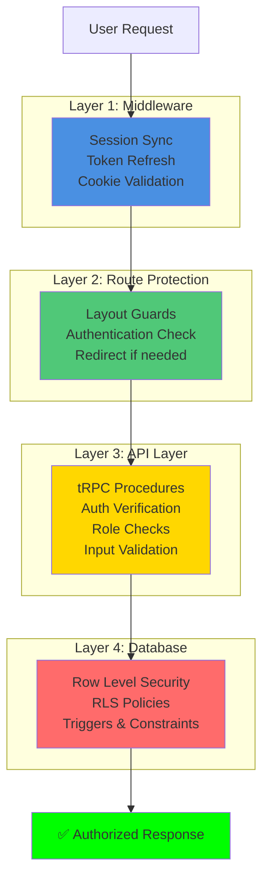
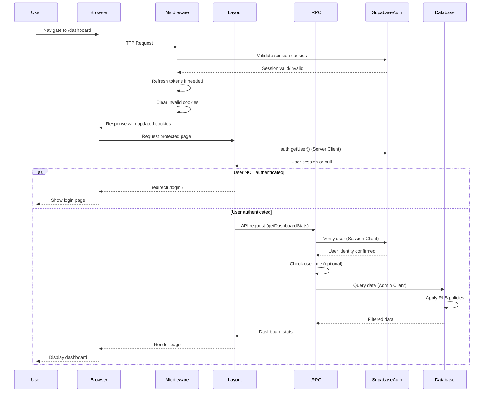
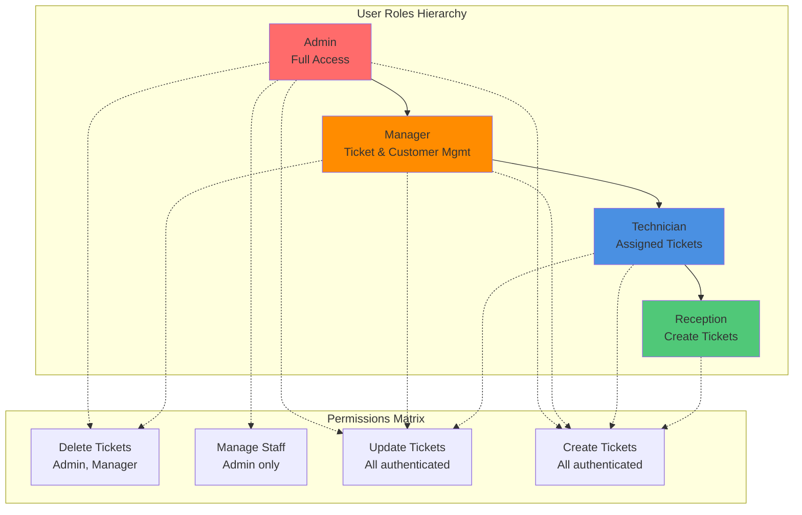
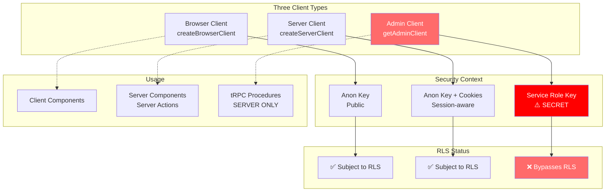
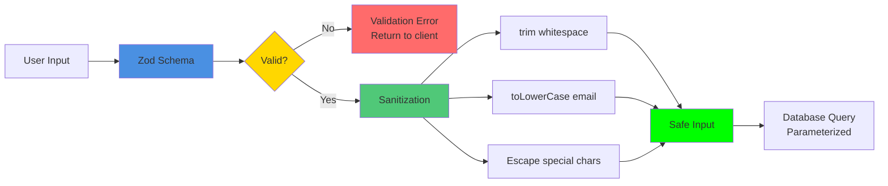
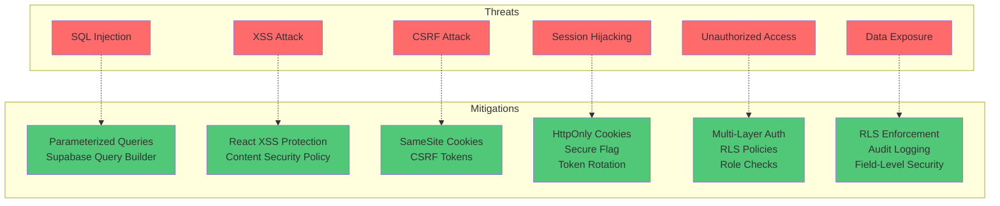
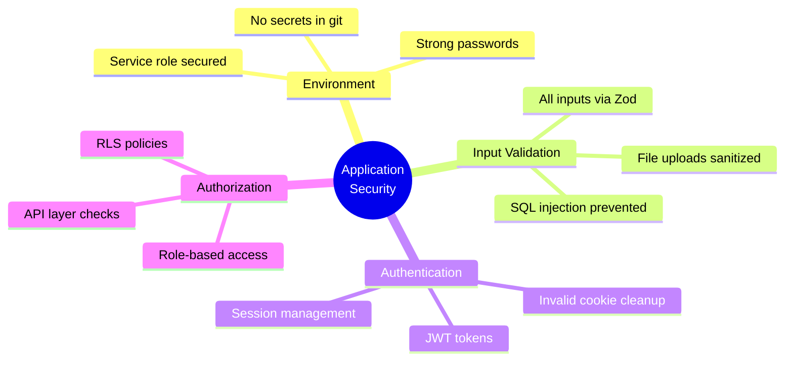

# 10. Security Integration

[← Previous: Testing Strategy](09-testing-strategy.md) | [Back to Index](../architecture.md)

---

## 10.1 Three-Layer Security Model

The Service Center application implements a **defense-in-depth** security model with four distinct layers:



### Security Principle

**Defense in Depth:** Each layer provides independent security checks. Bypassing one layer (e.g., JavaScript disabled) doesn't grant access due to deeper protections.

---

## 10.2 Authentication Flow



### Login Process

```typescript
// src/app/(public)/login/action.ts
export async function login(prevState: LoginState, formData: FormData) {
  const email = formData.get("email") as string
  const password = formData.get("password") as string

  // 1. Server-side validation
  if (!email || !/^[^\s@]+@[^\s@]+\.[^\s@]+$/.test(email)) {
    return { fieldErrors: { email: "Invalid email" }, success: false }
  }

  // 2. Clear existing auth cookies (prevents stale sessions)
  const cookieStore = await cookies()
  const authCookies = cookieStore.getAll().filter(c =>
    c.name.startsWith("sb-") && c.name.includes("-auth-token")
  )
  authCookies.forEach(cookie => cookieStore.delete(cookie.name))

  // 3. Authenticate with Supabase
  const supabase = await createClient()
  const { error, data } = await supabase.auth.signInWithPassword({
    email: email.trim(),
    password,
  })

  // 4. Handle errors with user-friendly messages
  if (error) {
    if (error.message.includes("invalid login credentials")) {
      return { error: "Invalid email or password", success: false }
    }
    return { error: getUserFriendlyError(error), success: false }
  }

  // 5. Verify session created
  if (!data?.session) {
    return { error: "Login succeeded but session creation failed", success: false }
  }

  // 6. Success - revalidate cache and redirect
  revalidatePath("/", "layout")
  redirect("/dashboard")
}
```

---

## 10.3 Authorization & Role-Based Access Control



### Role Definition

```sql
create type public.user_role as enum (
  'admin',      -- Full system access, can delete, manage users
  'manager',    -- Can manage tickets, customers, products, reports
  'technician', -- Can view/update assigned tickets, add parts
  'reception'   -- Can create tickets, view customer info
);
```

### RLS Helper Functions (✅ Story 01.00 - Complete Oct 2025)

**Comprehensive RBAC Implementation with 6 helper functions:**

```sql
-- Get current user's role
create or replace function get_my_role()
returns user_role as $$
  select role from profiles where user_id = auth.uid()
$$ language sql security definer;

-- Check if user has specific role
create or replace function has_role(required_role user_role)
returns boolean as $$
  select role = required_role from profiles where user_id = auth.uid()
$$ language sql security definer;

-- Check if user has any of the specified roles
create or replace function has_any_role(required_roles user_role[])
returns boolean as $$
  select role = any(required_roles) from profiles where user_id = auth.uid()
$$ language sql security definer;

-- Check if user is manager or above (admin/manager)
create or replace function is_manager_or_above()
returns boolean as $$
  select role in ('admin', 'manager') from profiles where user_id = auth.uid()
$$ language sql security definer;

-- Check if user is admin only
create or replace function is_admin_only()
returns boolean as $$
  select role = 'admin' from profiles where user_id = auth.uid()
$$ language sql security definer;

-- Check if technician is assigned to specific ticket
create or replace function is_technician_assigned_to_ticket(ticket_id uuid)
returns boolean as $$
  select assigned_to = auth.uid() from service_tickets where id = ticket_id
$$ language sql security definer;
```

### API-Level Authorization (✅ RBAC Middleware - Story 01.00)

**Modern Middleware-Based Approach:**

```typescript
// src/server/middleware/requireRole.ts
import { TRPCError } from "@trpc/server";
import type { Context } from "../trpc";
import type { UserRole } from "@/types/roles";

export function requireRole(allowedRoles: UserRole[]) {
  return async ({ ctx }: { ctx: Context }) => {
    if (!ctx.user) {
      throw new TRPCError({
        code: "UNAUTHORIZED",
        message: "Authentication required",
      });
    }

    const { data: profile } = await ctx.supabaseAdmin
      .from("profiles")
      .select("role")
      .eq("user_id", ctx.user.id)
      .single();

    if (!profile || !allowedRoles.includes(profile.role as UserRole)) {
      throw new TRPCError({
        code: "FORBIDDEN",
        message: `Access denied. Required roles: ${allowedRoles.join(", ")}`,
      });
    }

    return { ctx: { ...ctx, userRole: profile.role as UserRole } };
  };
}

// Usage in routers
export const workflowRouter = router({
  createTemplate: publicProcedure
    .use(requireRole(["admin", "manager"]))  // ✅ Middleware checks role
    .input(createTemplateSchema)
    .mutation(async ({ input, ctx }) => {
      // ctx.userRole is guaranteed to be admin or manager
      // ... proceed with operation
    }),

  completeTask: publicProcedure
    .use(requireRole(["admin", "manager", "technician"]))
    .input(completeTaskSchema)
    .mutation(async ({ input, ctx }) => {
      // Additional check: technicians can only complete their assigned tasks
      if (ctx.userRole === "technician") {
        const { data: task } = await ctx.supabaseAdmin
          .from("service_ticket_tasks")
          .select("service_tickets(assigned_to)")
          .eq("id", input.taskId)
          .single();

        if (task?.service_tickets?.assigned_to !== ctx.user.id) {
          throw new TRPCError({
            code: "FORBIDDEN",
            message: "You can only complete tasks assigned to you",
          });
        }
      }
      // ... proceed with operation
    }),
});
```

**Protected Endpoints Count:** 50+ procedures across 5 Phase 2 routers

**Security Features:**
- ✅ Centralized middleware for consistent enforcement
- ✅ Role-based access at API layer
- ✅ Audit logging for permission-sensitive operations
- ✅ Fine-grained permissions (e.g., technicians only access assigned tickets)
- ✅ UI-level guards prevent unauthorized access attempts

---

## 10.4 Supabase Client Security Model



### Security Rules

```typescript
// ✅ DO: Use supabaseAdmin for data operations in tRPC
const { data } = await ctx.supabaseAdmin
  .from("service_tickets")
  .select("*")

// ✅ DO: Use supabaseClient for auth verification
const { data: { user } } = await ctx.supabaseClient.auth.getUser()

// ❌ DON'T: Export service role key to client
NEXT_PUBLIC_SUPABASE_SERVICE_ROLE_KEY=xxx // ❌ CRITICAL SECURITY HOLE!

// ❌ DON'T: Skip authentication checks
await ctx.supabaseAdmin.from("tickets").insert(input) // ❌ No auth check!

// ✅ DO: Always verify user first
const { data: { user } } = await ctx.supabaseClient.auth.getUser()
if (!user) throw new TRPCError({ code: "UNAUTHORIZED" })
await ctx.supabaseAdmin.from("tickets").insert({ ...input, created_by: user.id })
```

---

## 10.5 Input Validation & Sanitization



### Zod Validation Pattern

```typescript
// All tRPC inputs MUST be validated
export const createTicketSchema = z.object({
  customer_data: z.object({
    name: z.string()
      .min(1, "Customer name is required")
      .max(100, "Name too long")
      .trim(), // Sanitize whitespace
    phone: z.string()
      .min(1, "Phone required")
      .regex(/^\+?[\d\s-()]+$/, "Invalid phone format"),
    email: z.string()
      .email("Invalid email format")
      .optional()
      .transform(val => val?.toLowerCase()), // Normalize
  }),
  product_id: z.string().uuid("Invalid product ID"),
  description: z.string()
    .min(1, "Description required")
    .max(5000, "Description too long")
    .trim(),
  service_fee: z.number()
    .min(0, "Cannot be negative")
    .max(1000000, "Exceeds maximum"),
})

// Use in tRPC procedure
createTicket: publicProcedure
  .input(createTicketSchema)
  .mutation(async ({ input, ctx }) => {
    // input is now validated, typed, and sanitized
  })
```

### SQL Injection Prevention

```typescript
// ✅ DO: Use Supabase query builder (automatically parameterized)
const { data } = await ctx.supabaseAdmin
  .from("service_tickets")
  .select("*")
  .eq("customer_id", customerId) // Safe - parameterized
  .ilike("issue_description", `%${searchTerm}%`) // Safe - parameterized

// ❌ DON'T: Build raw SQL with string concatenation
const { data } = await ctx.supabaseAdmin.rpc("raw_query", {
  query: `SELECT * FROM tickets WHERE name = '${customerName}'` // ❌ SQL INJECTION!
})

// ✅ DO: If raw SQL required, use parameterized RPC
const { data } = await ctx.supabaseAdmin.rpc("search_tickets", {
  search_term: customerName, // Passed as parameter
})
```

---

## 10.6 Security Threat Model



---

## 10.7 Security Checklist

### Application Security



**Checklist:**

- [x] Environment variables validated on startup
- [x] Service role key never exposed to client
- [x] All tRPC inputs validated with Zod
- [x] Authentication verified in protected routes
- [x] Role-based authorization at API layer
- [x] File uploads sanitized (Vietnamese chars, special chars)
- [x] Session cookies secured (httpOnly, sameSite)
- [x] Middleware syncs sessions on every request
- [x] Invalid auth cookies automatically cleared

### Database Security

- [x] Row Level Security (RLS) enabled on all tables
- [x] RLS policies enforce role-based access
- [x] Security definer functions use `set search_path = ''`
- [x] All foreign keys use appropriate cascade rules
- [x] Check constraints validate data integrity
- [x] Audit trail columns (created_by, updated_by, timestamps)
- [x] Triggers log important state changes
- [x] Generated columns prevent manual tampering

### API Security

- [x] All procedures validate input with Zod
- [x] Authentication checked via `supabaseClient.auth.getUser()`
- [x] Authorization enforced with role checks
- [x] Supabase query builder used (prevents SQL injection)
- [x] Error messages don't leak sensitive information
- [x] TRPCError used with appropriate HTTP status codes
- [x] Service role client usage limited to server-side only

### Deployment Security

- [x] Docker containers run as non-root user
- [x] Environment variables stored securely (not in git)
- [x] Cloudflare Tunnel for HTTPS (production)
- [x] Multi-tenant instances isolated (separate databases)
- [x] Port randomization for instance isolation
- [x] Health check endpoints (no sensitive data)

---

## 10.8 Security Best Practices Summary

### Environment Variables

```bash
# ✅ DO: Use strong, random passwords
SETUP_PASSWORD=X7$mK9#pL2@nQ5vR8wT4yU6zAb3cD8eF1

# ✅ DO: Keep service role key SECRET
SUPABASE_SERVICE_ROLE_KEY=eyJhbGci...  # SERVER-ONLY

# ✅ DO: Use NEXT_PUBLIC_ ONLY for client-safe values
NEXT_PUBLIC_SUPABASE_URL=http://127.0.0.1:54321
NEXT_PUBLIC_SUPABASE_ANON_KEY=eyJhbGci...

# ❌ DON'T: Expose service role to client
NEXT_PUBLIC_SUPABASE_SERVICE_ROLE_KEY=xxx # ❌ CRITICAL!
```

### Session Security

```typescript
// ✅ DO: Always verify user
const { data: { user }, error } = await ctx.supabaseClient.auth.getUser()
if (!user || error) {
  throw new TRPCError({ code: "UNAUTHORIZED" })
}

// ❌ DON'T: Trust client-provided user IDs
.input(z.object({ userId: z.string() })) // ❌ Spoofable

// ✅ DO: Get user from session
const userId = user.id // Verified by Supabase
```

### Database Security

```sql
-- ✅ DO: Use security definer with search_path protection
create or replace function public.is_admin()
returns boolean as $$
begin
  return exists (select 1 from public.profiles where user_id = auth.uid() and role = 'admin');
end;
$$ language plpgsql
security definer              -- Runs with creator privileges
set search_path = '';         -- Prevents schema hijacking

-- ✅ DO: Enable RLS on all tables
alter table "service_tickets" enable row level security;

-- ✅ DO: Create policies for each operation
create policy "tickets_delete" on "service_tickets"
  for delete using (public.is_admin_or_manager());
```

---

## Conclusion

The Service Center application implements comprehensive security through:

1. **Four-Layer Defense** - Middleware, Route Guards, API, Database
2. **Type-Safe Validation** - Zod schemas prevent injection attacks
3. **Row Level Security** - Database-level access control
4. **Role-Based Authorization** - Admin, Manager, Technician, Reception
5. **Secure Session Management** - JWT tokens with rotation
6. **Audit Trail** - All actions logged with user attribution

This multi-layered approach ensures that even if one security layer is bypassed, others prevent unauthorized access or data exposure.

---

[← Previous: Testing Strategy](09-testing-strategy.md) | [Back to Index](../architecture.md)
