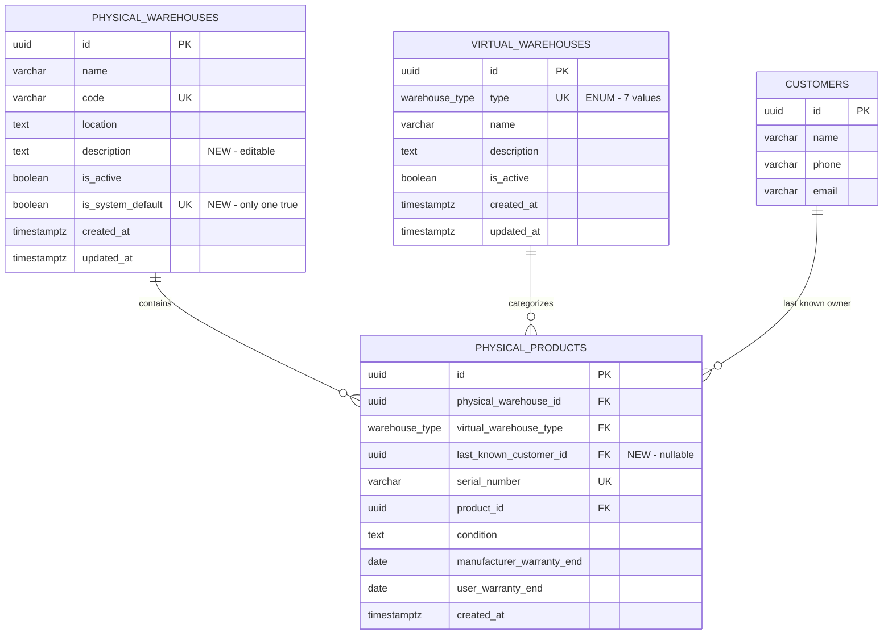
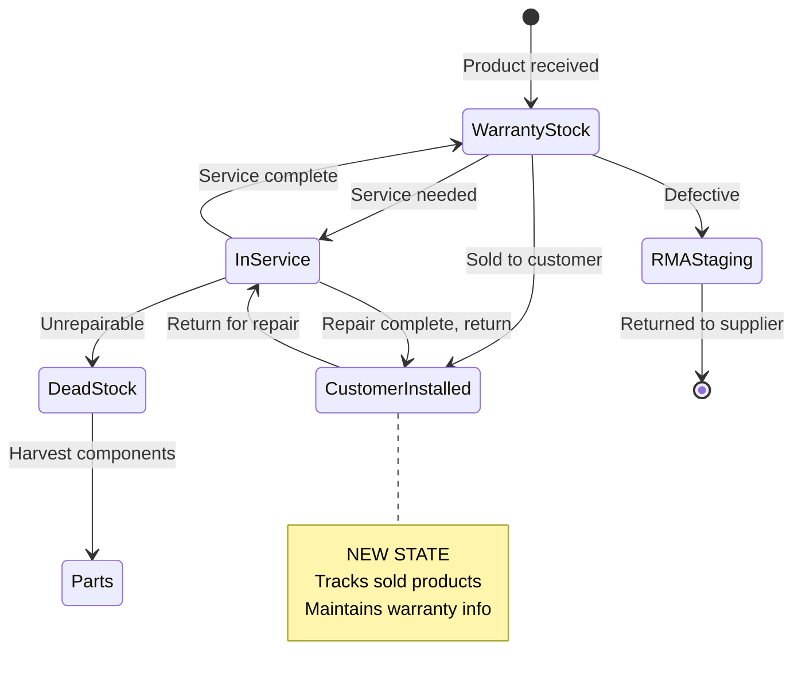

# Default Warehouse System Architecture

**Document Version:** 2.0 (Updated after clarifications)
**Created:** 2025-10-30
**Last Updated:** 2025-10-30
**Author:** Winston (Architect)
**Status:** Specification - Ready for Implementation

**Key Updates in v2.0:**
- ✅ Default warehouse editable (name, location, description) but cannot be deleted
- ✅ Added `last_known_customer_id` field to track product ownership
- ✅ Automatic customer tracking on warranty replacements
- ✅ Manual customer tracking on sales transfers
- ✅ Products remain in customer_installed after warranty expiration
- ✅ Default warehouse includes description field in Vietnamese

---

## Table of Contents

1. [Overview](#1-overview)
2. [Business Requirements](#2-business-requirements)
3. [Database Schema Design](#3-database-schema-design)
4. [Data Model Diagrams](#4-data-model-diagrams)
5. [Migration Strategy](#5-migration-strategy)
6. [API Design](#6-api-design)
7. [Data Flow & System Behavior](#7-data-flow--system-behavior)
8. [Implementation Plan](#8-implementation-plan)
9. [Testing Strategy](#9-testing-strategy)
10. [Rollback Plan](#10-rollback-plan)

---

## 1. Overview

### 1.1 Purpose

This document specifies the architecture for the **Default Warehouse System**, which ensures that:
- A system-managed physical warehouse "Công ty" (Company) always exists
- All 7 virtual warehouse types are automatically seeded and linked to the default warehouse
- The system maintains these defaults even after database resets
- Users cannot delete the default physical warehouse

### 1.2 Rationale

**Problem:**
- Current system requires manual creation of physical and virtual warehouses
- Database resets lose warehouse configuration
- No guaranteed "home base" for inventory operations
- Risk of deleting critical warehouses

**Solution:**
- System-managed default physical warehouse that cannot be deleted
- Auto-seeding of all virtual warehouse types
- Idempotent migrations that recreate defaults on database reset
- Built-in validation to protect system-critical warehouses

### 1.3 Key Features

✅ **Default Physical Warehouse**: "Công ty" auto-created, cannot be deleted
✅ **7 Virtual Warehouse Types**: All seeded automatically
✅ **Auto-Linking**: Virtual warehouses linked to default physical warehouse
✅ **Idempotent Seeding**: Safe to run multiple times
✅ **Reset Resilient**: Recreates on `pnpx supabase db reset`
✅ **New Warehouse Type**: `customer_installed` tracks sold products

---

## 2. Business Requirements

### 2.1 Functional Requirements

**FR31**: The system shall automatically create a default physical warehouse named "Công ty" (Company) with all 7 virtual warehouse types linked on initial database setup, and these defaults shall be recreated on database reset and cannot be deleted by users.

**FR9** (Updated): The system shall support 7 virtual warehouse types: Main (default), Warranty Stock, RMA Staging, Dead Stock, In-Service, Parts, and Customer Installed (tracks sold products currently with customers).

### 2.2 Virtual Warehouse Types

| Type | Code | Vietnamese | Purpose |
|------|------|------------|---------|
| Main | `main` | Kho Chính | Default main storage for physical warehouses |
| Warranty Stock | `warranty_stock` | Hàng bảo hành | Products under active warranty available for replacement |
| RMA Staging | `rma_staging` | Khu vực RMA | Products awaiting return to supplier/manufacturer |
| Dead Stock | `dead_stock` | Hàng hỏng | Non-functional products for parts harvesting or disposal |
| In Service | `in_service` | Đang sửa chữa | Products currently being serviced or repaired |
| Parts | `parts` | Kho linh kiện | Replacement parts and components inventory |
| **Customer Installed** | `customer_installed` | **Hàng đã bán** | **Products sold and installed at customer sites (NEW)** |

### 2.3 Use Cases

**UC-1: Database Initialization**
- **Actor**: System/Developer
- **Flow**: Run `pnpx supabase db reset` → Default warehouse created automatically
- **Outcome**: System ready for inventory operations without manual setup

**UC-2: Edit Default Warehouse**
- **Actor**: Admin/Manager
- **Flow**: Edit "Công ty" warehouse name, location, or description
- **Outcome**: Changes saved successfully
- **Note**: Default warehouse CAN be edited, only deletion is blocked

**UC-2a: Attempt to Delete Default Warehouse**
- **Actor**: Admin/Manager
- **Flow**: Try to delete "Công ty" warehouse via UI or API
- **Outcome**: Operation blocked with error message
- **Error**: "Cannot delete system default warehouse 'Công ty'. This warehouse is required for system operations."

**UC-3: Automatic Warranty Replacement (Customer Installed)**
- **Actor**: Technician/Manager
- **Flow**:
  1. Complete service ticket with warranty replacement
  2. Issue replacement product to customer (xuất ra trả bảo hành)
  3. System automatically moves product to `customer_installed`
  4. System records customer information in `last_known_customer_id`
- **Outcome**: Product tracked as "at customer site" with warranty info maintained
- **Benefit**: Automatic tracking, no manual data entry required

**UC-4: Manual Sales Transfer (Customer Installed)**
- **Actor**: Manager/Reception
- **Flow**:
  1. Create stock transfer document
  2. Select product(s) from warehouse stock
  3. Select destination: `customer_installed`
  4. Select customer (required)
  5. Submit transfer document
- **Outcome**: Product moved to `customer_installed`, customer tracked
- **Benefit**: Track sold products and their current owners for warranty claims

---

## 3. Database Schema Design

### 3.1 ENUM Changes

#### 3.1.1 Add `customer_installed` to `warehouse_type`

**Current ENUM:**
```sql
CREATE TYPE public.warehouse_type AS ENUM (
  'main',
  'warranty_stock',
  'rma_staging',
  'dead_stock',
  'in_service',
  'parts'
);
```

**New ENUM:**
```sql
CREATE TYPE public.warehouse_type AS ENUM (
  'main',
  'warranty_stock',
  'rma_staging',
  'dead_stock',
  'in_service',
  'parts',
  'customer_installed'  -- NEW
);
```

**Migration Command:**
```sql
ALTER TYPE public.warehouse_type ADD VALUE IF NOT EXISTS 'customer_installed';
```

### 3.2 Table Schema Changes

#### 3.2.1 Add `is_system_default` to `physical_warehouses`

**Current Schema:**
```sql
CREATE TABLE public.physical_warehouses (
  id UUID PRIMARY KEY DEFAULT gen_random_uuid(),
  name VARCHAR(255) NOT NULL,
  code VARCHAR(20) NOT NULL UNIQUE,
  location TEXT,
  description TEXT,
  is_active BOOLEAN NOT NULL DEFAULT true,
  created_at TIMESTAMPTZ NOT NULL DEFAULT NOW(),
  updated_at TIMESTAMPTZ NOT NULL DEFAULT NOW()
);
```

**Updated Schema:**
```sql
CREATE TABLE public.physical_warehouses (
  id UUID PRIMARY KEY DEFAULT gen_random_uuid(),
  name VARCHAR(255) NOT NULL,
  code VARCHAR(20) NOT NULL UNIQUE,
  location TEXT,
  description TEXT,
  is_active BOOLEAN NOT NULL DEFAULT true,
  is_system_default BOOLEAN NOT NULL DEFAULT false,  -- NEW
  created_at TIMESTAMPTZ NOT NULL DEFAULT NOW(),
  updated_at TIMESTAMPTZ NOT NULL DEFAULT NOW()
);
```

**Migration:**
```sql
-- Add column
ALTER TABLE public.physical_warehouses
ADD COLUMN IF NOT EXISTS is_system_default BOOLEAN NOT NULL DEFAULT false;

-- Add unique partial index (only one warehouse can be system default)
CREATE UNIQUE INDEX IF NOT EXISTS physical_warehouses_system_default_unique
ON public.physical_warehouses(is_system_default)
WHERE is_system_default = true;

-- Add comment
COMMENT ON COLUMN public.physical_warehouses.is_system_default IS
'Indicates if this is the system-managed default warehouse "Công ty" that cannot be deleted';
```

#### 3.2.2 Virtual Warehouse Links (Conceptual)

**Note**: Current implementation assumes virtual warehouses are global. If we need explicit links between physical and virtual warehouses, we would create:

```sql
CREATE TABLE public.virtual_warehouse_links (
  id UUID PRIMARY KEY DEFAULT gen_random_uuid(),
  physical_warehouse_id UUID NOT NULL REFERENCES public.physical_warehouses(id) ON DELETE CASCADE,
  virtual_warehouse_id UUID NOT NULL REFERENCES public.virtual_warehouses(id) ON DELETE CASCADE,
  created_at TIMESTAMPTZ NOT NULL DEFAULT NOW(),
  UNIQUE(physical_warehouse_id, virtual_warehouse_id)
);

CREATE INDEX idx_vw_links_physical ON public.virtual_warehouse_links(physical_warehouse_id);
CREATE INDEX idx_vw_links_virtual ON public.virtual_warehouse_links(virtual_warehouse_id);
```

**Decision**: For MVP, we'll keep virtual warehouses global and add `physical_warehouse_id` filter at query level. Links table can be added later if needed for strict isolation.

#### 3.2.3 Add `last_known_customer_id` to `physical_products`

To track which customer owns each product in `customer_installed` warehouse:

**Migration:**
```sql
-- Add last_known_customer_id column to track customer ownership
ALTER TABLE public.physical_products
ADD COLUMN IF NOT EXISTS last_known_customer_id UUID REFERENCES public.customers(id) ON DELETE SET NULL;

-- Add index for customer lookups
CREATE INDEX IF NOT EXISTS idx_physical_products_last_customer
ON public.physical_products(last_known_customer_id)
WHERE last_known_customer_id IS NOT NULL;

-- Add comment
COMMENT ON COLUMN public.physical_products.last_known_customer_id IS
'Last known customer who owns/received this product. Updated when product moves to customer_installed warehouse.';
```

**Usage:**
- **Automatic**: When warranty replacement issued, system sets `last_known_customer_id` from service ticket customer
- **Manual**: When creating sales transfer to `customer_installed`, customer selection required
- **Nullable**: Products not yet sold have NULL value
- **Retained**: Value persists even if product returned for service (helps with warranty claims)

### 3.3 Constraints & Indexes

**Constraints:**
- `physical_warehouses.is_system_default` - Unique partial index ensures only one default
- `virtual_warehouses.warehouse_type` - Unique constraint ensures one instance per type
- Foreign key: `physical_products.virtual_warehouse_type` references `virtual_warehouses.warehouse_type`

**Indexes:**
```sql
-- Already exists
CREATE INDEX idx_physical_products_virtual_warehouse
ON public.physical_products(virtual_warehouse_type);

-- New indexes
CREATE INDEX idx_physical_warehouses_system_default
ON public.physical_warehouses(is_system_default)
WHERE is_system_default = true;
```

---

## 4. Data Model Diagrams

### 4.1 Entity Relationship Diagram



### 4.2 Default Warehouse Structure

```mermaid
graph TB
    subgraph "Default Physical Warehouse"
        PW["Công ty<br/>(Company)<br/>is_system_default=true<br/>❌ Cannot Delete"]
    end

    subgraph "7 Virtual Warehouses"
        VW1[Main<br/>main]
        VW2[Warranty Stock<br/>warranty_stock]
        VW3[RMA Staging<br/>rma_staging]
        VW4[Dead Stock<br/>dead_stock]
        VW5[In Service<br/>in_service]
        VW6[Parts<br/>parts]
        VW7[Customer Installed<br/>customer_installed<br/>⭐ NEW]
    end

    PW -.-> VW1
    PW -.-> VW2
    PW -.-> VW3
    PW -.-> VW4
    PW -.-> VW5
    PW -.-> VW6
    PW -.-> VW7

    style PW fill:#FFD700,stroke:#FF6B6B,stroke-width:3px
    style VW7 fill:#50C878,stroke:#4A90E2,stroke-width:2px
```



### 4.3 Warehouse Type ENUM

```mermaid
classDiagram
    class warehouse_type {
        <<enumeration>>
        main
        warranty_stock
        rma_staging
        dead_stock
        in_service
        parts
        customer_installed ⭐ NEW
    }

    class virtual_warehouses {
        +uuid id
        +warehouse_type type UK
        +varchar name
        +text description
    }

    warehouse_type <-- virtual_warehouses : uses
```



---

## 5. Migration Strategy

### 5.1 Migration File Structure

**File**: `supabase/migrations/YYYYMMDDHHMMSS_add_default_warehouse_system.sql`

```sql
-- Migration: Add Default Warehouse System
-- Created: 2025-10-30
-- Description: Adds customer_installed warehouse type and default "Công ty" physical warehouse

BEGIN;

-- ============================================================================
-- STEP 1: Add new ENUM value
-- ============================================================================
ALTER TYPE public.warehouse_type ADD VALUE IF NOT EXISTS 'customer_installed';

-- ============================================================================
-- STEP 2: Add is_system_default column to physical_warehouses
-- ============================================================================
ALTER TABLE public.physical_warehouses
ADD COLUMN IF NOT EXISTS is_system_default BOOLEAN NOT NULL DEFAULT false;

-- Add unique partial index
CREATE UNIQUE INDEX IF NOT EXISTS physical_warehouses_system_default_unique
ON public.physical_warehouses(is_system_default)
WHERE is_system_default = true;

-- Add comment
COMMENT ON COLUMN public.physical_warehouses.is_system_default IS
'Indicates if this is the system-managed default warehouse that cannot be deleted';

-- ============================================================================
-- STEP 3: Add last_known_customer_id to physical_products
-- ============================================================================
ALTER TABLE public.physical_products
ADD COLUMN IF NOT EXISTS last_known_customer_id UUID REFERENCES public.customers(id) ON DELETE SET NULL;

-- Add index for customer lookups
CREATE INDEX IF NOT EXISTS idx_physical_products_last_customer
ON public.physical_products(last_known_customer_id)
WHERE last_known_customer_id IS NOT NULL;

-- Add comment
COMMENT ON COLUMN public.physical_products.last_known_customer_id IS
'Last known customer who owns/received this product. Updated when product moves to customer_installed warehouse.';

-- ============================================================================
-- STEP 4: Seed default physical warehouse "Công ty"
-- ============================================================================
INSERT INTO public.physical_warehouses (
  name,
  code,
  location,
  description,
  is_active,
  is_system_default
)
VALUES (
  'Công ty',
  'COMPANY',
  'Trụ sở chính',
  'Kho mặc định của công ty, không thể xóa. Chứa tất cả các loại kho ảo.',
  true,
  true
)
ON CONFLICT (code) DO UPDATE SET
  is_system_default = true,
  description = 'Kho mặc định của công ty, không thể xóa. Chứa tất cả các loại kho ảo.'
WHERE physical_warehouses.code = 'COMPANY';

-- ============================================================================
-- STEP 5: Seed 7 virtual warehouses (idempotent)
-- ============================================================================
INSERT INTO public.virtual_warehouses (warehouse_type, name, description)
VALUES
  (
    'main',
    'Main',
    'Kho Chính — Default main virtual warehouse for a physical warehouse'
  ),
  (
    'warranty_stock',
    'Warranty Stock',
    'Products under active warranty available for replacement'
  ),
  (
    'rma_staging',
    'RMA Staging Area',
    'Products awaiting return to supplier or manufacturer'
  ),
  (
    'dead_stock',
    'Dead Stock',
    'Non-functional products for parts harvesting or disposal'
  ),
  (
    'in_service',
    'In Service',
    'Products currently being serviced or repaired'
  ),
  (
    'parts',
    'Parts Inventory',
    'Replacement parts and components inventory'
  ),
  (
    'customer_installed',
    'Customer Installed',
    'Hàng đã bán — Products sold and currently installed at customer sites'
  )
ON CONFLICT (warehouse_type) DO NOTHING;

COMMIT;
```

### 5.2 Idempotency Strategy

**Key Techniques:**
1. **`ADD VALUE IF NOT EXISTS`** - Safely adds ENUM value
2. **`ADD COLUMN IF NOT EXISTS`** - Prevents duplicate column errors
3. **`CREATE INDEX IF NOT EXISTS`** - Prevents duplicate index errors
4. **`ON CONFLICT DO NOTHING`** - Prevents duplicate seed data
5. **`ON CONFLICT DO UPDATE`** - Ensures default warehouse marked correctly

**Result**: Migration can be run multiple times without errors.

### 5.3 Rollback Strategy

```sql
-- Rollback migration (if needed)
BEGIN;

-- Remove customer_installed products first
UPDATE public.physical_products
SET virtual_warehouse_type = 'main'
WHERE virtual_warehouse_type = 'customer_installed';

-- Delete customer_installed virtual warehouse
DELETE FROM public.virtual_warehouses
WHERE warehouse_type = 'customer_installed';

-- Remove is_system_default column
DROP INDEX IF EXISTS physical_warehouses_system_default_unique;
ALTER TABLE public.physical_warehouses
DROP COLUMN IF EXISTS is_system_default;

-- Note: Cannot remove ENUM value in PostgreSQL without recreating the type
-- If rollback needed, would require:
-- 1. Drop all tables using warehouse_type
-- 2. Drop and recreate ENUM
-- 3. Restore tables
-- Better approach: Keep ENUM value, just don't use it

COMMIT;
```

---

## 6. API Design

### 6.1 tRPC Router Updates

#### 6.1.1 `warehouse.deletePhysical` - Add Validation

**Location**: `src/server/routers/warehouse.ts`

**Before:**
```typescript
deletePhysical: publicProcedure
  .input(z.object({ id: z.string().uuid() }))
  .mutation(async ({ ctx, input }) => {
    // Check role
    if (!ctx.user || !['admin', 'manager'].includes(ctx.user.role)) {
      throw new TRPCError({ code: 'FORBIDDEN' });
    }

    // Check if warehouse has products
    const { count } = await ctx.supabaseAdmin
      .from('physical_products')
      .select('id', { count: 'exact', head: true })
      .eq('physical_warehouse_id', input.id);

    if (count && count > 0) {
      throw new TRPCError({
        code: 'PRECONDITION_FAILED',
        message: `Cannot delete warehouse: ${count} product(s) in stock.`
      });
    }

    // Soft delete
    const { data, error } = await ctx.supabaseAdmin
      .from('physical_warehouses')
      .update({ is_active: false })
      .eq('id', input.id)
      .select()
      .single();

    if (error) throw new TRPCError({
      code: 'INTERNAL_SERVER_ERROR',
      message: error.message
    });

    return data;
  })
```

**After (with default warehouse protection):**
```typescript
deletePhysical: publicProcedure
  .input(z.object({ id: z.string().uuid() }))
  .mutation(async ({ ctx, input }) => {
    // Check role
    if (!ctx.user || !['admin', 'manager'].includes(ctx.user.role)) {
      throw new TRPCError({ code: 'FORBIDDEN' });
    }

    // ✅ NEW: Check if this is the system default warehouse
    const { data: warehouse } = await ctx.supabaseAdmin
      .from('physical_warehouses')
      .select('is_system_default, name')
      .eq('id', input.id)
      .single();

    if (warehouse?.is_system_default) {
      throw new TRPCError({
        code: 'PRECONDITION_FAILED',
        message: `Cannot delete system default warehouse "${warehouse.name}".`
      });
    }

    // Check if warehouse has products
    const { count } = await ctx.supabaseAdmin
      .from('physical_products')
      .select('id', { count: 'exact', head: true })
      .eq('physical_warehouse_id', input.id);

    if (count && count > 0) {
      throw new TRPCError({
        code: 'PRECONDITION_FAILED',
        message: `Cannot delete warehouse: ${count} product(s) in stock.`
      });
    }

    // Soft delete
    const { data, error } = await ctx.supabaseAdmin
      .from('physical_warehouses')
      .update({ is_active: false })
      .eq('id', input.id)
      .select()
      .single();

    if (error) throw new TRPCError({
      code: 'INTERNAL_SERVER_ERROR',
      message: error.message
    });

    return data;
  })
```

### 6.2 Type Definitions

#### 6.2.1 Update `WarehouseType`

**Location**: `src/types/warehouse.ts`

```typescript
export type WarehouseType =
  | 'main'
  | 'warranty_stock'
  | 'rma_staging'
  | 'dead_stock'
  | 'in_service'
  | 'parts'
  | 'customer_installed';  // ✅ NEW

export interface PhysicalWarehouse {
  id: string;
  name: string;
  code: string;
  location: string | null;
  description: string | null;
  is_active: boolean;
  is_system_default: boolean;  // ✅ NEW
  created_at: string;
  updated_at: string;
  product_count?: number;
}

export interface VirtualWarehouse {
  id: string;
  warehouse_type: WarehouseType;
  name: string;
  description: string | null;
  is_active: boolean;
  created_at: string;
  updated_at: string;
  product_count?: number;
}
```

### 6.3 Constants

#### 6.3.1 Update Warehouse Constants

**Location**: `src/constants/warehouse.ts`

```typescript
export const WAREHOUSE_TYPE_LABELS: Record<WarehouseType, string> = {
  main: 'Main',
  warranty_stock: 'Warranty Stock',
  rma_staging: 'RMA Staging Area',
  dead_stock: 'Dead Stock',
  in_service: 'In Service',
  parts: 'Parts Inventory',
  customer_installed: 'Customer Installed'  // ✅ NEW
};

export const WAREHOUSE_TYPE_LABELS_VI: Record<WarehouseType, string> = {
  main: 'Kho Chính',
  warranty_stock: 'Hàng bảo hành',
  rma_staging: 'Khu vực RMA',
  dead_stock: 'Hàng hỏng',
  in_service: 'Đang sửa chữa',
  parts: 'Kho linh kiện',
  customer_installed: 'Hàng đã bán'  // ✅ NEW
};

export const WAREHOUSE_TYPE_DESCRIPTIONS: Record<WarehouseType, string> = {
  main: 'Kho Chính — Default main virtual warehouse',
  warranty_stock: 'Products under active warranty available for replacement',
  rma_staging: 'Products awaiting return to supplier or manufacturer',
  dead_stock: 'Non-functional products for parts harvesting or disposal',
  in_service: 'Products currently being serviced or repaired',
  parts: 'Replacement parts and components inventory',
  customer_installed: 'Hàng đã bán — Products sold and installed at customer sites'  // ✅ NEW
};

export const WAREHOUSE_TYPE_COLORS: Record<WarehouseType, string> = {
  main: 'blue',
  warranty_stock: 'green',
  rma_staging: 'orange',
  dead_stock: 'red',
  in_service: 'purple',
  parts: 'yellow',
  customer_installed: 'cyan'  // ✅ NEW
};
```

---

## 7. Data Flow & System Behavior

### 7.1 Database Initialization Flow

```mermaid
sequenceDiagram
    participant Dev as Developer
    participant CLI as Supabase CLI
    participant DB as PostgreSQL
    participant Triggers as DB Triggers

    Dev->>CLI: pnpx supabase db reset
    CLI->>DB: Drop all tables
    CLI->>DB: Run migrations in order

    Note over DB: Migration: Add Default Warehouse System

    DB->>DB: 1. Add 'customer_installed' to ENUM
    DB->>DB: 2. Add 'is_system_default' column
    DB->>DB: 3. Create unique partial index
    DB->>DB: 4. Seed "Công ty" physical warehouse
    DB->>DB: 5. Seed 7 virtual warehouses

    DB-->>CLI: Migration complete
    CLI-->>Dev: ✅ Database reset successful

    Note over DB: System ready with defaults
```



### 7.2 Warehouse Deletion Attempt Flow

```mermaid
sequenceDiagram
    participant UI as Admin UI
    participant API as tRPC Router
    participant DB as PostgreSQL

    UI->>API: deletePhysical({ id: "..." })

    API->>DB: SELECT is_system_default, name<br/>WHERE id = "..."
    DB-->>API: { is_system_default: true, name: "Công ty" }

    alt Is System Default
        API-->>UI: ❌ TRPCError<br/>"Cannot delete system default warehouse 'Công ty'"
    else Not System Default
        API->>DB: SELECT COUNT(*) FROM physical_products<br/>WHERE physical_warehouse_id = "..."
        DB-->>API: count: 5

        alt Has Products
            API-->>UI: ❌ TRPCError<br/>"Cannot delete: 5 products in stock"
        else No Products
            API->>DB: UPDATE SET is_active = false
            DB-->>API: Success
            API-->>UI: ✅ Warehouse deactivated
        end
    end
```



### 7.3 Automatic Warranty Replacement Flow

**Trigger**: Technician completes service ticket with warranty replacement (xuất ra trả bảo hành)

```mermaid
sequenceDiagram
    participant Tech as Technician
    participant UI as Ticket UI
    participant API as Ticket API
    participant DB as PostgreSQL

    Tech->>UI: Complete ticket with warranty replacement
    UI->>API: completeTicket({<br/>  ticketId: "...",<br/>  replacementProductId: "...",<br/>  outcome: "warranty_replacement"<br/>})

    API->>DB: BEGIN TRANSACTION

    Note over API,DB: Get customer from ticket
    API->>DB: SELECT customer_id FROM service_tickets
    DB-->>API: customerId: "xxx"

    Note over API,DB: Update product location & owner
    API->>DB: UPDATE physical_products SET<br/>  virtual_warehouse_type = 'customer_installed',<br/>  last_known_customer_id = 'xxx'

    Note over API,DB: Log stock movement
    API->>DB: INSERT stock_movement (type: 'assignment')

    Note over API,DB: Update ticket status
    API->>DB: UPDATE service_tickets SET status = 'completed'

    API->>DB: COMMIT

    DB-->>API: Success
    API-->>UI: ✅ Ticket completed
    UI-->>Tech: Product auto-moved to "Hàng đã bán"<br/>Customer tracked: {customerName}
```



### 7.3a Manual Sales Transfer Flow

**Trigger**: Manager/Reception creates stock transfer document for product sale

```mermaid
sequenceDiagram
    participant Manager as Manager/Reception
    participant UI as Stock Transfer UI
    participant API as Stock Movement API
    participant DB as PostgreSQL

    Manager->>UI: Create new stock transfer
    UI->>Manager: Select source warehouse
    Manager->>UI: Select products (serials)
    UI->>Manager: Select destination: "Customer Installed"

    Note over UI,Manager: Customer selection REQUIRED
    UI->>Manager: ⚠️ Select customer (required)
    Manager->>UI: Select customer from dropdown

    UI->>API: createStockTransfer({<br/>  products: [...],<br/>  from: "warranty_stock",<br/>  to: "customer_installed",<br/>  customerId: "xxx"<br/>})

    API->>DB: BEGIN TRANSACTION

    Note over API,DB: Update each product
    loop For each product
        API->>DB: UPDATE physical_products SET<br/>  virtual_warehouse_type = 'customer_installed',<br/>  last_known_customer_id = 'xxx'
        API->>DB: INSERT stock_movement
    end

    API->>DB: COMMIT

    DB-->>API: Success
    API-->>UI: ✅ Transfer completed
    UI-->>Manager: {count} products moved to "Hàng đã bán"<br/>Customer: {customerName}
```



### 7.4 State Transitions



---

## 8. Implementation Plan

### 8.1 Phase 1: Database Schema (2-3 hours)

**Tasks:**
1. ✅ Create migration file: `YYYYMMDDHHMMSS_add_default_warehouse_system.sql`
2. ✅ Add `customer_installed` to `warehouse_type` ENUM
3. ✅ Add `is_system_default` column to `physical_warehouses`
4. ✅ Add `last_known_customer_id` column to `physical_products`
5. ✅ Create unique partial index for `is_system_default`
6. ✅ Create index for `last_known_customer_id` lookups
7. ✅ Seed default "Công ty" physical warehouse with description
8. ✅ Seed 7 virtual warehouses (including `customer_installed`)
9. ✅ Test migration idempotency (run 3x)
10. ✅ Verify on local Supabase: `pnpx supabase db reset`

**Acceptance Criteria:**
- Migration runs without errors
- Running migration multiple times produces same result
- Default warehouse has `is_system_default = true` and description in Vietnamese
- All 7 virtual warehouses exist
- `warehouse_type` ENUM has 7 values
- `physical_products` has `last_known_customer_id` column (nullable)

### 8.2 Phase 2: Backend Updates (3-4 hours)

**Tasks:**
1. ✅ Update `src/types/warehouse.ts` - Add `customer_installed`, `is_system_default`, `last_known_customer_id`
2. ✅ Update `src/constants/warehouse.ts` - Add labels/descriptions for new type
3. ✅ Update `src/server/routers/warehouse.ts`:
   - Add validation in `deletePhysical` to block default warehouse deletion (only!)
   - Allow editing of default warehouse (name, location, description)
   - Update error messages
4. ✅ Update `src/server/routers/inventory.ts`:
   - Add `customerId` parameter to stock transfer procedures
   - Implement automatic `last_known_customer_id` update on warranty replacement
   - Require customer selection when transferring to `customer_installed`
5. ✅ Regenerate TypeScript DB types: `pnpx supabase gen types typescript`
6. ✅ Update Zod schemas to include `customer_installed` and customer tracking
7. ✅ Build and verify: `pnpm build`

**Acceptance Criteria:**
- TypeScript types reflect new ENUM value and customer field
- API validation blocks deletion (NOT editing) of default warehouse
- Stock transfers to `customer_installed` require customer selection
- Warranty replacement automatically sets customer ownership
- Error messages are user-friendly in Vietnamese
- No TypeScript compilation errors

### 8.3 Phase 3: Frontend Updates (3-4 hours)

**Tasks:**
1. ✅ Update warehouse constants with Vietnamese labels
2. ✅ Update `PhysicalWarehouseTable` component:
   - Show badge/indicator for system default warehouse
   - Disable delete button for default warehouse (edit button remains active)
   - Show "Không thể xóa" tooltip on disabled delete button
3. ✅ Update `VirtualWarehouseTable` component:
   - Show all 7 warehouse types
   - Add color coding for `customer_installed` (cyan)
4. ✅ Update stock movement/transfer forms:
   - Include `customer_installed` in destination dropdowns
   - Add customer selection field (conditionally shown when destination = customer_installed)
   - Mark customer field as required with asterisk
   - Add tooltip explaining "Hàng đã bán" purpose
5. ✅ Update product detail views:
   - Show `last_known_customer_id` as "Khách hàng cuối" field
   - Display customer name with link to customer detail
6. ✅ Update warranty replacement flow in ticket completion:
   - Show confirmation: "Product will be tracked as sold to {customerName}"
7. ✅ Test UI flows:
   - View warehouses page
   - Edit default warehouse (should work)
   - Attempt to delete default warehouse (should fail)
   - Transfer product to customer_installed with customer selection
   - Complete warranty replacement ticket (automatic customer_installed)

**Acceptance Criteria:**
- Default warehouse clearly marked in UI with badge
- Delete button disabled for default warehouse, edit button active
- Customer selection required when transferring to `customer_installed`
- Customer Installed option available in all stock movement dropdowns
- Last known customer displayed in product detail views
- Vietnamese labels display correctly throughout UI
- Tooltips explain purpose of `customer_installed` warehouse

### 8.4 Phase 4: Testing (2-3 hours)

**Test Cases:**

**TC-1: Migration Idempotency**
```bash
pnpx supabase db reset  # Run 1
pnpx supabase db reset  # Run 2
pnpx supabase db reset  # Run 3
# Verify: Same result each time
```

**TC-2: Default Warehouse Protection**
```typescript
// Attempt to delete via API
const result = await trpc.warehouse.deletePhysical.mutate({
  id: defaultWarehouseId
});
// Expected: TRPCError "Cannot delete system default warehouse"
```

**TC-3: Virtual Warehouse Count**
```sql
SELECT COUNT(*) FROM virtual_warehouses;
-- Expected: 7
```

**TC-4: Customer Installed Stock Movement**
```typescript
// Transfer product to customer_installed
const result = await trpc.inventory.stockMovement.create.mutate({
  productId: 'xxx',
  fromWarehouse: 'warranty_stock',
  toWarehouse: 'customer_installed'
});
// Expected: Success
```

**TC-5: Warranty Tracking**
```typescript
// Verify product retains warranty info after transfer to customer_installed
const product = await trpc.inventory.products.getById.query({ id: 'xxx' });
// Expected: manufacturer_warranty_end_date and user_warranty_end_date preserved
```

### 8.5 Phase 5: Documentation (1 hour)

**Tasks:**
1. ✅ Update CLAUDE.md with new warehouse type and customer tracking
2. ✅ Update architecture diagrams
3. ✅ Create this architecture document
4. ✅ Update Story 01.06 acceptance criteria
5. ✅ Add migration notes to changelog

---

### 📊 Total Implementation Estimate

**Total Time: 12-17 hours**

| Phase | Estimate | Description |
|-------|----------|-------------|
| Phase 1: Database Schema | 2-3 hours | ENUM, columns, indexes, seeding |
| Phase 2: Backend Updates | 3-4 hours | Types, API validation, customer tracking logic |
| Phase 3: Frontend Updates | 3-4 hours | UI components, forms, customer selection |
| Phase 4: Testing | 2-3 hours | Unit, integration, E2E tests |
| Phase 5: Documentation | 1 hour | Update docs and changelog |

**Note**: Estimate increased from v1.0 (8-12 hours) due to customer tracking requirements.

---

## 9. Testing Strategy

### 9.1 Unit Tests

**Test File**: `src/server/routers/warehouse.test.ts`

```typescript
describe('warehouse.deletePhysical', () => {
  it('should block deletion of system default warehouse', async () => {
    const defaultWarehouse = await createDefaultWarehouse();

    await expect(
      trpc.warehouse.deletePhysical.mutate({ id: defaultWarehouse.id })
    ).rejects.toThrow('Cannot delete system default warehouse');
  });

  it('should allow deletion of non-default warehouse', async () => {
    const customWarehouse = await createCustomWarehouse();

    const result = await trpc.warehouse.deletePhysical.mutate({
      id: customWarehouse.id
    });

    expect(result.is_active).toBe(false);
  });
});
```

### 9.2 Integration Tests

**Test File**: `tests/e2e/warehouse-default-system.spec.ts`

```typescript
import { test, expect } from '@playwright/test';

test.describe('Default Warehouse System', () => {
  test('should show default warehouse in list', async ({ page }) => {
    await page.goto('/warehouses');

    const defaultWarehouse = page.locator('tr:has-text("Công ty")');
    await expect(defaultWarehouse).toBeVisible();

    // Should have system default badge
    await expect(defaultWarehouse.locator('[data-testid="system-default-badge"]'))
      .toBeVisible();
  });

  test('should disable delete button for default warehouse', async ({ page }) => {
    await page.goto('/warehouses');

    const defaultWarehouseRow = page.locator('tr:has-text("Công ty")');
    const deleteButton = defaultWarehouseRow.locator('button[aria-label="Delete"]');

    await expect(deleteButton).toBeDisabled();
  });

  test('should show customer_installed in virtual warehouse list', async ({ page }) => {
    await page.goto('/warehouses');
    await page.click('text=Virtual Warehouses');

    await expect(page.locator('text=Customer Installed')).toBeVisible();
    await expect(page.locator('text=Hàng đã bán')).toBeVisible();
  });
});
```

### 9.3 Database Tests

**Test File**: `tests/db/default-warehouse.test.sql`

```sql
-- Test 1: Verify only one system default can exist
BEGIN;
  INSERT INTO physical_warehouses (name, code, is_system_default)
  VALUES ('Test', 'TEST', true);
  -- Should fail due to unique constraint
ROLLBACK;

-- Test 2: Verify all 7 virtual warehouses exist
SELECT COUNT(*) = 7 AS all_warehouses_exist
FROM virtual_warehouses;

-- Test 3: Verify customer_installed warehouse exists
SELECT EXISTS(
  SELECT 1 FROM virtual_warehouses
  WHERE warehouse_type = 'customer_installed'
) AS customer_installed_exists;
```

---

## 10. Rollback Plan

### 10.1 Emergency Rollback Procedure

**If critical issues found after deployment:**

```bash
# Step 1: Stop accepting new inventory operations
# Set feature flag in .env or config
DISABLE_CUSTOMER_INSTALLED=true

# Step 2: Migrate products out of customer_installed
pnpx supabase db execute <<SQL
UPDATE physical_products
SET virtual_warehouse_type = 'warranty_stock'
WHERE virtual_warehouse_type = 'customer_installed';
SQL

# Step 3: Remove is_system_default constraint (optional)
pnpx supabase db execute <<SQL
DROP INDEX IF EXISTS physical_warehouses_system_default_unique;
ALTER TABLE physical_warehouses DROP COLUMN is_system_default;
SQL

# Step 4: Deploy previous API version
git revert <commit-hash>
pnpm build
pnpm start
```

### 10.2 Data Preservation

**Before rollback:**
1. Export all products in `customer_installed`:
```sql
COPY (
  SELECT * FROM physical_products
  WHERE virtual_warehouse_type = 'customer_installed'
) TO '/tmp/customer_installed_backup.csv' WITH CSV HEADER;
```

2. Document affected serial numbers
3. Notify stakeholders of rollback

### 10.3 Partial Rollback

**If only customer_installed causes issues:**
```sql
-- Disable only the new warehouse type
UPDATE virtual_warehouses
SET is_active = false
WHERE warehouse_type = 'customer_installed';

-- Move products to warranty_stock
UPDATE physical_products
SET virtual_warehouse_type = 'warranty_stock'
WHERE virtual_warehouse_type = 'customer_installed';
```

**Keep default warehouse system intact** - only remove problematic feature.

---

## Appendix A: SQL Scripts

### A.1 Complete Migration Script

See section 5.1 for full migration SQL.

### A.2 Verification Queries

```sql
-- Verify default warehouse
SELECT * FROM physical_warehouses WHERE is_system_default = true;

-- Verify all virtual warehouses
SELECT warehouse_type, name FROM virtual_warehouses ORDER BY warehouse_type;

-- Count products in customer_installed
SELECT COUNT(*) FROM physical_products WHERE virtual_warehouse_type = 'customer_installed';

-- Get warranty info for sold products
SELECT
  pp.serial_number,
  p.name AS product_name,
  pp.manufacturer_warranty_end_date,
  pp.user_warranty_end_date,
  CASE
    WHEN pp.user_warranty_end_date > NOW() THEN 'Under Warranty'
    WHEN pp.manufacturer_warranty_end_date > NOW() THEN 'Manufacturer Warranty Only'
    ELSE 'Out of Warranty'
  END AS warranty_status
FROM physical_products pp
JOIN products p ON p.id = pp.product_id
WHERE pp.virtual_warehouse_type = 'customer_installed';
```

---

## Appendix B: Configuration Files

### B.1 Environment Variables

No new environment variables required.

### B.2 Feature Flags (Optional)

```typescript
// src/config/features.ts
export const FEATURES = {
  CUSTOMER_INSTALLED_WAREHOUSE: process.env.ENABLE_CUSTOMER_INSTALLED !== 'false',
  DEFAULT_WAREHOUSE_PROTECTION: true
};
```

---

## Document History

| Version | Date | Author | Changes |
|---------|------|--------|---------|
| 1.0 | 2025-10-30 | Winston (Architect) | Initial architecture specification |
| 2.0 | 2025-10-30 | Winston (Architect) | Added customer tracking (`last_known_customer_id`), clarified editing vs deletion rules, documented automatic & manual flows, added description to default warehouse |

---

**Next Steps:**
1. Review this architecture document with PM and stakeholders
2. Create implementation story/task in backlog
3. Assign to developer for implementation
4. Schedule QA review after implementation

---

*Document End*
