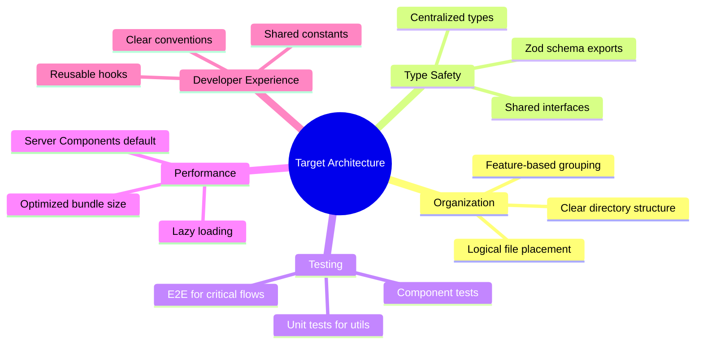
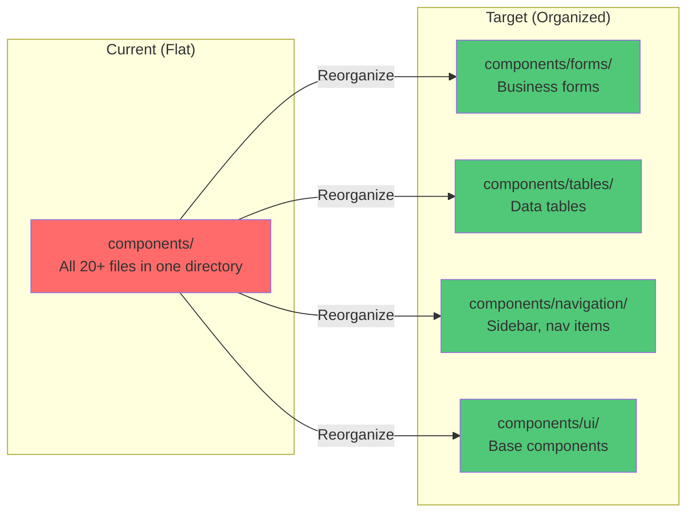
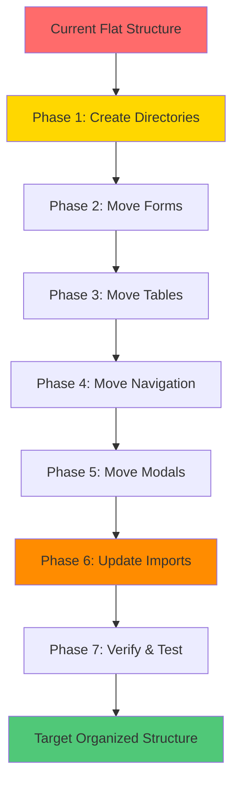
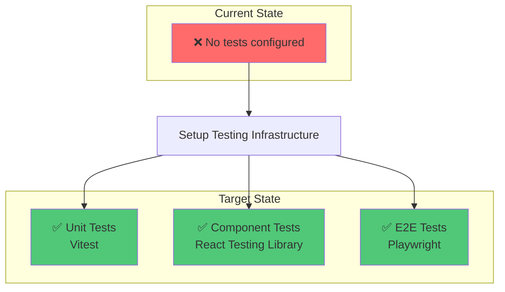
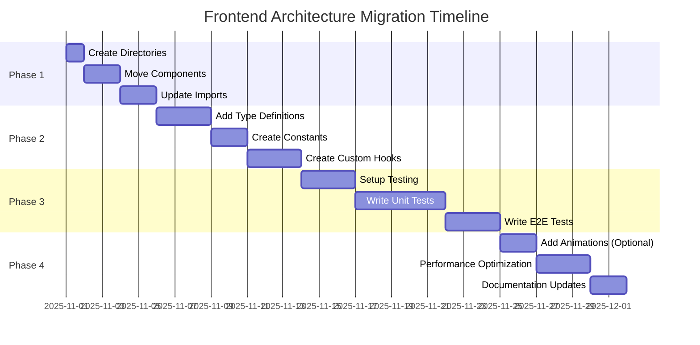

# Service Center - Frontend Architecture Roadmap

**Version:** 1.0 (Next/Future State)
**Last Updated:** 2025-10-23
**Status:** 🎯 Target Architecture
**Author:** Winston (Architect Agent)

---

## Overview

This document outlines the **target frontend architecture** and **migration plan** for the Service Center application. It focuses on improvements, reorganization, and new patterns to implement.

> **Note:** For the current production state, see `ui-architecture-current.md` in this directory.

---

## Table of Contents

1. [Target Architecture Vision](#target-architecture-vision)
2. [Directory Reorganization](#directory-reorganization)
3. [New Directories to Create](#new-directories-to-create)
4. [Migration Plan](#migration-plan)
5. [Testing Infrastructure](#testing-infrastructure)
6. [Proposed Improvements](#proposed-improvements)
7. [Implementation Phases](#implementation-phases)

---

## Target Architecture Vision

### Goals

1. **Better Organization** - Group related files by feature/concern
2. **Scalability** - Support growth without cluttering directories
3. **Discoverability** - New developers can easily find what they need
4. **Maintainability** - Clear separation of concerns
5. **Type Safety** - Centralized type definitions
6. **Testability** - Comprehensive test coverage

### Architectural Principles



---

## Directory Reorganization

### Current Structure (Flat) → Target Structure (Organized)



### Target Directory Structure

```plaintext
src/
├── app/                           # Next.js App Router (no changes)
│   ├── (auth)/                    # Protected routes
│   ├── (public)/                  # Public routes
│   └── api/                       # API routes
│
├── components/                    # ⭐ REORGANIZED
│   ├── ui/                        # shadcn/ui base components
│   │   ├── button.tsx
│   │   ├── input.tsx
│   │   ├── dialog.tsx
│   │   ├── select.tsx
│   │   ├── form.tsx
│   │   └── ...
│   │
│   ├── forms/                     # 🆕 Business forms
│   │   ├── add-ticket-form.tsx
│   │   ├── edit-ticket-form.tsx
│   │   ├── add-customer-form.tsx
│   │   ├── edit-customer-form.tsx
│   │   └── ...
│   │
│   ├── tables/                    # 🆕 Data tables
│   │   ├── data-table.tsx         # Reusable table component
│   │   ├── ticket-table.tsx
│   │   ├── customer-table.tsx
│   │   ├── product-table.tsx
│   │   └── ...
│   │
│   ├── navigation/                # 🆕 Navigation components
│   │   ├── app-sidebar.tsx
│   │   ├── nav-main.tsx
│   │   ├── nav-secondary.tsx
│   │   └── nav-user.tsx
│   │
│   ├── modals/                    # 🆕 Modal/Dialog components
│   │   ├── quick-upload-images-modal.tsx
│   │   ├── confirm-delete-modal.tsx
│   │   └── ...
│   │
│   └── shared/                    # 🆕 Shared business components
│       ├── ticket-status-badge.tsx
│       ├── customer-select.tsx
│       ├── product-select.tsx
│       ├── ticket-parts-manager.tsx
│       └── ...
│
├── types/                         # 🆕 TypeScript type definitions
│   ├── index.ts                   # Re-export all types
│   ├── database.types.ts          # Supabase generated types
│   ├── models.ts                  # Domain models (Ticket, Customer, etc.)
│   ├── forms.ts                   # Form data types
│   ├── api.ts                     # API request/response types
│   └── enums.ts                   # Shared enums
│
├── hooks/                         # 🆕 Custom React hooks
│   ├── use-tickets.ts             # Ticket-related hooks
│   ├── use-customers.ts           # Customer hooks
│   ├── use-products.ts            # Product hooks
│   ├── use-parts.ts               # Parts hooks
│   ├── use-auth.ts                # Authentication hooks
│   ├── use-debounce.ts            # Utility hooks
│   └── use-media-query.ts         # Responsive hooks
│
├── constants/                     # 🆕 Application constants
│   ├── index.ts                   # Re-export all constants
│   ├── routes.ts                  # Route paths
│   ├── status.ts                  # Ticket status flow
│   ├── roles.ts                   # User roles & permissions
│   ├── messages.ts                # UI messages (i18n ready)
│   └── config.ts                  # App config (pagination, limits)
│
├── server/                        # Server-side code (no changes)
│   ├── routers/
│   └── trpc.ts
│
├── lib/                           # Shared utilities (minimal changes)
│   └── utils.ts
│
└── utils/                         # Core utilities (no changes)
    └── supabase/
```

---

## New Directories to Create

### Phase 1: Essential Directories

```bash
# Create type definitions directory
mkdir -p src/types

# Create hooks directory
mkdir -p src/hooks

# Create constants directory
mkdir -p src/constants

# Create component subdirectories
mkdir -p src/components/forms
mkdir -p src/components/tables
mkdir -p src/components/navigation
mkdir -p src/components/modals
mkdir -p src/components/shared
```

### Phase 2: Populate Type Definitions

```typescript
// src/types/models.ts
export type ServiceTicket = {
  id: string
  ticket_number: string
  customer_id: string
  product_id: string
  issue_description: string
  status: TicketStatus
  priority_level: PriorityLevel
  warranty_type: WarrantyType | null
  service_fee: number
  diagnosis_fee: number
  parts_total: number
  discount_amount: number
  total_cost: number
  created_at: string
  updated_at: string
}

export type Customer = {
  id: string
  name: string
  phone: string
  email: string | null
  address: string | null
  created_at: string
}

export type Product = {
  id: string
  brand_id: string
  name: string
  model: string
  category: string | null
  description: string | null
  created_at: string
}

// ... more models
```

```typescript
// src/types/enums.ts
export type TicketStatus = 'pending' | 'in_progress' | 'completed' | 'cancelled'
export type PriorityLevel = 'low' | 'normal' | 'high' | 'urgent'
export type UserRole = 'admin' | 'manager' | 'technician' | 'reception'
export type WarrantyType = 'manufacturer' | 'store' | 'extended' | 'none'
export type PaymentStatus = 'unpaid' | 'partial' | 'paid' | 'refunded'

// Status flow validation
export const VALID_STATUS_TRANSITIONS: Record<TicketStatus, TicketStatus[]> = {
  pending: ['in_progress', 'cancelled'],
  in_progress: ['completed', 'cancelled'],
  completed: [], // Terminal state
  cancelled: [], // Terminal state
}
```

```typescript
// src/types/index.ts
export * from './models'
export * from './enums'
export * from './forms'
export * from './api'
export type { Database } from './database.types'
```

### Phase 3: Create Shared Constants

```typescript
// src/constants/routes.ts
export const ROUTES = {
  HOME: '/',
  LOGIN: '/login',
  SETUP: '/setup',

  // Dashboard
  DASHBOARD: '/dashboard',

  // Tickets
  TICKETS: '/tickets',
  TICKET_ADD: '/tickets/add',
  TICKET_DETAIL: (id: string) => `/tickets/${id}` as const,
  TICKET_EDIT: (id: string) => `/tickets/${id}/edit` as const,

  // Customers
  CUSTOMERS: '/customers',
  CUSTOMER_DETAIL: (id: string) => `/customers/${id}` as const,

  // Products
  PRODUCTS: '/products',

  // Parts
  PARTS: '/parts',

  // Team
  TEAM: '/team',

  // Settings
  ACCOUNT: '/account',
  SETTINGS: '/setting',
  APP_SETTINGS: '/app-setting',
} as const

export type Route = typeof ROUTES[keyof typeof ROUTES]
```

```typescript
// src/constants/status.ts
import type { TicketStatus, PriorityLevel } from '@/types'

export const TICKET_STATUS_LABELS: Record<TicketStatus, string> = {
  pending: 'Pending',
  in_progress: 'In Progress',
  completed: 'Completed',
  cancelled: 'Cancelled',
}

export const TICKET_STATUS_COLORS: Record<TicketStatus, string> = {
  pending: 'bg-yellow-100 text-yellow-800',
  in_progress: 'bg-blue-100 text-blue-800',
  completed: 'bg-green-100 text-green-800',
  cancelled: 'bg-gray-100 text-gray-800',
}

export const PRIORITY_LABELS: Record<PriorityLevel, string> = {
  low: 'Low',
  normal: 'Normal',
  high: 'High',
  urgent: 'Urgent',
}

export const PRIORITY_COLORS: Record<PriorityLevel, string> = {
  low: 'bg-gray-100 text-gray-800',
  normal: 'bg-blue-100 text-blue-800',
  high: 'bg-orange-100 text-orange-800',
  urgent: 'bg-red-100 text-red-800',
}
```

```typescript
// src/constants/config.ts
export const APP_CONFIG = {
  // Pagination
  DEFAULT_PAGE_SIZE: 10,
  PAGE_SIZE_OPTIONS: [10, 25, 50, 100],

  // File uploads
  MAX_FILE_SIZE: 5 * 1024 * 1024, // 5MB
  ALLOWED_FILE_TYPES: ['image/jpeg', 'image/png', 'image/webp', 'application/pdf'],

  // Ticket numbers
  TICKET_NUMBER_PREFIX: 'SV',

  // Search
  SEARCH_DEBOUNCE_MS: 300,
  MIN_SEARCH_LENGTH: 2,

  // Currency
  CURRENCY_CODE: 'VND',
  CURRENCY_SYMBOL: '₫',
} as const
```

```typescript
// src/constants/messages.ts
export const MESSAGES = {
  // Success messages
  TICKET_CREATED: 'Service ticket created successfully',
  TICKET_UPDATED: 'Service ticket updated successfully',
  TICKET_DELETED: 'Service ticket deleted successfully',
  CUSTOMER_CREATED: 'Customer created successfully',
  CUSTOMER_UPDATED: 'Customer updated successfully',

  // Error messages
  GENERIC_ERROR: 'An error occurred. Please try again.',
  NETWORK_ERROR: 'Network error. Please check your connection.',
  UNAUTHORIZED: 'You are not authorized to perform this action.',
  NOT_FOUND: 'The requested resource was not found.',

  // Validation messages
  REQUIRED_FIELD: 'This field is required',
  INVALID_EMAIL: 'Please enter a valid email address',
  INVALID_PHONE: 'Please enter a valid phone number',
  MIN_LENGTH: (min: number) => `Must be at least ${min} characters`,
  MAX_LENGTH: (max: number) => `Must be no more than ${max} characters`,

  // Confirmation messages
  CONFIRM_DELETE: 'Are you sure you want to delete this item?',
  CONFIRM_CANCEL: 'Are you sure you want to cancel this ticket?',
  UNSAVED_CHANGES: 'You have unsaved changes. Are you sure you want to leave?',
} as const
```

### Phase 4: Create Custom Hooks

```typescript
// src/hooks/use-tickets.ts
import { trpc } from '@/utils/trpc'
import type { ServiceTicket, TicketStatus } from '@/types'

export function useTickets(filters?: {
  status?: TicketStatus
  assigned_to?: string
  limit?: number
}) {
  return trpc.tickets.list.useQuery(filters)
}

export function useTicket(id: string) {
  return trpc.tickets.getById.useQuery(id, {
    enabled: !!id,
  })
}

export function useCreateTicket() {
  const utils = trpc.useUtils()

  return trpc.tickets.create.useMutation({
    onSuccess: () => {
      utils.tickets.list.invalidate()
      utils.dashboard.getPendingCount.invalidate()
    },
  })
}

export function useUpdateTicket() {
  const utils = trpc.useUtils()

  return trpc.tickets.update.useMutation({
    onSuccess: (data) => {
      utils.tickets.list.invalidate()
      utils.tickets.getById.invalidate(data.id)
    },
  })
}

export function useDeleteTicket() {
  const utils = trpc.useUtils()

  return trpc.tickets.delete.useMutation({
    onSuccess: () => {
      utils.tickets.list.invalidate()
    },
  })
}
```

```typescript
// src/hooks/use-debounce.ts
import { useEffect, useState } from 'react'

export function useDebounce<T>(value: T, delay: number = 300): T {
  const [debouncedValue, setDebouncedValue] = useState<T>(value)

  useEffect(() => {
    const timer = setTimeout(() => {
      setDebouncedValue(value)
    }, delay)

    return () => {
      clearTimeout(timer)
    }
  }, [value, delay])

  return debouncedValue
}
```

---

## Migration Plan

### Step-by-Step Migration



### Phase 1: Create Directory Structure

```bash
#!/bin/bash
# scripts/reorganize-components.sh

echo "Creating new directory structure..."

# Create type directories
mkdir -p src/types
mkdir -p src/hooks
mkdir -p src/constants

# Create component subdirectories
mkdir -p src/components/forms
mkdir -p src/components/tables
mkdir -p src/components/navigation
mkdir -p src/components/modals
mkdir -p src/components/shared

echo "✅ Directories created"
```

### Phase 2: Move Form Components

```bash
#!/bin/bash

echo "Moving form components..."

# Move all form files
mv src/components/add-ticket-form.tsx src/components/forms/
mv src/components/edit-ticket-form.tsx src/components/forms/
mv src/components/add-customer-form.tsx src/components/forms/
mv src/components/edit-customer-form.tsx src/components/forms/

echo "✅ Forms moved"
```

### Phase 3: Move Table Components

```bash
#!/bin/bash

echo "Moving table components..."

# Move all table files
mv src/components/ticket-table.tsx src/components/tables/
mv src/components/customer-table.tsx src/components/tables/
mv src/components/product-table.tsx src/components/tables/ 2>/dev/null
mv src/components/data-table.tsx src/components/tables/ 2>/dev/null

echo "✅ Tables moved"
```

### Phase 4: Move Navigation Components

```bash
#!/bin/bash

echo "Moving navigation components..."

# Move navigation files
mv src/components/app-sidebar.tsx src/components/navigation/
mv src/components/nav-main.tsx src/components/navigation/ 2>/dev/null
mv src/components/nav-secondary.tsx src/components/navigation/ 2>/dev/null
mv src/components/nav-user.tsx src/components/navigation/ 2>/dev/null

echo "✅ Navigation moved"
```

### Phase 5: Move Modal Components

```bash
#!/bin/bash

echo "Moving modal components..."

# Move modal files
mv src/components/quick-upload-images-modal.tsx src/components/modals/
mv src/components/*-modal.tsx src/components/modals/ 2>/dev/null
mv src/components/*-dialog.tsx src/components/modals/ 2>/dev/null

echo "✅ Modals moved"
```

### Phase 6: Move Shared Components

```bash
#!/bin/bash

echo "Moving shared components..."

# Move shared business components
mv src/components/ticket-status-badge.tsx src/components/shared/
mv src/components/customer-select.tsx src/components/shared/
mv src/components/product-select.tsx src/components/shared/
mv src/components/ticket-parts-manager.tsx src/components/shared/

echo "✅ Shared components moved"
```

### Phase 7: Update Import Paths

```bash
#!/bin/bash

echo "Updating import paths..."

# Update imports across all files
find src/app -type f -name "*.tsx" -o -name "*.ts" | while read file; do
  sed -i 's|@/components/add-ticket-form|@/components/forms/add-ticket-form|g' "$file"
  sed -i 's|@/components/edit-ticket-form|@/components/forms/edit-ticket-form|g' "$file"
  sed -i 's|@/components/ticket-table|@/components/tables/ticket-table|g' "$file"
  sed -i 's|@/components/customer-table|@/components/tables/customer-table|g' "$file"
  sed -i 's|@/components/app-sidebar|@/components/navigation/app-sidebar|g' "$file"
  sed -i 's|@/components/quick-upload-images-modal|@/components/modals/quick-upload-images-modal|g' "$file"
  # ... more replacements
done

echo "✅ Imports updated"
```

### Phase 8: Verification

```bash
#!/bin/bash

echo "Verifying migration..."

# Run TypeScript check
pnpm tsc --noEmit

# Run build
pnpm build

# Run linter
pnpm lint

echo "✅ Migration complete!"
```

### Complete Migration Script

```bash
#!/bin/bash
# scripts/migrate-architecture.sh

set -e

echo "🚀 Starting frontend architecture migration..."
echo ""

# Phase 1: Create directories
echo "Phase 1: Creating directory structure..."
mkdir -p src/{types,hooks,constants}
mkdir -p src/components/{forms,tables,navigation,modals,shared}
echo "✅ Phase 1 complete"
echo ""

# Phase 2: Move forms
echo "Phase 2: Moving form components..."
for file in src/components/*-form.tsx; do
  [ -f "$file" ] && mv "$file" src/components/forms/
done
echo "✅ Phase 2 complete"
echo ""

# Phase 3: Move tables
echo "Phase 3: Moving table components..."
for file in src/components/*-table.tsx; do
  [ -f "$file" ] && mv "$file" src/components/tables/
done
echo "✅ Phase 3 complete"
echo ""

# Phase 4: Move navigation
echo "Phase 4: Moving navigation components..."
mv src/components/app-sidebar.tsx src/components/navigation/ 2>/dev/null || true
mv src/components/nav-*.tsx src/components/navigation/ 2>/dev/null || true
echo "✅ Phase 4 complete"
echo ""

# Phase 5: Move modals
echo "Phase 5: Moving modal components..."
for file in src/components/*-modal.tsx src/components/*-dialog.tsx; do
  [ -f "$file" ] && mv "$file" src/components/modals/
done
echo "✅ Phase 5 complete"
echo ""

# Phase 6: Move shared
echo "Phase 6: Moving shared components..."
mv src/components/ticket-status-badge.tsx src/components/shared/ 2>/dev/null || true
mv src/components/*-select.tsx src/components/shared/ 2>/dev/null || true
mv src/components/ticket-parts-manager.tsx src/components/shared/ 2>/dev/null || true
echo "✅ Phase 6 complete"
echo ""

# Phase 7: Update imports
echo "Phase 7: Updating import paths..."
echo "⚠️  Manual import path updates required"
echo "   Run: find src/app -type f \\( -name '*.tsx' -o -name '*.ts' \\) -exec sed -i 's/old-path/new-path/g' {} +"
echo ""

# Phase 8: Verification
echo "Phase 8: Verifying migration..."
pnpm tsc --noEmit && echo "✅ TypeScript check passed" || echo "❌ TypeScript errors found"
echo ""

echo "🎉 Migration script complete!"
echo ""
echo "Next steps:"
echo "1. Manually update import paths in app/ directory"
echo "2. Run 'pnpm build' to verify"
echo "3. Test the application thoroughly"
```

---

## Testing Infrastructure

### Goal: Achieve Comprehensive Test Coverage



### Testing Stack Installation

```bash
# Unit & Component Testing
pnpm add -D vitest @vitest/ui @vitest/coverage-v8
pnpm add -D @testing-library/react @testing-library/jest-dom
pnpm add -D @testing-library/user-event
pnpm add -D @vitejs/plugin-react jsdom

# E2E Testing
pnpm add -D @playwright/test

# Install Playwright browsers
pnpx playwright install
```

### Vitest Configuration

```typescript
// vitest.config.ts
import { defineConfig } from 'vitest/config'
import react from '@vitejs/plugin-react'
import path from 'path'

export default defineConfig({
  plugins: [react()],
  test: {
    globals: true,
    environment: 'jsdom',
    setupFiles: ['./test/setup.ts'],
    include: ['**/*.{test,spec}.{ts,tsx}'],
    coverage: {
      provider: 'v8',
      reporter: ['text', 'json', 'html'],
      exclude: [
        'node_modules/',
        '.next/',
        'test/',
        '**/*.config.{ts,js}',
        '**/*.d.ts',
      ],
    },
  },
  resolve: {
    alias: {
      '@': path.resolve(__dirname, './src'),
    },
  },
})
```

### Test Setup File

```typescript
// test/setup.ts
import '@testing-library/jest-dom'
import { afterEach } from 'vitest'
import { cleanup } from '@testing-library/react'

// Cleanup after each test
afterEach(() => {
  cleanup()
})

// Mock Next.js router
vi.mock('next/navigation', () => ({
  useRouter: () => ({
    push: vi.fn(),
    replace: vi.fn(),
    back: vi.fn(),
  }),
  usePathname: () => '/test',
  useSearchParams: () => new URLSearchParams(),
}))
```

### Example Component Test

```typescript
// src/components/shared/ticket-status-badge.test.tsx
import { describe, it, expect } from 'vitest'
import { render, screen } from '@testing-library/react'
import { TicketStatusBadge } from './ticket-status-badge'

describe('TicketStatusBadge', () => {
  it('renders pending status correctly', () => {
    render(<TicketStatusBadge status="pending" />)
    expect(screen.getByText('Pending')).toBeInTheDocument()
  })

  it('renders in_progress status correctly', () => {
    render(<TicketStatusBadge status="in_progress" />)
    expect(screen.getByText('In Progress')).toBeInTheDocument()
  })

  it('applies correct color classes', () => {
    const { container } = render(<TicketStatusBadge status="completed" />)
    expect(container.firstChild).toHaveClass('bg-green-100', 'text-green-800')
  })
})
```

### Example Hook Test

```typescript
// src/hooks/use-debounce.test.ts
import { describe, it, expect, vi } from 'vitest'
import { renderHook, waitFor } from '@testing-library/react'
import { useDebounce } from './use-debounce'

describe('useDebounce', () => {
  it('debounces value changes', async () => {
    const { result, rerender } = renderHook(
      ({ value, delay }) => useDebounce(value, delay),
      { initialProps: { value: 'initial', delay: 300 } }
    )

    expect(result.current).toBe('initial')

    rerender({ value: 'updated', delay: 300 })
    expect(result.current).toBe('initial') // Still old value

    await waitFor(() => expect(result.current).toBe('updated'), {
      timeout: 400,
    })
  })
})
```

### Playwright Configuration

```typescript
// playwright.config.ts
import { defineConfig } from '@playwright/test'

export default defineConfig({
  testDir: './e2e',
  fullyParallel: true,
  forbidOnly: !!process.env.CI,
  retries: process.env.CI ? 2 : 0,
  workers: process.env.CI ? 1 : undefined,
  reporter: 'html',
  use: {
    baseURL: 'http://localhost:3025',
    trace: 'on-first-retry',
    screenshot: 'only-on-failure',
  },
  webServer: {
    command: 'pnpm dev',
    url: 'http://localhost:3025',
    reuseExistingServer: !process.env.CI,
  },
  projects: [
    {
      name: 'chromium',
      use: { browserName: 'chromium' },
    },
  ],
})
```

### Example E2E Test

```typescript
// e2e/ticket-creation.spec.ts
import { test, expect } from '@playwright/test'

test.describe('Ticket Creation Flow', () => {
  test('admin can create a new ticket', async ({ page }) => {
    // Navigate to login
    await page.goto('/login')

    // Login
    await page.fill('[name="email"]', 'admin@example.com')
    await page.fill('[name="password"]', 'admin123456')
    await page.click('button[type="submit"]')

    // Wait for dashboard
    await expect(page).toHaveURL('/dashboard')

    // Navigate to tickets
    await page.click('text=Tickets')
    await expect(page).toHaveURL('/tickets')

    // Click new ticket button
    await page.click('text=New Ticket')
    await expect(page).toHaveURL('/tickets/add')

    // Fill form
    await page.selectOption('[name="customer_id"]', { index: 1 })
    await page.selectOption('[name="product_id"]', { index: 1 })
    await page.fill('[name="issue_description"]', 'Screen is broken')
    await page.selectOption('[name="priority_level"]', 'high')

    // Submit
    await page.click('button:has-text("Create Ticket")')

    // Verify success
    await expect(page.locator('text=/SV-\\d{4}-\\d{3}/')).toBeVisible()
  })
})
```

### Package.json Scripts

```json
{
  "scripts": {
    "test": "vitest",
    "test:ui": "vitest --ui",
    "test:coverage": "vitest --coverage",
    "test:e2e": "playwright test",
    "test:e2e:ui": "playwright test --ui",
    "test:e2e:debug": "playwright test --debug"
  }
}
```

---

## Proposed Improvements

### 1. Animation Library (Optional)

```bash
# Install Framer Motion for animations
pnpm add framer-motion
```

```typescript
// src/components/shared/animated-card.tsx
import { motion } from 'framer-motion'

export function AnimatedCard({ children }: { children: React.ReactNode }) {
  return (
    <motion.div
      initial={{ opacity: 0, y: 20 }}
      animate={{ opacity: 1, y: 0 }}
      exit={{ opacity: 0, y: -20 }}
      transition={{ duration: 0.2 }}
    >
      {children}
    </motion.div>
  )
}
```

### 2. Form Helper Utilities

```typescript
// src/lib/form-utils.ts
import type { FieldErrors } from 'react-hook-form'

export function getErrorMessage(
  errors: FieldErrors,
  field: string
): string | undefined {
  const fieldError = errors[field]
  return fieldError?.message as string | undefined
}

export function hasError(errors: FieldErrors, field: string): boolean {
  return !!errors[field]
}
```

### 3. Reusable Data Table Component

```typescript
// src/components/tables/data-table.tsx
import type { ColumnDef } from '@tanstack/react-table'

type DataTableProps<TData> = {
  columns: ColumnDef<TData>[]
  data: TData[]
  isLoading?: boolean
  onRowClick?: (row: TData) => void
}

export function DataTable<TData>({
  columns,
  data,
  isLoading,
  onRowClick,
}: DataTableProps<TData>) {
  // Reusable table implementation
  // Includes sorting, filtering, pagination
}
```

### 4. Environment Variable Validation

```typescript
// src/lib/env.ts
import { z } from 'zod'

const envSchema = z.object({
  NEXT_PUBLIC_SUPABASE_URL: z.string().url(),
  NEXT_PUBLIC_SUPABASE_ANON_KEY: z.string().min(1),
  SUPABASE_SERVICE_ROLE_KEY: z.string().min(1),
  SETUP_PASSWORD: z.string().min(8),
  ADMIN_EMAIL: z.string().email(),
  ADMIN_PASSWORD: z.string().min(8),
  ADMIN_NAME: z.string().min(1),
})

export const env = envSchema.parse(process.env)
```

### 5. API Response Wrapper

```typescript
// src/types/api.ts
export type ApiResponse<T> = {
  success: true
  data: T
} | {
  success: false
  error: string
  code?: string
}

export type PaginatedResponse<T> = {
  data: T[]
  pagination: {
    page: number
    pageSize: number
    total: number
    totalPages: number
  }
}
```

---

## Implementation Phases

### Timeline Overview



### Phase 1: Directory Reorganization (Week 1)

**Goal:** Reorganize components into logical subdirectories

**Tasks:**
1. ✅ Create new directory structure
2. ✅ Move form components to `components/forms/`
3. ✅ Move table components to `components/tables/`
4. ✅ Move navigation components to `components/navigation/`
5. ✅ Move modal components to `components/modals/`
6. ✅ Move shared components to `components/shared/`
7. ✅ Update all import paths
8. ✅ Verify build succeeds

**Success Criteria:**
- All components organized by type
- No TypeScript errors
- Application builds successfully
- All routes work as expected

### Phase 2: Type System & Constants (Week 2-3)

**Goal:** Centralize types and constants

**Tasks:**
1. ✅ Create `src/types/` directory structure
2. ✅ Define domain models in `types/models.ts`
3. ✅ Define enums in `types/enums.ts`
4. ✅ Create route constants in `constants/routes.ts`
5. ✅ Create status/priority constants in `constants/status.ts`
6. ✅ Create message constants in `constants/messages.ts`
7. ✅ Create app config in `constants/config.ts`
8. ✅ Create custom hooks in `hooks/`

**Success Criteria:**
- All types centralized and reusable
- Constants used throughout app
- No hardcoded strings for routes/messages
- Custom hooks extracted and tested

### Phase 3: Testing Infrastructure (Week 4-5)

**Goal:** Implement comprehensive testing

**Tasks:**
1. ✅ Install Vitest and React Testing Library
2. ✅ Configure Vitest
3. ✅ Write tests for utility functions
4. ✅ Write tests for custom hooks
5. ✅ Write component tests
6. ✅ Install Playwright
7. ✅ Write E2E tests for critical flows
8. ✅ Setup CI/CD for tests

**Success Criteria:**
- 70%+ code coverage
- All critical flows tested
- Tests passing in CI/CD
- Test documentation complete

### Phase 4: Polish & Optimization (Week 6)

**Goal:** Final improvements and optimization

**Tasks:**
1. ✅ Add animations (if desired)
2. ✅ Performance optimization
3. ✅ Accessibility audit
4. ✅ Documentation updates
5. ✅ Code review and cleanup

**Success Criteria:**
- Smooth animations
- Fast page loads
- Accessible components
- Complete documentation

---

## Success Metrics

### Before Migration
- ❌ Flat component structure (20+ files in one directory)
- ❌ No type definitions directory
- ❌ Hardcoded routes and messages
- ❌ No custom hooks
- ❌ No tests
- ❌ No centralized constants

### After Migration
- ✅ Organized component structure by type
- ✅ Centralized type definitions
- ✅ Route constants used throughout
- ✅ Reusable custom hooks
- ✅ 70%+ test coverage
- ✅ Centralized constants and configuration

---

## Rollback Plan

If migration causes issues:

```bash
# Rollback script
git stash
git checkout main
pnpm install
pnpm build
```

**Prevention:**
- Work in a feature branch
- Commit frequently
- Test at each phase
- Keep backup of working state

---

## Conclusion

This roadmap provides a clear path to a more organized, maintainable, and testable frontend architecture. The migration can be done incrementally, with each phase building on the previous one.

**Key Benefits:**
- 📁 Better organization
- 🎯 Improved developer experience
- 🧪 Comprehensive testing
- 🔧 Easier maintenance
- 📈 Scalability for future features

**Next Steps:**
1. Review this plan with the team
2. Create feature branch for migration
3. Execute Phase 1 (directory reorganization)
4. Continue through phases systematically

---

**Document Version:** 1.0
**Target Completion:** 6 weeks
**Status:** 🎯 Planning Phase
