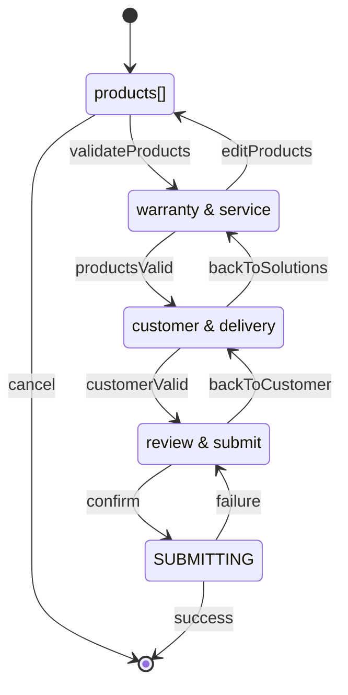

# Sơ đồ state cho `useServiceRequestWizard`



## Cấu trúc state

```ts
type WizardState = {
  products: Array<{
    id: string;
    serialNumber: string;
    productBrand?: string;
    productModel?: string;
    purchaseDate?: string;
    issueDescription: string;
    warrantyCheck: {
      status: "idle" | "pending" | "success" | "error";
      eligible?: boolean;
      message?: string;
      expiresAt?: string;
    };
    warrantyRequested: boolean;
    serviceOption?: "warranty" | "paid" | "replacement";
    attachments: Array<{
      id: string;
      fileName: string;
      path?: string;
      size: number;
      type: string;
      status: "idle" | "uploading" | "success" | "error";
      progress: number;
    }>;
  }>;
  requestIssueOverview?: string;
  customer: {
    name: string;
    email: string;
    phone: string;
    address?: string;
  };
  delivery: {
    preferredDeliveryMethod: "pickup" | "delivery";
    deliveryAddress?: string;
    preferredSchedule?: string;
    pickupNotes?: string;
    contactNotes?: string;
  };
  consentConfirmed: boolean;
  honeypot: string;
};
```

## Luồng dữ liệu chính
- **products[]** được cập nhật ở bước 1 và đồng bộ lại khi người dùng quay lại từ các bước sau (xóa sản phẩm sẽ reset `warrantyCheck`, attachments).
- **warrantyCheck** được trigger ở bước 2; kết quả lưu trong state để render badges, đồng thời xác định mặc định `serviceOption`.
- **customer** và **delivery** được auto-fill dựa trên lookup số điện thoại; người dùng có thể ghi đè trước khi sang bước 4.
- **consentConfirmed** và **honeypot** chỉ thay đổi ở bước 4; submit payload đọc toàn bộ state, chuẩn hóa dữ liệu trước khi gửi tRPC.
